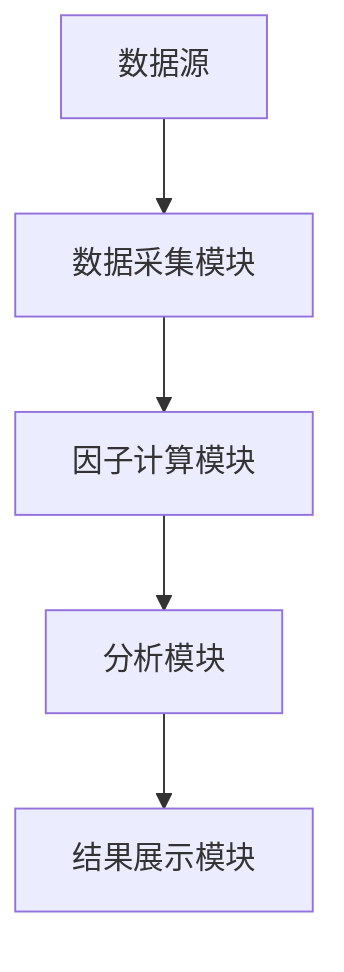
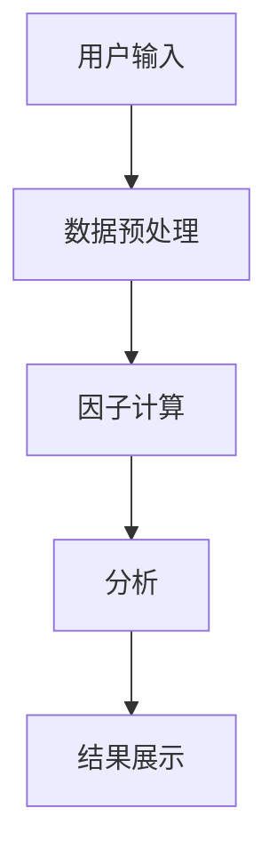

                 


# 金融市场风险因子暴露分析工具

## 关键词：金融市场、风险因子、风险暴露、金融分析、风险管理、量化分析

## 摘要：本文深入探讨了金融市场风险因子暴露分析工具的构建与应用，详细讲解了风险因子的定义、分类、分析方法，以及基于机器学习的风险因子分析。文章还介绍了系统的架构设计、项目实战案例，最后总结了工具的应用价值和未来发展方向。

---

# 第一章: 引言

金融市场中的风险管理至关重要，而风险因子暴露分析工具是实现这一目标的关键。本文将探讨如何利用这些工具有效识别和量化风险，帮助投资者做出明智决策。

---

# 第二章: 风险因子暴露分析工具概述

## 2.1 风险因子的定义与分类
- **风险因子**：影响资产或投资组合价值的因素，如市场波动率、信用风险等。
- 分类：市场因子、信用因子、流动性因子、宏观经济因子等。

## 2.2 暴露分析的定义与作用
- 暴露分析：评估资产或组合对特定风险因子的敏感性。
- 作用：帮助投资者理解风险来源，制定有效的风险管理策略。

## 2.3 工具的优缺点对比
- **传统方法**：如VaR模型，计算复杂，结果不够精确。
- **现代工具**：结合量化分析和机器学习，提供高精度预测和实时监控。

---

# 第三章: 风险因子暴露的分析方法

## 3.1 常见分析方法
- **回归分析**：通过回归模型识别影响资产回报的关键因子。
- **主成分分析（PCA）**：减少因子数量，提取主要风险因子。

## 3.2 因子分析的步骤
1. 数据收集：获取相关资产的历史价格和宏观经济数据。
2. 因子识别：通过统计方法提取关键风险因子。
3. 暴露计算：量化每个因子对资产组合的影响程度。

## 3.3 方法优缺点
- 回归分析：简单但可能遗漏非线性关系。
- PCA：降维但可能丢失部分信息。

---

# 第四章: 基于机器学习的风险因子分析

## 4.1 机器学习的应用
- **随机森林**：用于特征重要性分析，识别关键风险因子。
- **神经网络**：处理非线性关系，提高预测准确性。

## 4.2 算法实现步骤
1. 数据预处理：清洗和标准化数据。
2. 模型训练：使用训练数据训练机器学习模型。
3. 因子识别：通过模型输出提取关键风险因子。
4. 暴露分析：预测因子对资产组合的影响。

## 4.3 机器学习的优势
- 高准确性：能够捕捉复杂关系。
- 自适应性：无需手动调整模型参数。

---

# 第五章: 系统架构设计

## 5.1 系统模块划分
- 数据采集模块：收集金融市场数据。
- 因子计算模块：识别和计算风险因子。
- 分析模块：进行暴露分析并生成报告。
- 展示模块：以可视化方式呈现结果。

## 5.2 系统架构图


## 5.3 数据流图


---

# 第六章: 项目实战

## 6.1 环境搭建
- Python 3.8+
- 安装库：`numpy`, `pandas`, `scikit-learn`

## 6.2 核心代码实现
```python
import numpy as np
import pandas as pd
from sklearn.ensemble import RandomForestRegressor

# 数据加载
data = pd.read_csv('market_data.csv')

# 特征选择
features = data.drop('return', axis=1)
target = data['return']

# 模型训练
model = RandomForestRegressor(n_estimators=100)
model.fit(features, target)

# 提取重要性
importances = model.feature_importances_
factor_names = features.columns
```

## 6.3 案例分析
- 分析某投资组合对市场波动的暴露程度，计算暴露值并生成可视化报告。

---

# 第七章: 结论与展望

## 7.1 结论
风险因子暴露分析工具在现代金融管理中至关重要，能够帮助投资者有效识别和管理风险。

## 7.2 未来展望
- 结合人工智能和大数据技术，提升分析工具的准确性和实时性。
- 推动工具在更多金融领域的应用，如算法交易和风险对冲。

---

通过本文的详细讲解，读者将深入了解金融市场风险因子暴露分析工具的构建与应用，掌握多种分析方法和系统设计思路，为实际投资决策提供有力支持。

