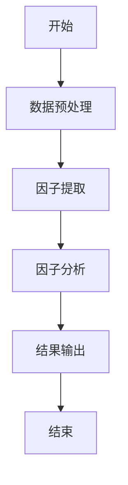
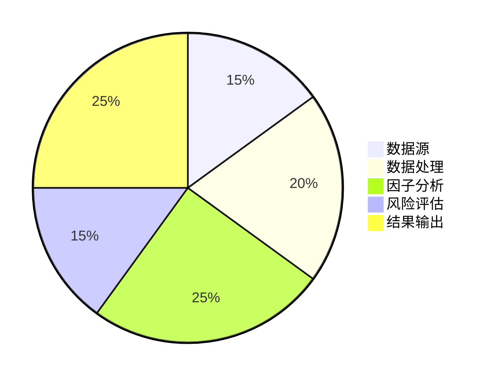
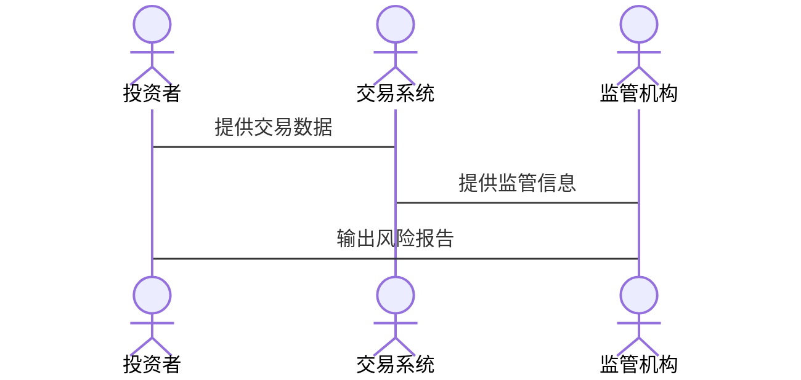

                 


# 金融市场风险因子识别系统

> **关键词**：金融市场，风险因子，识别系统，算法原理，系统架构，项目实战

> **摘要**：本文系统地探讨了金融市场风险因子识别系统的核心概念、算法原理、系统架构以及项目实战。通过对风险因子的定义、分类、识别方法的深入分析，结合因子分析模型和Python实现，展示了如何构建一个高效的金融市场风险因子识别系统。文章内容涵盖从理论到实践的各个方面，旨在为读者提供全面的指导和启发。

---

## 第一部分: 金融市场风险因子识别系统概述

### 第1章: 金融市场风险因子概述

#### 1.1 风险因子的定义与背景

金融市场中的风险因子是指能够影响资产价格波动的各种因素，包括市场风险、信用风险、流动性风险等。这些因子是投资者在进行资产定价和风险评估时需要考虑的重要因素。

#### 1.2 风险因子的分类与特征

风险因子可以分为系统性风险和非系统性风险两大类。系统性风险影响整个市场，如市场波动率、经济周期等；非系统性风险则影响特定资产或行业，如信用违约风险。

| 风险类型 | 特征 | 示例 |
|----------|------|------|
| 系统性风险 | 影响整个市场 | 市场波动率、利率变化 |
| 非系统性风险 | 影响特定资产或行业 | 信用违约风险、流动性风险 |

#### 1.3 风险因子识别的必要性与挑战

识别风险因子可以帮助投资者更好地理解市场波动，制定有效的风险管理策略。然而，风险因子的识别面临数据获取难度大、模型复杂性高、市场变化快等挑战。

#### 1.4 风险因子识别的边界与外延

风险因子识别的边界在于其适用的市场环境和时间范围。外延则包括与其他金融概念（如资产定价模型）的关系。

#### 1.5 本章小结

本章介绍了风险因子的定义、分类、识别必要性及其边界，为后续内容奠定了基础。

---

## 第二部分: 风险因子识别的核心概念与联系

### 第2章: 风险因子识别的核心概念

#### 2.1 风险因子识别的原理

风险因子识别基于统计学和机器学习方法，通过对历史数据的分析提取影响资产价格的关键因子。

#### 2.2 风险因子的属性特征对比

通过对比不同风险因子的属性特征，可以帮助我们更好地理解它们的差异和适用场景。

#### 2.3 风险因子识别的ER实体关系图

使用Mermaid图展示风险因子识别系统中的实体关系，如下：

```mermaid
erDiagram
    actor 投资者 {
        <属性>
        资金需求
        风险偏好
    }
    actor 市场监管机构 {
        <属性>
        市场规则
        监测数据
    }
    actor 交易系统 {
        <属性>
        交易数据
        价格走势
    }
    投资者 --> 市场监管机构 : 提供市场数据
    投资者 --> 交易系统 : 下达交易指令
    市场监管机构 --> 交易系统 : 提供监管信息
```

---

## 第三部分: 风险因子识别的算法原理

### 第3章: 风险因子识别算法概述

#### 3.1 风险因子识别算法的原理

以因子分析模型为例，算法通过提取影响资产收益的主要因子来实现风险识别。

#### 3.2 风险因子识别算法的数学模型

因子分析模型的数学公式如下：

$$ F = \sum_{i=1}^{n} a_i x_i $$

其中，$F$ 表示因子，$a_i$ 是因子载荷，$x_i$ 是观测变量。

#### 3.3 风险因子识别算法的流程图

使用Mermaid图展示算法的流程：



#### 3.4 风险因子识别算法的Python实现

以下是因子分析模型的Python代码示例：

```python
import numpy as np
from sklearn.decomposition import FactorAnalysis

# 示例数据
X = np.random.randn(100, 5)  # 100个样本，5个变量

# 因子分析模型
fa = FactorAnalysis(n_components=2)  # 提取2个因子
factors = fa.fit_transform(X)

# 输出因子载荷
print(fa.components_)
```

---

## 第四部分: 风险因子识别系统的架构设计

### 第4章: 系统分析与架构设计

#### 4.1 问题场景介绍

金融市场风险因子识别系统的目的是帮助投资者识别和管理市场风险。

#### 4.2 系统功能设计

系统功能模块包括数据采集、因子提取、风险评估和结果输出。

#### 4.3 系统架构设计

使用Mermaid图展示系统架构：



#### 4.4 系统接口设计

系统接口包括数据接口、因子提取接口和风险评估接口。

#### 4.5 系统交互流程图

使用Mermaid图展示系统交互流程：



---

## 第五部分: 项目实战

### 第5章: 金融市场风险因子识别系统实战

#### 5.1 环境安装

安装必要的Python库，如NumPy、Scikit-learn。

#### 5.2 系统核心实现

实现因子分析模型的代码，如下：

```python
from sklearn.decomposition import FactorAnalysis
import numpy as np

# 生成示例数据
X = np.random.randn(100, 5)

# 初始化因子分析模型
fa = FactorAnalysis(n_components=2)

# 训练模型并提取因子
fa.fit(X)
factors = fa.transform(X)

# 输出因子载荷
print(fa.components_)
```

#### 5.3 代码应用解读与分析

分析代码的功能，解释每一步的作用。

#### 5.4 实际案例分析

通过案例分析展示如何利用因子分析模型识别风险因子。

#### 5.5 项目小结

总结项目实现的关键点和注意事项。

---

## 第六部分: 总结与展望

### 第6章: 总结

#### 6.1 最佳实践 tips

- 确保数据质量
- 选择合适的算法
- 定期更新模型

#### 6.2 小结

本文系统地介绍了金融市场风险因子识别系统的核心概念、算法原理和系统架构，并通过项目实战展示了其具体实现。

#### 6.3 注意事项

- 数据隐私问题
- 模型的可解释性
- 计算资源的需求

#### 6.4 拓展阅读

建议进一步阅读相关书籍和论文，深入学习金融市场风险因子识别的高级方法。

---

**注**：以上目录和内容仅为示例，实际撰写时需要根据具体情况进行调整和补充。

