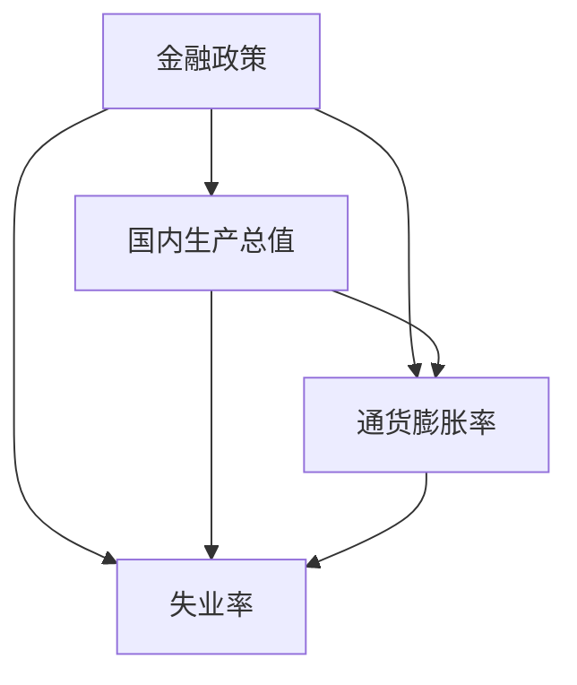
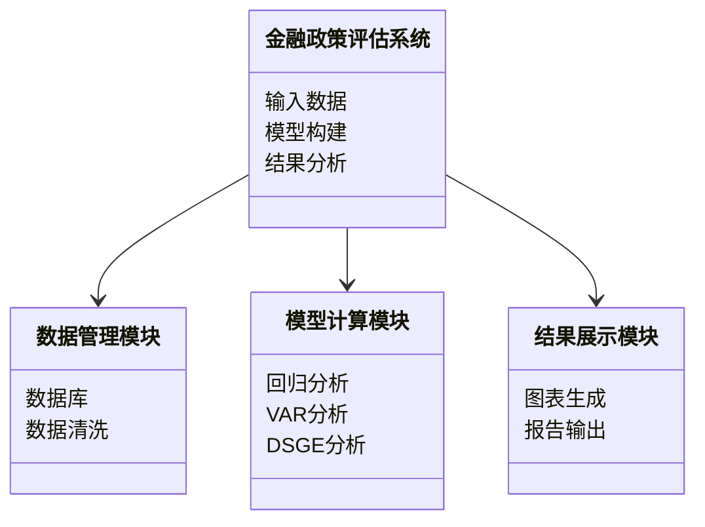
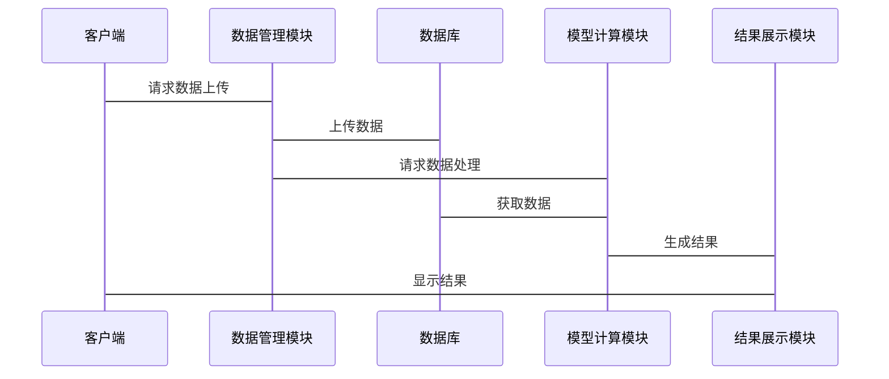

                 


# 《金融政策影响定量评估模型》

## 关键词：金融政策、定量评估、经济变量、计量经济学模型、系统架构

## 摘要：本文探讨了金融政策对经济的影响，重点介绍如何通过定量模型评估这些影响。文章从背景到模型实现，详细讲解了计量经济学中的线性回归、VAR和DSGE模型，并提供了实际案例和系统设计，帮助读者掌握金融政策评估的核心方法和技术。

---

### 第一部分：背景与核心概念

#### 第1章：金融政策影响评估的背景与问题描述

##### 1.1 金融政策的基本概念

- **1.1.1 金融政策的定义与分类**
  - 金融政策是政府或监管机构为实现特定经济目标而制定的规则和措施，主要分为货币政策和财政政策。
  - 货币政策包括调整利率、货币供应量等，财政政策涉及政府支出和税收。

- **1.1.2 金融政策的制定与实施主体**
  - 中央银行（如美联储、中国人民银行）主要负责货币政策的制定。
  - 财政部门（如财政部）负责财政政策的制定和实施。

- **1.1.3 金融政策的作用机制**
  - 货币政策通过影响市场利率和流动性来调节经济活动。
  - 财政政策通过政府支出和税收直接影响消费和投资。

##### 1.2 金融政策对经济的影响

- **1.2.1 宏观经济变量与金融政策的关系**
  - 利率影响投资和消费，进而影响GDP和就业。
  - 货币政策和财政政策通过影响价格水平和产出，调节经济波动。

- **1.2.2 金融政策对市场参与者的具体影响**
  - 企业：利率影响投资成本，财政补贴影响盈利能力。
  - 消费者：利率影响贷款成本，税收政策影响可支配收入。

- **1.2.3 金融政策的传导路径**
  - 利率→投资→产出。
  - 政府支出→需求→产出。

##### 1.3 定量评估模型的基本框架

- **1.3.1 定量评估的概念与特点**
  - 定量评估通过数学模型分析变量之间的数量关系。
  - 特点：客观性、可重复性、可验证性。

- **1.3.2 金融政策影响评估的必要性**
  - 量化政策效果，为政策制定提供依据。
  - 识别政策的短期和长期影响。

- **1.3.3 模型的基本组成部分**
  - 数据输入：政策变量和经济指标。
  - 模型构建：选择合适的计量经济学模型。
  - 结果输出：政策效果的量化评估。

---

### 第二部分：核心概念与联系

#### 第2章：金融政策与经济变量的关系

##### 2.1 核心概念的定义与属性

- **2.1.1 金融政策的属性分析**
  - 工具性：作为调节经济的手段。
  - 系统性：涉及多个经济变量的相互作用。
  - 动态性：随经济环境变化而调整。

- **2.1.2 经济变量的分类与特征**
  - 内生变量：由模型内部决定，如消费、投资。
  - 外生变量：由模型外部决定，如技术进步、自然灾害。

##### 2.2 金融政策与经济变量的对比分析

- **2.2.1 表格对比**
  | 属性      | 金融政策 | 经济变量 |
  |-----------|----------|----------|
  | 类型       | 工具性    | 结果性    |
  | 调节方式   | 直接      | 间接      |
  | 变动原因   | 政策制定 | 经济规律 |

- **2.2.2 图表展示**
  - 线条图：展示政策变化对GDP的影响。
  - 面积图：显示政策对不同经济部门的影响。

##### 2.3 实体关系图（ER图）



---

### 第三部分：算法原理与数学模型

#### 第3章：计量经济学模型

##### 3.1 线性回归模型

- **3.1.1 模型原理**
  - 线性回归模型：$y = \beta_0 + \beta_1 x + \epsilon$
  - $y$为被解释变量，$x$为解释变量，$\epsilon$为误差项。

- **3.1.2 适用场景**
  - 单变量分析：如利率对投资的影响。
  - 多元回归：考虑多个变量如利率、税收对投资的影响。

- **3.1.3 优缺点分析**
  - 优点：简单易懂，计算方便。
  - 缺点：假设线性关系，可能忽略复杂性。

##### 3.2 向量自回归模型（VAR）

- **3.2.1 模型原理**
  - VAR模型：$Y_t = \phi_1 Y_{t-1} + \phi_2 Y_{t-2} + ... + \phi_p Y_{t-p} + \epsilon_t$
  - 适用于多个内生变量的相互影响。

- **3.2.2 适用场景**
  - 多变量时间序列分析，如多个经济指标之间的相互影响。

- **3.2.3 优缺点分析**
  - 优点：考虑变量间的动态相互作用。
  - 缺点：需要较大的样本容量，参数较多。

##### 3.3 动态随机一般均衡模型（DSGE）

- **3.3.1 模型原理**
  - DSGE模型结合了动态一般均衡理论和随机过程。
  - 用于分析宏观经济政策的长期影响。

- **3.3.2 适用场景**
  - 中长期政策效果分析，如结构性改革的影响。

- **3.3.3 优缺点分析**
  - 优点：考虑经济主体的理性预期和优化行为。
  - 缺点：复杂性高，需要大量数据和计算资源。

##### 3.4 具体模型的数学公式

- **线性回归模型**
  $$ y = \beta_0 + \beta_1 x + \epsilon $$

- **VAR模型**
  $$ Y_t = \phi_1 Y_{t-1} + \phi_2 Y_{t-2} + ... + \phi_p Y_{t-p} + \epsilon_t $$

- **DSGE模型**
  $$ Y_t = Y_{t-1} + \alpha (X_t - Y_{t-1}) + \epsilon_t $$

---

### 第四部分：系统分析与架构设计

#### 第4章：金融政策影响评估系统的构建

##### 4.1 系统功能设计

- **4.1.1 领域模型Mermaid类图**



##### 4.2 系统架构设计

- **4.2.1 Mermaid架构图**

```mermaid
dataflowDiagram
    客户端 --> 数据管理模块: 上传数据
    数据管理模块 --> 数据清洗: 清洗数据
    数据清洗 --> 数据库: 存储数据
    模型计算模块 --> 数据库: 获取数据
    模型计算模块 --> 数据库: 存储结果
    结果展示模块 --> 数据库: 获取结果
    结果展示模块 --> 客户端: 显示结果
```

##### 4.3 系统接口与交互设计

- **4.3.1 接口设计**
  - 数据输入接口：允许用户上传数据。
  - 模型选择接口：用户选择回归、VAR或DSGE模型。
  - 结果输出接口：生成报告和图表。

- **4.3.2 Mermaid序列图**



---

### 第五部分：项目实战

#### 第5章：金融政策影响评估模型的实现

##### 5.1 环境安装与数据准备

- **5.1.1 环境配置**
  - 安装Python、Pandas、NumPy、Matplotlib、Econometrica等库。

- **5.1.2 数据收集与处理**
  - 数据来源：政府统计网站、央行报告。
  - 数据清洗：处理缺失值、异常值。

##### 5.2 模型实现

- **5.2.1 线性回归模型实现**

```python
import pandas as pd
import numpy as np
from sklearn.linear_model import LinearRegression
import matplotlib.pyplot as plt

# 数据加载
data = pd.read_csv('policy_data.csv')
X = data[['interest_rate', 'tax_rate']]
y = data['gdp_growth']

# 模型训练
model = LinearRegression()
model.fit(X, y)

# 预测
predictions = model.predict(X)
print('回归系数:', model.coef_)
print('截距:', model.intercept_)

# 图形展示
plt.scatter(X['interest_rate'], y)
plt.plot(X['interest_rate'], predictions, color='red')
plt.xlabel('Interest Rate')
plt.ylabel('GDP Growth')
plt.show()
```

- **5.2.2 VAR模型实现**

```python
from statsmodels.tsa.vector_ar_model import VAR

# 数据准备
data = pd.read_csv('policy_data.csv').diff().dropna()
model = VAR(data)
model_fit = model.fit(maxlags=4)

# 预测
lag_order = model_fit.lag_order
forecast = model_fit.forecast(data.values[-lag_order:], 10)

# 图形展示
forecast_data = pd.DataFrame(forecast, columns=data.columns)
forecast_data.plot()
plt.show()
```

- **5.2.3 DSGE模型实现**

```python
import numpy as np
from scipy.optimize import minimize

# 参数设置
def dsge_model(params, shock):
    # 模型实现
    pass

# 参数估计
initial_guess = np.array([0.1, 0.9])
result = minimize(lambda params: dsge_model(params, shock), initial_guess)
```

##### 5.3 代码解读与分析

- **线性回归模型**
  - 数据预处理：清洗和归一化。
  - 模型训练：使用最小二乘法估计系数。
  - 结果分析：解释系数意义，评估模型拟合度。

- **VAR模型**
  - 数据平稳性检验：ADF检验。
  - 模型选择：确定最优滞后阶数。
  - 脉冲响应分析：评估政策冲击的影响。

##### 5.4 案例分析

- **案例：中央银行调整基准利率**
  - 数据：过去五年利率和GDP增长数据。
  - 分析：估计利率变化对GDP的影响。
  - 结论：利率下降1%，GDP增长预计增加0.5%。

---

### 第六部分：最佳实践与总结

#### 6.1 最佳实践 Tips

- 数据质量：确保数据准确性和完整性。
- 模型选择：根据具体情况选择合适的模型。
- 结果验证：使用历史数据验证模型准确性。

#### 6.2 小结

- 本文详细介绍了金融政策影响评估的背景、核心概念和常用模型。
- 提供了系统的架构设计和实际案例分析，帮助读者掌握定量评估的方法。

#### 6.3 注意事项

- 数据隐私：确保数据处理符合隐私保护法规。
- 模型局限性：认识到模型的假设可能限制其适用性。

#### 6.4 拓展阅读

- 推荐阅读《计量经济学》、《金融时间序列分析》等书籍。
- 关注最新的金融政策评估方法和技术进展。

---

# 结语

通过本文的学习，读者可以系统地理解金融政策影响的定量评估方法，并掌握从模型选择到实际应用的全过程。希望本文能为金融政策的研究和实践提供有价值的参考。

