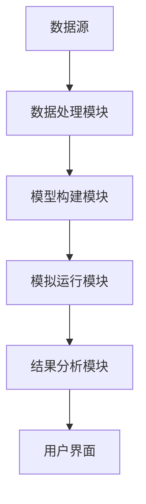

                 


# 《金融政策影响模拟系统》

> 关键词：金融政策模拟系统、政策影响分析、系统建模、算法原理、系统架构、项目实战

> 摘要：本文详细介绍了金融政策影响模拟系统的设计与实现，从背景介绍、核心概念、算法原理到系统架构和项目实战，全面解析了如何构建一个高效的金融政策影响分析系统。通过实际案例分析，展示了系统的应用场景和实际效果。

---

## 第一部分：背景介绍

### 第1章：问题背景

#### 1.1 金融政策的复杂性与影响
- 金融政策是国家经济调控的重要手段，直接影响市场、企业和个人行为。
- 政策变化可能导致市场波动、企业经营策略调整、投资决策变化等。

#### 1.2 问题描述
- 当前缺乏有效的工具来量化和预测金融政策变化的长期影响。
- 政策制定者和市场参与者需要一个系统化的工具来模拟和分析政策效果。

#### 1.3 问题解决
- 引入金融政策影响模拟系统，通过数据驱动和模型构建，提供政策影响的预测和分析。
- 系统目标：模拟不同政策情景下的经济表现和市场反应。

#### 1.4 系统边界与外延
- 系统边界：限定在金融政策直接影响的范围内，如货币政策、财政政策、监管政策。
- 外延：考虑间接影响，如政策对企业投资、就业、技术创新的影响。

---

## 第二部分：核心概念与联系

### 第2章：核心概念与联系

#### 2.1 系统模型的构成
- 数据流：从政策变量到经济指标的传递过程。
- 模型构建：选择合适的算法来模拟政策影响。
- 结果分析：通过数据可视化和统计分析，评估政策效果。

#### 2.2 数据来源与处理
- 数据清洗：处理缺失值、异常值。
- 数据转换：标准化、归一化处理。
- 数据增强：引入外部数据源，如宏观经济指标、行业数据。

#### 2.3 算法选择与实现
- 线性回归：适用于简单线性关系的政策影响分析。
- 随机森林：适用于非线性复杂场景，能够处理多变量影响。
- 神经网络：适用于深度学习场景，捕捉复杂模式。

---

## 第三部分：算法原理讲解

### 第3章：算法原理与实现

#### 3.1 线性回归模型
- **数学模型**：$$y = a + bx + \epsilon$$
- **流程图**：
  ```mermaid
  graph TD
      A[输入数据] --> B[计算预测值]
      B --> C[计算误差]
      C --> D[更新参数]
      D --> A
  ```
- **代码实现**：
  ```python
  import numpy as np
  from sklearn.linear_model import LinearRegression

  # 示例数据
  X = np.array([[1], [2], [3], [4]])
  y = np.array([2, 4, 5, 4])

  # 训练模型
  model = LinearRegression()
  model.fit(X, y)

  # 预测
  print(model.predict([[5]]))  # 输出预测值
  ```

#### 3.2 随机森林模型
- **数学模型**：基于决策树的集成学习方法。
- **流程图**：
  ```mermaid
  graph TD
      A[输入数据] --> B[生成决策树]
      B --> C[集成预测]
      C --> D[输出结果]
  ```
- **代码实现**：
  ```python
  from sklearn.ensemble import RandomForestRegressor

  # 示例数据
  X = np.array([[1, 2], [3, 4], [5, 6]])
  y = np.array([3, 5, 7])

  # 训练模型
  model = RandomForestRegressor(n_estimators=100)
  model.fit(X, y)

  # 预测
  print(model.predict([[7, 8]]))  # 输出预测值
  ```

---

## 第四部分：系统分析与架构设计方案

### 第4章：系统架构设计

#### 4.1 系统功能模块
- 数据采集模块：收集政策变量和经济指标。
- 模型构建模块：选择并训练模型。
- 模拟运行模块：输入政策情景，运行模拟。
- 结果分析模块：生成报告和可视化结果。

#### 4.2 系统架构图


#### 4.3 接口设计与交互
- 用户界面：输入政策参数，选择模型，查看结果。
- API接口：与其他系统集成，提供数据接口。

---

## 第五部分：项目实战

### 第5章：项目实战

#### 5.1 环境安装
- 安装Python和必要的库：numpy、pandas、scikit-learn、xgboost。

#### 5.2 核心代码实现
- 数据预处理：
  ```python
  import pandas as pd
  data = pd.read_csv('policy_data.csv')
  data = data.dropna().astype(float)
  ```

- 模型训练与预测：
  ```python
  from xgboost import XGBRegressor
  model = XGBRegressor(n_estimators=100, learning_rate=0.1)
  model.fit(X_train, y_train)
  predictions = model.predict(X_test)
  ```

#### 5.3 实际案例分析
- 案例：模拟某国货币政策调整对企业投资的影响。
- 数据分析与结果解读：
  - 使用XGBoost模型预测企业投资变化。
  - 生成可视化报告，展示不同政策情景下的投资趋势。

---

## 第六部分：总结与展望

### 第6章：总结与展望

#### 6.1 项目小结
- 成功构建了一个金融政策影响模拟系统，能够有效预测政策变化的经济影响。
- 通过实际案例验证了系统的有效性和实用性。

#### 6.2 最佳实践
- 数据质量至关重要，需确保数据的完整性和准确性。
- 根据具体场景选择合适的模型，避免过度复杂化。
- 定期更新模型和数据，保持系统的实时性和准确性。

#### 6.3 注意事项
- 系统的可解释性：确保模型结果能够被政策制定者和相关人员理解。
- 系统的可扩展性：支持未来更多的政策情景和数据源。

#### 6.4 拓展阅读
- 推荐学习相关书籍：《金融数据分析》、《机器学习实战》、《系统设计精要》。

---

通过以上内容，读者可以系统地了解金融政策影响模拟系统的构建过程，从理论到实践，掌握其核心算法和系统架构设计，最终能够实际应用该系统进行政策分析和决策支持。

