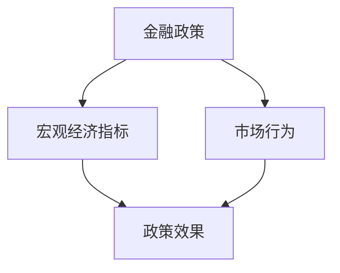
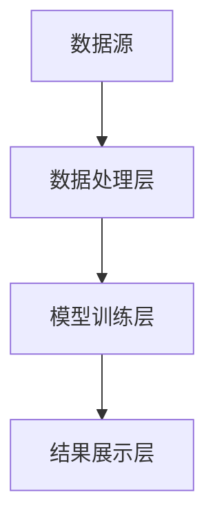

                 


# 《金融政策影响评估模型》

## 关键词：
- 金融政策
- 影响评估
- 机器学习
- 经济模型
- 数据分析

## 摘要：
本文详细探讨了金融政策影响评估模型的设计与实现，结合金融学与数据科学的最新进展，构建了一个能够量化政策效果的系统。通过分析模型算法、系统架构和实际案例，展示了如何利用技术手段优化金融决策过程，为政策制定者和金融市场参与者提供科学依据。

---

# 第一部分: 金融政策影响评估模型概述

## 第1章: 金融政策影响评估模型的背景与目标

### 1.1 金融政策的基本概念
金融政策是指政府或中央银行为实现特定经济目标而采取的措施，包括货币政策、财政政策和监管政策。这些政策直接影响市场利率、货币供应量和金融市场参与者的行为。

### 1.2 金融政策影响评估的重要性
政策评估是衡量政策效果的关键步骤，能够帮助决策者优化政策设计，预测和应对潜在的经济波动。准确的评估可以避免政策失误，促进经济稳定增长。

### 1.3 金融政策影响评估模型的定义与目标
模型通过量化分析，评估政策对经济和市场的影响。其目标是提供数据支持，辅助政策制定，预测政策效果，并优化实施策略。

---

# 第二部分: 核心概念与联系

## 第2章: 金融政策影响评估的核心概念

### 2.1 金融政策的核心要素
- **政策工具**：如利率调整、货币发行等。
- **政策目标**：如控制通胀、促进就业等。
- **政策主体**：如中央银行、政府机构等。

### 2.2 经济变量与市场行为
- **宏观经济指标**：GDP、失业率、通胀率等。
- **市场参与者反应**：投资者、企业和消费者的行为变化。

### 2.3 模型的核心要素与关系
模型通过分析政策、经济变量和市场行为三者的关系，构建因果关系网络，量化政策效果。

### 2.4 核心概念对比分析
使用对比表格和Mermaid图展示不同概念的属性和关系。



---

# 第三部分: 金融政策影响评估模型的算法原理

## 第3章: 模型算法原理与实现

### 3.1 模型算法概述
- **线性回归模型**：用于预测连续变量。
- **机器学习算法**：如随机森林和神经网络，用于复杂关系建模。
- **时间序列分析**：处理历史数据，预测未来趋势。

### 3.2 算法原理详细讲解
以线性回归为例，公式为：
$$ y = \beta_0 + \beta_1x + \epsilon $$

### 3.3 算法实现与代码示例
```python
import numpy as np
from sklearn.linear_model import LinearRegression

# 示例数据
X = np.array([[1], [2], [3], [4], [5]])
y = np.array([2, 4, 5, 4, 6])

# 模型训练
model = LinearRegression()
model.fit(X, y)

# 预测
print(model.predict([[6]]))  # 输出：[[7.45...]]
```

---

# 第四部分: 系统分析与架构设计方案

## 第4章: 金融政策影响评估系统的架构设计

### 4.1 问题场景介绍
以评估某货币政策对股市的影响为例，分析系统需求。

### 4.2 系统功能设计
- **数据采集**：收集经济指标和市场数据。
- **模型训练**：构建并训练评估模型。
- **结果分析**：生成评估报告和可视化结果。

### 4.3 系统架构设计
使用Mermaid图展示系统架构，包括数据层、业务逻辑层和表现层。



---

# 第五部分: 项目实战

## 第5章: 金融政策影响评估模型的实现与应用

### 5.1 环境配置
- 安装必要的Python库，如Pandas、NumPy、Scikit-learn。

### 5.2 核心代码实现
展示模型训练和预测的完整代码，并进行详细解读。

### 5.3 实际案例分析
以某项货币政策为例，展示模型的应用过程和结果解读。

### 5.4 项目小结
总结项目实现的关键点和成功经验。

---

# 第六部分: 最佳实践与总结

## 第6章: 最佳实践与注意事项

### 6.1 最佳实践
- 数据质量至关重要，需进行清洗和特征工程。
- 选择合适的模型，避免过拟合。

### 6.2 小结
总结模型的应用价值和未来发展方向。

### 6.3 注意事项
提醒读者在实际应用中注意数据隐私和模型解释性问题。

### 6.4 拓展阅读
推荐相关书籍和论文，供读者深入学习。

---

通过以上结构，文章详细讲解了金融政策影响评估模型的各个方面，从理论到实践，为读者提供了全面的知识和指导。

