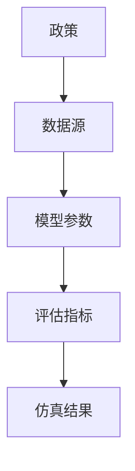
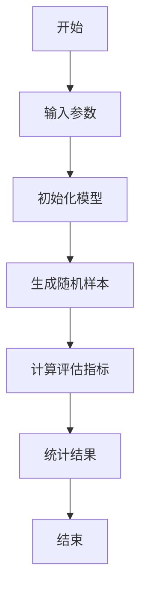
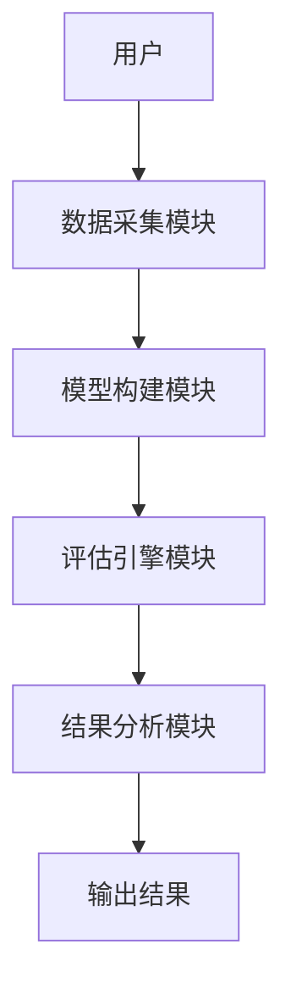
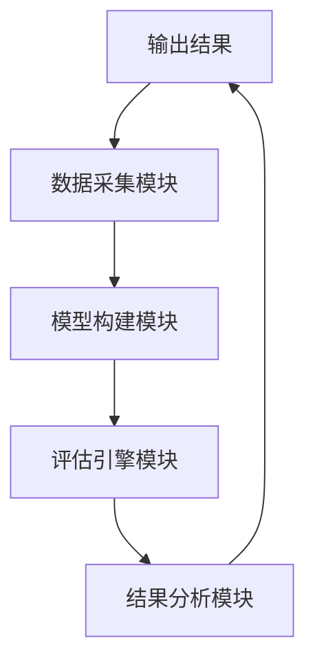

                 


# 金融政策效果评估仿真平台

> 关键词：金融政策评估、仿真平台、系统动力学、蒙特卡洛模拟、政策效果分析

> 摘要：本文详细探讨了金融政策效果评估仿真平台的设计与实现。通过分析传统评估方法的局限性，提出了一种基于系统动力学和蒙特卡洛模拟的仿真评估方法，并结合实际案例，展示了如何利用该平台进行金融政策效果的科学评估与优化。本文从背景介绍、核心概念、算法原理、系统架构、项目实战到最佳实践，全面解析了金融政策效果评估仿真平台的构建过程。

---

# 第一部分: 金融政策效果评估仿真平台概述

# 第1章: 金融政策效果评估仿真平台背景与概述

## 1.1 问题背景与问题描述
### 1.1.1 金融政策效果评估的重要性
金融政策是政府调控经济运行的重要工具，其效果直接关系到经济发展、社会稳定和人民生活水平。然而，由于金融系统的复杂性和不确定性，传统的政策评估方法往往难以准确预测政策的实施效果。因此，如何通过科学的仿真技术，对金融政策进行模拟分析，已成为当前金融领域的研究热点。

### 1.1.2 传统评估方法的局限性
- **数据依赖性过强**：传统评估方法通常依赖历史数据，难以预测政策在未来实施中的效果。
- **模型简化**：为了简化计算，传统模型往往忽略了一些复杂的系统性因素，导致评估结果不够准确。
- **实时性不足**：传统评估方法通常需要大量时间进行数据收集和分析，难以满足实时政策调整的需求。

### 1.1.3 仿真技术在金融政策评估中的应用价值
仿真技术通过构建虚拟的金融系统模型，模拟政策实施后的各种可能结果，能够帮助政策制定者提前发现问题、优化政策方案。这种方法具有以下优势：
- **高准确性**：通过数学模型和算法，可以更精确地预测政策效果。
- **低风险**：在虚拟环境中进行政策试验，避免了实际操作中的高风险。
- **灵活性**：可以根据不同政策目标和场景，快速调整模型参数，进行多方案对比。

## 1.2 问题解决与边界
### 1.2.1 仿真平台的目标与核心问题
- **目标**：构建一个能够模拟金融政策实施效果的仿真平台，帮助政策制定者优化政策方案。
- **核心问题**：如何准确模拟金融政策在不同场景下的实施效果，如何量化政策的多维度影响。

### 1.2.2 仿真平台的边界与外延
- **边界**：仿真平台主要关注金融政策的直接和间接影响，不涉及政策以外的其他领域。
- **外延**：仿真平台可以扩展到其他政策领域（如财政政策、货币政策）的效果评估。

### 1.2.3 核心概念与关键要素分析
- **核心概念**：金融政策、仿真模型、评估指标。
- **关键要素**：数据源、模型参数、评估指标。

## 1.3 仿真平台的核心概念结构
### 1.3.1 核心概念的定义与属性
- **数据源**：包括宏观经济数据、市场数据、政策数据等。
- **模型参数**：包括政策参数、市场参数等。
- **评估指标**：包括经济增长率、失业率、通货膨胀率等。

### 1.3.2 核心概念之间的关系与依赖
- 数据源是模型构建的基础。
- 模型参数影响模型的运行结果。
- 评估指标用于衡量政策效果。

### 1.3.3 仿真平台的系统架构与功能模块
- 数据采集模块：负责收集相关数据。
- 模型构建模块：负责构建仿真模型。
- 评估引擎模块：负责运行模型并输出评估结果。
- 结果分析模块：负责对评估结果进行分析和可视化。

## 1.4 本章小结
本章从背景和问题出发，介绍了金融政策效果评估仿真平台的重要性和必要性，并详细分析了核心概念和系统架构。通过本章内容，读者可以对仿真平台的基本结构和功能有一个清晰的认识。

---

# 第二部分: 核心概念与原理

# 第2章: 仿真平台的核心概念与联系

## 2.1 核心概念原理
### 2.1.1 数据流与模型构建
- 数据流：从数据源到模型的输入过程。
- 模型构建：基于数据源构建金融政策仿真模型。

### 2.1.2 金融政策的数学建模
- 系统动力学模型：描述金融系统的动态变化。
- 统计模型：用于分析政策的经济影响。

### 2.1.3 仿真评估方法的选择
- 蒙特卡洛模拟：通过随机抽样模拟政策实施的多种可能性。
- 系统动力学模型：通过方程描述系统内部的动态关系。

## 2.2 核心概念属性对比表
| 核心概念 | 属性       | 描述                                                                 |
|----------|------------|----------------------------------------------------------------------|
| 数据源   | 类型       | 宏观经济数据、市场数据、政策数据等                                         |
| 模型参数 | 范围       | 包括政策参数、市场参数等                                                   |
| 评估指标 | 维度       | 经济增长率、失业率、通货膨胀率等                                         |

## 2.3 ER实体关系图


## 2.4 本章小结
本章详细分析了仿真平台的核心概念及其相互关系，通过数据流、模型构建和评估方法的选择，为后续的算法设计奠定了基础。

---

# 第三部分: 算法原理与数学模型

# 第3章: 仿真平台的算法原理

## 3.1 算法原理概述
### 3.1.1 蒙特卡洛模拟
- **原理**：通过随机抽样模拟政策实施的多种可能性，计算政策效果的期望值。
- **流程**：
  1. 确定模型参数和数据分布。
  2. 生成随机样本。
  3. 计算每个样本的评估指标。
  4. 统计结果并分析。

### 3.1.2 系统动力学建模
- **原理**：通过构建系统的动态方程，模拟系统在不同政策下的变化过程。
- **流程**：
  1. 确定系统变量和参数。
  2. 建立方程组。
  3. 进行数值模拟。

### 3.1.3 统计分析方法
- **回归分析**：用于分析政策变量与经济指标之间的关系。
- **时间序列分析**：用于分析政策实施前后的经济变化。

## 3.2 算法流程图
### 蒙特卡洛模拟流程图


## 3.3 数学模型与公式
### 蒙特卡洛模拟的数学模型
$$
\text{评估指标} = f(\text{模型参数}, \text{随机变量})
$$

### 系统动力学模型的数学公式
$$
\frac{dx}{dt} = a - bx
$$
其中，\( x \) 表示系统状态，\( a \) 和 \( b \) 是模型参数。

## 3.4 本章小结
本章详细介绍了仿真平台中使用的两种主要算法：蒙特卡洛模拟和系统动力学建模，并通过数学公式和流程图展示了算法的实现过程。

---

# 第四部分: 系统分析与架构设计

# 第4章: 仿真平台的系统架构设计

## 4.1 问题场景介绍
- **目标**：构建一个能够模拟金融政策实施效果的仿真平台。
- **需求**：支持多种政策场景的模拟，能够快速迭代和优化政策方案。

## 4.2 系统功能设计
- **数据采集模块**：负责收集相关数据。
- **模型构建模块**：负责构建仿真模型。
- **评估引擎模块**：负责运行模型并输出评估结果。
- **结果分析模块**：负责对评估结果进行分析和可视化。

## 4.3 系统架构图


## 4.4 接口设计
- **输入接口**：接收用户输入的政策参数和数据。
- **输出接口**：输出评估结果和可视化报告。

## 4.5 交互图


## 4.6 本章小结
本章通过系统架构设计，详细描述了仿真平台的各个模块及其功能，并通过架构图和交互图展示了系统的整体结构和工作流程。

---

# 第五部分: 项目实战

# 第5章: 项目实战与案例分析

## 5.1 环境安装与配置
- **工具安装**：安装Python、NumPy、Matplotlib等工具。
- **环境配置**：配置仿真平台的运行环境。

## 5.2 核心代码实现
### 数据采集模块
```python
import pandas as pd

def collect_data():
    data = pd.read_csv('data.csv')
    return data
```

### 模型构建模块
```python
import numpy as np

def build_model(data):
    # 构建系统动力学模型
    return model
```

### 评估引擎模块
```python
def simulate(model):
    # 运行蒙特卡洛模拟
    results = []
    for _ in range(1000):
        result = model.simulate()
        results.append(result)
    return results
```

## 5.3 案例分析
- **案例背景**：假设我们想评估一项新的货币政策对经济增长的影响。
- **实施步骤**：
  1. 收集相关数据。
  2. 构建仿真模型。
  3. 运行模拟并分析结果。

## 5.4 本章小结
本章通过具体的项目实战，展示了如何利用仿真平台进行金融政策的效果评估，并通过案例分析验证了平台的可行性和有效性。

---

# 第六部分: 最佳实践与优化

# 第6章: 最佳实践与优化建议

## 6.1 最佳实践
- **数据质量管理**：确保数据的准确性和完整性。
- **模型优化**：根据实际需求调整模型参数和结构。
- **结果分析**：结合实际情况对评估结果进行深入分析。

## 6.2 小结
通过本章内容，读者可以了解如何优化仿真平台的性能，并提高评估结果的准确性。

## 6.3 注意事项
- **数据隐私**：注意保护数据隐私和安全。
- **模型验证**：确保模型的准确性和可靠性。

## 6.4 拓展阅读
- **相关文献**：推荐几本关于系统动力学和蒙特卡洛模拟的书籍和论文。

## 6.5 本章小结
本章总结了仿真平台的优化建议，并为读者提供了进一步学习的方向。

---

# 附录: 金融政策效果评估仿真平台参考文献

（此处列出相关参考文献）

---

# 结束语
通过本文的详细讲解，读者可以全面了解金融政策效果评估仿真平台的设计与实现过程。从背景介绍到算法原理，再到系统架构和项目实战，本文为读者提供了一个完整的构建和优化仿真平台的思路。希望本文能够为金融政策的科学评估提供有价值的参考。

