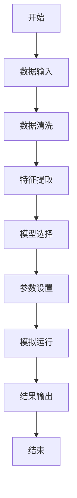
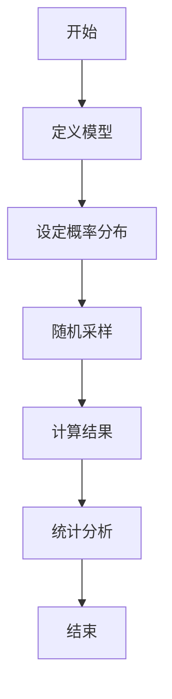
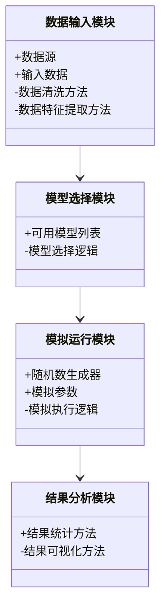
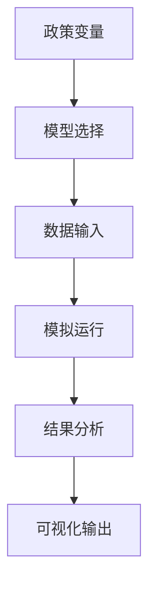

                 


# 金融政策效果评估模拟器

> **关键词**：金融政策，政策效果评估，蒙特卡洛模拟，经济模型，政策模拟器  
> **摘要**：本文介绍了一种金融政策效果评估模拟器的设计与实现。通过分析金融政策的实施效果，结合经济学和计算机科学的方法，构建了一个能够模拟政策效果的系统。该系统利用蒙特卡洛模拟等技术，帮助政策制定者更好地理解政策的潜在影响。

---

## 第一部分: 金融政策效果评估模拟器背景与核心概念

### 第1章: 金融政策效果评估概述

#### 1.1 金融政策的基本概念

金融政策是政府或金融机构为了实现特定经济目标而采取的措施，包括货币政策、财政政策等。这些政策旨在调节经济运行，促进经济增长，维护金融稳定。例如，中央银行通过调整利率、货币供应量等手段影响市场流动性。

#### 1.2 金融政策效果评估的重要性

评估金融政策的效果至关重要，因为政策的实施可能会对经济产生深远影响。例如，提高利率可能抑制投资和消费，从而影响GDP增长。有效的评估可以帮助政策制定者优化政策，避免负面效果。

#### 1.3 金融政策效果模拟器的概念与作用

金融政策效果模拟器是一种工具，通过模拟政策实施后的经济表现，帮助评估政策效果。它能够预测政策变化对市场、企业、消费者等的影响，为决策提供数据支持。

---

### 第2章: 金融政策效果评估的核心概念

#### 2.1 金融政策效果评估的关键要素

- **政策变量**：如利率、税率等直接影响经济的变量。
- **经济变量**：如GDP、失业率、通货膨胀率等衡量经济状况的指标。
- **评估指标**：如政策的实施效果、对不同群体的影响等。

#### 2.2 金融政策效果评估的主要模型

- **线性回归模型**：用于分析变量之间的线性关系，例如GDP与利率的关系。
- **超额收益模型**：用于评估政策对特定行业或市场的影响。
- **差分法模型**：通过比较政策实施前后的情况，分析政策效果。

#### 2.3 模型对比与适用场景

- **线性回归模型**适用于数据线性关系明显的场景，但可能无法捕捉复杂经济现象。
- **超额收益模型**适合分析特定政策对特定市场的直接影响。
- **差分法模型**适合于政策实施前后对比，但需要确保数据的可比性。

---

## 第二部分: 金融政策效果评估模拟器的算法原理

### 第3章: 金融政策效果评估模拟器的算法原理

#### 3.1 评估模拟器的总体流程

1. 数据输入与预处理：收集相关经济数据，清洗和标准化。
2. 模型选择与参数设置：根据需求选择合适的模型，并设定参数。
3. 模拟运行与结果输出：运行模拟，获取结果并进行可视化。

#### 3.2 算法实现的详细步骤

1. **数据清洗与特征工程**：处理缺失值、异常值，提取关键特征。
2. **模型训练与参数调优**：使用训练数据优化模型参数，提高预测精度。
3. **模拟结果的可视化与分析**：生成图表，直观展示模拟结果。

---

### 图3-1: 评估模拟器的算法流程图



---

## 第三部分: 金融政策效果评估模拟器的数学模型与公式

### 第4章: 金融政策效果评估模拟器的数学模型

#### 4.1 蒙特卡洛模拟的基本原理

蒙特卡洛模拟是一种通过随机采样来估计系统行为的方法。其基本步骤如下：

1. **定义模型**：明确系统中的变量和关系。
2. **设定概率分布**：为变量分配概率分布。
3. **随机采样**：生成变量的随机值。
4. **计算结果**：根据模型计算结果。
5. **统计分析**：分析结果，得出结论。

#### 4.2 蒙特卡洛模拟的数学公式

蒙特卡洛模拟的核心是通过多次随机采样来估计期望值。公式如下：

$$ E[X] = \frac{1}{N} \sum_{i=1}^{N} x_i $$

其中，$x_i$ 是第i次采样的结果，$N$ 是采样的总次数。

---

### 图4-1: 蒙特卡洛模拟流程图



---

## 第四部分: 金融政策效果评估模拟器的系统分析与架构设计

### 第5章: 金融政策效果评估模拟器的系统分析

#### 5.1 项目介绍

金融政策效果评估模拟器是一个基于蒙特卡洛模拟的系统，用于评估不同金融政策对经济的影响。系统功能模块包括数据输入、模型选择、模拟运行和结果分析。

---

### 图5-1: 系统功能模块类图



---

### 图5-2: 系统架构图


---

## 第五部分: 项目实战

### 第6章: 项目实战

#### 6.1 环境安装

- 安装Python：`python --version`
- 安装依赖库：`pip install numpy pandas matplotlib`

#### 6.2 核心实现源代码

```python
import numpy as np
import pandas as pd
import matplotlib.pyplot as plt

def monte_carlo_simulation(parameters, model_func, num_simulations=1000):
    results = []
    for _ in range(num_simulations):
        # 生成随机变量
        random_vars = np.random.normal(size=len(parameters))
        # 计算结果
        result = model_func(random_vars, parameters)
        results.append(result)
    return results

def model_func(random_vars, parameters):
    # 示例模型：线性回归
    beta = parameters['beta']
    intercept = parameters['intercept']
    return beta * random_vars + intercept

# 示例参数
parameters = {
    'beta': 0.5,
    'intercept': 10
}

# 运行模拟
results = monte_carlo_simulation(parameters, model_func)

# 绘制结果
plt.hist(results, bins=30)
plt.xlabel('Result')
plt.ylabel('Frequency')
plt.show()
```

---

### 图6-1: 模拟结果的直方图


---

## 第六部分: 总结与展望

### 第7章: 总结与展望

#### 7.1 总结

金融政策效果评估模拟器通过蒙特卡洛模拟等技术，帮助政策制定者更好地理解政策的潜在影响。本文详细介绍了模拟器的背景、核心概念、算法原理、数学模型和系统架构，并通过实战案例展示了其具体实现。

#### 7.2 展望

未来，模拟器可以结合机器学习和大数据技术，进一步提升评估的准确性和效率。此外，可以扩展模拟器的功能，支持更多的政策类型和经济指标。

---

### 图7-1: 金融政策效果评估模拟器的整体架构图



---

通过以上结构，您可以逐步完成《金融政策效果评估模拟器》的撰写。每个部分都需要详细展开，确保内容的完整性和技术的准确性。

