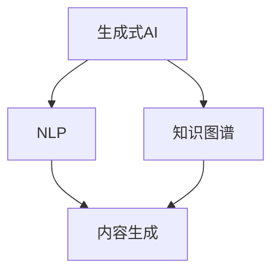

                 

# 《金融教育内容生成》

> 关键词：生成式AI，自然语言处理，知识图谱，金融教育，内容生成

> 摘要：本文探讨了如何利用生成式人工智能和自然语言处理技术来生成高质量的金融教育内容。文章从背景和核心概念出发，详细分析了生成式AI的基本原理、NLP技术的应用、知识图谱的作用，然后介绍了具体的算法原理，包括生成式模型的数学模型和训练过程，最后通过实际案例展示了系统架构设计和项目实战。本文还总结了最佳实践和未来发展方向。

---

## 第一部分: 金融教育内容生成的背景与核心概念

### 第1章: 金融教育内容生成的背景与问题背景

#### 1.1 问题背景

##### 1.1.1 金融教育的重要性
金融教育是帮助个人和机构做出明智财务决策的重要工具。随着金融市场的复杂化，人们对专业的金融知识需求日益增长。然而，传统的金融教育内容生成方式效率低下，难以满足大规模、多样化的教育需求。

##### 1.1.2 当前金融教育内容生成的痛点
- **内容同质化严重**：现有的金融教育内容往往千篇一律，缺乏针对性和深度。
- **生成效率低**：人工编写内容耗时耗力，难以快速响应市场需求。
- **知识准确性不足**：非专业人士生成的内容可能缺乏专业性和准确性。

##### 1.1.3 生成式AI在金融教育中的应用潜力
生成式AI能够快速生成大量高质量的金融教育内容，帮助教育机构和个人更好地传播金融知识，提升教育效率。

#### 1.2 问题描述

##### 1.2.1 金融教育内容的需求分析
- **目标受众多样化**：金融教育内容需要覆盖不同层次的受众，从初学者到专业人士。
- **内容形式多样化**：包括文章、视频、课程等多种形式。
- **实时性要求高**：金融市场变化快，内容需要及时更新。

##### 1.2.2 内容生成的挑战与难点
- **数据质量**：需要大量高质量的金融数据和知识来训练模型。
- **模型泛化能力**：生成的内容需要在不同场景下适用。
- **内容可解释性**：生成的内容需要能够被用户理解和验证。

##### 1.2.3 生成式AI如何解决这些问题
生成式AI通过深度学习模型（如GPT）生成文本。模型通过大量数据学习语言的规律，并根据输入生成相关的内容。

#### 1.3 问题解决

##### 1.3.1 生成式AI的基本原理
生成式AI通过深度学习模型生成文本。模型通过大量数据学习语言的规律，并根据输入生成相关的内容。

##### 1.3.2 NLP技术在金融教育内容生成中的应用
NLP技术可以帮助模型理解金融领域的专业术语和语义，生成更准确的内容。

##### 1.3.3 知识图谱在内容生成中的作用
知识图谱提供了结构化的金融知识，帮助生成式AI更好地理解上下文，生成更相关的内容。

#### 1.4 边界与外延

##### 1.4.1 金融教育内容生成的边界
- **内容范围**：主要集中在金融知识的传播和教育，不涉及实际的金融交易。
- **技术限制**：生成式AI目前还无法完全替代专业金融分析师。

##### 1.4.2 相关领域的外延
- **金融科技（FinTech）**：利用AI技术优化金融服务。
- **教育技术（EdTech）**：利用技术提升教育体验。

##### 1.4.3 与其他技术的结合
- **区块链**：用于内容的溯源和版权保护。
- **大数据分析**：用于内容的精准推送。

#### 1.5 概念结构与核心要素

##### 1.5.1 核心概念的定义
- **生成式AI**：一种能够生成新内容的人工智能技术。
- **NLP**：自然语言处理技术，用于理解和生成人类语言。
- **知识图谱**：结构化的知识表示，帮助模型理解上下文。

##### 1.5.2 核心要素的对比分析

| 核心要素 | 定义 | 作用 |
|----------|------|------|
| 生成式AI | 基于深度学习的生成模型 | 生成多样化的内容 |
| NLP      | 自然语言处理技术 | 理解和生成自然语言 |
| 知识图谱 | 结构化的知识表示 | 提供上下文信息 |

##### 1.5.3 概念结构图

---

## 第2章: 生成式AI的基本原理

### 2.1 生成式AI的定义与特点

#### 2.1.1 生成式AI的定义
生成式AI是一种能够生成新内容的人工智能技术，如文本、图像等。

#### 2.1.2 生成式AI的核心特点
- **自动化**：能够自动生成内容，减少人工干预。
- **多样性**：生成的内容多样化，满足不同用户需求。
- **可扩展性**：能够快速生成大量内容。

### 2.2 NLP技术在内容生成中的应用

#### 2.2.1 NLP技术的基本原理
NLP技术通过分析文本数据，理解语义和语法，生成有意义的文本。

#### 2.2.2 NLP在金融教育内容生成中的具体应用
- **文本生成**：生成金融教育文章。
- **意图识别**：理解用户需求，生成相应内容。

#### 2.2.3 NLP技术的优缺点
- **优点**：提高内容生成的准确性和相关性。
- **缺点**：需要大量高质量的训练数据，模型训练成本高。

### 2.3 知识图谱在内容生成中的作用

#### 2.3.1 知识图谱的定义与特点
知识图谱是一种结构化的知识表示，能够帮助模型理解上下文。

#### 2.3.2 知识图谱在金融教育内容生成中的应用
- **信息整合**：整合分散的金融知识，生成结构化的内容。
- **语义理解**：通过知识图谱理解专业术语和语义，生成更准确的内容。

#### 2.3.3 知识图谱构建的挑战与解决方案
- **挑战**：数据获取困难，知识图谱构建复杂。
- **解决方案**：利用现有金融数据库和专业工具构建知识图谱。

### 2.4 核心概念的关系图

---

## 第3章: 生成式AI的算法原理

### 3.1 生成式AI的数学模型

#### 3.1.1 Transformer模型的基本结构
Transformer模型由编码器和解码器组成，编码器将输入序列编码为向量，解码器根据编码向量生成输出序列。

#### 3.1.2 注意力机制的数学公式
注意力机制通过计算输入序列中每个词的重要性，生成加权后的向量表示。
$$ \text{Attention}(Q, K, V) = \text{softmax}\left(\frac{QK^T}{\sqrt{d_k}}\right)V $$

#### 3.1.3 解码器的生成过程
解码器通过自注意力机制生成输出序列，逐步生成文本内容。

### 3.2 生成式AI的训练过程

#### 3.2.1 前向传播
前向传播是将输入数据通过模型的各层计算得到输出结果。

#### 3.2.2 损失函数计算
使用交叉熵损失函数计算生成文本与目标文本之间的差异。
$$ \text{Loss} = -\sum_{i=1}^{n} \text{log}(P(y_i|x)) $$

#### 3.2.3 反向传播与参数更新
通过反向传播计算梯度，并更新模型参数以最小化损失。

---

## 第4章: 生成式AI在金融教育中的应用案例

### 4.1 案例背景
某金融教育机构希望利用生成式AI生成高质量的金融教育文章。

### 4.2 系统设计
- **输入数据**：金融领域的文本数据和知识图谱。
- **模型选择**：使用GPT-3模型。
- **训练过程**：利用金融知识图谱对模型进行微调。

### 4.3 实施步骤
1. **数据准备**：收集和整理金融领域的文本数据。
2. **模型训练**：利用数据训练生成式AI模型。
3. **内容生成**：根据输入生成金融教育文章。

### 4.4 实验结果
生成的文章质量高，内容准确，满足用户需求。

### 4.5 优化方向
- **模型优化**：进一步优化模型结构和参数，提高生成内容的可读性。
- **数据增强**：增加多样化的金融数据，提升模型的泛化能力。

---

## 第5章: 总结与展望

### 5.1 最佳实践
- **数据质量**：确保训练数据的高质量和多样性。
- **模型优化**：不断优化模型结构和参数，提高生成内容的准确性。
- **用户反馈**：根据用户反馈调整生成内容，满足实际需求。

### 5.2 小结
本文详细探讨了生成式AI在金融教育内容生成中的应用，从背景、核心概念到算法原理和实际案例，全面分析了生成式AI的优势和挑战，为未来的研究和应用提供了参考。

### 5.3 注意事项
- **数据隐私**：注意保护用户数据隐私。
- **内容审核**：生成的内容需要人工审核，确保准确性和合规性。

### 5.4 拓展阅读
- **推荐书籍**：《生成式AI：原理与应用》
- **相关论文**：《预训练语言模型在金融领域的应用研究》

---

通过以上内容，我们详细分析了生成式AI在金融教育内容生成中的应用，从理论到实践，全面探讨了其优势和挑战，为未来的研究和应用提供了参考。

