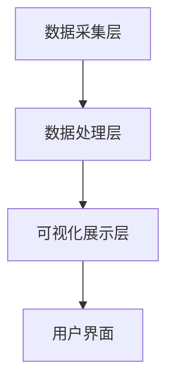

                 


# 《金融数据可视化：技术与最佳实践》

---

## 关键词：金融数据可视化，数据处理，数据分析，数据可视化技术，算法实现，系统架构，项目实战

---

## 摘要：
本文系统地探讨了金融数据可视化的核心技术与最佳实践，从背景、概念、算法到系统架构和项目实战，全面解析金融数据可视化的关键环节。通过实际案例分析和代码实现，深入浅出地讲解了金融数据可视化中的数据预处理、分析建模、可视化呈现等技术，并结合实际场景提供最佳实践建议，帮助读者在金融领域高效应用数据可视化技术。

---

## 目录大纲

### 第一部分: 金融数据可视化概述

## # 第1章: 金融数据可视化背景与挑战

### ## 1.1 金融数据可视化的定义与重要性

#### ### 1.1.1 什么是金融数据可视化
- 定义：金融数据可视化是指通过图表、图形等视觉化手段，将复杂的金融数据转化为易于理解的信息。
- 重要性：帮助用户快速识别趋势、异常和关键信息，辅助决策。

#### ### 1.1.2 金融数据可视化的关键特征
- 交互性：支持用户与图表的互动。
- 实时性：数据更新快，可视化呈现及时。
- 多维度：支持多维度数据的综合展示。

#### ### 1.1.3 金融数据可视化的应用场景
- 股票市场分析
- 风险管理
- 投资组合优化
- 财务报表分析

### ## 1.2 金融数据可视化的核心问题

#### ### 1.2.1 数据复杂性与信息密度
- 金融数据通常包含大量复杂关系，如何在有限空间内传递有效信息是关键。

#### ### 1.2.2 数据实时性与动态更新
- 金融市场数据实时变动，可视化系统需要快速响应。

#### ### 1.2.3 数据安全与隐私保护
- 金融数据敏感，如何在可视化过程中保护数据安全是重要挑战。

### ## 1.3 金融数据可视化的技术挑战

#### ### 1.3.1 数据处理的高效性
- 处理海量数据时，如何保持性能是关键。

#### ### 1.3.2 可视化呈现的准确性
- 确保图表准确反映数据，避免误导。

#### ### 1.3.3 用户交互的便捷性
- 提供友好交互界面，方便用户操作。

### ## 1.4 金融数据可视化工具对比

#### ### 1.4.1 常见金融数据可视化工具概述
- Tableau、Power BI、Excel、Python库（Matplotlib、Pandas、Seaborn）、Plotly、D3.js等。

#### ### 1.4.2 工具优缺点分析
- **Tableau**：功能强大，但学习曲线陡峭。
- **Power BI**：与微软生态集成好，但需要付费高级功能。
- **Python可视化库**：灵活，但需要编程基础。
- **D3.js**：高度定制化，但开发难度大。

#### ### 1.4.3 工具选择的建议
- 根据项目需求、团队技能和预算选择合适工具。

---

## 第二部分: 金融数据可视化的核心概念与技术

## # 第2章: 金融数据可视化的核心概念

### ## 2.1 数据处理与清洗

#### ### 2.1.1 数据清洗的必要性
- 金融数据常有缺失值、异常值，需清洗处理。

#### ### 2.1.2 数据标准化与归一化
- **标准化**：将数据按比例缩放到同一范围。
- **归一化**：将数据缩放到[0,1]范围。

#### ### 2.1.3 数据增强与特征工程
- 通过增加新特征或变换现有特征，提高模型性能。

### ## 2.2 数据分析与建模

#### ### 2.2.1 数据分析的基本方法
- 描述性分析：总结数据特征。
- 推断性分析：基于数据推断总体特征。

#### ### 2.2.2 数据建模的常见算法
- 线性回归、逻辑回归、决策树、随机森林、支持向量机等。

#### ### 2.2.3 数据模型的评估与优化
- 使用交叉验证、ROC曲线等方法评估模型性能。

### ## 2.3 数据可视化技术

#### ### 2.3.1 可视化图表的选择
- 折线图：适合时间序列数据。
- 柱状图：适合比较不同类别数据。
- 饼图：适合展示数据分布比例。

#### ### 2.3.2 可视化工具的使用技巧
- 利用工具的高级功能，如动态交互、高级图表类型。

#### ### 2.3.3 可视化效果的优化策略
- 保持图表简洁，避免信息过载。
- 使用一致的颜色和样式，提高可读性。

---

## 第三部分: 金融数据可视化的核心算法与实现

## # 第3章: 金融数据可视化的核心算法

### ## 3.1 数据预处理算法

#### ### 3.1.1 数据清洗算法
- 删除缺失值：简单删除或插值填充。
- 处理异常值：使用Z-score或IQR方法。

#### ### 3.1.2 数据标准化与归一化
- 标准化公式：\( z = \frac{x - \mu}{\sigma} \)
- 归一化公式：\( x' = \frac{x - \min}{\max - \min} \)

#### ### 3.1.3 数据增强
- 增加噪声：添加随机噪声数据。
- 数据变换：如对数变换、标准化变换。

### ## 3.2 数据分析算法

#### ### 3.2.1 聚类分析
- K-means算法：将数据分成K个簇。
- 层次聚类：通过层次化方法构建树状结构。

#### ### 3.2.2 分类分析
- 线性回归：预测连续型变量。
- 逻辑回归：预测二分类变量。

#### ### 3.2.3 回归分析
- 线性回归：\( y = \beta_0 + \beta_1x + \epsilon \)
- 逐步回归：通过逐步筛选变量进行建模。

### ## 3.3 数据可视化算法

#### ### 3.3.1 图表生成算法
- 使用Matplotlib生成折线图、柱状图等。

#### ### 3.3.2 图表交互算法
- 使用Plotly实现动态交互图表。

#### ### 3.3.3 图表优化算法
- 自动调整图表布局，优化视觉效果。

---

## 第四部分: 金融数据可视化系统的架构与设计

## # 第4章: 金融数据可视化系统的架构设计

### ## 4.1 系统架构设计

#### ### 4.1.1 分层架构设计
- 数据采集层：从数据库或API获取数据。
- 数据处理层：清洗、转换数据。
- 可视化展示层：生成图表并呈现给用户。

#### ### 4.1.2 微服务架构设计
- 数据采集服务、数据处理服务、可视化服务独立部署。

#### ### 4.1.3 组件化架构设计
- 将系统分解为数据获取组件、数据处理组件、可视化组件。

### ## 4.2 系统功能设计

#### ### 4.2.1 数据采集模块
- 从多种数据源获取数据，如数据库、API接口。

#### ### 4.2.2 数据处理模块
- 数据清洗、转换、增强。

#### ### 4.2.3 数据分析模块
- 应用算法模型对数据进行分析。

#### ### 4.2.4 可视化展示模块
- 根据分析结果生成图表，并展示给用户。

### ## 4.3 系统架构设计图



---

## 第五部分: 项目实战与最佳实践

## # 第5章: 项目实战

### ## 5.1 项目环境安装

#### ### 5.1.1 安装Python
- 使用Anaconda安装Python 3.8或更高版本。

#### ### 5.1.2 安装可视化库
- pip install matplotlib pandas seaborn plotly

### ## 5.2 系统核心实现源代码

#### ### 5.2.1 数据获取与清洗
```python
import pandas as pd
import numpy as np

# 获取数据
data = pd.read_csv('financial_data.csv')

# 删除缺失值
data.dropna(inplace=True)

# 处理异常值
z = np.abs((data - data.mean()).std())
data = data[(np.abs((data - data.mean()) / data.std()) < 3).all(axis=1)]
```

#### ### 5.2.2 数据分析与建模
```python
from sklearn.linear_model import LinearRegression

# 训练线性回归模型
model = LinearRegression()
model.fit(X_train, y_train)
```

#### ### 5.2.3 数据可视化
```python
import matplotlib.pyplot as plt

# 绘制折线图
plt.figure(figsize=(10,6))
plt.plot(data['日期'], data['收盘价'], label='收盘价')
plt.xlabel('日期')
plt.ylabel('价格')
plt.title('股票价格走势')
plt.legend()
plt.show()
```

### ## 5.3 实际案例分析

#### ### 5.3.1 案例背景
- 分析某股票的历史价格数据，预测未来走势。

#### ### 5.3.2 数据处理与建模
- 使用历史价格数据训练线性回归模型。

#### ### 5.3.3 可视化呈现
- 绘制股票价格走势图，展示预测结果。

### ## 5.4 项目小结
- 详细总结项目的实现过程、遇到的问题及解决方法。

---

## 第六部分: 最佳实践与总结

## # 第6章: 最佳实践与总结

### ## 6.1 最佳实践 tips

#### ### 6.1.1 数据处理
- 始终保持数据的干净和一致。

#### ### 6.1.2 可视化设计
- 简洁明了，避免过度修饰。

#### ### 6.1.3 工具选择
- 根据需求选择合适的工具，不要盲目追求高级功能。

### ## 6.2 项目总结

#### ### 6.2.1 项目成果
- 成功实现了金融数据可视化的系统。

#### ### 6.2.2 经验与教训
- 数据预处理是关键，可视化设计要以用户为中心。

### ## 6.3 未来展望

#### ### 6.3.1 技术发展
- 人工智能在数据可视化中的应用越来越广泛。

#### ### 6.3.2 应用场景扩展
- 数据可视化技术将应用于更多金融领域，如智能投顾、风险管理等。

---

## 第七部分: 参考文献与扩展阅读

## # 第7章: 参考文献与扩展阅读

### ## 7.1 参考文献

#### ### 7.1.1 数据可视化
- "Data Visualization: A Visual Introduction Using R" by Orrie Waller

#### ### 7.1.2 数据分析
- "Python for Data Analysis" by Wes McKinney

### ## 7.2 扩展阅读

#### ### 7.2.1 深度学习在金融中的应用
- 探讨深度学习如何提升金融数据的分析和可视化。

#### ### 7.2.2 交互式可视化工具的发展
- 了解最新的交互式可视化工具和技术。

---

通过以上目录大纲，我们可以系统地学习和实践金融数据可视化的核心技术与最佳实践，帮助读者在金融领域高效地应用数据可视化技术。

