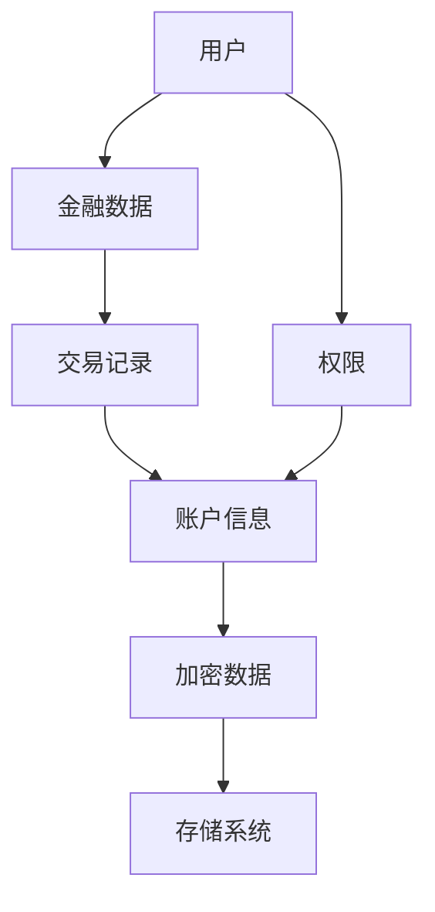
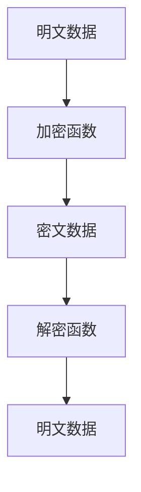
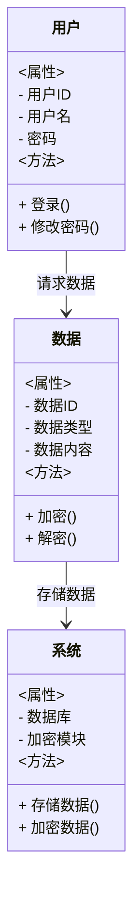
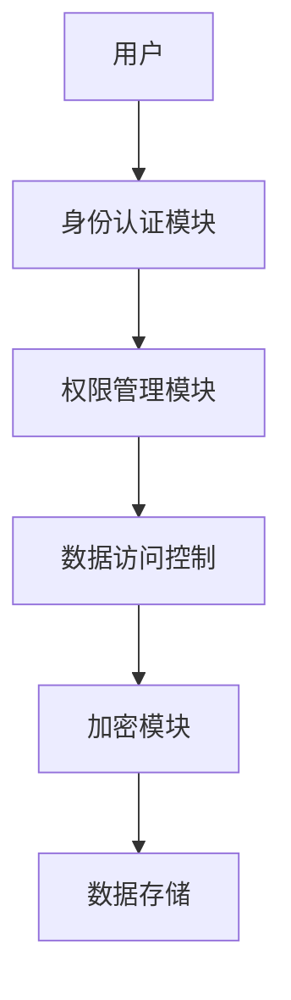
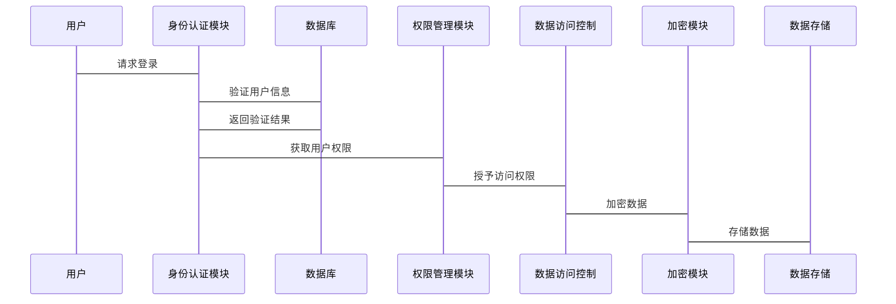

                 


# 《金融数据安全与隐私保护框架设计》

---

## 关键词：
- 金融数据安全
- 隐私保护
- 数据加密
- 匿名化处理
- 系统架构

---

## 摘要：
随着数字化金融的快速发展，金融数据的安全与隐私保护成为企业和个人面临的重大挑战。本文将从金融数据安全与隐私保护的基本概念出发，逐步分析其核心技术和实现框架。通过详细讲解数据加密、匿名化处理、身份认证等关键技术，结合实际案例，阐述如何构建安全且合规的金融数据隐私保护框架。本文旨在为企业和技术人员提供一份全面的指导，帮助他们在复杂的金融环境中确保数据安全与隐私保护。

---

# 第一章：金融数据安全与隐私保护的背景与挑战

## 1.1 问题背景
- 金融数据的敏感性与价值
- 金融数据泄露的潜在风险
- 数字化金融时代的安全需求

## 1.2 问题描述
- 金融数据的分类与分级管理
- 隐私保护的法律与合规要求
- 数据生命周期中的安全威胁

## 1.3 问题解决
- 数据加密技术的应用
- 匿名化处理的技术手段
- 安全策略与机制的建立

## 1.4 边界与外延
- 数据实体关系分析
- 隐私保护的范围界定
- 安全与隐私的平衡点

## 1.5 核心要素组成
- 数据生命周期管理
- 安全策略与机制
- 隐私保护技术

---

# 第二章：核心概念与关联分析

## 2.1 核心概念
- 数据分类与访问控制
- 加密技术与匿名化处理
- 身份认证与权限管理

## 2.2 属性对比
| 核心概念       | 数据分类与访问控制 | 加密技术与匿名化处理 | 身份认证与权限管理 |
|----------------|---------------------|-----------------------|---------------------|
| 定义           | 数据按敏感性分类    | 数据加密与匿名化      | 用户身份验证       |
| 实现方式       | 访问控制列表       | 同态加密、秘密分享    | 数字证书、权限管理 |
| 应用场景       | 数据存储与访问     | 数据传输与共享       | 用户登录与权限控制 |

## 2.3 ER实体关系图


---

# 第三章：数据加密与隐私保护算法

## 3.1 同态加密算法
### 3.1.1 基本原理
- 加密与解密的数学模型
$$ E(x) = x^k \mod n $$
$$ D(E(x)) = x \mod n $$

### 3.1.2 加密算法的流程图


## 3.2 数据匿名化处理
### 3.2.1 定义与实现
- 数据匿名化的基本思想
- 基于k-匿名性的隐私保护
- 匿名化处理的数学模型
$$ P(x) = \sum_{i=1}^{n} w_i x_i $$

## 3.3 秘密分享算法
### 3.3.1 基本原理
- 秘密分享的基本原理
- 分享与重构的数学模型
$$ S = x_1 \oplus x_2 \oplus \ldots \oplus x_n $$

---

# 第四章：系统分析与架构设计

## 4.1 问题场景介绍
- 金融系统的常见安全威胁
- 隐私保护的需求分析

## 4.2 系统功能设计
- 领域模型设计（Mermaid类图）


## 4.3 系统架构设计
- 系统架构图（Mermaid架构图）


## 4.4 系统接口设计
- 接口描述与交互流程

## 4.5 系统交互图（Mermaid序列图）


---

# 第五章：项目实战与最佳实践

## 5.1 项目环境安装
- 开发环境与工具配置
- 依赖库安装

## 5.2 核心代码实现
- 数据加密模块实现
```python
def encrypt(text):
    return text.encode('utf-8')
```
- 匿名化处理实现
```python
def anonymize(data):
    return data.drop(columns=['user_id'])
```

## 5.3 案例分析
- 项目实施的具体案例
- 数据处理与保护的效果展示

## 5.4 最佳实践
- 小结与注意事项
- 扩展阅读与资源推荐

---

# 结语

通过以上章节的详细讲解，我们从理论到实践，逐步构建了一个完整的金融数据安全与隐私保护框架。希望本书能为读者在金融数据安全领域的研究与实践提供有价值的参考与指导。

