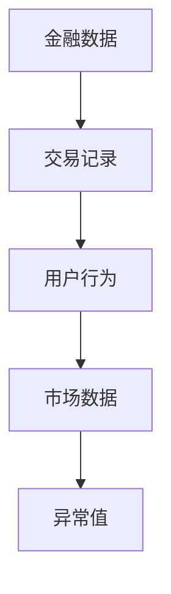
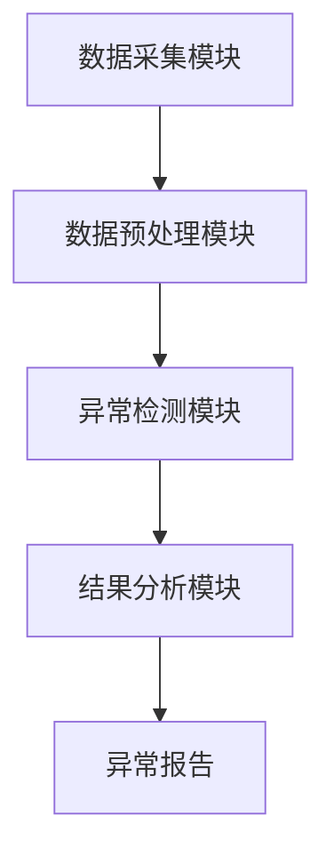

                 


# 《金融数据异常值检测与处理系统》

> 关键词：金融数据、异常值检测、机器学习、深度学习、系统架构、实时检测

> 摘要：本文系统地探讨了金融数据异常值检测与处理系统的构建过程。从基本概念到高级算法，从系统架构到项目实战，详细分析了如何利用统计学、机器学习和深度学习方法进行金融数据的异常值检测，并结合实际案例，展示了一个完整的异常值检测系统的构建过程。本文旨在为金融数据分析师、系统架构师和相关技术人员提供一份全面的技术指南。

---

## 第一部分: 金融数据异常值检测与处理系统概述

### 第1章: 异常值检测的背景与概念

#### 1.1 异常值检测的定义与背景

- 什么是金融数据异常值
  - 数据点偏离预期的正常行为
  - 包括市场操纵、欺诈交易、系统错误等
- 异常值检测的重要性
  - 保障金融系统的安全性和稳定性
  - 提高数据分析的准确性和可靠性
- 异常值检测的边界与外延
  - 数据范围、时间范围、业务范围的界定

#### 1.2 金融数据异常值的类型与特征

- 突发性异常值
  - 短时间内数据剧烈波动
  - 如市场崩盘或突发新闻影响
- 系统性异常值
  - 长期偏离正常趋势
  - 如持续的市场操纵或系统性错误
- 随机性异常值
  - 偶然性波动
  - 如小额错误交易或数据录入错误

#### 1.3 异常值检测的核心要素

- 数据源与数据特征
  - 交易数据、市场数据、用户行为数据等
- 异常检测算法的选择
  - 统计方法、机器学习方法、深度学习方法
- 业务场景与目标
  - 风险控制、欺诈 detection、系统监控

---

### 第2章: 异常值检测的核心概念与联系

#### 2.1 异常检测的核心原理

- 统计学原理
  - 利用数据的分布特性，如均值、方差、分位数等
- 机器学习原理
  - 基于监督学习、无监督学习、半监督学习
- 深度学习原理
  - 利用神经网络模型捕捉数据的复杂模式

#### 2.2 异常检测算法的特征对比

| 方法类型       | 特点                          | 适用场景             | 优缺点                           |
|----------------|-------------------------------|----------------------|----------------------------------|
| 统计学方法     | 基于数据分布特性，简单高效     | 小数据集             | 对复杂异常模式捕捉能力有限       |
| 机器学习方法   | 可处理高维数据，模型解释性强   | 中等规模数据集       | 需要标注数据，对复杂模式捕捉能力一般 |
| 深度学习方法   | 能捕捉复杂非线性模式           | 大数据、高维数据     | 训练时间长，模型解释性差           |

#### 2.3 ER实体关系图架构



---

## 第二部分: 异常值检测算法原理

### 第3章: 统计学方法在异常值检测中的应用

#### 3.1 统计学方法概述

- 基于均值和标准差的异常检测
  - 使用Z-score公式识别偏离均值的数据点
  - $$ Z = \frac{X - \mu}{\sigma} $$
  - 示例：股票价格突然波动，Z-score大于3时视为异常
- 基于分位数的异常检测
  - 使用百分位数（如95%分位数）识别极端值
  - 示例：某交易量远高于历史数据的95%分位数
- 基于马尔可夫链的异常检测
  - 使用状态转移模型识别偏离预期的序列
  - 示例：市场状态从正常状态转移到异常状态

#### 3.2 统计学方法的数学模型

- 均值和标准差的计算公式
  - $$ \mu = \frac{1}{n}\sum_{i=1}^{n}x_i $$
  - $$ \sigma = \sqrt{\frac{1}{n-1}\sum_{i=1}^{n}(x_i - \mu)^2} $$
- Z-score计算公式
  - $$ Z = \frac{X - \mu}{\sigma} $$
  - 示例：某股票价格异常波动，Z-score为4，远高于3，视为异常

---

### 第4章: 机器学习方法在异常值检测中的应用

#### 4.1 机器学习方法概述

- 基于监督学习的异常检测
  - 使用分类模型（如随机森林、SVM）进行异常分类
  - 示例：训练模型识别欺诈交易
- 基于无监督学习的异常检测
  - 使用聚类算法（如K-means、DBSCAN）识别异常簇
  - 示例：用户行为聚类，识别异常交易模式
- 基于半监督学习的异常检测
  - 使用One-Class SVM等方法，仅使用正常数据进行训练
  - 示例：识别未知异常模式

#### 4.2 机器学习方法的数学模型

- One-Class SVM
  - $$ y = sign(w^T x + b) $$
  - 示例：训练模型仅使用正常数据，识别异常点
- Isolation Forest
  - 使用树结构隔离异常点
  - 示例：检测网络流量中的异常流量

---

### 第5章: 深度学习方法在异常值检测中的应用

#### 5.1 深度学习方法概述

- 基于RNN的异常检测
  - 使用循环神经网络捕捉时间序列的异常模式
  - 示例：股票价格波动预测
- 基于CNN的异常检测
  - 使用卷积神经网络捕捉空间特征
  - 示例：多特征金融数据的异常检测
- 基于VAE的异常检测
  - 使用变分自编码器重构数据，识别异常点
  - 示例：识别交易记录中的异常模式

#### 5.2 深度学习方法的数学模型

- LSTM结构
  - $$ h_t = \tanh(W_{hh}h_{t-1} + W_{xh}x_t + b_h) $$
  - $$ o_t = \sigma(W_{ho}h_t + b_o) $$
  - 示例：预测股票价格，识别异常波动

---

## 第三部分: 系统架构与实现

### 第6章: 金融数据异常值检测系统架构

#### 6.1 系统功能设计

- 数据采集模块
  - 数据源：交易记录、市场数据、用户行为数据
  - 数据预处理：清洗、归一化、特征提取
- 异常检测模块
  - 统计方法：Z-score、分位数
  - 机器学习方法：Isolation Forest、One-Class SVM
  - 深度学习方法：LSTM、VAE
- 结果分析模块
  - 异常报告生成
  - 数据可视化

#### 6.2 系统架构设计



#### 6.3 系统接口设计

- 数据接口：数据源接口、数据存储接口
- 检测接口：API调用接口、实时检测接口
- 报告接口：结果输出接口、可视化接口

---

### 第7章: 项目实战

#### 7.1 环境搭建

- 安装Python、Jupyter Notebook、Pandas、NumPy、Scikit-learn、Keras、TensorFlow、PyTorch
- 示例环境：Python 3.8 + Jupyter Notebook

#### 7.2 数据集选择

- 示例数据集：股票价格数据（如股票代码：AAPL、MSFT、GOOGL）
- 数据预处理：清洗、归一化、特征提取

#### 7.3 系统核心实现

- 数据预处理代码
  ```python
  import pandas as pd
  import numpy as np

  # 读取数据
  df = pd.read_csv('stock_prices.csv')
  # 清洗数据
  df = df.dropna()
  # 归一化
  normalized_data = (df - df.mean()) / df.std()
  ```

- 异常检测代码
  ```python
  from sklearn.ensemble import IsolationForest

  # 初始化模型
  model = IsolationForest(n_estimators=100, random_state=42)
  # 训练模型
  model.fit(normalized_data)
  # 预测异常点
  outliers = model.predict(normalized_data)
  ```

- 结果分析代码
  ```python
  import matplotlib.pyplot as plt

  # 可视化异常点
  plt.scatter(range(len(outliers)), df['price'], c=outliers, cmap='viridis')
  plt.xlabel('Index')
  plt.ylabel('Price')
  plt.title('Isolation Forest Anomaly Detection')
  plt.show()
  ```

#### 7.4 实际案例分析

- 数据背景：股票价格数据
- 数据分析：识别异常波动
- 模型优化：调整参数、交叉验证
- 可视化结果：绘制异常点分布图

---

### 第8章: 总结与展望

#### 8.1 系统总结

- 异常值检测系统的构建过程
- 关键技术点总结
- 实战经验分享

#### 8.2 实际应用中的注意事项

- 数据质量的重要性
- 模型调优的技巧
- 可视化工具的选择

#### 8.3 未来的研究方向

- 实时异常值检测
- 多模态数据的异常检测
- 混合模型的应用

---

## 第四部分: 最佳实践与小结

### 第9章: 最佳实践

#### 9.1 数据预处理的注意事项

- 数据清洗的重要性
- 特征工程的关键性
- 数据归一化的选择

#### 9.2 模型选择与调优

- 统计方法的适用场景
- 机器学习方法的优缺点
- 深度学习方法的适用场景

#### 9.3 结果分析与可视化

- 异常报告的生成
- 数据可视化的工具选择
- 可视化结果的解读

---

### 第10章: 小结与展望

- 本文总结
- 未来研究方向
- 挑战与机遇

---

## 参考文献

- 统计学相关书籍
- 机器学习相关书籍
- 深度学习相关书籍
- 异常值检测相关论文

---

通过本文的系统讲解，读者可以全面掌握金融数据异常值检测与处理系统的构建过程，从理论到实践，从算法到系统架构，都能获得深入的了解。

