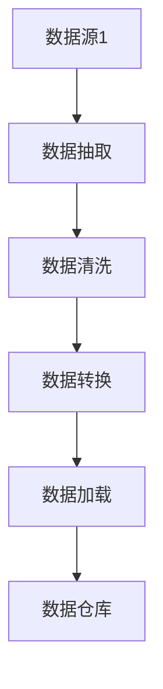
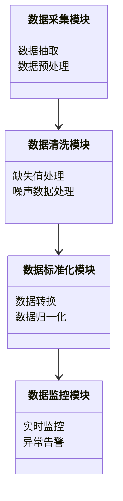
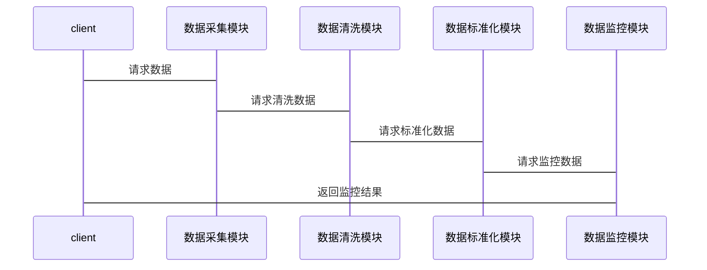

                 


# 《金融数据质量控制系统》

## 关键词：金融数据、数据质量、数据清洗、数据标准化、数据质量管理、数据安全

## 摘要：本文深入探讨了金融数据质量控制系统的设计与实现，从数据质量管理的核心概念、算法原理、系统架构到项目实战，全面解析了如何确保金融数据的准确性、完整性和一致性。通过具体案例分析和代码实现，展示了如何构建高效、可靠的金融数据质量控制系统。

---

# 正文

## 第一章：金融数据质量控制的背景与问题

### 1.1 金融数据质量的重要性

#### 1.1.1 金融数据的特点与应用场景

金融数据具有高价值性、实时性、多样性和复杂性等特点。在金融领域，数据广泛应用于风险管理、投资决策、信用评估、交易监控等场景。例如，银行需要实时监控客户交易数据以防范洗钱行为，证券公司需要分析市场数据以制定交易策略。

#### 1.1.2 数据质量对金融业务的影响

数据质量直接影响金融业务的决策质量和效率。低质量的数据可能导致错误的交易决策，甚至引发金融风险。例如，错误的客户信息可能导致信用评估失误，进而引发信用风险。

#### 1.1.3 数据质量问题的现状与挑战

当前，金融数据来源多样，包括内部系统和外部数据源，数据格式和标准不统一，导致数据清洗和整合的难度增加。此外，数据安全和隐私保护也是数据质量管理的重要方面，尤其是在《通用数据保护条例》（GDPR）等法规下，数据隐私保护成为数据质量管理的重要组成部分。

### 1.2 数据质量管理的核心问题

数据质量管理的核心问题包括：

- **数据完整性**：确保数据不被篡改或丢失。
- **数据准确性**：确保数据反映真实情况。
- **数据一致性**：确保数据在不同系统中保持一致。
- **数据及时性**：确保数据能够及时更新和使用。

### 1.3 金融数据质量控制的目标与边界

#### 1.3.1 数据质量控制的目标

数据质量控制的目标是确保数据的准确性、完整性和一致性，从而支持金融业务的高效运作和决策。

#### 1.3.2 数据质量控制的边界与外延

数据质量控制的边界包括数据来源、数据处理流程和数据存储。外延则涉及数据治理、数据安全和数据隐私保护。

#### 1.3.3 数据质量控制与数据治理的关系

数据质量控制是数据治理的重要组成部分，数据治理还包括数据架构、数据安全和数据生命周期管理。

---

## 第二章：数据质量管理的核心概念

### 2.1 数据质量维度分析

数据质量可以从以下几个维度进行分析：

| 维度 | 描述 | 示例 |
|------|------|------|
| 完整性 | 数据是否完整无缺 | 检查是否存在缺失值 |
| 准确性 | 数据是否准确无误 | 检查数据是否符合业务规则 |
| 一致性 | 数据在不同系统中是否一致 | 检查同一数据在不同系统中的表现 |
| 及时性 | 数据是否及时更新 | 检查数据更新的频率 |

### 2.2 数据质量管理的核心要素

#### 2.2.1 数据来源

数据来源包括内部系统（如CRM、交易系统）和外部数据源（如第三方API）。数据来源的多样性增加了数据质量管理的复杂性。

#### 2.2.2 数据处理流程

数据处理流程包括数据采集、清洗、转换和存储。每个阶段都需要进行数据质量检查。

#### 2.2.3 数据存储与管理

数据存储需要考虑数据的安全性、可靠性和可扩展性。常用的技术包括数据库、大数据平台和云存储。

#### 2.2.4 数据使用与分析

数据使用与分析需要确保数据的准确性和一致性。分析结果需要能够支持业务决策。

### 2.3 数据质量管理的框架

数据质量管理的框架包括数据质量评估、数据清洗、数据标准化和数据监控。

---

## 第三章：数据清洗算法原理

### 3.1 数据清洗的基本原理

数据清洗的目标是去除噪声数据，填补缺失值，消除重复数据，确保数据的一致性和准确性。

#### 3.1.1 数据清洗的步骤

1. 数据采集与预处理
2. 数据清洗：去除噪声数据，填补缺失值
3. 数据转换：将数据转换为适合分析的形式
4. 数据存储

#### 3.1.2 数据清洗的常见方法

- **缺失值处理**：使用均值、中位数或随机填充法填补缺失值。
- **噪声数据处理**：使用聚类算法或回归算法检测和去除异常值。
- **数据去重**：通过哈希或唯一标识符去除重复数据。

### 3.2 数据清洗的算法实现

#### 3.2.1 缺失值处理算法

**均值填充法**：适用于数值型数据。

$$ \text{均值} = \frac{\sum x_i}{n} $$

**中位数填充法**：适用于数值型数据。

**随机填充法**：适用于需要保持数据分布的场景。

#### 3.2.2 噪声数据处理算法

**异常检测算法**：使用Z-score或IQR方法检测异常值。

$$ Z = \frac{x - \mu}{\sigma} $$

**聚类算法**：使用K-means或DBSCAN算法识别异常点。

#### 3.2.3 数据去重算法

**哈希去重**：通过哈希函数将数据转换为哈希值，去除相同哈希值的数据。

**唯一标识符去重**：使用主键或其他唯一标识符去除重复数据。

#### 3.2.4 数据标准化与归一化

**标准化**：将数据按比例缩放到相同范围内。

$$ X_{\text{标准化}} = \frac{X - \mu}{\sigma} $$

**归一化**：将数据缩放到[0,1]范围。

$$ X_{\text{归一化}} = \frac{X - \min(X)}{\max(X) - \min(X)} $$

### 3.3 数据清洗的数学模型

#### 3.3.1 缺失值填充模型

使用均值填充法的数学模型：

$$ \hat{x}_i = \mu $$

其中，$\mu$ 是数据的均值。

#### 3.3.2 异常检测模型

使用拉普拉斯分布建模异常检测：

$$ P(x) = \frac{1}{\sqrt{2\pi\sigma^2}} e^{-x^2/(2\sigma^2)} $$

通过计算数据点的概率密度，识别低密度区域的异常点。

---

## 第四章：数据标准化与集成

### 4.1 数据标准化

数据标准化的目的是消除数据中的偏差，使其具有可比性。常用的方法包括：

- **最小-最大标准化**：将数据缩放到[0,1]范围。

$$ X_{\text{归一化}} = \frac{X - \min(X)}{\max(X) - \min(X)} $$

- **Z-score标准化**：将数据标准化为均值为0，标准差为1的分布。

$$ X_{\text{标准化}} = \frac{X - \mu}{\sigma} $$

### 4.2 数据集成

数据集成的目标是将来自不同数据源的数据整合到一个统一的数据仓库中。常用的数据集成方法包括：

- **数据抽取、转换、加载（ETL）**：通过数据清洗和转换将数据加载到目标数据仓库。

**mermaid**



### 4.3 数据集成的流程

1. 数据抽取：从多个数据源中提取数据。
2. 数据清洗：去除噪声数据，填补缺失值。
3. 数据转换：将数据转换为适合分析的形式。
4. 数据加载：将处理后的数据加载到目标数据仓库。

---

## 第五章：数据质量管理系统的架构设计

### 5.1 系统功能设计

数据质量管理系统的功能模块包括：

- **数据采集**：从多种数据源采集数据。
- **数据清洗**：去除噪声数据，填补缺失值。
- **数据标准化**：将数据转换为统一格式。
- **数据监控**：实时监控数据质量，发现异常及时告警。

**mermaid**



### 5.2 系统架构设计

数据质量管理系统的架构包括：

- **数据源层**：包括内部系统和外部数据源。
- **数据处理层**：包括数据清洗、数据标准化等模块。
- **数据存储层**：包括数据库和大数据平台。
- **数据访问层**：提供数据访问接口。
- **应用层**：包括数据监控、数据报告等模块。

**mermaid**


### 5.3 系统接口设计

数据质量管理系统的接口设计包括：

- **数据采集接口**：从外部数据源采集数据。
- **数据清洗接口**：接收数据并进行清洗。
- **数据标准化接口**：将数据转换为统一格式。
- **数据监控接口**：实时监控数据质量。

### 5.4 系统交互设计

**mermaid**



---

## 第六章：项目实战

### 6.1 环境安装

#### 6.1.1 安装Python

```bash
pip install python
```

#### 6.1.2 安装数据处理库

```bash
pip install pandas numpy scikit-learn
```

### 6.2 系统核心实现

#### 6.2.1 数据清洗实现

```python
import pandas as pd
import numpy as np

# 创建示例数据集
data = {'A': [1, 2, np.nan, 4, 5],
        'B': ['a', 'b', 'c', np.nan, 'e']}
df = pd.DataFrame(data)

# 处理缺失值
df['A'].fillna(df['A'].mean(), inplace=True)
df['B'].fillna(df['B'].mode()[0], inplace=True)

print(df)
```

#### 6.2.2 数据标准化实现

```python
from sklearn.preprocessing import StandardScaler

# 创建示例数据集
X = np.array([[1, 2], [3, 4], [5, 6]])

# 数据标准化
scaler = StandardScaler()
X_scaled = scaler.fit_transform(X)

print(X_scaled)
```

### 6.3 案例分析

#### 6.3.1 数据清洗案例

假设我们有一个包含缺失值和噪声数据的客户数据集，我们需要使用上述代码进行数据清洗。

#### 6.3.2 数据标准化案例

假设我们有一个包含客户交易数据的数据集，我们需要使用标准化方法将其转换为统一格式。

### 6.4 优化与改进

根据实际运行结果，优化数据清洗和标准化算法，提高数据处理效率和准确性。

---

## 第七章：总结与展望

### 7.1 总结

通过本文的介绍，我们全面解析了金融数据质量控制系统的设计与实现，从数据质量管理的核心概念、算法原理、系统架构到项目实战，展示了如何确保金融数据的准确性、完整性和一致性。

### 7.2 展望

未来，随着人工智能和大数据技术的不断发展，数据质量管理将更加智能化和自动化。建议金融企业结合自身需求，引入先进的数据质量管理技术，提升数据治理能力，为金融业务的高效运作和决策提供有力支持。

---

**最佳实践 tips**

- 数据质量管理需要结合业务需求和数据特点，制定合适的策略。
- 数据清洗和标准化是数据质量管理的重要环节，需要谨慎处理。
- 数据监控是数据质量管理的重要组成部分，需要实时关注数据质量变化。

**注意事项**

- 数据隐私和安全是数据质量管理的重要方面，需遵守相关法规。
- 数据质量管理需要跨部门协作，包括数据工程师、业务部门和IT部门。

**拓展阅读**

- 《数据质量管理：方法与实践》
- 《大数据时代的数据质量管理》
- 《金融数据安全与隐私保护》

---

通过本文的详细讲解，相信读者对金融数据质量控制系统有了全面的理解。希望本文对读者在实际工作中有所帮助。

