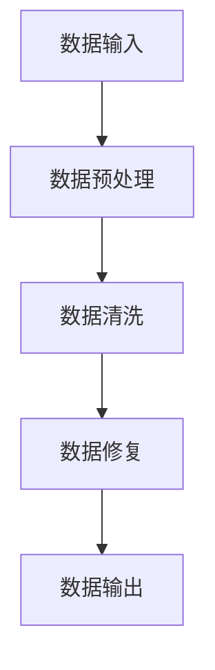
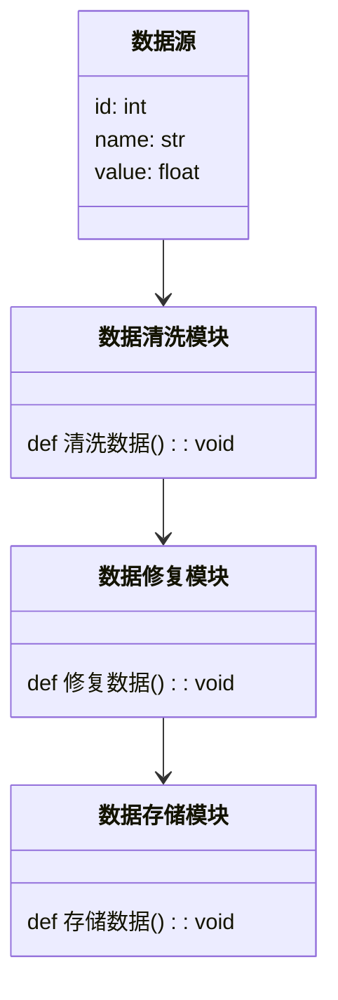
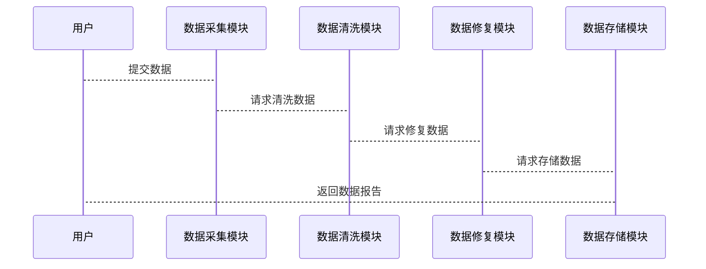

                 


# 《金融数据质量自动化控制与修复平台》

## 关键词：金融数据、数据质量、自动化控制、数据修复、算法原理、系统架构、项目实战

## 摘要：本文系统地介绍了金融数据质量自动化控制与修复平台的背景、核心概念、算法原理、系统架构及项目实战。通过详细分析数据质量的核心要素与修复算法，结合实际案例，展示了如何构建一个高效、可靠的金融数据质量管理平台。

---

## 第1章: 金融数据质量自动化控制与修复平台的背景与意义

### 1.1 问题背景与描述

#### 1.1.1 金融数据质量问题的现状
- 金融行业数据量大、类型多样，数据来源复杂。
- 数据清洗与修复耗时耗力，依赖人工操作。
- 数据质量问题可能导致严重的经济损失。

#### 1.1.2 数据质量问题对金融业务的影响
- 数据不准确可能导致决策失误。
- 数据不完整会影响业务流程的效率。
- 数据不一致可能导致合规性问题。

#### 1.1.3 数据质量控制的重要性
- 保障金融数据的准确性和可靠性。
- 提高数据分析的效率和效果。
- 降低金融业务的风险。

### 1.2 数据质量的定义与核心要素

#### 1.2.1 数据质量的定义
数据质量是指数据的准确性、完整性、一致性、及时性和规范性。

#### 1.2.2 数据质量的核心要素
| 核心要素 | 描述 |
|----------|------|
| 完整性   | 数据是否存在缺失值。 |
| 准确性   | 数据是否真实反映实际情况。 |
| 一致性   | 数据是否符合统一的格式和标准。 |
| 及时性   | 数据是否及时更新。 |
| 规范性   | 数据是否符合业务规范和法律法规。 |

### 1.3 数据修复与自动化的必要性

#### 1.3.1 数据修复的定义与目标
数据修复是指通过算法和技术手段，修复数据中的错误、缺失或不一致等问题，以提高数据质量。

#### 1.3.2 自动化控制与修复的必要性
- 提高数据处理效率。
- 降低人工干预的成本。
- 确保数据处理的准确性。

#### 1.3.3 金融行业对自动化数据质量管理的需求
- 金融行业对数据的实时性和准确性要求高。
- 数据来源多样化，需要统一的数据质量管理平台。

### 1.4 本章小结
本章介绍了金融数据质量自动化控制与修复平台的背景和意义，明确了数据质量的核心要素，强调了数据修复与自动化的必要性。

---

## 第2章: 数据质量与修复的核心概念与联系

### 2.1 数据质量的核心概念

#### 2.1.1 数据质量的维度分析
数据质量可以从完整性、准确性、一致性、及时性和规范性五个维度进行分析。

#### 2.1.2 数据质量与业务目标的关系
数据质量直接影响金融业务的决策和执行效果。

#### 2.1.3 数据质量的生命周期
数据质量贯穿于数据的产生、存储、处理和应用的全过程。

### 2.2 数据修复的核心概念

#### 2.2.1 数据修复的定义与目标
数据修复是指通过技术手段修复数据中的错误、缺失或不一致等问题，以提高数据质量。

#### 2.2.2 数据修复的关键技术
- 数据清洗技术。
- 数据填补技术。
- 数据标准化技术。

#### 2.2.3 数据修复与数据质量管理的关系
数据修复是数据质量管理的重要环节，数据质量管理为数据修复提供规则和标准。

### 2.3 数据质量与修复的联系与区别

#### 2.3.1 数据质量与修复的联系
- 数据修复是提高数据质量的重要手段。
- 数据质量是数据修复的目标和标准。

#### 2.3.2 数据质量与修复的区别
- 数据质量关注数据的整体属性。
- 数据修复关注数据的局部问题。

#### 2.3.3 数据质量与修复的协同作用
- 数据修复通过解决数据问题，提高数据质量。
- 数据质量通过规则和标准，指导数据修复的方向和方法。

### 2.4 数据质量与修复的ER实体关系图
```mermaid
er
actor: 用户
goal: 数据质量管理
process: 数据清洗与修复
data: 数据质量评估报告
rules: 数据质量规则
```

### 2.5 本章小结
本章详细讲解了数据质量与修复的核心概念，分析了它们的联系与区别，并通过ER实体关系图展示了数据质量管理的流程。

---

## 第3章: 数据清洗与修复算法原理

### 3.1 数据清洗算法概述

#### 3.1.1 数据清洗的目标与步骤
- 数据清洗的目标是消除数据中的错误、冗余和不一致。
- 数据清洗的步骤包括数据预处理、数据去重、填补缺失值、标准化和归一化。

#### 3.1.2 常见数据清洗算法
- 去重算法。
- 填补缺失值算法（均值填补、中位数填补、随机填补）。
- 数据标准化算法（Min-Max标准化、Z-score标准化）。
- 数据归一化算法。

### 3.2 数据修复算法原理

#### 3.2.1 数据修复的数学模型
数据修复可以通过回归模型、聚类模型和机器学习模型实现。

#### 3.2.2 数据修复的算法流程
1. 数据预处理：去除噪声、填补缺失值。
2. 数据分析：识别数据中的异常值和不一致。
3. 数据修复：基于规则或模型修复数据问题。

#### 3.2.3 数据修复的实现步骤
- 数据预处理。
- 数据分析与建模。
- 数据修复与验证。

### 3.3 数据清洗与修复的流程图


### 3.4 数据修复算法的Python实现

#### 3.4.1 数据清洗的代码示例
```python
import pandas as pd

# 数据预处理
data = pd.read_csv('data.csv')
data.dropna(inplace=True)  # 删除缺失值
data.drop_duplicates(inplace=True)  # 去重
data['age'].fillna(data['age'].mean(), inplace=True)  # 填补缺失值
```

#### 3.4.2 数据修复的代码示例
```python
from sklearn.impute import KNNImputer

# 数据填补
imputer = KNNImputer(n_neighbors=5)
data_imputed = imputer.fit_transform(data)
```

### 3.5 本章小结
本章详细讲解了数据清洗与修复的算法原理，通过代码示例展示了数据清洗与修复的具体实现步骤。

---

## 第4章: 数据质量管理系统的架构设计

### 4.1 系统功能设计

#### 4.1.1 领域模型


#### 4.1.2 系统功能模块
- 数据采集模块。
- 数据清洗模块。
- 数据修复模块。
- 数据存储模块。
- 数据报告模块。

### 4.2 系统架构设计

#### 4.2.1 系统架构图


#### 4.2.2 系统接口设计
- 数据采集接口。
- 数据清洗接口。
- 数据修复接口。
- 数据存储接口。
- 数据报告接口。

### 4.3 系统交互流程

#### 4.3.1 系统交互流程图


### 4.4 本章小结
本章详细讲解了数据质量管理系统的架构设计，包括功能模块、系统架构图和系统交互流程图。

---

## 第5章: 项目实战——构建金融数据质量自动化控制与修复平台

### 5.1 项目环境安装

#### 5.1.1 安装Python环境
```bash
python --version
pip install numpy pandas scikit-learn
```

#### 5.1.2 安装Jupyter Notebook
```bash
pip install jupyter
jupyter notebook
```

### 5.2 核心代码实现

#### 5.2.1 数据清洗代码
```python
import pandas as pd
from sklearn.impute import KNNImputer

# 数据预处理
data = pd.read_csv('data.csv')
data.dropna(inplace=True)  # 删除缺失值
data.drop_duplicates(inplace=True)  # 去重
data['age'].fillna(data['age'].mean(), inplace=True)  # 填补缺失值
```

#### 5.2.2 数据修复代码
```python
from sklearn.impute import KNNImputer

# 数据填补
imputer = KNNImputer(n_neighbors=5)
data_imputed = imputer.fit_transform(data)
```

### 5.3 代码解读与分析

#### 5.3.1 数据清洗代码解读
- 使用pandas库读取数据。
- 删除数据中的缺失值和重复值。
- 使用均值填补年龄字段的缺失值。

#### 5.3.2 数据修复代码解读
- 使用KNNImputer算法填补数据中的缺失值。
- 基于K近邻算法，选择5个邻居进行数据填补。

### 5.4 实际案例分析

#### 5.4.1 数据清洗案例
假设我们有一个包含客户信息的数据集，其中年龄字段存在缺失值。我们可以通过上述代码进行数据清洗和修复。

#### 5.4.2 数据修复案例
假设我们有一个包含股票价格的数据集，其中某些交易日的价格缺失。我们可以通过上述代码进行数据修复。

### 5.5 本章小结
本章通过实际案例展示了如何构建金融数据质量自动化控制与修复平台，详细讲解了核心代码的实现和应用。

---

## 第6章: 总结与展望

### 6.1 本章总结
- 本文系统地介绍了金融数据质量自动化控制与修复平台的背景、核心概念、算法原理和系统架构。
- 通过实际案例展示了如何构建一个高效、可靠的金融数据质量管理平台。

### 6.2 未来展望
- 数据质量管理将更加智能化和自动化。
- 数据修复算法将更加精准和高效。
- 数据质量管理平台将更加智能化和个性化。

### 6.3 最佳实践
- 数据质量管理需要结合业务需求和数据特点。
- 数据修复需要选择合适的算法和模型。
- 数据质量管理平台需要定期更新和优化。

### 6.4 本章小结
本章总结了全文内容，并展望了未来的发展方向，提出了最佳实践和注意事项。

---

## 参考文献

1. 刘洋, 《数据质量管理与修复技术》.
2. 张伟, 《金融数据分析与挖掘》.
3. 李明, 《数据清洗与修复算法》.

---

通过上述目录结构，您可以逐步展开每一部分的内容，确保文章逻辑清晰、结构紧凑、内容详实。

