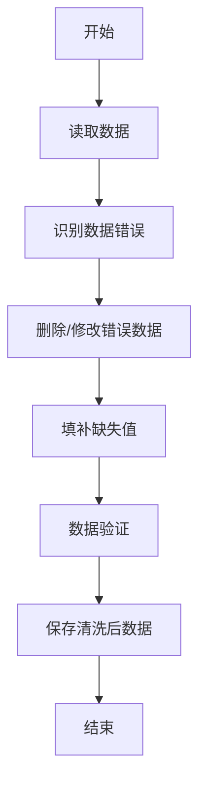
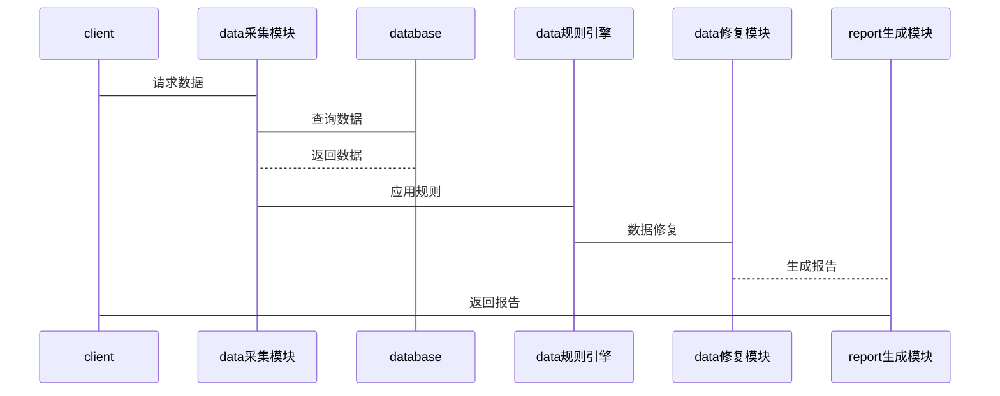

                 


# 《金融数据质量自动化控制平台》

---

## 关键词

- 金融数据质量
- 数据质量管理
- 自动化控制平台
- 数据清洗
- 数据增强
- 数据标准化

---

## 摘要

金融数据的质量直接关系到金融机构的决策能力和风险管理水平。随着金融行业的快速发展，数据量的剧增和数据来源的多样化，数据质量问题变得日益突出。传统的数据质量管理方法依赖人工操作，效率低下且容易出错，难以应对复杂多变的金融环境。因此，构建一个高效的金融数据质量自动化控制平台成为迫切需求。本文将深入探讨金融数据质量管理的核心概念、算法原理、系统架构，并通过实际案例展示如何利用技术手段实现数据质量的自动化控制，最终为金融机构提供一套高效、可靠的解决方案。

---

## 正文

---

### 第一部分: 金融数据质量自动化控制平台概述

---

#### 第1章: 金融数据质量概述

---

##### 1.1 数据质量管理的背景与意义

金融数据是金融机构进行交易、分析和决策的核心依据。然而，在实际业务中，数据质量问题屡见不鲜，主要表现在数据缺失、数据冗余、数据不一致等方面。这些问题不仅会导致分析结果的偏差，还可能引发严重的经济损失和声誉风险。

数据质量管理的目标是通过系统化的手段，确保数据的准确性、完整性和一致性。在金融领域，数据质量管理尤为重要，因为它直接关系到金融机构的合规性、风险控制能力和客户信任度。传统的数据质量管理方法依赖人工操作，效率低下且容易出错。随着技术的进步，自动化数据质量管理成为趋势。

---

##### 1.2 金融数据质量的核心问题

1. **数据完整性问题**：数据缺失或不完整会导致分析结果的偏差，影响决策的准确性。
2. **数据准确性问题**：数据中的错误或虚假信息可能导致错误的业务决策。
3. **数据一致性问题**：同一数据在不同系统中存在不一致，导致数据孤岛和信息混乱。

---

##### 1.3 数据质量自动化控制的必要性

1. **传统数据质量管理的局限性**：
   - 人工检查效率低，且容易出错。
   - 数据量大、来源多样化，人工难以覆盖所有数据。
2. **自动化控制的优势**：
   - 提高数据处理效率，降低人工成本。
   - 实现数据质量管理的标准化和规范化。
   - 支持实时数据监控，快速发现和解决问题。

---

#### 第2章: 数据质量管理的核心概念与联系

---

##### 2.1 数据质量管理的核心概念

1. **数据清洗**：识别和处理数据中的错误、冗余或不完整部分，确保数据的准确性和一致性。
2. **数据增强**：通过补充或修改数据，提高数据的质量和可用性。
3. **数据标准化**：将数据转换为统一的格式或标准，确保数据的一致性。

---

##### 2.2 核心概念的属性特征对比

| 概念       | 属性特征                          |
|------------|-----------------------------------|
| 数据清洗   | 去除错误数据，填补缺失值          |
| 数据增强   | 补充数据，增加数据多样性          |
| 数据标准化 | 统一数据格式，确保数据一致性      |

---

##### 2.3 数据质量管理的ER实体关系图

```mermaid
erDiagram
    customer[客户] {
        id : integer
        name : string
        address : string
    }
    transaction[交易] {
        id : integer
        amount : decimal
        date : datetime
    }
    rule[数据质量规则] {
        id : integer
        name : string
        condition : string
    }
    customer --> transaction : 发起
    rule --> transaction : 应用规则
```

---

### 第二部分: 数据质量管理的算法原理

---

#### 第3章: 数据清洗算法原理

---

##### 3.1 数据清洗流程图



---

##### 3.2 数据清洗算法实现

以下是一个基于Python的简单数据清洗代码示例：

```python
import pandas as pd

# 读取数据
data = pd.read_csv('financial_data.csv')

# 删除重复行
data.drop_duplicates(inplace=True)

# 填补缺失值
data['amount'].fillna(data['amount'].mean(), inplace=True)

# 删除异常值
data = data[(data['amount'] > 0) & (data['amount'] < 1000000)]
```

---

##### 3.3 数据清洗的数学模型

数据清洗过程中常用的异常值检测方法是基于统计学的z-score模型：

$$ z = \frac{x - \mu}{\sigma} $$

其中：
- $x$ 表示数据点的值。
- $\mu$ 表示数据集的均值。
- $\sigma$ 表示数据集的标准差。

如果 $z$ 值的绝对值大于等于3，则认为该数据点是异常值。

---

### 第三部分: 系统架构与设计

---

#### 第4章: 系统架构设计

---

##### 4.1 系统功能设计

1. **数据采集模块**：从多个数据源采集金融数据。
2. **规则引擎模块**：定义和执行数据质量规则。
3. **数据修复模块**：自动修复数据中的错误。

---

##### 4.2 系统架构图

```mermaid
client
    data采集模块
    data规则引擎
    data修复模块
    database
    report生成模块
```

---

#### 4.3 系统接口设计

1. **数据采集接口**：
   - 接收数据请求。
   - 返回数据结果。

2. **规则引擎接口**：
   - 接收数据规则。
   - 返回数据验证结果。

---

#### 4.4 系统交互流程



---

### 第四部分: 项目实战

---

#### 第5章: 项目实战

---

##### 5.1 环境安装

1. 安装Python和相关库：
   ```bash
   pip install pandas numpy matplotlib
   ```

---

##### 5.2 核心代码实现

```python
import pandas as pd
import numpy as np

# 数据清洗函数
def data_cleaning(df):
    # 删除重复行
    df.drop_duplicates(inplace=True)
    # 填补缺失值
    df['amount'].fillna(df['amount'].mean(), inplace=True)
    # 删除异常值
    df = df[(df['amount'] > 0) & (df['amount'] < 1000000)]
    return df

# 数据增强函数
def data_enhancement(df):
    # 添加时间特征
    df['time_features'] = df['date'].apply(lambda x: x.weekday())
    return df

# 数据标准化函数
def data_normalization(df):
    # 标准化金额字段
    df['amount_normalized'] = (df['amount'] - df['amount'].mean()) / df['amount'].std()
    return df
```

---

##### 5.3 案例分析

假设我们有一个交易数据集，其中包含交易金额和交易时间。通过上述函数，我们可以实现数据清洗、数据增强和数据标准化。

---

### 第五部分: 最佳实践

---

#### 第6章: 最佳实践

---

##### 6.1 小结

金融数据质量自动化控制平台通过数据清洗、数据增强和数据标准化等技术手段，能够显著提高数据质量，降低数据风险。

---

##### 6.2 注意事项

1. 数据清洗时，需谨慎处理缺失值，避免简单地删除数据。
2. 数据增强需结合业务场景，避免引入不必要的偏差。
3. 数据标准化需确保不同数据源的格式一致性。

---

##### 6.3 拓展阅读

1. 《数据质量管理手册》
2. 《Python金融数据分析》
3. 《机器学习在金融领域的应用》

---

## 结语

通过构建金融数据质量自动化控制平台，金融机构能够更高效地管理数据质量，降低数据风险，提升决策能力。未来，随着人工智能和大数据技术的不断发展，数据质量管理将更加智能化和自动化。

