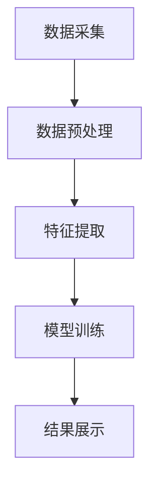

                 


# 金融新闻分析与投资影响评估

## 关键词：
- 金融新闻分析
- 投资影响评估
- 自然语言处理
- 机器学习
- 金融投资

## 摘要：
本文详细探讨了金融新闻分析与投资影响评估的重要性、核心技术以及实际应用。通过自然语言处理和机器学习技术，分析金融新闻中的情感和趋势，评估其对投资决策的影响。文章从背景介绍、核心概念、算法原理、系统架构到项目实战，全面阐述了如何利用这些技术提升投资决策的科学性和准确性。

---

## 第一部分: 金融新闻分析与投资影响评估背景与概念

### 第1章: 金融新闻分析的重要性

#### 1.1 金融新闻分析的定义与背景
金融新闻分析是指通过自然语言处理技术，对金融市场中的新闻、公告、报告等文本数据进行处理和分析，提取有价值的信息，用于评估这些信息对金融市场和投资决策的影响。

- **1.1.1 什么是金融新闻**  
  金融新闻包括公司公告、行业动态、经济指标、政策变化等，这些信息往往会影响市场的波动和投资者的决策。

- **1.1.2 金融新闻分析的必要性**  
  投资者需要及时了解市场动态，以便做出更明智的投资决策。金融新闻分析可以帮助投资者快速提取关键信息，识别市场趋势。

- **1.1.3 投资影响评估的核心概念**  
  投资影响评估是通过分析金融新闻，评估这些信息对资产价格、市场趋势的影响，从而为投资决策提供依据。

#### 1.2 金融市场的基本原理
- 金融市场的波动性  
  市场波动性受多种因素影响，包括经济数据、政策变化、公司业绩等。

- 投资者的决策过程  
  投资者需要基于信息做出决策，信息的质量和及时性直接影响投资结果。

### 第2章: 投资影响评估的理论基础

#### 2.1 投资影响评估的定义
投资影响评估是指通过分析金融新闻，评估这些信息对资产价格、市场趋势的影响，从而为投资决策提供依据。

- **信息的有效性**  
  有效的信息能够影响市场价格，投资者需要关注这些信息。

- **信息的及时性**  
  及时获取信息有助于投资者做出更快的反应。

#### 2.2 金融市场的基本原理
- 市场参与者  
  包括机构投资者、个人投资者、公司等。

- 价格发现机制  
  市场通过供需关系确定资产价格。

#### 2.3 投资决策的关键因素
- 市场情绪  
  投资者的心理和行为会影响市场走势。

- 宏观经济指标  
  如GDP、利率、通货膨胀等。

---

## 第二部分: 金融新闻分析的核心技术

### 第3章: 自然语言处理在金融新闻中的应用

#### 3.1 自然语言处理概述
自然语言处理（NLP）是人工智能的重要分支，用于处理和理解人类语言。在金融新闻分析中，NLP技术可以帮助提取文本中的关键信息。

- **文本预处理**  
  包括分词、去停用词、词干提取等。

- **情感分析**  
  通过分析文本的情感倾向，判断市场情绪。

#### 3.2 金融新闻中的文本特征提取
- **关键词提取**  
  识别文本中的重要词汇，如公司名称、行业术语等。

- **实体识别**  
  识别文本中的实体，如人名、公司名、日期等。

#### 3.3 基于NLP的情感分析在投资决策中的作用
- **市场情绪分析**  
  通过分析新闻的情感倾向，判断市场情绪是积极、消极还是中性。

- **情绪与市场走势的关系**  
  情绪分析可以帮助预测市场走势，辅助投资决策。

### 第4章: 机器学习与深度学习在金融新闻分析中的应用

#### 4.1 机器学习的基本原理
- **监督学习**  
  使用标注数据训练模型，预测未来数据。

- **无监督学习**  
  从数据中发现隐藏模式。

#### 4.2 深度学习在金融新闻分析中的优势
- **文本表示**  
  使用词嵌入（如Word2Vec、GloVe）表示文本。

- **序列模型**  
  使用循环神经网络（RNN）或长短期记忆网络（LSTM）处理序列数据。

#### 4.3 常见的金融新闻分析模型
- **情感分析模型**  
  基于LSTM的情感分析模型。

- **时间序列模型**  
  使用ARIMA或LSTM预测市场趋势。

---

## 第三部分: 投资影响评估的算法与模型

### 第5章: 金融新闻分析的算法原理

#### 5.1 文本预处理流程
1. 分词：将文本分割成词语。
2. 去停用词：去除无意义的词汇。
3. 词干提取：将词语转换为词干。

#### 5.2 特征提取与选择
- **TF-IDF**  
  计算词语的重要性。

- **Word Embedding**  
  使用词嵌入表示词语。

#### 5.3 情感分析算法的实现
- **数据准备**  
  收集标注的情感数据。

- **模型训练**  
  使用训练数据训练情感分析模型。

- **模型评估**  
  使用测试数据评估模型性能。

### 第6章: 投资影响评估的数学模型

#### 6.1 投资影响评估的数学公式
- **线性回归模型**  
  $$ y = \beta_0 + \beta_1 x_1 + \beta_2 x_2 + \dots + \beta_n x_n $$  
  其中，$y$是目标变量，$x_i$是自变量，$\beta_i$是回归系数。

- **逻辑回归模型**  
  $$ P(y=1|x) = \frac{1}{1 + e^{-\beta x}} $$

#### 6.2 模型的训练与优化
- **参数优化**  
  使用梯度下降优化模型参数。

- **正则化**  
  使用L1或L2正则化防止过拟合。

#### 6.3 模型评估与验证
- **准确率**  
  正确预测的比例。

- **召回率**  
  真正正类的预测比例。

- **F1分数**  
  调和平均数，综合准确率和召回率。

---

## 第四部分: 系统架构与项目实战

### 第7章: 金融新闻分析系统的架构设计

#### 7.1 系统功能模块划分
- **数据采集模块**  
  从新闻网站、数据库等获取金融新闻数据。

- **数据预处理模块**  
  对数据进行清洗、分词等处理。

- **模型训练模块**  
  使用训练数据训练情感分析模型。

- **结果展示模块**  
  展示分析结果，如市场情绪、预测趋势等。

#### 7.2 系统架构设计图


#### 7.3 系统接口设计
- **API接口**  
  提供REST API接口，供其他系统调用。

### 第8章: 投资影响评估的项目实战

#### 8.1 项目环境安装与配置
- **安装Python**  
  安装Python 3.8或更高版本。

- **安装依赖库**  
  使用pip安装numpy、pandas、scikit-learn、keras等。

#### 8.2 系统核心代码实现
```python
import numpy as np
from sklearn.feature_extraction.text import TfidfVectorizer
from sklearn.model_selection import train_test_split
from sklearn.linear_model import LogisticRegression
from sklearn.metrics import accuracy_score

# 数据准备
text_data = [...]  # 文本数据
labels = [...]      # 标签

# 特征提取
vectorizer = TfidfVectorizer()
X = vectorizer.fit_transform(text_data)
X_train, X_test, y_train, y_test = train_test_split(X, labels, test_size=0.2)

# 模型训练
model = LogisticRegression()
model.fit(X_train, y_train)

# 模型评估
y_pred = model.predict(X_test)
print("准确率:", accuracy_score(y_test, y_pred))
```

#### 8.3 项目案例分析与解读
- **案例分析**  
  使用某公司的新闻数据进行分析，预测其股价走势。

- **结果解读**  
  分析模型预测结果，评估模型的准确性。

---

## 第五部分: 最佳实践与总结

### 第9章: 金融新闻分析的最佳实践

#### 9.1 数据来源的选择与处理
- **数据来源**  
  选择可靠的新闻网站和数据源。

- **数据清洗**  
  去除噪音数据，确保数据质量。

#### 9.2 模型调优与优化技巧
- **参数调优**  
  使用网格搜索优化模型参数。

- **模型融合**  
  使用集成学习提高模型性能。

#### 9.3 系统部署与维护建议
- **云部署**  
  将系统部署到云服务器，提供API接口。

- **定期更新**  
  定期更新模型，确保模型性能。

### 第10章: 投资影响评估的未来展望

#### 10.1 人工智能在金融新闻分析中的发展趋势
- **深度学习的应用**  
  更多深度学习模型将应用于金融新闻分析。

- **实时分析**  
  实时分析新闻数据，快速响应市场变化。

#### 10.2 投资影响评估技术的创新
- **多模态分析**  
  综合文本、图像等多种数据源进行分析。

- **个性化投资建议**  
  根据投资者的风险偏好提供个性化建议。

---

## 结语

金融新闻分析与投资影响评估是人工智能在金融领域的典型应用，通过自然语言处理和机器学习技术，可以帮助投资者更好地理解市场动态，做出更明智的投资决策。未来，随着技术的不断发展，金融新闻分析将更加智能化和个性化，为投资者提供更精准的支持。

---

