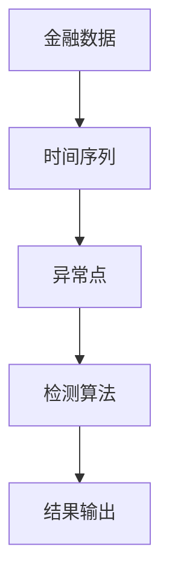
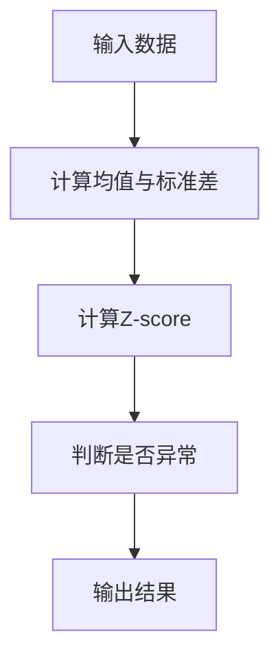
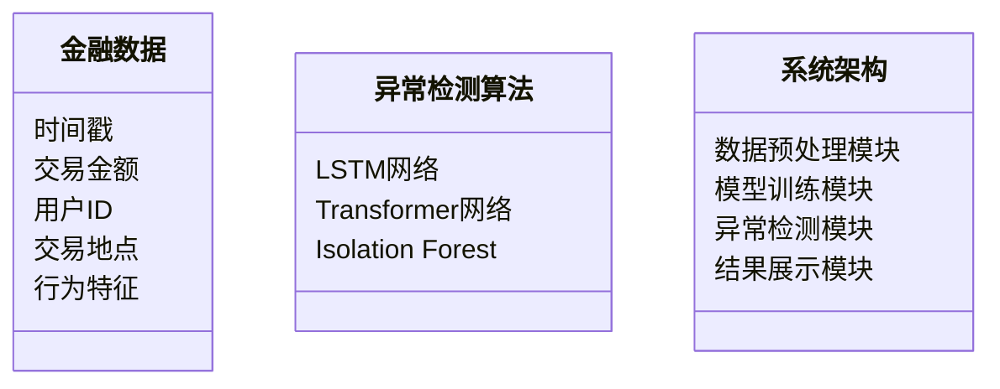

                 


# 《金融时序数据异常检测的AI方法》

**关键词**：金融、时序数据、异常检测、人工智能、深度学习、机器学习、数据科学

**摘要**：  
本文详细探讨了金融时序数据异常检测的AI方法，结合统计学、机器学习和深度学习技术，分析了不同方法的优缺点及其应用场景。通过实际案例和系统架构设计，展示了如何利用这些技术实现高效的金融异常检测系统，帮助读者全面理解并掌握该领域的核心方法和技术。

---

# 《金融时序数据异常检测的AI方法》

---

## 第1章: 异常检测的背景与核心概念

### 1.1 金融时序数据的特性

#### 1.1.1 金融数据的基本特征  
金融数据具有高波动性、非线性、周期性、噪声干扰和高价值等特点。这些特性使得金融时序数据的异常检测具有挑战性。  

#### 1.1.2 时序数据的独特性  
时序数据依赖于时间顺序，数据点之间存在相关性，且可能受到季节性、趋势和周期性的影响。  

#### 1.1.3 异常检测的必要性  
在金融领域，异常检测可以识别潜在的欺诈交易、市场操纵、系统故障等，帮助机构规避风险。  

---

### 1.2 问题背景与目标

#### 1.2.1 金融异常交易的定义  
金融异常交易指偏离正常模式的交易行为，可能包括欺诈、洗钱、市场操纵等。  

#### 1.2.2 异常检测的目标  
- 识别异常交易行为；  
- 提前预警潜在风险；  
- 支持后续分析与决策。  

#### 1.2.3 问题的边界与外延  
- 异常检测不等同于分类或回归问题；  
- 异常检测需要考虑数据的时间依赖性。  

---

### 1.3 核心概念与要素

#### 1.3.1 异常检测的定义与分类  
- 异常检测：通过分析数据，识别与正常模式不一致的异常点。  
- 分类：基于监督学习和无监督学习的方法。  

#### 1.3.2 金融时序数据的核心要素  
- 时间戳（Timestamp）：记录数据的时间；  
- 交易金额（Amount）：交易的金额大小；  
- 用户ID（UserID）：交易的用户标识；  
- 交易地点（Location）：交易的地理位置；  
- 行为特征（Behavior Features）：如交易频率、设备类型等。  

#### 1.3.3 异常检测的评价指标  
- 准确率（Accuracy）：正确识别的异常点占总异常点的比例；  
- 召回率（Recall）：真实异常点中被正确识别的比例；  
- F1分数（F1-Score）：平衡准确率和召回率的指标。  

---

## 第2章: 异常检测的核心概念与联系

### 2.1 异常检测的基本原理

#### 2.1.1 统计学方法  
- **Z-score**：通过计算数据点与均值的距离来判断是否异常。  
  $$ Z = \frac{X - \mu}{\sigma} $$  
- **箱线图**：基于四分位数的异常检测方法。  

#### 2.1.2 机器学习方法  
- **Isolation Forest**：基于树结构的无监督学习算法，适用于高维数据。  
- **One-Class SVM**：通过学习正常数据的分布，识别异常点。  

#### 2.1.3 深度学习方法  
- **LSTM**：通过捕捉时间序列的长程依赖关系，预测未来值并识别异常。  
- **Transformer**：基于自注意力机制，适用于长序列数据的建模。  

---

### 2.2 核心概念对比分析

#### 2.2.1 不同异常检测方法的特征对比  
| 方法         | 是否需要标签 | 计算复杂度 | 适用场景           |  
|--------------|--------------|------------|--------------------|  
| Z-score      | 否           | 低          | 正态分布数据         |  
| Isolation Forest | 否           | 中          | 高维数据             |  
| LSTM          | 否           | 高          | 时间序列数据         |  

#### 2.2.2 方法适用场景的对比分析  
- 统计学方法适用于简单场景；  
- 机器学习方法适用于中等规模数据；  
- 深度学习方法适用于复杂、长序列数据。  

---

### 2.3 实体关系图

#### 2.3.1 ER图展示  


---

## 第3章: 统计学方法

### 3.1 基于统计的异常检测

#### 3.1.1 Z-score方法  
- 计算每个数据点的Z-score，超过阈值则标记为异常。  
- 示例代码：  
  ```python
  import numpy as np
  from scipy import stats

  data = np.array([10, 20, 30, 40, 100])
  z_scores = stats.zscore(data)
  threshold = 3
  anomalies = np.where(np.abs(z_scores) > threshold)[0]
  print(anomalies)
  ```

#### 3.1.2 算法流程  


---

## 第4章: 机器学习方法

### 4.1 基于机器学习的异常检测

#### 4.1.1 Isolation Forest算法  
- 通过构建随机树，将数据点隔离到叶子节点。  
- 示例代码：  
  ```python
  from sklearn.ensemble import IsolationForest

  model = IsolationForest(n_estimators=100, contamination=0.05)
  model.fit(X_train)
  y_pred = model.predict(X_test)
  anomalies = np.where(y_pred == -1)[0]
  ```

#### 4.1.2 One-Class SVM算法  
- 通过学习正常数据的分布，识别异常点。  
- 示例代码：  
  ```python
  from sklearn.svm import OneClassSVM

  model = OneClassSVM(gamma='auto', nu=0.05)
  model.fit(X_train)
  y_pred = model.predict(X_test)
  anomalies = np.where(y_pred == -1)[0]
  ```

---

## 第5章: 深度学习方法

### 5.1 基于深度学习的异常检测

#### 5.1.1 LSTM网络  
- 通过捕捉时间序列的长程依赖关系，预测未来值并识别异常。  
- 示例代码：  
  ```python
  import tensorflow as tf
  from tensorflow.keras.models import Sequential
  from tensorflow.keras.layers import LSTM, Dense

  model = Sequential()
  model.add(LSTM(64, return_sequences=True, input_shape=(timesteps, features)))
  model.add(LSTM(32, return_sequences=False))
  model.add(Dense(1))
  model.compile(optimizer='adam', loss='mse')
  model.fit(X_train, y_train, epochs=10, batch_size=32)
  ```

#### 5.1.2 Transformer网络  
- 基于自注意力机制，适用于长序列数据的建模。  
- 示例代码：  
  ```python
  import tensorflow as tf
  from tensorflow.keras.layers import MultiHeadAttention, Dense

  model = Sequential()
  model.add(MultiHeadAttention(heads=8, key_dim=64))
  model.add(Dense(1))
  model.compile(optimizer='adam', loss='mse')
  model.fit(X_train, y_train, epochs=10, batch_size=32)
  ```

---

## 第6章: 系统分析与架构设计

### 6.1 系统功能设计

#### 6.1.1 领域模型  


---

## 第7章: 项目实战

### 7.1 环境安装与配置

#### 7.1.1 安装Python与依赖库  
```bash
pip install numpy pandas scikit-learn tensorflow
```

#### 7.1.2 数据集加载  
```python
import pandas as pd
data = pd.read_csv('financial_data.csv')
```

---

### 7.2 系统核心实现

#### 7.2.1 LSTM模型实现  
```python
import tensorflow as tf
from tensorflow.keras.models import Sequential
from tensorflow.keras.layers import LSTM, Dense

model = Sequential()
model.add(LSTM(64, return_sequences=True, input_shape=(timesteps, features)))
model.add(LSTM(32, return_sequences=False))
model.add(Dense(1))
model.compile(optimizer='adam', loss='mse')
model.fit(X_train, y_train, epochs=10, batch_size=32)
```

#### 7.2.2 训练与预测  
```python
y_pred = model.predict(X_test)
threshold = 0.5
anomalies = np.where(y_pred > threshold)[0]
```

---

## 第8章: 最佳实践与总结

### 8.1 小结

- 统计学方法适用于简单场景；  
- 机器学习方法适用于中等规模数据；  
- 深度学习方法适用于复杂、长序列数据。  

### 8.2 注意事项

- 数据预处理是关键；  
- 需要考虑模型的实时性；  
- 需要结合业务场景进行调整。  

### 8.3 拓展阅读

- 《时间序列分析》  
- 《深度学习实战》  
- 《金融数据分析》  

---

**总结**：通过本文的讲解，读者可以全面了解金融时序数据异常检测的AI方法，掌握从理论到实践的完整流程，为实际应用提供参考和指导。

