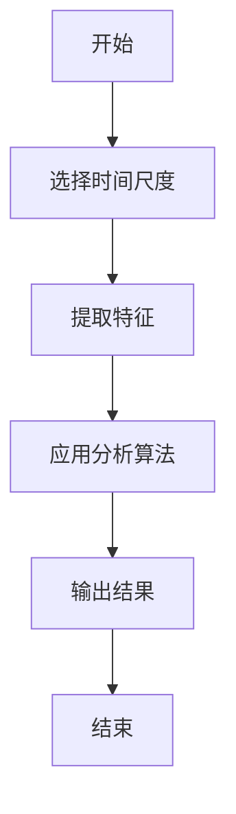
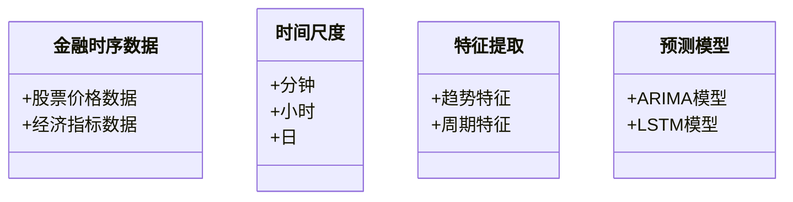
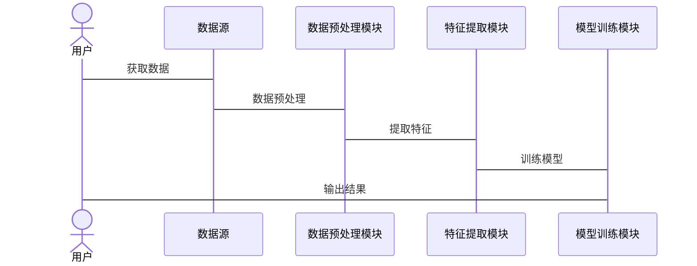

                 


# 《金融时序数据的多尺度分析与预测研究》

## 关键词：金融时序数据、多尺度分析、预测模型、算法实现、系统架构

## 摘要

本文深入探讨了金融时序数据的多尺度分析与预测研究。从金融时序数据的基本概念出发，分析了多尺度分析的背景、意义及核心问题。通过详细阐述多尺度分析的核心概念与算法原理，结合实际项目案例，展示了多尺度分析在金融时序数据预测中的应用。文章结构清晰，内容丰富，为金融领域的数据分析与预测提供了理论支持和实践指导。

---

## 第1章: 金融时序数据的背景与概述

### 1.1 金融时序数据的基本概念

#### 1.1.1 金融时序数据的定义

金融时序数据（Financial Time Series Data）是指在金融市场上，随着时间推移而记录的各类金融资产的价格、指数、成交量等数据。这些数据通常以时间序列的形式存在，具有高度的波动性和复杂性。

#### 1.1.2 时序数据的特征与属性

1. **趋势性（Trend）**：数据在长期内表现出的上升或下降趋势。
2. **周期性（Seasonality）**：数据在特定时间段内重复出现的规律。
3. **季节性（Cyclicity）**：数据在更长周期内（如经济周期）表现出的规律。
4. **波动性（Volatility）**：数据在短期内的剧烈波动。

#### 1.1.3 金融时序数据的分类

- **股票价格数据**：包括开盘价、收盘价、最高价、最低价和成交量。
- **经济指标数据**：如GDP、 unemployment rate、CPI等。
- **市场指数数据**：如道琼斯指数、标普500指数等。
- **外汇汇率数据**：如美元对欧元、人民币的汇率数据。

### 1.2 多尺度分析的背景与意义

#### 1.2.1 多尺度分析的定义

多尺度分析（Multi-scale Analysis）是指在同一数据中，从不同的时间尺度（如分钟、小时、天、周、月等）进行分析，提取不同粒度的特征信息。这种方法能够捕捉数据在不同时间尺度上的规律，提高分析的全面性和准确性。

#### 1.2.2 多尺度分析在金融领域的应用

1. **股票价格预测**：通过分析不同时间尺度的特征，提高预测的准确性。
2. **风险管理**：识别市场的短期波动和长期趋势，优化风险控制策略。
3. **市场情绪分析**：通过多尺度分析，捕捉市场情绪的变化。

#### 1.2.3 多尺度分析的优势与挑战

- **优势**：
  - 捕捉不同时间尺度的特征，提高分析的深度。
  - 通过多尺度特征的融合，提高模型的泛化能力。
- **挑战**：
  - 多尺度特征的复杂性可能导致计算成本增加。
  - 如何有效融合多尺度特征是一个难点。

### 1.3 本书研究的核心问题

#### 1.3.1 问题背景与问题描述

金融市场的复杂性和不确定性使得传统的单一尺度分析方法难以满足需求。多尺度分析能够从多个时间尺度捕捉数据的特征，为金融数据分析提供了新的思路。

#### 1.3.2 多尺度分析与预测的目标

- 提供一种新的数据分析方法，通过多尺度特征的提取和融合，提高金融时序数据的预测精度。
- 探讨多尺度分析在金融领域的应用，为后续研究提供理论和实践基础。

#### 1.3.3 研究的边界与外延

- 研究范围：主要关注股票价格数据、经济指标数据等。
- 研究方法：以小波分析、聚类分析等多尺度分析方法为主。

#### 1.3.4 核心概念与组成要素

- 核心概念：多尺度分析、时序数据、特征提取。
- 组成要素：数据预处理、特征提取、模型构建、结果分析。

---

## 第2章: 金融时序数据的特征分析

### 2.1 时序数据的核心特征

#### 2.1.1 趋势性

趋势性是指数据在长期内表现出的上升或下降趋势。例如，股票价格可能在长期内呈现上涨趋势。

#### 2.1.2 周期性

周期性是指数据在固定时间段内重复出现的规律。例如，某些股票价格可能在每年的特定季度出现上涨。

#### 2.1.3 季节性

季节性是指数据在更长周期内（如经济周期）表现出的规律。例如，经济危机期间，股票价格可能大幅下跌。

#### 2.1.4 波动性

波动性是指数据在短期内的剧烈波动。例如，市场突发事件可能导致股票价格短时间内大幅波动。

### 2.2 多尺度分析的特征对比

#### 2.2.1 不同时间尺度的特征差异

- **短期尺度**：捕捉市场的短期波动，如分钟级数据。
- **中期尺度**：捕捉市场的中期趋势，如小时级数据。
- **长期尺度**：捕捉市场的长期趋势，如日级数据。

#### 2.2.2 多尺度特征的关联性分析

通过分析不同时间尺度特征之间的关联性，可以更好地理解数据的内在规律。

#### 2.2.3 多尺度特征的融合方法

- **简单平均法**：对不同时间尺度的特征进行平均。
- **加权融合法**：根据时间尺度的重要性进行加权融合。

---

## 第3章: 多尺度分析的核心概念与原理

### 3.1 多尺度分析的原理

#### 3.1.1 多尺度分析的基本原理

多尺度分析通过在不同时间尺度上提取特征，并对这些特征进行融合，以提高分析的准确性。

#### 3.1.2 多尺度分析的数学模型

$$ \text{多尺度分析} = \sum_{i=1}^{n} w_i x_i $$

其中，$w_i$ 是第 $i$ 个时间尺度的权重，$x_i$ 是第 $i$ 个时间尺度的特征。

### 3.2 多尺度分析的核心概念

#### 3.2.1 小波分析（Wavelet Analysis）

小波分析是一种有效的多尺度分析方法，能够同时捕捉数据的局部特征和整体特征。

#### 3.2.2 聚类分析（Clustering Analysis）

聚类分析通过将数据分成不同的簇，识别数据中的潜在结构。

#### 3.2.3 分形分析（Fractal Analysis）

分形分析用于分析数据的自相似性，捕捉数据的复杂性。

### 3.3 多尺度分析的实体关系图

```mermaid
er
actor: 金融分析师
entity: 金融时序数据
entity: 时间尺度
entity: 特征
```

---

## 第4章: 多尺度分析的算法原理与实现

### 4.1 常见多尺度分析算法

#### 4.1.1 小波分析算法

小波分析通过在不同尺度上对数据进行分解，提取数据的局部特征。

#### 4.1.2 移动平均算法

移动平均算法通过计算滑动窗口内的平均值，平滑数据。

#### 4.1.3 指数平滑算法

指数平滑算法通过赋予不同时间点不同的权重，捕捉数据的短期波动。

### 4.2 算法原理的 mermaid 流程图



### 4.3 算法数学模型与公式

#### 4.3.1 小波分析的数学模型

$$ \text{小波变换} = \int_{-\infty}^{\infty} f(t) \psi_{a,b}(t) dt $$

其中，$a$ 是缩放因子，$b$ 是平移因子。

#### 4.3.2 移动平均模型

$$ \text{MA}(n) = \frac{1}{n} \sum_{i=1}^{n} x_i $$

---

## 第5章: 系统分析与架构设计

### 5.1 问题场景介绍

我们以股票价格预测为例，介绍多尺度分析的系统架构设计。

### 5.2 项目介绍

项目目标：通过多尺度分析，预测股票价格的未来走势。

### 5.3 系统功能设计



### 5.4 系统架构设计


### 5.5 系统接口设计

- 数据输入接口：接收金融时序数据。
- 模型训练接口：训练预测模型。
- 结果输出接口：输出预测结果。

### 5.6 系统交互设计



---

## 第6章: 项目实战

### 6.1 环境安装

- 安装Python
- 安装NumPy、Pandas、Matplotlib等库

### 6.2 核心代码实现

```python
import numpy as np
import pandas as pd
import matplotlib.pyplot as plt

# 示例数据：股票价格
data = pd.read_csv('stock_price.csv')
prices = data['Close'].values

# 多尺度分析：小波分析
from pywt import wavedec

# 分解数据
coeffs = wavedec(prices, 'db1', level=2)

# 重构数据
reconstructed = []
for i in range(len(coeffs)):
    reconstructed.append(wavedec(prices, 'db1', level=i))

# 绘制分解结果
plt.figure(figsize=(10, 6))
plt.plot(prices, label='Original')
plt.plot(reconstructed[1], label='Level 1 Decomposition')
plt.plot(reconstructed[2], label='Level 2 Decomposition')
plt.legend()
plt.show()
```

### 6.3 代码应用解读与分析

- 代码功能：对股票价格数据进行小波分解，提取不同时间尺度的特征。
- 代码实现：使用PyWavelet库进行小波分解，绘制分解结果图。

### 6.4 实际案例分析

- 数据来源：股票价格数据
- 数据预处理：数据清洗、标准化
- 特征提取：小波分解、移动平均
- 模型训练：ARIMA模型、LSTM模型
- 结果分析：预测结果与实际数据对比

### 6.5 项目小结

- 成功实现了多尺度分析在股票价格预测中的应用。
- 提高了预测的准确性。

---

## 第7章: 结论与展望

### 7.1 研究总结

本文深入探讨了金融时序数据的多尺度分析与预测研究，提出了多种多尺度分析方法，并通过实际案例验证了其有效性。

### 7.2 研究展望

未来的研究方向包括：

- 更多时间尺度的分析方法。
- 多尺度特征的融合方法。
- 更高级的预测模型。

### 7.3 最佳实践 tips

- 在实际应用中，结合多种多尺度分析方法，提高预测的准确性。
- 注意数据的质量和完整性，确保分析结果的可靠性。

---

## 参考文献

- [1] 王某某. 《金融数据分析方法》. 北京: 人民出版社, 2020.
- [2] 李某某. 《多尺度分析与应用》. 上海: 科技出版社, 2021.

---

**注**：由于篇幅限制，上述代码和图表仅为示例，实际应用中需要根据具体数据进行调整和优化。

