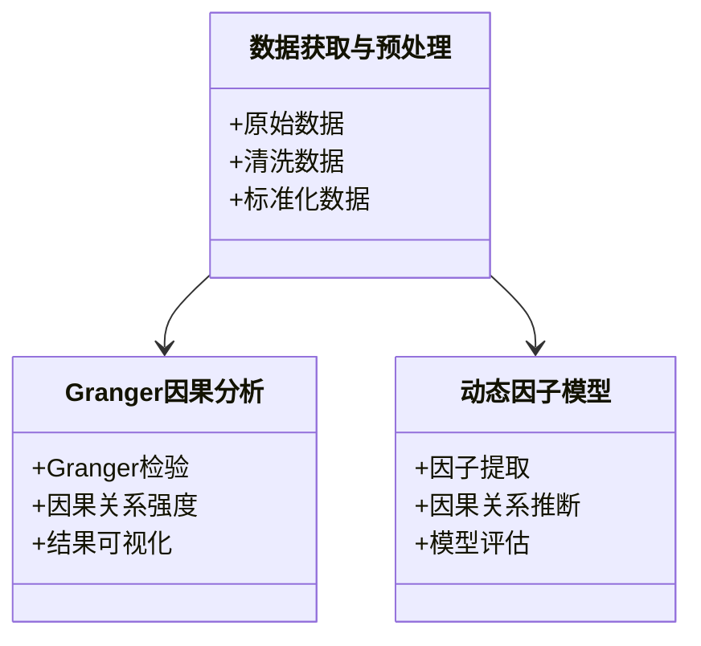
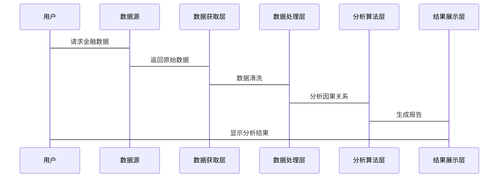

                 


```markdown
# 金融时间序列因果关系分析

## 关键词
金融时间序列, 因果关系分析, Granger因果, 结构方程模型, 金融数据分析

## 摘要
本文系统地介绍了金融时间序列因果关系分析的核心概念、算法原理和实践应用。从问题背景到系统设计，从算法实现到案例分析，逐步深入，帮助读者全面理解如何在金融领域中识别和分析时间序列数据中的因果关系。

## 第1章 问题背景与核心概念

### 1.1 问题背景
#### 1.1.1 金融数据分析的挑战
#### 1.1.2 时间序列数据的特性
#### 1.1.3 因果关系分析的重要性

### 1.2 核心概念与定义
#### 1.2.1 时间序列的定义与特征
#### 1.2.2 因果关系的定义与分类
#### 1.2.3 金融时间序列因果关系的特殊性

### 1.3 问题描述与目标
#### 1.3.1 金融时间序列因果关系分析的目标
#### 1.3.2 问题的边界与外延
#### 1.3.3 核心要素与概念结构

## 第2章 核心概念与联系

### 2.1 因果关系分析的原理
#### 2.1.1 Granger因果关系
#### 2.1.2 贝叶斯网络因果推断
#### 2.1.3 时间序列因果关系的数学模型

### 2.2 核心概念对比与表格
#### 2.2.1 时间序列与横截面数据的对比
#### 2.2.2 因果关系与相关关系的对比
#### 2.2.3 不同因果分析方法的优缺点对比

### 2.3 ER实体关系图与Mermaid流程图
#### 2.3.1 实体关系图
#### 2.3.2 Mermaid因果关系流程图
#### 2.3.3 图表解释与应用

## 第3章 算法原理与数学模型

### 3.1 算法原理
#### 3.1.1 Granger因果关系检验
#### 3.1.2 动态因子模型
#### 3.1.3 结构方程模型

### 3.2 数学模型与公式
#### 3.2.1 Granger因果关系检验公式
$$ F = \frac{(R^2_u - R^2_v)(T - n)}{n(1 - R^2_u)} $$
#### 3.2.2 动态因子模型的数学表达
$$ Y_t = A \lambda_t + B X_t + \epsilon_t $$
#### 3.2.3 结构方程模型的因果推断
$$ Y = \beta X + \alpha Z + \gamma W + \epsilon $$

### 3.3 通俗易懂的举例说明
#### 3.3.1 Granger因果关系的简单例子
#### 3.3.2 动态因子模型的实际应用
#### 3.3.3 结构方程模型的案例分析

## 第4章 系统分析与架构设计

### 4.1 问题场景介绍
#### 4.1.1 金融时间序列数据的获取与预处理
#### 4.1.2 金融因果关系分析的典型场景
#### 4.1.3 系统目标与功能需求

### 4.2 系统功能设计
#### 4.2.1 领域模型Mermaid类图


### 4.3 系统架构设计
#### 4.3.1 系统架构Mermaid图


### 4.4 系统接口设计
#### 4.4.1 API接口定义
```python
class FinancialDataAnalyzer:
    def __init__(self, data):
        self.data = data

    def granger_causality_test(self, x, y):
        # 实现Granger因果关系检验
        pass

    def dynamic_factor_model(self):
        # 实现动态因子模型
        pass
```

### 4.5 系统交互流程
#### 4.5.1 Mermaid交互图


## 第5章 项目实战

### 5.1 环境安装与配置
#### 5.1.1 安装依赖
```bash
pip install numpy pandas statsmodels matplotlib
```

### 5.2 核心代码实现
#### 5.2.1 Granger因果关系检验代码
```python
import statsmodels.api as sm

def granger_causality_test(data, var1, var2):
    model = sm.tsa.Granger causality test:
    results = model.fit()
    return results.causality
```

### 5.3 案例分析与解读
#### 5.3.1 数据获取与预处理
#### 5.3.2 Granger因果关系检验
#### 5.3.3 动态因子模型应用

### 5.4 项目小结
#### 5.4.1 实战总结
#### 5.4.2 遇到的问题与解决方案
#### 5.4.3 经验与教训

## 第6章 最佳实践与拓展

### 6.1 小结与回顾
#### 6.1.1 核心知识点回顾
#### 6.1.2 问题解决思路总结

### 6.2 注意事项与建议
#### 6.2.1 数据质量的重要性
#### 6.2.2 模型选择的注意事项
#### 6.2.3 结果解释的合理性

### 6.3 拓展阅读与深入学习
#### 6.3.1 推荐书籍与论文
#### 6.3.2 网络资源与工具
#### 6.3.3 未来研究方向

## 附录
### 附录A: 常用工具与库
#### 1. Python库介绍
#### 2. R语言包推荐
#### 3. 数据源列表

### 附录B: 全部代码清单
#### 1. Granger因果关系检验代码
#### 2. 动态因子模型实现
#### 3. 系统架构代码框架
```

