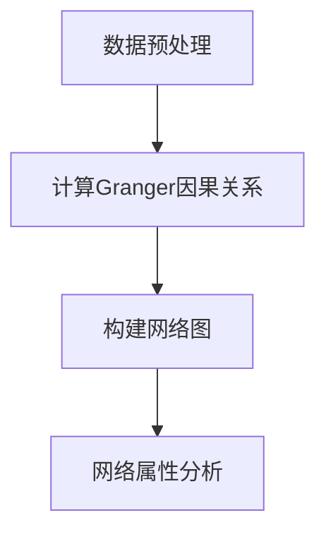
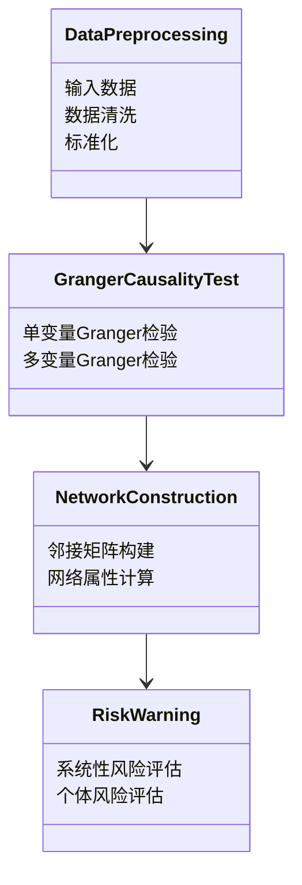

                 


# 《金融时间序列因果关系网络分析》

> 关键词：金融时间序列，因果关系网络，Granger因果检验，网络属性分析，金融风险预警

> 摘要：本文系统地探讨了金融时间序列因果关系网络分析的核心概念、算法原理、数学模型和实际应用。通过结合Granger因果检验和网络分析方法，本文提出了一种新的金融风险预警框架，能够有效识别金融市场中的因果关系网络结构，并为投资者提供决策支持。

---

# 第一部分: 金融时间序列因果关系网络分析基础

---

## 第1章: 金融时间序列分析概述

### 1.1 时间序列分析的基本概念

#### 1.1.1 时间序列的定义与特点
时间序列是指按照时间顺序排列的一组数据，通常用于描述某个变量在不同时间点上的变化情况。金融时间序列分析是金融数据分析的重要组成部分，广泛应用于股票价格预测、风险管理、资产配置等领域。

#### 1.1.2 金融时间序列的独特性
金融时间序列具有以下独特性：
1. **非线性**：金融市场中的价格波动通常是非线性的，难以用简单的线性模型描述。
2. **异质性**：不同金融资产之间的相关性和波动性差异较大。
3. **波动性**：金融时间序列往往表现出“肥尾”特征，极端事件发生的概率较高。
4. **高频性**：现代金融市场交易频率极高，时间序列数据的采样间隔可以是秒级别甚至更短。

#### 1.1.3 时间序列分析的应用场景
时间序列分析在金融领域的应用场景包括：
- 股票价格预测
- 金融风险管理
- 资产配置优化
- 金融异常事件检测
- 金融市场结构分析

---

### 1.2 因果关系网络的基本概念

#### 1.2.1 因果关系的定义
因果关系是指一个变量的变化能够直接影响另一个变量的变化。在金融领域，因果关系网络用于描述不同金融资产之间的相互影响关系。

#### 1.2.2 网络分析在金融中的应用
网络分析在金融领域的应用包括：
- 识别金融市场中的主导资产
- 分析资产之间的相互影响关系
- 评估金融市场的系统性风险

#### 1.2.3 金融时间序列因果关系的复杂性
金融时间序列因果关系的复杂性主要体现在以下几个方面：
1. **多重因果关系**：一个资产的变化可能受到多个其他资产的影响。
2. **动态变化**：金融市场的因果关系网络可能随时间发生变化。
3. **非线性关系**：因果关系可能表现为非线性关系。

---

## 第2章: 金融时间序列因果关系网络的核心概念

### 2.1 因果关系网络的构建原理

#### 2.1.1 Granger因果检验的基本原理
Granger因果检验是一种常用的时间序列因果关系检验方法。其基本思想是：如果变量 $X$ 对变量 $Y$ 存在Granger因果关系，则 $Y$ 的预测可以通过引入 $X$ 的过去信息来提高准确性。

#### 2.1.2 网络因果关系的数学模型
网络因果关系可以通过邻接矩阵来表示，其中 $A_{ij}$ 表示变量 $i$ 对变量 $j$ 是否存在因果关系。

#### 2.1.3 网络节点与边的定义
- **节点**：代表金融资产（如股票、指数等）。
- **边**：表示两个资产之间的因果关系，边的方向表示因果关系的方向。

---

### 2.2 金融时间序列因果关系的网络属性

#### 2.2.1 网络密度与节点度分布
- **网络密度**：表示网络中边的数量与可能边数的比值。
- **节点度分布**：表示网络中每个节点的度数（即连接的边数）。

#### 2.2.2 网络的聚类系数与模块化
- **聚类系数**：表示网络中相邻节点的连接程度。
- **模块化**：表示网络中社区结构的清晰程度。

#### 2.2.3 网络的路径长度与直径
- **路径长度**：表示网络中任意两个节点之间最短路径的平均长度。
- **直径**：表示网络中最长的最短路径长度。

---

## 第3章: 金融时间序列因果关系网络的算法原理

### 3.1 Granger因果检验的数学模型

#### 3.1.1 单变量Granger检验公式
$$
F = \frac{(R^2_{\text{restricted}} - R^2_{\text{unrestricted}}) / (T - 2k - 1)}{(1 - R^2_{\text{unrestricted}}) / (T - k - 1)}
$$
其中，$T$为样本数量，$k$为回归变量个数。

---

#### 3.1.2 多变量Granger因果检验
多变量Granger因果检验可以使用向量自回归（VAR）模型进行，其基本形式为：
$$
\mathbf{y}_t = c + \sum_{i=1}^p \Phi_i \mathbf{y}_{t-i} + \epsilon_t
$$

---

### 3.2 网络因果关系的构建算法

#### 3.2.1 基于Granger检验的网络构建
- 对每对变量进行Granger因果检验。
- 根据检验结果构建邻接矩阵。

#### 3.2.2 基于动态时间序列模型的网络构建
- 使用动态因子模型（DFM）提取隐含因子。
- 根据隐含因子构建因果关系网络。

#### 3.2.3 基于贝叶斯网络的因果推断
- 使用贝叶斯网络（Bayesian Network）进行因果推断。
- 通过条件概率计算因果关系。

---

### 3.3 算法实现的流程图



---

## 第4章: 金融时间序列因果关系网络的数学模型

### 4.1 Granger因果检验的数学公式

#### 4.1.1 单变量Granger检验公式
$$
F = \frac{(R^2_{\text{restricted}} - R^2_{\text{unrestricted}}) / (T - 2k - 1)}{(1 - R^2_{\text{unrestricted}}) / (T - k - 1)}
$$

其中，$T$为样本数量，$k$为回归变量个数。

---

#### 4.1.2 多变量Granger因果检验公式
$$
F = \frac{(R^2_{\text{restricted}} - R^2_{\text{unrestricted}}) / (T - 2k - 1)}{(1 - R^2_{\text{unrestricted}}) / (T - k - 1)}
$$

---

### 4.2 网络因果关系的数学表达

#### 4.2.1 网络邻接矩阵的定义
$$
A_{ij} = 1 \text{ 如果变量 } i \text{ 对变量 } j \text{ 存在Granger因果关系}
$$

---

## 第5章: 金融时间序列因果关系网络的系统分析与架构设计

### 5.1 系统架构设计



---

## 第6章: 金融时间序列因果关系网络的项目实战

### 6.1 环境安装与配置

```bash
# 安装必要的Python库
pip install numpy
pip install pandas
pip install matplotlib
pip install networkx
pip install statsmodels
```

---

### 6.2 核心代码实现

```python
import numpy as np
import pandas as pd
from statsmodels.tsa.stattools import grangercausalitytests

# 示例数据：假设我们有两支股票的价格数据
data = pd.DataFrame({
    'stock1': [100, 101, 102, 103, 104],
    'stock2': [200, 201, 202, 203, 204]
})

# 使用Granger因果检验
result = grangercausalitytests(data, maxlag=1, verbose=False)
print(result)
```

---

### 6.3 案例分析

#### 6.3.1 数据来源与预处理
- 数据来源：假设我们使用的是某金融市场的股票价格数据。
- 数据预处理：包括数据清洗、标准化等步骤。

#### 6.3.2 网络构建
- 使用Granger因果检验构建邻接矩阵。
- 可视化网络结构。

#### 6.3.3 风险预警
- 基于网络属性分析，评估系统性风险。
- 提供风险预警信号。

---

## 第7章: 结论与展望

### 7.1 研究结论
本文提出了基于Granger因果检验的金融时间序列因果关系网络分析方法，能够有效识别金融市场中的因果关系网络结构，为金融风险管理提供了新的思路。

### 7.2 研究展望
未来的研究可以进一步探索以下方向：
1. 结合深度学习方法，提高因果关系网络的构建精度。
2. 研究网络动态变化，构建实时更新的因果关系网络。
3. 探讨因果关系网络在金融监管中的应用。

---

## 第8章: 最佳实践与注意事项

### 8.1 最佳实践
- 数据预处理是关键，确保数据质量。
- 选择合适的模型参数，避免过拟合。
- 定期更新网络模型，适应市场变化。

### 8.2 注意事项
- Granger因果检验仅能证明统计上的因果关系，不能完全等同于实际的因果关系。
- 金融时间序列数据具有高度的波动性，模型需要具有鲁棒性。

---

## 第9章: 扩展阅读

### 9.1 推荐书籍
1. 《时间序列分析》
2. 《网络科学导论》
3. 《金融风险管理》

### 9.2 推荐论文
1. Granger, C. W. J. (1969). Some Aspects of Smoothing and Forecasting.
2. Bowerman, B. L., & O'Con

