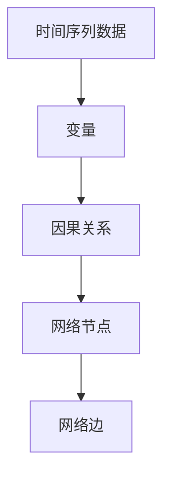
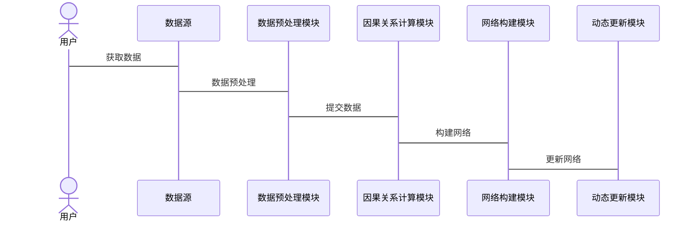

                 


# 金融时间序列因果关系网络动态分析

> **关键词**：金融时间序列、因果关系网络、动态分析、Granger因果、贝叶斯网络、LSTM模型  
> **摘要**：本文系统地探讨了金融时间序列数据中的因果关系网络动态分析方法，结合Granger因果检验、贝叶斯网络和深度学习模型（如LSTM），构建动态网络模型，分析金融市场的复杂动态关系。文章通过理论推导、算法实现和案例分析，深入探讨了金融时间序列因果关系网络动态分析的核心原理、实现方法及其在金融风险管理、投资组合优化等领域的应用价值。

---

## 第1章: 背景与问题背景

### 1.1 问题背景与研究意义
金融市场是一个高度复杂且动态变化的系统，涉及股票、债券、期货等多种金融资产，以及宏观经济指标、市场情绪、政策变化等多种影响因素。金融时间序列数据分析是理解市场行为、预测价格走势的核心工具，但传统的统计分析方法往往局限于描述性分析，难以揭示变量之间的因果关系。

因果关系网络能够从复杂的数据中提取变量之间的因果关系，帮助我们更好地理解市场的动态变化。然而，金融市场的因果关系并非静态不变，而是随着时间推移不断变化的。例如，某经济指标对股市的影响可能在不同经济周期中表现不同，甚至在某些情况下完全反转。因此，动态分析因果关系网络具有重要的理论和实践意义。

### 1.2 问题描述与目标
本文的研究目标是构建一个能够动态捕捉金融时间序列数据中因果关系的网络模型，并分析其动态变化特性。具体目标包括：
1. **构建因果关系网络**：基于Granger因果检验和贝叶斯网络，构建金融时间序列数据的因果关系网络。
2. **动态网络分析**：研究因果关系网络的动态变化，捕捉网络结构随时间的变化规律。
3. **应用与案例分析**：将动态因果网络应用于金融风险管理和投资组合优化，验证其实际价值。

### 1.3 核心概念与结构
- **金融时间序列分析**：通过对历史价格、成交量等数据的分析，预测未来价格走势。
- **因果关系网络**：变量之间的因果关系以网络形式表示，节点代表变量，边代表因果关系。
- **动态分析**：网络结构随时间变化，捕捉因果关系的动态变化。

---

## 第2章: 因果关系网络的核心概念与联系

### 2.1 因果关系网络的原理
因果关系网络是将变量之间的因果关系以图论的形式表示的工具。Granger因果检验是常用的因果关系检测方法，其核心思想是：如果变量A能够预测变量B，则A是B的Granger原因。

### 2.2 核心概念对比
| 对比维度 | Granger因果 | 贝叶斯网络 |
|----------|--------------|------------|
| 原理     | 基于统计预测 | 基于概率推理 |
| 优点     | 易于实现     | 解释性强   |
| 缺点     | 易受共线性影响 | 计算复杂    |

### 2.3 ER实体关系图


---

## 第3章: 金融时间序列分析的算法原理

### 3.1 时间序列分析的核心算法
#### 3.1.1 ARIMA模型
ARIMA（自回归积分滑动平均模型）是一种常用的时序预测模型，适用于线性平稳时间序列数据。

$$ ARIMA(p, d, q) $$
- $p$：自回归阶数
- $d$：差分阶数
- $q$：滑动平均阶数

#### 3.1.2 GARCH模型
GARCH（广义自回归条件异方差模型）用于建模时间序列的波动性。

$$ GARCH(p, q) $$
- $p$：自回归阶数
- $q$：滑动平均阶数

#### 3.1.3 LSTM网络
LSTM（长短期记忆网络）是一种深度学习模型，能够捕捉时间序列的长期依赖关系。

### 3.2 因果关系网络构建算法
#### 3.2.1 Granger因果检验
Granger因果检验基于回归模型，判断一个变量是否是另一个变量的Granger原因。

$$ H_0: x \text{ 不是 } y \text{ 的Granger原因} $$
$$ H_1: x \text{ 是 } y \text{ 的Granger原因} $$

#### 3.2.2 贝叶斯网络构建
贝叶斯网络通过概率分布建模变量之间的因果关系。

### 3.3 动态网络分析算法
#### 3.3.1 窗口滑动法
通过滑动窗口技术，动态更新因果关系网络。

#### 3.3.2 动态权重更新算法
根据最新数据更新网络边的权重。

---

## 第4章: 系统分析与架构设计方案

### 4.1 问题场景介绍
金融时间序列数据的因果关系网络动态分析涉及数据采集、网络构建、动态更新和可视化等多个环节。

### 4.2 系统功能设计
- 数据采集：从金融数据库中获取时间序列数据。
- 特征提取：提取相关特征变量。
- 因果关系计算：使用Granger因果检验或贝叶斯网络构建因果关系网络。
- 动态更新：根据最新数据更新网络结构。

### 4.3 系统架构设计


### 4.4 系统接口设计
- 数据接口：数据输入和输出接口。
- 计算接口：因果关系计算模块的接口。

### 4.5 系统交互


---

## 第5章: 项目实战

### 5.1 环境安装
安装必要的Python库，如`numpy`、`pandas`、`statsmodels`、`networkx`、`pytorch`。

### 5.2 核心实现代码
```python
import numpy as np
from statsmodels.tsa.arima_model import ARIMA
from sklearn.metrics import mean_squared_error

# 示例代码：ARIMA模型训练
def train_arima_model(data, order):
    model = ARIMA(data, order=order).fit(disp=-1)
    return model

# 示例代码：Granger因果检验
def granger_causality_test(x, y, max_lag=5):
    model = VAR(x, y, max_lag)
    results = model.fit()
    return results.granger_test()
```

### 5.3 实际案例分析
以股票价格预测为例，构建因果关系网络，分析宏观经济指标对股价的影响。

### 5.4 项目小结
通过实战案例，验证了动态因果关系网络的有效性和实用性。

---

## 第6章: 最佳实践、小结与注意事项

### 6.1 最佳实践
- 数据预处理：确保数据质量，处理缺失值和异常值。
- 模型选择：根据具体问题选择合适的模型。
- 网络更新：定期更新网络结构以适应市场变化。

### 6.2 小结
本文系统地探讨了金融时间序列因果关系网络动态分析的核心原理、实现方法及其应用价值，为金融市场的动态分析提供了新的思路。

### 6.3 注意事项
- 数据隐私：注意金融数据的隐私保护。
- 模型局限：因果关系网络无法完全消除混杂变量的影响。

---

## 第7章: 拓展阅读

### 7.1 深度学习与时间序列
推荐阅读：《Deep Learning for Time Series Forecasting》。

### 7.2 贝叶斯网络
推荐阅读：《Probabilistic Graphical Models: Principles and Techniques》。

### 7.3 动态网络
推荐阅读：《Dynamic Network Analysis in the Social Sciences》。

---

**全文完**。

