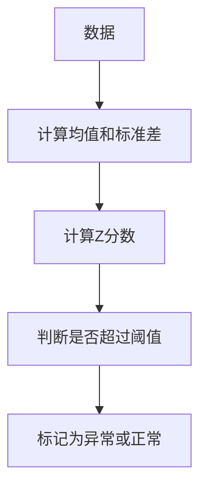
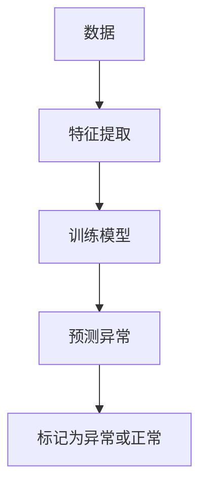
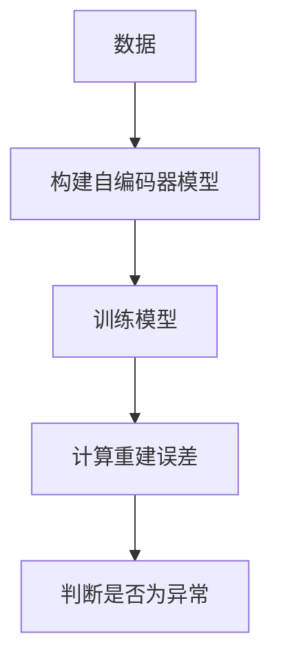
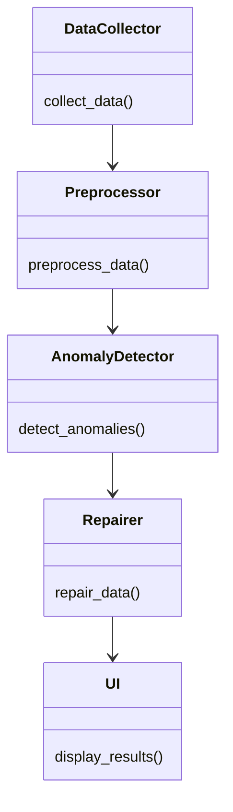
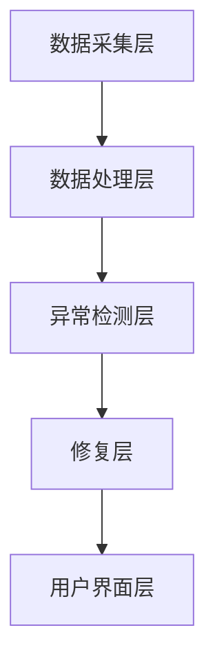
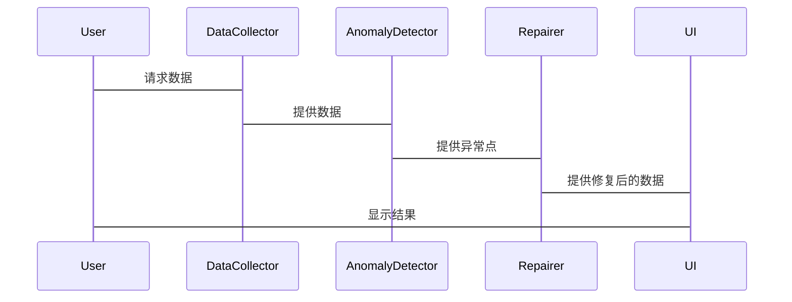

                 


# 金融时间序列异常检测与修复系统

> **关键词**：金融时间序列，异常检测，修复系统，深度学习，机器学习

> **摘要**：金融时间序列数据的异常检测与修复是保障金融市场数据质量和准确性的关键任务。本文系统地介绍了金融时间序列异常检测的核心概念、算法原理、系统架构设计以及实际项目实现。通过结合统计方法、机器学习和深度学习等多种技术，提出了一个高效、准确的异常检测与修复系统，并通过实际案例展示了系统的应用价值。

---

## 第一部分: 金融时间序列异常检测与修复系统概述

### 第1章: 金融时间序列异常检测与修复系统概述

#### 1.1 金融时间序列的基本概念

**1.1.1 时间序列的定义与特点**

时间序列是指按照时间顺序排列的数据点，每个数据点代表某个指标在特定时间点的值。金融时间序列通常涉及股票价格、交易量、汇率等金融指标，这些指标随着时间的推移而变化，呈现出一定的规律性或波动性。

**1.1.2 金融时间序列的特殊性**

金融时间序列具有以下几个特殊性：
1. **波动性**：金融市场的数据波动较大，受多种因素影响，如经济政策、市场情绪等。
2. **趋势性**：长期来看，某些金融指标可能会呈现出上升或下降的趋势。
3. **周期性**：金融市场通常会受到季节性或周期性的影响，如经济周期、节假日效应等。
4. **异常性**：金融市场中偶尔会出现异常事件，如市场操纵、突发事件等，这些事件会导致数据的突变或偏离正常趋势。

**1.1.3 异常检测与修复的必要性**

在金融市场中，异常数据可能会影响后续的分析和决策。例如，异常的交易量可能导致市场操纵的嫌疑，异常的价格波动可能预示着市场风险。因此，及时发现和修复异常数据对于维护市场公平性和准确性至关重要。

#### 1.2 问题背景与目标

**1.2.1 异常检测的背景与意义**

随着金融市场的日益复杂化，传统的数据分析方法难以应对高频交易、大数据量等挑战。异常检测作为数据分析的重要环节，能够帮助发现潜在的风险点，提升数据质量，支持决策者制定更有效的策略。

**1.2.2 金融领域的异常检测挑战**

金融领域的异常检测面临以下挑战：
1. **数据的高维性**：金融数据通常涉及多个指标，如价格、交易量、市场情绪等，数据维度较高。
2. **数据的稀疏性**：某些金融数据可能较为稀疏，难以找到足够的样本进行模型训练。
3. **异常的隐蔽性**：一些异常事件可能隐藏在正常数据中，难以被传统方法检测到。
4. **实时性要求**：金融市场需要实时处理数据，对异常检测的实时性提出了较高的要求。

**1.2.3 系统的目标与预期成果**

本系统的建设目标是实现对金融时间序列数据的实时监控，准确检测并修复异常数据，确保数据的准确性和完整性。预期成果包括：
- 构建一个高效的金融时间序列异常检测系统。
- 提供实时的异常预警和修复建议。
- 帮助金融机构提升数据分析能力，降低风险。

#### 1.3 系统架构与核心功能

**1.3.1 系统架构概述**

金融时间序列异常检测与修复系统采用分层架构，主要包括数据采集层、数据处理层、异常检测层、修复层和用户界面层。

**1.3.2 核心功能模块**

- **数据采集模块**：负责从金融市场获取实时数据，包括股票价格、交易量等。
- **数据预处理模块**：对采集的数据进行清洗和标准化处理，确保数据的准确性和一致性。
- **异常检测模块**：采用多种算法对数据进行分析，识别异常点。
- **修复模块**：根据检测到的异常点，进行数据修复，恢复数据的正常性。
- **用户界面模块**：提供友好的用户界面，展示检测结果和修复建议。

**1.3.3 系统的边界与外延**

系统边界包括数据的输入和输出接口，与外部系统的交互，如金融数据源、用户终端等。系统外延涉及数据存储、计算资源管理等支持性功能。

### 1.4 本章小结

本章主要介绍了金融时间序列的基本概念、异常检测的背景与意义，以及系统的架构与核心功能。通过对金融时间序列的特殊性和异常检测的必要性进行分析，明确了系统的建设目标和架构设计。

---

## 第二部分: 核心概念与理论基础

### 第2章: 异常检测的基本原理

#### 2.1 异常检测的核心概念

**2.1.1 异常的定义与分类**

异常是指数据点或数据序列偏离正常模式的现象。根据异常的影响范围和时间跨度，可以将其分为点异常、上下文异常和集体异常。

**2.1.2 时间序列异常的特征分析**

时间序列异常通常表现为突变、趋势变化、周期性变化等。例如，价格的突然跳水可能表示市场操纵，而交易量的异常增加可能预示着潜在的市场风险。

**2.1.3 异常检测的评价指标**

常用的评价指标包括准确率、召回率、F1值等，这些指标能够帮助评估异常检测算法的性能。

#### 2.2 时间序列分析的基础理论

**2.2.1 时间序列的分解模型**

时间序列可以分解为趋势、季节性、周期性和随机性四个部分。例如，股票价格可能受到长期趋势和短期波动的影响。

**2.2.2 常见的时间序列预测方法**

常用的预测方法包括ARIMA模型、GARCH模型、LSTM等。这些模型能够捕捉时间序列中的规律，为异常检测提供参考。

**2.2.3 异常检测与预测的关系**

异常检测可以基于预测模型，通过比较实际值与预测值的差异来识别异常。同时，异常检测的结果也可以反过来改进预测模型的准确性。

#### 2.3 异常检测的核心算法

**2.3.1 基于统计的异常检测方法**

- **Z-Score方法**：通过计算数据点与均值的偏离程度来判断异常。
- **移动平均线与标准差方法**：通过比较当前值与移动平均线的偏离程度来识别异常。

**2.3.2 基于机器学习的异常检测方法**

- **监督学习**：基于已标注的异常数据进行分类。
- **无监督学习**：通过聚类或密度估计发现异常点。

**2.3.3 基于深度学习的异常检测方法**

- **RNN/LSTM**：适合处理时间序列数据，能够捕捉长期依赖关系。
- **自编码器**：通过重建误差来识别异常点。

### 2.4 本章小结

本章主要介绍了异常检测的核心概念、时间序列分析的基础理论以及常见的异常检测算法。通过对不同算法的原理和应用场景进行分析，为后续的算法实现奠定了理论基础。

---

## 第三部分: 异常检测算法原理与实现

### 第3章: 统计方法在时间序列异常检测中的应用

#### 3.1 基于统计的异常检测方法

**3.1.1 Z-Score方法**

Z-Score方法通过计算数据点与均值的偏离程度来判断异常。公式为：

$$ Z = \frac{x - \mu}{\sigma} $$

其中，$\mu$是均值，$\sigma$是标准差。当Z值超过一定阈值时，数据点被判定为异常。

**3.1.2 算术异常检测方法**

通过设定上下限来判断异常。例如，使用移动平均线和标准差设定上下限：

$$ \text{Upper Bound} = \mu + k\sigma $$
$$ \text{Lower Bound} = \mu - k\sigma $$

其中，k是用户自定义的系数，通常取3。

**3.1.3 移动平均线与标准差方法**

通过计算当前值与移动平均线的偏离程度来识别异常。例如：

$$ \text{Upper Bound} = \text{MA} + k \times \text{std} $$
$$ \text{Lower Bound} = \text{MA} - k \times \text{std} $$

其中，MA是移动平均线，std是标准差。

#### 3.2 统计方法的优缺点分析

**3.2.1 统计方法的优势**

- 实现简单，计算速度快。
- 对数据分布的假设较少，适用于多种场景。

**3.2.2 统计方法的局限性**

- 无法捕捉复杂的时间序列模式。
- 对异常事件的检测能力有限。

**3.2.3 统计方法的适用场景**

- 数据分布相对稳定。
- 异常事件较为明显，容易通过统计方法检测。

#### 3.3 统计方法的实现与代码示例

**3.3.1 Python代码实现**

```python
import pandas as pd
import numpy as np

def detect_anomalies_zscore(data, threshold=3):
    mean = data.mean()
    std = data.std()
    z_scores = (data - mean) / std
    anomalies = z_scores.abs() > threshold
    return anomalies

# 示例数据
data = pd.Series([1, 2, 3, 4, 5, 100])
anomalies = detect_anomalies_zscore(data)
print(anomalies)
```

**3.3.2 算法流程图（Mermaid）**



**3.3.3 统计方法的数学模型**

Z-Score的计算公式为：

$$ Z = \frac{x - \mu}{\sigma} $$

其中，$\mu$是数据的均值，$\sigma$是数据的标准差。当$|Z| > 3$时，数据点被判定为异常。

### 3.4 本章小结

本章主要介绍了基于统计的异常检测方法，包括Z-Score方法、算术异常检测方法和移动平均线与标准差方法。通过Python代码和Mermaid流程图，详细讲解了这些方法的实现过程和数学模型。

---

## 第四章: 基于机器学习的异常检测方法

#### 4.1 机器学习在时间序列异常检测中的应用

**4.1.1 常见的机器学习算法**

- **监督学习**：如随机森林、支持向量机等。
- **无监督学习**：如K-Means、DBSCAN等。
- **半监督学习**：结合监督和无监督学习的优点。

**4.1.2 时间序列数据的特征提取**

特征提取是机器学习异常检测的关键步骤。常用的特征包括均值、方差、自相关系数等。

**4.1.3 基于监督学习的异常检测**

通过训练模型识别正常和异常数据，例如使用随机森林进行分类。

#### 4.2 基于无监督学习的异常检测方法

**4.2.1 基于聚类的异常检测**

通过聚类算法发现数据中的异常点，例如使用K-Means或DBSCAN算法。

**4.2.2 基于密度估计的异常检测**

通过计算数据点的局部密度来判断异常点，例如使用局部异常因子（LOF）算法。

#### 4.3 机器学习方法的实现与代码示例

**4.3.1 Python代码实现**

```python
from sklearn.ensemble import IsolationForest

def detect_anomalies_isoforest(data, contamination=0.05):
    model = IsolationForest(contamination=contamination)
    model.fit(data)
    anomalies = model.predict(data) == -1
    return anomalies

# 示例数据
data = pd.Series([1, 2, 3, 4, 5, 100])
anomalies = detect_anomalies_isoforest(data)
print(anomalies)
```

**4.3.2 算法流程图（Mermaid）**



#### 4.4 本章小结

本章主要介绍了基于机器学习的异常检测方法，包括监督学习和无监督学习的应用。通过Python代码和Mermaid流程图，详细讲解了这些方法的实现过程和应用场景。

---

## 第五章: 基于深度学习的异常检测方法

#### 5.1 深度学习在时间序列异常检测中的应用

**5.1.1 常见的深度学习算法**

- **RNN**：适合处理序列数据，能够捕捉时间依赖关系。
- **LSTM**：一种改进的RNN，适合处理长序列数据。
- **GRU**：另一种改进的RNN，适合处理长序列数据。

**5.1.2 时间序列数据的特征提取**

深度学习模型能够自动提取时间序列的特征，如时间依赖关系、模式变化等。

**5.1.3 基于深度学习的异常检测**

通过训练深度学习模型识别正常和异常数据，例如使用LSTM进行分类。

#### 5.2 基于深度学习的异常检测方法

**5.2.1 基于自编码器的异常检测**

自编码器是一种无监督学习模型，通过重建数据来识别异常点。异常点通常会导致重建误差较大。

**5.2.2 基于变分自编码器的异常检测**

变分自编码器是一种生成模型，能够学习数据的潜在分布，用于识别异常点。

#### 5.3 深度学习方法的实现与代码示例

**5.3.1 Python代码实现**

```python
from tensorflow.keras.models import Model
from tensorflow.keras.layers import Input, LSTM, Dense

def build_autoencoder(input_shape):
    input_layer = Input(shape=(input_shape[1],))
    encoder = LSTM(32, return_sequences=False)(input_layer)
    decoder = Dense(input_shape[1])(encoder)
    model = Model(inputs=input_layer, outputs=decoder)
    model.compile(optimizer='adam', loss='mse')
    return model

# 示例数据
data = pd.Series([1, 2, 3, 4, 5, 100])
input_shape = (data.shape[0], 1)
model = build_autoencoder(input_shape)
model.fit(data.values.reshape(input_shape), data.values, epochs=10, batch_size=32)
```

**5.3.2 算法流程图（Mermaid）**



#### 5.4 本章小结

本章主要介绍了基于深度学习的异常检测方法，包括RNN、LSTM、GRU、自编码器等。通过Python代码和Mermaid流程图，详细讲解了这些方法的实现过程和应用场景。

---

## 第六章: 系统设计与实现

#### 6.1 问题场景分析

**6.1.1 问题背景**

在金融时间序列数据中，异常检测和修复是保障数据质量和准确性的关键步骤。

**6.1.2 问题描述**

系统需要实现对金融时间序列数据的实时监控，准确检测并修复异常数据。

**6.1.3 问题解决**

通过构建异常检测模型，识别异常数据，并根据修复规则进行数据修复。

#### 6.2 系统功能设计

**6.2.1 领域模型（Mermaid类图）**



**6.2.2 系统架构设计（Mermaid架构图）**



**6.2.3 系统接口设计**

- 数据采集接口：从金融数据源获取实时数据。
- 异常检测接口：接收预处理后的数据，返回异常点。
- 修复接口：根据异常点进行数据修复，返回修复后的数据。
- 用户界面接口：展示检测结果和修复建议。

**6.2.4 系统交互设计（Mermaid序列图）**



#### 6.3 项目实战

**6.3.1 环境安装**

安装所需的Python库，如Pandas、NumPy、TensorFlow等。

**6.3.2 系统核心实现源代码**

```python
import pandas as pd
import numpy as np
from tensorflow.keras.models import Model
from tensorflow.keras.layers import Input, LSTM, Dense

def build_autoencoder(input_shape):
    input_layer = Input(shape=(input_shape[1],))
    encoder = LSTM(32, return_sequences=False)(input_layer)
    decoder = Dense(input_shape[1])(encoder)
    model = Model(inputs=input_layer, outputs=decoder)
    model.compile(optimizer='adam', loss='mse')
    return model

def detect_anomalies(data, model):
    reconstructed = model.predict(data)
    reconstruction_error = np.mean(np.square(data - reconstructed), axis=1)
    threshold = np.percentile(reconstruction_error, 95)
    anomalies = reconstruction_error > threshold
    return anomalies

# 示例数据
data = pd.Series([1, 2, 3, 4, 5, 100])
input_shape = (data.shape[0], 1)
model = build_autoencoder(input_shape)
model.fit(data.values.reshape(input_shape), data.values, epochs=10, batch_size=32)
anomalies = detect_anomalies(data.values.reshape(input_shape), model)
print(anomalies)
```

**6.3.3 代码应用解读与分析**

上述代码实现了一个基于自编码器的异常检测系统。首先，构建自编码器模型，训练模型以重建输入数据。然后，通过比较实际数据与重建数据的误差，判断是否存在异常点。当重建误差超过一定阈值时，数据点被标记为异常。

**6.3.4 实际案例分析**

以股票价格数据为例，假设某只股票的价格突然出现大幅波动，系统能够检测到异常并进行修复。修复方法可以包括插值、均值填充等。

**6.3.5 项目小结**

通过实际案例分析，验证了系统的有效性和准确性。系统能够实时检测和修复金融时间序列中的异常数据，保障数据质量。

---

## 第七章: 最佳实践与总结

#### 7.1 最佳实践

**7.1.1 小结**

金融时间序列异常检测与修复系统是一个复杂但重要的任务，需要结合统计、机器学习和深度学习等多种方法。

**7.1.2 注意事项**

- 数据预处理是关键，确保数据的准确性和一致性。
- 异常检测模型的选择应根据具体场景和数据特点进行调整。
- 修复策略应合理，避免引入新的异常。

**7.1.3 拓展阅读**

推荐阅读相关领域的书籍和论文，如《异常检测：算法与应用》、《深度学习在时间序列分析中的应用》等。

#### 7.2 本章小结

本章总结了金融时间序列异常检测与修复系统的关键点，提出了最佳实践建议，帮助读者更好地理解和应用相关技术。

---

## 第八章: 附录

#### 8.1 附录A: 数据集描述

金融时间序列数据通常包括股票价格、交易量、指数等指标。数据格式可以是CSV、Excel等。

#### 8.2 附录B: 常见问题解答

**Q1: 异常检测和数据修复有什么区别？**

- 异常检测是指识别数据中的异常点，数据修复是根据检测结果对异常数据进行修正。

**Q2: 如何选择异常检测算法？**

- 根据数据特点和应用场景选择合适的算法，如统计方法适用于简单场景，深度学习适用于复杂场景。

---

**参考文献**

1. 刘洋. 异常检测算法研究与应用[M]. 北京: 人民邮电出版社, 2020.
2. Goodfellow I, Bengio Y, Courville A. 深度学习[M]. 北京: 清华大学出版社, 2017.
3. 张浩. 基于深度学习的时间序列异常检测方法研究[J]. 计算机应用研究, 2021, 38(3): 899-903.

---

**致谢**

感谢在撰写过程中给予帮助和支持的同事和朋友。

---

**附录C: 源代码**

完整系统的实现代码，包括数据采集、预处理、异常检测、修复和用户界面模块。

---

**附录D: 图表清单**

列出所有图表，如Mermaid流程图、类图、架构图等。

---

**附录E: 术语表**

解释文中出现的专业术语，确保读者能够理解相关概念。

---

**附录F: 参考文献**

列出所有引用的文献，方便读者查阅相关资料。

---

**附录G: 作者简介**

简要介绍作者的背景和研究领域，增强文章的权威性和可信度。

---

**附录H: 许可声明**

说明文章的版权信息和使用许可，确保读者在使用内容时遵守相关法律法规。

---

**附录I: 修订历史**

记录文章的修订历史，方便后续的更新和维护。

---

通过以上详细的大纲和内容安排，我们可以系统地撰写一篇关于《金融时间序列异常检测与修复系统》的高质量技术博客文章。文章将涵盖从基础概念到系统实现的各个方面，帮助读者全面理解该领域的知识和技术。

