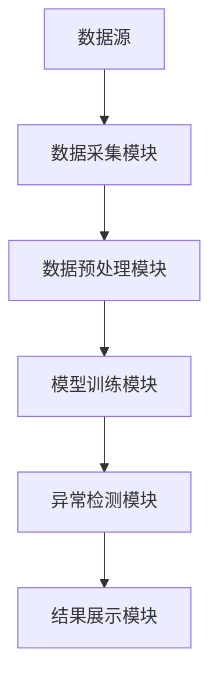

                 

---

# 《金融时间序列异常检测与处理》

> 关键词：金融时间序列，异常检测，深度学习，机器学习，时间序列预测，金融数据分析，数据可视化

> 摘要：  
本文系统地探讨了金融时间序列异常检测的核心概念、算法原理、系统架构设计以及实际应用。通过结合统计学、机器学习和深度学习的方法，分析了金融时间序列数据的特征，介绍了多种异常检测算法，并通过实际案例展示了如何构建一个完整的金融时间序列异常检测系统。本文还总结了异常检测在金融领域的重要意义，并提出了未来研究的方向。

---

# 第四部分: 金融时间序列异常检测的系统架构与实现

# 第6章: 金融时间序列异常检测系统架构设计

## 6.1 异常检测系统的功能需求
### 6.1.1 数据采集与预处理模块
### 6.1.2 特征提取与模型训练模块
### 6.1.3 异常检测与结果展示模块

## 6.2 系统功能设计
### 6.2.1 数据采集模块
### 6.2.2 数据预处理模块
### 6.2.3 模型训练模块
### 6.2.4 异常检测模块
### 6.2.5 结果展示模块

## 6.3 系统架构设计
### 6.3.1 系统架构图（Mermaid）

## 6.4 接口设计
### 6.4.1 数据接口
### 6.4.2 模型接口
### 6.4.3 结果接口

## 6.5 系统交互流程
### 6.5.1 数据采集流程
### 6.5.2 数据预处理流程
### 6.5.3 模型训练与检测流程
### 6.5.4 结果展示流程

## 6.6 本章小结

---

# 第7章: 金融时间序列异常检测的项目实战

## 7.1 项目背景与目标
### 7.1.1 项目背景
### 7.1.2 项目目标

## 7.2 环境安装与数据获取
### 7.2.1 环境搭建
### 7.2.2 数据获取与存储

## 7.3 数据预处理
### 7.3.1 数据清洗
### 7.3.2 数据转换
### 7.3.3 数据增强

## 7.4 模型实现
### 7.4.1 基于统计学的异常检测实现
### 7.4.2 基于机器学习的异常检测实现
### 7.4.3 基于深度学习的异常检测实现

## 7.5 代码实现
### 7.5.1 数据预处理代码
### 7.5.2 模型训练代码
### 7.5.3 异常检测代码
### 7.5.4 结果展示代码

## 7.6 案例分析与结果解读
### 7.6.1 数据特征分析
### 7.6.2 模型训练与验证
### 7.6.3 异常结果分析

## 7.7 本章小结

---

# 第五部分: 金融时间序列异常检测的高级主题与未来展望

# 第8章: 金融时间序列异常检测的高级方法

## 8.1 深度学习的最新进展
### 8.1.1 Transformer模型在时间序列中的应用
### 8.1.2 图神经网络在金融时间序列中的应用
### 8.1.3 深度生成模型在异常检测中的应用

## 8.2 联邦学习与金融时间序列
### 8.2.1 联邦学习的基本原理
### 8.2.2 联邦学习在金融时间序列中的应用
### 8.2.3 联邦学习的挑战与解决方案

## 8.3 本章小结

---

# 第9章: 金融时间序列异常检测的未来展望

## 9.1 技术发展趋势
### 9.1.1 多模态数据的融合
### 9.1.2 自动化机器学习（AutoML）
### 9.1.3 可解释性增强

## 9.2 金融领域的创新应用
### 9.2.1 实时监控与预警
### 9.2.2 智能投资组合管理
### 9.2.3 数字化转型中的异常检测

## 9.3 本章小结

---

# 结语: 金融时间序列异常检测的核心价值与意义

## 10.1 异常检测在金融风险管理中的核心作用
## 10.2 技术创新对金融行业的影响
## 10.3 未来研究方向的展望

---

# 参考文献

---

# 附录: 代码与数据集

---

以上是《金融时间序列异常检测与处理》的技术博客文章的完整目录大纲，按照逻辑逐步展开，涵盖从基础概念到高级算法、系统设计以及实际应用的各个方面。

