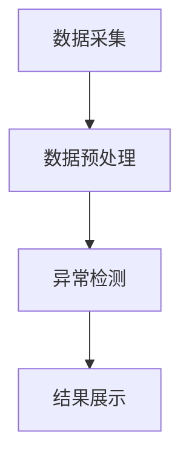
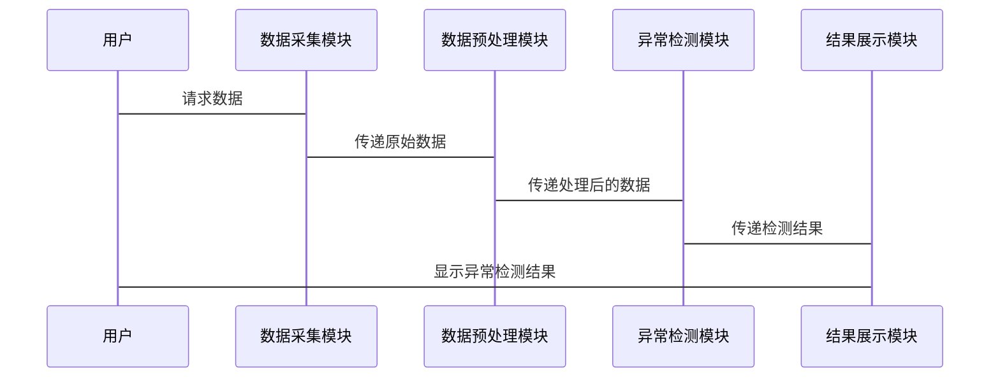

                 


# 《金融时间序列异常检测系统》

---

## 关键词：
金融时间序列，异常检测，统计方法，机器学习，深度学习，系统架构

---

## 摘要：
金融时间序列数据在金融市场的分析和预测中扮演着重要角色。异常检测作为金融风险管理的重要工具，能够帮助识别潜在的市场波动、欺诈行为和潜在的危机。本文从金融时间序列的基本概念出发，详细探讨了异常检测的核心原理、算法实现以及系统架构设计，并结合实际案例，展示了如何构建一个高效的金融时间序列异常检测系统。文章最后总结了最佳实践和未来研究方向。

---

# 第1章: 金融时间序列异常检测的背景与意义

## 1.1 异常检测的基本概念

### 1.1.1 异常检测的定义与特点
异常检测是指通过分析数据，识别出与正常数据模式不一致的异常点或异常行为。在金融领域，异常检测可以帮助识别市场操纵、欺诈交易、突发事件等潜在风险。

### 1.1.2 金融时间序列数据的特点
金融时间序列数据具有以下特点：
- **连续性**：数据按时间顺序排列，每一点都与前后点相关。
- **波动性**：金融市场的波动性较高，数据变化频繁。
- **周期性**：金融数据可能表现出日、周、月等周期性特征。
- **依赖性**：当前时刻的值可能与过去时刻的值密切相关。

### 1.1.3 异常检测在金融领域的应用价值
- **风险管理**：及时发现异常事件，减少潜在损失。
- **市场分析**：识别市场波动的潜在原因。
- **欺诈 detection**：发现异常交易行为，防止欺诈。

## 1.2 金融时间序列数据的特性

### 1.2.1 时间序列数据的基本特征
- **趋势**：数据长期向上的或向下的趋势。
- **周期性**：数据在固定时间段内重复出现的模式。
- **噪声**：随机波动，可能是正常市场波动或异常事件。

### 1.2.2 金融时间序列的波动性与周期性
- **波动性**：金融市场的价格波动通常是不稳定的，受到多种因素影响。
- **周期性**：金融数据可能表现出日、周、月等周期性变化。

### 1.2.3 异常事件的典型表现形式
- **单点异常**：某个时间点的值显著偏离正常范围。
- **趋势变化**：数据在某个时间段内突然偏离正常趋势。
- **集体异常**：多个时间点同时或连续出现异常。

## 1.3 异常检测的挑战与难点

### 1.3.1 数据的复杂性与噪声干扰
- 金融数据受到多种因素影响，如市场情绪、经济指标、政策变化等。
- 数据中可能存在噪声，掩盖了真正的异常信号。

### 1.3.2 异常事件的稀疏性与多样性
- 异常事件在金融数据中往往稀疏，正常数据占据绝大部分。
- 异常事件的类型多样，可能涉及多种模式和特征。

### 1.3.3 计算效率与实时性要求
- 高频交易和实时监控要求异常检测系统具有较高的计算效率。
- 数据流的实时处理需要系统能够快速响应和分析。

---

## 1.4 本章小结
本章介绍了金融时间序列异常检测的基本概念、数据特性以及面临的挑战。金融时间序列数据的复杂性和多样性使得异常检测成为一个具有挑战性的任务，但其在风险管理、市场分析和欺诈 detection 等方面的应用价值使其成为金融领域的重要研究方向。

---

# 第2章: 金融时间序列异常检测的核心概念与原理

## 2.1 时间序列分析基础

### 2.1.1 时间序列的基本分析方法
- **描述性分析**：通过均值、标准差、最大值、最小值等统计指标描述数据特征。
- **趋势分析**：识别数据的长期趋势，如线性趋势或非线性趋势。
- **周期性分解**：将时间序列分解为趋势、周期性和噪声三部分。

### 2.1.2 时间序列分解方法
- **STL分解**：将时间序列分解为趋势、季节性和噪声三部分。
- **Holt-Winter方法**：基于指数平滑法的时间序列分解。

### 2.1.3 自相关分析
- **自相关函数（ACF）**：描述时间序列中不同滞后阶数的自相关性。
- **偏自相关函数（PACF）**：在控制其他滞后阶数影响下，某滞后阶数的自相关性。

## 2.2 异常检测的核心原理

### 2.2.1 统计方法
- **Z-score方法**：通过计算数据点与均值的偏离程度，判断是否为异常。
- **四分位数法**：基于数据分布的四分位数范围，判断数据点是否为异常。

### 2.2.2 机器学习方法
- **监督学习**：基于已标注的数据训练分类器，识别正常和异常样本。
- **无监督学习**：基于无标签数据的聚类或密度估计，识别异常样本。

### 2.2.3 深度学习方法
- **循环神经网络（RNN）**：用于捕捉时间序列的长期依赖关系。
- **Transformer模型**：基于自注意力机制，捕捉时间序列中的全局依赖关系。

---

## 2.3 本章小结
本章介绍了时间序列分析的基本方法以及异常检测的核心原理。统计方法适用于简单场景，机器学习方法能够处理复杂模式，深度学习方法则能够捕捉时间序列的长期依赖关系。

---

# 第3章: 统计方法在金融时间序列异常检测中的应用

## 3.1 Z-score方法

### 3.1.1 方法原理
Z-score方法基于正态分布假设，计算每个数据点的标准化得分。公式如下：
$$
Z = \frac{X - \mu}{\sigma}
$$
其中，$\mu$ 是均值，$\sigma$ 是标准差。

### 3.1.2 实际应用
以股票价格为例，计算每只股票的价格Z-score，判断其是否偏离正常范围。

```python
import pandas as pd
import numpy as np

# 示例数据：股票价格
prices = pd.Series([100, 101, 98, 102, 105, 103, 100, 98, 104, 107])

# 计算Z-score
mu = prices.mean()
sigma = prices.std()
z_scores = (prices - mu) / sigma

# 找出异常点
threshold = 3
outliers = z_scores.abs() > threshold
print(outliers)
```

### 3.1.3 优缺点分析
- **优点**：简单易实现，计算效率高。
- **缺点**：假设数据服从正态分布，可能不适用于金融数据。

## 3.2 四分位数法

### 3.2.1 方法原理
四分位数法基于数据的分布范围，计算数据的上下界，判断数据点是否超出范围。

$$
下界 = Q1 - 1.5 \times IQR \\
上界 = Q3 + 1.5 \times IQR
$$
其中，$IQR$ 是四分位距，$Q1$ 是第一四分位数，$Q3$ 是第三四分位数。

### 3.2.2 实际应用
以股票成交量为例，判断成交量是否异常。

```python
import pandas as pd
import numpy as np

# 示例数据：股票成交量
volumes = pd.Series([1000, 1200, 900, 1500, 2000, 800, 1100, 950, 1300, 2500])

# 计算四分位数
Q1 = volumes.quantile(0.25)
Q3 = volumes.quantile(0.75)
IQR = Q3 - Q1
lower_bound = Q1 - 1.5 * IQR
upper_bound = Q3 + 1.5 * IQR

# 找出异常点
outliers = volumes[(volumes < lower_bound) | (volumes > upper_bound)]
print(outliers)
```

### 3.2.3 优缺点分析
- **优点**：不受数据分布的影响，适用于非正态分布数据。
- **缺点**：需要调整参数（如1.5倍IQR），且对异常点敏感。

---

## 3.3 本章小结
本章介绍了统计方法在金融时间序列异常检测中的应用，重点讲解了Z-score方法和四分位数法的原理、实现和优缺点。

---

# 第4章: 机器学习方法在金融时间序列异常检测中的应用

## 4.1 基于监督学习的异常检测

### 4.1.1 One-Class SVM
One-Class SVM 是一种无监督学习算法，适用于正常样本数量远大于异常样本数量的情况。

### 4.1.2 Isolation Forest
Isolation Forest 是一种基于树的异常检测算法，适用于高维数据。

### 4.1.3 实际应用
以信用卡交易为例，使用监督学习方法识别欺诈交易。

---

## 4.2 基于无监督学习的异常检测

### 4.2.1 K-Means聚类
K-Means聚类算法将数据分为K个簇，识别与正常簇不同的异常簇。

### 4.2.2 DBSCAN算法
DBSCAN算法基于密度的聚类算法，识别密度较低的区域为异常点。

---

## 4.3 本章小结
本章介绍了机器学习方法在金融时间序列异常检测中的应用，重点讲解了监督学习和无监督学习的算法及其在实际中的应用。

---

# 第5章: 深度学习方法在金融时间序列异常检测中的应用

## 5.1 基于循环神经网络（RNN）的异常检测

### 5.1.1 LSTM网络原理
LSTM（长短期记忆网络）通过门控机制，能够捕捉时间序列的长期依赖关系。

### 5.1.2 实际应用
以股票价格预测为例，使用LSTM网络预测未来的价格走势，并识别异常波动。

```python
import keras
from keras.layers import LSTM, Dense
from keras.models import Sequential

# 示例数据：股票价格
prices = np.array([100, 101, 98, 102, 105, 103, 100, 98, 104, 107], dtype='float32')

# 构建模型
model = Sequential()
model.add(LSTM(64, input_shape=(None, 1)))
model.add(Dense(1))
model.compile(loss='mean_squared_error', optimizer='adam')

# 训练模型
X_train = np.array([prices[i:i+1] for i in range(len(prices)-1)], dtype='float32')
y_train = prices[1:]
model.fit(X_train, y_train, epochs=10, batch_size=32)

# 预测异常
X_test = np.array([prices[-1:]], dtype='float32')
y_pred = model.predict(X_test)
print(y_pred)
```

---

## 5.2 基于Transformer的异常检测

### 5.2.1 Transformer模型原理
Transformer模型基于自注意力机制，能够捕捉时间序列的全局依赖关系。

### 5.2.2 实际应用
以金融新闻分析为例，使用Transformer模型分析新闻文本，预测市场情绪，并识别异常情绪波动。

---

## 5.3 本章小结
本章介绍了深度学习方法在金融时间序列异常检测中的应用，重点讲解了LSTM和Transformer模型的原理及其在实际中的应用。

---

# 第6章: 金融时间序列异常检测系统的架构与实现

## 6.1 系统架构设计

### 6.1.1 系统模块划分
- **数据采集模块**：从金融数据源获取时间序列数据。
- **数据预处理模块**：对数据进行清洗、标准化等处理。
- **异常检测模块**：基于选择的算法模型，进行异常检测。
- **结果展示模块**：将检测结果以可视化形式展示。

### 6.1.2 系统功能设计
- 数据采集：支持多种数据源，如股票价格、交易数据等。
- 数据预处理：包括数据清洗、缺失值处理、标准化等。
- 异常检测：支持多种算法，如Z-score、LSTM、Transformer等。
- 结果展示：以图表形式展示异常点和检测结果。

---

## 6.2 系统架构设计

### 6.2.1 系统架构图


---

## 6.3 接口设计

### 6.3.1 数据接口
- 数据输入接口：从数据源获取原始数据。
- 数据输出接口：将处理后的数据传递给异常检测模块。

### 6.3.2 异常检测接口
- 异常检测输入接口：接收预处理后的数据。
- 异常检测输出接口：返回检测结果。

---

## 6.4 系统交互流程图



---

## 6.5 本章小结
本章介绍了金融时间序列异常检测系统的架构设计，包括模块划分、功能设计、系统架构图和交互流程图。

---

# 第7章: 金融时间序列异常检测系统的项目实战

## 7.1 环境安装

### 7.1.1 安装Python环境
建议使用Anaconda或virtualenv管理Python环境。

### 7.1.2 安装依赖库
- `numpy`：数据处理
- `pandas`：数据分析
- `scikit-learn`：机器学习算法
- `keras`或`tensorflow`：深度学习框架
- `matplotlib`或`seaborn`：数据可视化

---

## 7.2 系统核心实现

### 7.2.1 数据采集模块
从Yahoo Finance获取股票价格数据。

```python
import pandas_datareader as pdr
import datetime

# 获取股票数据
start = datetime.datetime(2020, 1, 1)
end = datetime.datetime(2023, 12, 31)
data = pdr.get_data_yahoo('AAPL', start, end)
```

### 7.2.2 数据预处理模块
对数据进行标准化处理。

```python
from sklearn.preprocessing import StandardScaler

# 标准化处理
scaler = StandardScaler()
data_scaled = scaler.fit_transform(data['Close'].values.reshape(-1, 1))
```

### 7.2.3 异常检测模块
使用LSTM模型进行异常检测。

```python
from keras.models import Sequential
from keras.layers import LSTM, Dense

# 构建模型
model = Sequential()
model.add(LSTM(64, input_shape=(None, 1)))
model.add(Dense(1))
model.compile(loss='mean_squared_error', optimizer='adam')

# 训练模型
X_train = data_scaled[:-1].reshape((len(data_scaled)-1, 1, 1))
y_train = data_scaled[1:]
model.fit(X_train, y_train, epochs=10, batch_size=32)

# 预测异常
X_test = data_scaled[-1].reshape((1, 1, 1))
y_pred = model.predict(X_test)
print(y_pred)
```

---

## 7.3 项目小结
本章通过一个实际项目展示了金融时间序列异常检测系统的实现，包括环境安装、数据采集、数据预处理和异常检测模块的实现。

---

# 第8章: 金融时间序列异常检测系统的总结与展望

## 8.1 本章总结
本文从金融时间序列异常检测的背景出发，详细探讨了统计方法、机器学习和深度学习在异常检测中的应用，并结合实际案例，展示了如何构建一个高效的金融时间序列异常检测系统。

## 8.2 未来研究方向
- **多模态数据融合**：结合文本、图像等多种数据源，提高异常检测的准确性。
- **在线学习算法**：研究在线学习算法，实现金融时间序列的实时异常检测。
- **模型解释性**：提高异常检测模型的可解释性，帮助用户理解异常原因。

## 8.3 最佳实践 tips
- **数据预处理**：在异常检测前，必须对数据进行充分的预处理，包括清洗、标准化等。
- **模型调参**：根据具体场景和数据特点，调整模型参数，提高检测效果。
- **模型评估**：使用准确率、召回率、F1分数等指标评估模型性能。

---

## 8.4 本章小结
本文总结了金融时间序列异常检测系统的实现，并展望了未来的研究方向和最佳实践 tips。

---

# 参考文献
1. Hyndman, R. J., & Athanasopoulos, G. (2018). Forecasting: principles and practice.
2. Goodfellow, I., Bengio, Y., & Courville, A. (2016). Deep learning.
3. Hochreiter, S., & Schmidhuber, J. (1997). Long short-term memory.

---

# 结束语
金融时间序列异常检测系统是一个复杂的系统工程，涉及数据采集、处理、建模和分析等多个环节。通过本文的探讨，希望能够为读者提供一个全面的视角，帮助他们在金融领域更好地应用时间序列异常检测技术。

---

