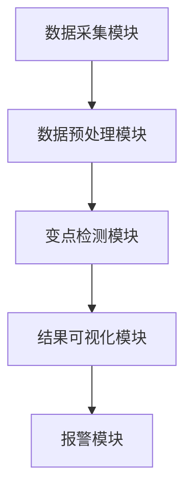

                 


# 《金融时间序列趋势变点检测》

## 关键词：时间序列分析、变点检测、金融数据分析、统计方法、机器学习、深度学习

## 摘要：  
金融时间序列数据的变点检测是金融数据分析中的重要任务，旨在识别数据分布或趋势的变化点。本文系统地介绍了变点检测的基本概念、核心方法及其在金融领域的应用。通过统计方法、机器学习方法和深度学习方法的对比分析，详细阐述了各类算法的实现原理和应用场景。同时，本文还探讨了金融时间序列变点检测系统的架构设计与实现方案，结合实际案例分析，为读者提供全面的理论支持和实践指导。

---

# 第一部分: 金融时间序列趋势变点检测背景与基础

---

## 第1章: 金融时间序列与变点检测概述

### 1.1 时间序列的基本概念

#### 1.1.1 时间序列的定义与特征  
时间序列是指按照时间顺序记录的数据序列，通常表示为 $X = \{x_1, x_2, \dots, x_T\}$，其中 $T$ 是时间步数。时间序列具有以下特征：  
- **趋势性**：数据整体呈现上升或下降的趋势。  
- **周期性**：数据呈现一定的周期性波动，如月度或季度数据的周期性。  
- **随机性**：数据中无法用确定性模型描述的部分。  

#### 1.1.2 金融时间序列的独特性  
金融时间序列具有以下独特特征：  
- **波动性**：金融市场的波动性较高，容易受到突发事件的影响。  
- **非线性**：金融数据通常表现出非线性特征，如“肥尾”现象。  
- **异质性**：不同金融资产或市场的数据具有不同的统计特性。  

#### 1.1.3 变点检测的定义与重要性  
变点检测是指在时间序列中识别数据分布或趋势发生显著变化的时刻。变点检测在金融领域具有重要意义：  
- **风险管理**：及时发现市场趋势变化，帮助投资者规避风险。  
- **交易机会**：识别市场拐点，捕捉交易机会。  
- **异常检测**：发现异常交易行为或市场操纵。  

---

### 1.2 金融时间序列中的变点问题

#### 1.2.1 变点的类型与分类  
变点可以分为以下几种类型：  
1. **均值变点**：数据均值发生变化的时刻。  
2. **方差变点**：数据波动性发生变化的时刻。  
3. **趋势变点**：数据趋势方向发生变化的时刻。  
4. **混合变点**：同时涉及均值、方差和趋势的变化。  

#### 1.2.2 变点检测在金融中的应用场景  
- **股票市场分析**：检测股价趋势变化，帮助投资者做出买卖决策。  
- **外汇市场分析**：识别汇率波动的关键点，帮助外汇交易者制定策略。  
- **风险管理**：及时发现市场风险，避免重大损失。  

#### 1.2.3 变点检测的挑战与难点  
- **数据噪声**：金融数据通常受到噪声干扰，影响变点检测的准确性。  
- **小样本问题**：在某些情况下，可用来训练的样本数量较少，导致模型泛化能力不足。  
- **多变点检测**：同时检测多个变点时，需要考虑变点之间的相互影响。  

---

### 1.3 本章小结  
本章主要介绍了时间序列的基本概念、金融时间序列的独特性以及变点检测的定义与重要性。通过分析变点的类型与应用场景，揭示了变点检测在金融领域中的关键作用，并指出了变点检测的主要挑战。

---

# 第二部分: 金融时间序列变点检测的核心方法

---

## 第2章: 统计方法与变点检测

### 2.1 参数模型与变点检测

#### 2.1.1 均值变点的检测方法  
均值变点的检测可以通过以下方法实现：  
1. **卡方检验**：通过比较相邻段的均值差异，判断是否存在显著变化。  
2. **t检验**：在两个时间段内分别估计均值，比较两者差异是否显著。  

#### 2.1.2 方差变点的检测方法  
方差变点的检测方法包括：  
1. **F检验**：比较两个时间段的方差是否显著不同。  
2. **Levene检验**：适用于非正态分布数据的方差齐性检验。  

#### 2.1.3 统计检验方法  
常用的统计检验方法包括卡方检验和t检验，具体步骤如下：  
1. 将时间序列分成两段，计算每段的均值和方差。  
2. 使用卡方检验或t检验判断两段的均值或方差是否存在显著差异。  
3. 如果存在显著差异，则判断该时刻为变点。  

---

### 2.2 非参数方法与变点检测

#### 2.2.1 基于经验分布函数的方法  
经验分布函数（Empirical Distribution Function, EDF）可以用来检测数据分布的变化。通过比较不同时间段的经验分布函数，判断是否存在显著差异。  

#### 2.2.2 基于核密度估计的方法  
核密度估计（Kernel Density Estimation, KDE）是一种非参数密度估计方法。通过计算不同时间段的核密度估计，判断数据分布是否发生变化。  

#### 2.2.3 基于分位数回归的方法  
分位数回归（Quantile Regression）可以用来检测数据分布的变化。通过比较不同分位数的变化，判断是否存在变点。  

---

### 2.3 统计方法的优缺点分析

#### 2.3.1 统计方法的适用场景  
统计方法适用于数据分布简单、样本量较大的情况。  

#### 2.3.2 统计方法的局限性  
统计方法的局限性包括：  
- 对异常值的鲁棒性较差。  
- 仅适用于单一变点检测，难以处理多个变点的情况。  

#### 2.3.3 统计方法与机器学习方法的结合  
通过结合统计方法和机器学习方法，可以提高变点检测的准确性和鲁棒性。例如，利用统计方法初步筛选候选变点，再使用机器学习方法进行进一步验证。

---

## 第3章: 机器学习方法与变点检测

### 3.1 监督学习方法

#### 3.1.1 基于分类的变点检测  
将变点检测问题转化为分类问题，通过训练分类器识别变点。  

#### 3.1.2 基于回归的变点检测  
通过回归模型预测数据的变化趋势，判断是否存在变点。  

#### 3.1.3 基于聚类的变点检测  
将时间序列数据划分为不同的簇，通过簇的变化判断是否存在变点。  

---

### 3.2 无监督学习方法

#### 3.2.1 基于异常检测的变点识别  
通过异常检测方法识别数据中的异常点，判断是否存在变点。  

#### 3.2.2 基于流形学习的变点检测  
流形学习（Manifold Learning）可以用来降维数据，通过降维后的数据变化判断是否存在变点。  

#### 3.2.3 基于自编码器的变点检测  
自编码器（Autoencoder）可以用来学习数据的正常状态，通过重建误差判断是否存在变点。  

---

### 3.3 集成学习方法

#### 3.3.1 基于投票的集成方法  
通过多个基模型的投票结果判断是否存在变点。  

#### 3.3.2 基于加权的集成方法  
根据基模型的性能加权投票结果，判断是否存在变点。  

#### 3.3.3 基于混合模型的集成方法  
通过混合多个基模型的结果，判断是否存在变点。  

---

## 第4章: 深度学习方法与变点检测

### 4.1 基于RNN的变点检测

#### 4.1.1 基于LSTM的变点检测  
长短时记忆网络（LSTM）可以捕捉时间序列的长程依赖性，适用于检测复杂的变化点。  

#### 4.1.2 基于GRU的变点检测  
门控循环单元网络（GRU）比LSTM更简单，适用于处理较短的时间序列数据。  

#### 4.1.3 基于双向RNN的变点检测  
双向RNN可以同时捕捉前后时间信息，适用于检测复杂的变化点。  

---

### 4.2 基于CNN的变点检测

#### 4.2.1 一维CNN的变点检测  
一维卷积神经网络（CNN）可以捕捉时间序列的局部特征，适用于检测简单的变化点。  

#### 4.2.2 基于多尺度CNN的变点检测  
通过多尺度卷积核提取不同粒度的特征，提高变点检测的准确性。  

#### 4.2.3 基于残差学习的变点检测  
残差学习（Residual Learning）可以通过残差网络捕捉数据中的异常变化。  

---

### 4.3 基于变分自编码器的变点检测

#### 4.3.1 VAE的基本原理  
变分自编码器（VAE）通过最大化数据的对数似然，学习数据的潜在分布。  

#### 4.3.2 基于VAE的异常检测  
通过VAE的重建误差判断数据是否存在异常，进而识别变点。  

#### 4.3.3 VAE在变点检测中的应用  
VAE可以用来检测时间序列数据中的异常变化，适用于复杂分布的数据。  

---

# 第三部分: 金融时间序列变点检测的系统设计与实现

---

## 第5章: 金融时间序列变点检测系统设计

### 5.1 系统需求分析

#### 5.1.1 问题场景介绍  
系统旨在实时监测金融时间序列数据，识别趋势变化点。  

#### 5.1.2 系统功能需求  
- 数据采集与预处理  
- 变点检测算法实现  
- 结果可视化与报警  

#### 5.1.3 系统性能需求  
- 实时性：快速响应金融市场的变化。  
- 准确性：确保变点检测的准确性。  

---

### 5.2 系统架构设计

#### 5.2.1 系统功能模块划分  
- 数据采集模块：负责采集金融时间序列数据。  
- 数据预处理模块：对数据进行清洗和归一化处理。  
- 变点检测模块：实现多种变点检测算法。  
- 结果可视化模块：展示检测结果并触发报警。  

#### 5.2.2 系统架构图  


#### 5.2.3 系统接口设计  
- 数据接口：与数据源对接，获取实时数据。  
- 检测接口：提供变点检测服务，返回检测结果。  
- 报警接口：触发报警机制，通知相关人员。  

---

### 5.3 系统实现方案

#### 5.3.1 数据采集与预处理  
1. 数据采集：通过API接口获取金融时间序列数据。  
2. 数据清洗：去除异常值和缺失值。  
3. 数据归一化：将数据标准化，便于算法处理。  

#### 5.3.2 变点检测算法实现  
1. 统计方法：实现卡方检验和t检验。  
2. 机器学习方法：实现监督学习和无监督学习算法。  
3. 深度学习方法：实现RNN、CNN和VAE模型。  

#### 5.3.3 结果可视化与报警  
1. 可视化界面：展示时间序列数据和变点位置。  
2. 报警机制：当检测到变点时，触发邮件或短信报警。  

---

## 第6章: 项目实战

### 6.1 环境安装与配置

#### 6.1.1 Python环境搭建  
安装Python 3.8及以上版本，安装必要的库，如Pandas、NumPy、Scikit-learn、Keras、TensorFlow等。  

#### 6.1.2 数据集准备  
获取金融时间序列数据，如股票价格数据或汇率数据。  

---

### 6.2 系统核心实现

#### 6.2.1 统计方法实现  
```python
import numpy as np
from scipy import stats

def mean_change_test(data, t):
    # 分成两段
    segment1 = data[:t]
    segment2 = data[t:]
    
    # 计算均值
    mean1 = np.mean(segment1)
    mean2 = np.mean(segment2)
    
    # 卡方检验
    var1 = np.var(segment1)
    var2 = np.var(segment2)
    n1 = len(segment1)
    n2 = len(segment2)
    statistic = (n1 + n2) * ((mean1 - mean2)**2) / (var1/n1 + var2/n2)
    p_value = stats.chi2.sf(statistic, 1)
    
    return p_value < 0.05
```

#### 6.2.2 机器学习方法实现  
```python
from sklearn.ensemble import IsolationForest

def isoforest_detection(data, n_estimators=100):
    model = IsolationForest(n_estimators=n_estimators, random_state=42)
    model.fit(data)
    anomaly_scores = model.decision_function(data)
    return anomaly_scores
```

#### 6.2.3 深度学习方法实现  
```python
from tensorflow.keras.models import Sequential
from tensorflow.keras.layers import LSTM, Dense

def lstm_model(input_shape):
    model = Sequential()
    model.add(LSTM(64, return_sequences=True, input_shape=input_shape))
    model.add(LSTM(32))
    model.add(Dense(1))
    model.compile(loss='mean_squared_error', optimizer='adam')
    return model
```

---

### 6.3 案例分析

#### 6.3.1 统计方法案例  
通过卡方检验检测股票价格的均值变化点。  

#### 6.3.2 机器学习案例  
使用Isolation Forest算法检测外汇市场的异常交易行为。  

#### 6.3.3 深度学习案例  
利用LSTM模型检测股票价格的趋势变化点。  

---

## 第7章: 总结与展望

### 7.1 总结  
本文系统地介绍了金融时间序列变点检测的核心方法，包括统计方法、机器学习方法和深度学习方法。通过对比分析，揭示了各类方法的优缺点及其适用场景。同时，结合实际案例，展示了变点检测在金融领域中的重要应用。

---

### 7.2 展望  
未来的研究方向包括：  
- **多变点检测**：研究如何同时检测多个变点。  
- **在线变点检测**：开发实时变点检测算法，适用于高频金融数据。  
- **混合方法**：结合多种算法的优势，提高变点检测的准确性和鲁棒性。  

---

### 7.3 最佳实践 Tips  
- 在实际应用中，应根据数据特性选择合适的变点检测方法。  
- 结合多种方法进行结果验证，提高检测的准确性。  
- 定期更新模型，适应市场环境的变化。  

---

### 7.4 小结  
金融时间序列变点检测是一项具有重要理论和实践意义的任务。通过本文的介绍，读者可以全面了解变点检测的核心方法，并将其应用于实际的金融数据分析中。未来的研究将进一步推动变点检测技术的发展，为金融领域提供更强大的工具支持。

--- 

**全文完**

