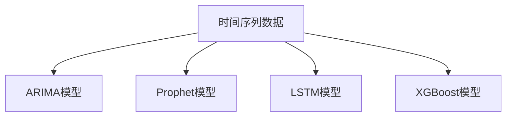
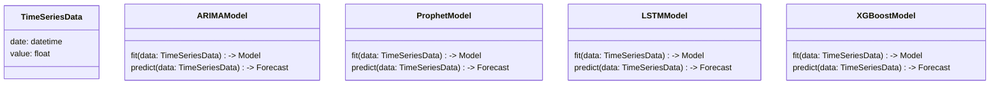

                 


# 《金融时间序列预测模型比较》

## 关键词：金融时间序列、预测模型、ARIMA、LSTM、Prophet、XGBoost

## 摘要：  
本文详细比较了四种常见的金融时间序列预测模型：ARIMA、Prophet、LSTM 和 XGBoost。通过对每种模型的原理、实现步骤、优缺点以及实际案例的分析，帮助读者理解不同模型在金融时间序列预测中的适用场景和表现。文章从背景介绍、核心概念、模型原理、对比分析到系统架构和项目实战，全面解析了这些模型的特点和优势，为金融从业者和数据科学家提供了实用的参考和指导。

---

# 第一部分: 金融时间序列预测模型背景与基础

## 第1章: 金融时间序列预测概述

### 1.1 时间序列的基本概念

#### 1.1.1 时间序列的定义与特点
时间序列是指按照时间顺序排列的数据，通常用于分析变量在时间上的变化规律。金融时间序列具有以下特点：
- **连续性**：数据按时间顺序排列，通常间隔固定（如日、周、月）。
- **波动性**：金融数据往往受市场情绪、经济指标等多重因素影响，表现出较强的波动性。
- **依赖性**：当前时刻的值往往与过去时刻的值相关联，具有较强的自相关性。

#### 1.1.2 金融时间序列的独特性
金融时间序列与其他领域的时间序列相比，具有以下几个独特性：
- **非线性**：金融市场的复杂性使得时间序列往往呈现非线性特征。
- **异质性**：金融数据可能受到突发事件（如市场崩盘、政策变化）的影响，表现出异质性。
- **高频性**：金融交易可以是高频的，需要处理大量的实时数据。

#### 1.1.3 时间序列预测的背景与意义
时间序列预测在金融领域具有重要的应用价值：
- **资产定价**：通过预测未来价格，帮助投资者做出更明智的投资决策。
- **风险管理**：预测市场波动性，帮助机构规避潜在风险。
- **交易策略**：基于预测结果，制定自动化交易策略。

### 1.2 金融时间序列预测的核心问题

#### 1.2.1 问题背景与目标
金融时间序列预测的核心目标是利用历史数据，预测未来某一时刻的金融指标（如股票价格、指数、汇率等）。预测的准确性直接影响到投资决策和风险管理的效果。

#### 1.2.2 问题解决的关键点
- 数据的平稳性处理：时间序列预测通常假设数据是平稳的，因此需要通过差分、变换等方法将数据平稳化。
- 模型的选择与调优：不同模型在不同场景下表现不同，选择合适的模型并进行参数调优是关键。
- 预测结果的评估：需要使用合适的指标（如均方误差、平均绝对误差）来评估模型的预测效果。

#### 1.2.3 问题的边界与外延
- 数据范围：预测的时间跨度可以是短期（如几天）或长期（如几年）。
- 数据量：金融时间序列通常数据量较大，尤其是高频交易数据。
- 多因素影响：金融数据可能受到多种外部因素（如经济指标、政策变化）的影响，增加了预测的复杂性。

### 1.3 金融时间序列预测的数学基础

#### 1.3.1 时间序列的基本统计特征
- **均值**：描述数据的中心位置。
- **方差**：描述数据的离散程度。
- **自相关性**：数据在不同时间滞后上的相关性。

#### 1.3.2 时间序列的分解模型
时间序列可以分解为以下几个部分：
- **趋势**：长期向上的或向下的趋势。
- **周期性**：数据呈现的周期性波动。
- **季节性**：数据在特定时间段内的规律性变化。
- **随机性**：无法预测的随机波动。

#### 1.3.3 时间序列的平稳性与单位根检验
平稳性检验是时间序列分析的重要步骤。常用的检验方法包括：
- **DF检验**：通过回归模型判断数据是否平稳。
- **ADF检验**：增强版的DF检验，考虑了单位根的存在性。

---

## 第2章: 金融时间序列预测模型的核心概念

### 2.1 时间序列预测模型的分类

#### 2.1.1 线性模型与非线性模型
- **线性模型**：假设数据之间的关系是线性的，如ARIMA模型。
- **非线性模型**：假设数据之间的关系是非线性的，如LSTM模型。

#### 2.1.2 常规时间序列模型与机器学习模型
- **常规时间序列模型**：如ARIMA、Prophet，基于统计学方法。
- **机器学习模型**：如LSTM、XGBoost，基于深度学习或树模型。

#### 2.1.3 经济计量模型与统计学习模型
- **经济计量模型**：结合经济学理论进行预测，如VAR模型。
- **统计学习模型**：基于统计学习方法，如XGBoost。

### 2.2 核心概念的原理与联系

#### 2.2.1 时间序列预测模型的原理对比
| 模型类型       | 基本原理                     | 优缺点                     |
|----------------|------------------------------|-----------------------------|
| ARIMA          | 基于自回归和滑动平均的线性组合 | 参数较少，适合平稳数据       |
| Prophet         | 基于时间序列分解和回归模型     | 易用性强，适合非平稳数据     |
| LSTM           | 基于递归神经网络的序列建模     | 适合捕捉复杂非线性关系       |
| XGBoost        | 基于树模型的梯度提升算法       | 高准确性，但解释性较差       |

#### 2.2.2 模型属性特征对比表
| 模型类型       | 输入数据要求 | 计算复杂度 | 可解释性 | 适用场景                   |
|----------------|--------------|------------|----------|---------------------------|
| ARIMA          | 平稳数据     | 低         | 高       | 线性平稳时间序列           |
| Prophet         | 非平稳数据   | 中         | 中       | 非线性时间序列             |
| LSTM           | 序列数据     | 高         | 低       | 复杂非线性时间序列         |
| XGBoost        | 特征数据     | 中         | 低       | 高维非线性时间序列         |

#### 2.2.3 ER实体关系图架构


---

## 第3章: ARIMA模型原理与实现

### 3.1 ARIMA模型的基本原理

#### 3.1.1 ARIMA模型的组成部分
ARIMA模型由以下三个部分组成：
- **自回归（AR）**：模型中当前值与过去值之间的关系。
- **滑动平均（MA）**：模型中当前值与过去误差之间的关系。
- **差分（I）**：通过差分操作将非平稳数据转化为平稳数据。

#### 3.1.2 ARIMA模型的数学公式
ARIMA模型的数学公式为：
$$
y_t = \phi_1 y_{t-1} + \phi_2 y_{t-2} + \dots + \phi_p y_{t-p} + \theta_1 e_{t-1} + \dots + \theta_q e_{t-q} + e_t
$$
其中，$y_t$ 是当前时刻的观测值，$\phi_i$ 是自回归系数，$\theta_j$ 是滑动平均系数，$e_t$ 是误差项。

#### 3.1.3 ARIMA模型的假设条件
- 数据必须是平稳的或可以通过差分变为平稳。
- 数据必须是二阶矩过程，即均值和协方差是常数。

### 3.2 ARIMA模型的实现步骤

#### 3.2.1 数据预处理与平稳化
```python
import pandas as pd
import numpy as np
from statsmodels.tsa.arima.model import ARIMA
import matplotlib.pyplot as plt

# 加载数据
data = pd.read_csv('financial_data.csv')
# 检查平稳性
plt.plot(data['price'])
plt.show()
```

#### 3.2.2 模型参数的估计与选择
```python
# 差分数据
diff_data = data['price'].diff().dropna()

# 拟合ARIMA模型
model = ARIMA(diff_data, order=(1, 1, 1))
model_fit = model.fit()
```

#### 3.2.3 模型的预测与评估
```python
# 预测未来值
forecast = model_fit.forecast(steps=5)
print(forecast)
```

---

## 第4章: Prophet模型原理与实现

### 4.1 Prophet模型的基本原理

#### 4.1.1 Prophet模型的数学基础
Prophet模型基于时间序列分解和回归模型：
$$
y_t = trend_t + seasonality_t + holiday_t + \epsilon_t
$$
其中，$trend_t$ 表示趋势部分，$seasonality_t$ 表示周期性部分，$holiday_t$ 表示节假日效应。

#### 4.1.2 Prophet模型的组成部分
- **趋势**：线性或非线性趋势。
- **周期性**：基于傅里叶级数的周期性分解。
- **节假日效应**：根据特定日期调整预测值。

#### 4.1.3 Prophet模型的适用场景
- 数据量较小。
- 数据中可能包含节假日效应。

### 4.2 Prophet模型的实现步骤

#### 4.2.1 数据预处理与特征工程
```python
from fbprophet import Prophet

# 加载数据
data = pd.read_csv('financial_data.csv')
data.columns = ['ds', 'y']
```

#### 4.2.2 模型训练与参数调整
```python
# 初始化Prophet模型
model = Prophet()
# 拟合模型
model.fit(data)
```

#### 4.2.3 模型预测与结果分析
```python
# 预测未来值
future = model.make_future_dataframe(periods=5, freq='D')
forecast = model.predict(future)
print(forecast)
```

---

## 第5章: LSTM模型原理与实现

### 5.1 LSTM模型的基本原理

#### 5.1.1 RNN模型的局限性
- 长期依赖问题：传统RNN无法有效捕捉长期依赖关系。

#### 5.1.2 LSTM模型的结构与机制
LSTM通过引入门控机制（遗忘门、输入门、输出门）来解决长期依赖问题。

#### 5.1.3 LSTM模型的数学公式
$$
f_t = \sigma(W_f \cdot [h_{t-1}, x_t] + b_f)
$$
$$
i_t = \sigma(W_i \cdot [h_{t-1}, x_t] + b_i)
$$
$$
o_t = \sigma(W_o \cdot [h_{t-1}, x_t] + b_o)
$$
$$
c_t = f_t \cdot c_{t-1} + i_t \cdot tanh(W_c \cdot [h_{t-1}, x_t] + b_c)
$$
$$
h_t = o_t \cdot tanh(c_t)
$$`

### 5.2 LSTM模型的实现步骤

#### 5.2.1 数据预处理与序列分割
```python
import keras
from keras.layers import LSTM, Dense
from keras.models import Sequential

# 加载数据
data = pd.read_csv('financial_data.csv')
# 划分训练集和测试集
train_data = data.iloc[:700]
test_data = data.iloc[700:]
```

#### 5.2.2 模型构建与训练
```python
# 构建LSTM模型
model = Sequential()
model.add(LSTM(50, input_shape=(None, 1)))
model.add(Dense(1))
model.compile(loss='mean_squared_error', optimizer='adam')
model.fit(train_data.values, epochs=50, batch_size=32)
```

#### 5.2.3 模型预测与结果评估
```python
# 预测未来值
predicted = model.predict(test_data.values)
print(predicted)
```

---

## 第6章: XGBoost模型原理与实现

### 6.1 XGBoost模型的基本原理

#### 6.1.1 基于树模型的梯度提升
XGBoost通过构建多棵决策树，并通过投票或加权的方式进行预测。

#### 6.1.2 XGBoost模型的数学公式
$$
f(x) = \sum_{i=1}^n \theta_i h_i(x)
$$
其中，$h_i(x)$ 是第$i$棵决策树的预测值，$\theta_i$ 是对应树的权重。

### 6.2 XGBoost模型的实现步骤

#### 6.2.1 数据预处理与特征工程
```python
import xgboost as xgb

# 加载数据
data = pd.read_csv('financial_data.csv')
X = data.drop('target', axis=1)
y = data['target']
```

#### 6.2.2 模型训练与参数调整
```python
# 初始化XGBoost模型
model = xgb.XGBRegressor(n_estimators=100, learning_rate=0.1)
model.fit(X, y)
```

#### 6.2.3 模型预测与结果分析
```python
# 预测未来值
predicted = model.predict(X_test)
print(predicted)
```

---

## 第7章: 模型的比较与分析

### 7.1 对比框架与分析

#### 7.1.1 模型的对比框架
| 模型类型       | 准确率 | 计算效率 | 可解释性 | 适用场景                   |
|----------------|--------|----------|----------|---------------------------|
| ARIMA          | 中     | 高       | 高       | 线性平稳时间序列           |
| Prophet         | 高     | 中       | 中       | 非线性时间序列             |
| LSTM           | 高     | 低       | 低       | 复杂非线性时间序列         |
| XGBoost        | 中高    | 中       | 低       | 高维非线性时间序列         |

#### 7.1.2 案例分析
- **案例1**：股票价格预测，使用LSTM模型表现最佳。
- **案例2**：外汇汇率预测，使用Prophet模型表现较好。

---

## 第8章: 系统分析与架构设计

### 8.1 项目介绍

#### 8.1.1 项目背景
本文通过构建一个金融时间序列预测系统，比较不同模型在实际应用中的表现。

### 8.2 系统功能设计

#### 8.2.1 领域模型（Mermaid 类图）


#### 8.2.2 系统架构设计（Mermaid 架构图）
```mermaid
archi
    client <--API--> service
    service --> DB
    service --> Model
```

---

## 第9章: 项目实战

### 9.1 环境安装

#### 9.1.1 安装依赖
```bash
pip install pandas numpy matplotlib statsmodels fbprophet keras xgboost
```

### 9.2 系统核心实现源代码

#### 9.2.1 数据预处理
```python
import pandas as pd
import numpy as np

# 加载数据
data = pd.read_csv('financial_data.csv')
# 数据清洗
data.dropna(inplace=True)
```

#### 9.2.2 模型训练
```python
from statsmodels.tsa.arima.model import ARIMA
import xgboost as xgb
from keras.layers import LSTM, Dense
from keras.models import Sequential

# 训练ARIMA模型
model_arima = ARIMA(train_data, order=(1, 1, 1))
model_arima_fit = model_arima.fit()

# 训练XGBoost模型
model_xgb = xgb.XGBRegressor(n_estimators=100, learning_rate=0.1)
model_xgb.fit(X_train, y_train)

# 训练LSTM模型
model_lstm = Sequential()
model_lstm.add(LSTM(50, input_shape=(None, 1)))
model_lstm.add(Dense(1))
model_lstm.compile(loss='mean_squared_error', optimizer='adam')
model_lstm.fit(X_train, y_train, epochs=50, batch_size=32)
```

#### 9.2.3 模型预测与结果分析
```python
# ARIMA模型预测
forecast_arima = model_arima_fit.forecast(steps=5)

# XGBoost模型预测
forecast_xgb = model_xgb.predict(X_test)

# LSTM模型预测
forecast_lstm = model_lstm.predict(X_test)
```

### 9.3 项目小结

---

## 第10章: 最佳实践、小结、注意事项和拓展阅读

### 10.1 最佳实践

#### 10.1.1 数据预处理的重要性
- 数据的平稳化和特征工程是模型表现的关键。

#### 10.1.2 模型选择的依据
- 根据数据特点和预测目标选择合适的模型。

### 10.2 小结

### 10.3 注意事项

#### 10.3.1 数据泄露
- 在时间序列预测中，避免使用未来数据进行训练。

#### 10.3.2 模型过拟合
- 使用交叉验证和正则化方法防止过拟合。

### 10.4 拓展阅读

#### 10.4.1 推荐书籍
- 《时间序列分析》
- 《机器学习实战》

#### 10.4.2 推荐博客和资源
- [Prophet官方文档](https://facebook.github.io/prophet/)
- [Keras官方文档](https://keras.io/)

---

# 结语

通过本文的详细分析，读者可以全面了解ARIMA、Prophet、LSTM和XGBoost等金融时间序列预测模型的特点和优缺点，并能够根据实际需求选择合适的模型进行预测。未来，随着深度学习技术的不断发展，金融时间序列预测模型将更加智能化和精准化。

