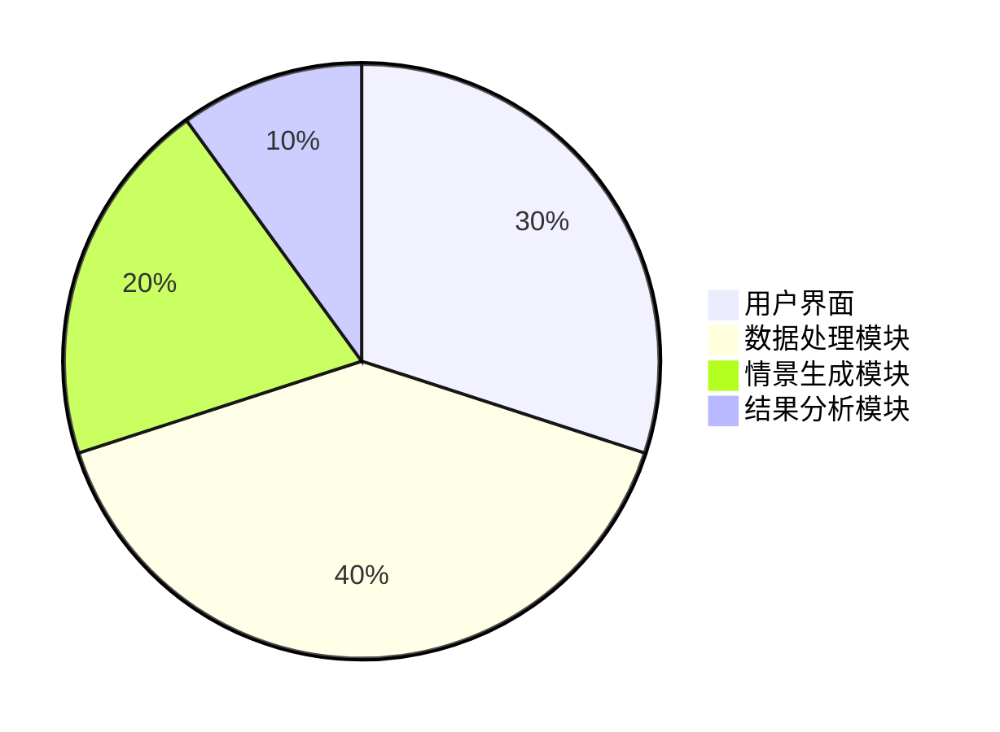

                 


# 金融机构压力测试情景生成器

**关键词：** 金融机构、压力测试、情景生成器、风险评估、算法设计、系统架构

**摘要：**  
本文系统地介绍金融机构压力测试情景生成器的核心概念、算法原理、系统架构设计及实际应用。通过详细分析压力测试的背景与重要性，讲解情景生成器的原理与实现方法，结合实际案例，展示如何利用先进的算法和系统架构设计来构建高效可靠的金融机构压力测试情景生成器。

---

# 第1章: 金融机构压力测试的背景与概述

## 1.1 压力测试的基本概念
### 1.1.1 压力测试的定义与目的
压力测试是通过模拟极端市场条件或突发情况，评估金融机构在面对这些压力时的稳健性。其目的是识别潜在风险点，确保机构在极端情况下仍能正常运营。

### 1.1.2 金融机构压力测试的重要性
金融机构的稳定性对整个经济体系至关重要。通过压力测试，可以提前发现潜在问题，制定应对策略，减少系统性风险。

### 1.1.3 压力测试情景生成器的作用
情景生成器是压力测试的核心工具，能够自动生成多种极端市场情景，帮助机构全面评估风险。

## 1.2 金融机构压力测试的分类
### 1.2.1 信用风险压力测试
评估单一资产或组合在信用违约情况下的损失。

### 1.2.2 市场风险压力测试
评估资产价格波动、利率变化等市场因素对投资组合的影响。

### 1.2.3 流动性风险压力测试
评估金融机构在极端情况下获取流动性的能力。

## 1.3 压力测试情景生成器的现状与挑战
### 1.3.1 当前压力测试情景生成的主要方法
包括基于规则的生成方法和基于数据驱动的生成方法。

### 1.3.2 情景生成器在金融机构中的应用现状
情景生成器已广泛应用于银行、保险、基金等领域。

### 1.3.3 情景生成器面临的挑战与未来发展方向
数据不足、模型准确性、计算效率等问题仍需解决。

## 1.4 本章小结
压力测试是金融机构风险管理的重要手段，情景生成器在其中扮演关键角色。随着技术进步，情景生成器将更加智能化和高效。

---

# 第2章: 压力测试情景生成器的核心概念

## 2.1 压力测试情景生成器的定义与核心要素
### 2.1.1 情景生成器的定义
一种自动生成压力测试情景的工具或系统，能够模拟各种极端市场条件。

### 2.1.2 情景生成器的核心要素
数据源、生成算法、情景评估模块、结果分析模块。

### 2.1.3 情景生成器的输入与输出
输入：市场数据、风险参数；输出：多种压力测试情景。

## 2.2 压力测试情景生成器的原理与流程
### 2.2.1 情景生成的基本流程
数据预处理 → 算法选择 → 情景生成 → 结果评估。

### 2.2.2 数据输入与处理
数据清洗、特征提取、数据增强。

### 2.2.3 情景生成与验证
生成情景后需验证其合理性，确保符合市场规律。

## 2.3 情景生成器的属性与特征对比
### 2.3.1 不同情景生成方法的对比分析
基于规则 vs 数据驱动：规则方法简单但不够灵活，数据驱动方法更精准但计算复杂。

### 2.3.2 基于规则与基于数据驱动的情景生成方法
规则方法通过设定阈值生成情景，数据驱动方法利用历史数据训练模型生成情景。

### 2.3.3 情景生成器的可扩展性与灵活性
灵活的情景生成器应支持多种市场条件和用户定制需求。

## 2.4 情景生成器的ER实体关系图
```mermaid
erDiagram
    customer[客户] {
        +string id
        +string name
        +string email
    }
    pressure_test[压力测试] {
        +string test_id
        +datetime test_date
        +float market_volatility
    }
    scenario_generator[情景生成器] {
        +string scenario_id
        +string algorithm_type
        +float execution_time
    }
    <from>
    customer --> pressure_test: 参与
    pressure_test --> scenario_generator: 使用
```

## 2.5 本章小结
情景生成器是压力测试的核心工具，其设计需综合考虑数据处理、算法选择和结果验证。

---

# 第3章: 压力测试情景生成器的算法原理

## 3.1 压力测试情景生成器的算法原理
### 3.1.1 蒙特卡洛模拟
通过随机采样生成多种市场情景，评估资产组合的潜在损失。

### 3.1.2 机器学习模型
使用回归分析或聚类分析生成相似的市场情景。

### 3.1.3 时间序列分析
利用历史数据预测未来市场走势，生成极端情景。

## 3.2 压力测试情景生成器的实现步骤
### 3.2.1 数据预处理
清洗数据、标准化、特征选择。

### 3.2.2 算法选择与参数设置
根据需求选择合适的算法，如随机森林、支持向量机等。

### 3.2.3 模型训练与验证
训练模型，验证其准确性和稳定性。

## 3.3 压力测试情景生成器的数学模型
### 3.3.1 蒙特卡洛模拟的数学公式
$$P(\text{损失} > L) = \int_{L}^{\infty} f(x) dx$$
其中，$f(x)$为损失分布函数。

### 3.3.2 机器学习模型的数学公式
$$y = \sum_{i=1}^{n} \beta_i x_i + \epsilon$$
其中，$\beta_i$为回归系数，$\epsilon$为误差项。

## 3.4 压力测试情景生成器的实现代码
```python
import numpy as np
from sklearn.ensemble import RandomForestRegressor

def generate_scenario(data, model):
    # 数据预处理
    X = data.drop(columns=['label'])
    y = data['label']
    model.fit(X, y)
    # 生成新情景
    new_data = pd.DataFrame({
        'feature1': [random_value],
        'feature2': [random_value],
        # 其他特征
    })
    predicted_label = model.predict(new_data)
    return predicted_label
```

## 3.5 本章小结
算法是情景生成器的核心，蒙特卡洛模拟和机器学习模型各有优劣，需根据具体需求选择合适的方法。

---

# 第4章: 金融机构压力测试情景生成器的系统分析与架构设计

## 4.1 项目背景与需求分析
### 4.1.1 项目背景
随着金融市场波动加剧，金融机构对压力测试的需求日益增加。

### 4.1.2 项目需求
开发一个高效、灵活的情景生成器，支持多种市场条件下的压力测试。

## 4.2 系统功能设计
### 4.2.1 系统功能模块
数据输入模块、情景生成模块、结果分析模块。

### 4.2.2 功能流程
数据输入 → 数据处理 → 情景生成 → 结果分析。

## 4.3 系统架构设计
### 4.3.1 系统架构图


### 4.3.2 模块交互关系
用户通过界面输入数据，数据处理模块清洗数据，情景生成模块生成情景，结果分析模块评估结果。

## 4.4 系统接口设计
### 4.4.1 输入接口
支持多种数据格式，如CSV、Excel。

### 4.4.2 输出接口
生成情景文件和结果报告。

## 4.5 系统交互流程
### 4.5.1 用户登录
用户登录系统，选择压力测试类型。

### 4.5.2 数据输入
上传数据文件，系统自动解析数据。

### 4.5.3 情景生成
选择算法，生成多种压力测试情景。

### 4.5.4 结果分析
查看生成的情景，并进行风险评估。

## 4.6 本章小结
系统架构设计需清晰模块划分，确保各模块高效协同工作。

---

# 第5章: 金融机构压力测试情景生成器的项目实战

## 5.1 项目背景与目标
### 5.1.1 项目背景
开发一个支持多种市场情景的压力测试生成器，帮助金融机构进行风险评估。

### 5.1.2 项目目标
实现一个高效、灵活的情景生成器，支持金融机构日常压力测试需求。

## 5.2 环境安装与配置
### 5.2.1 系统环境
建议使用Python 3.8及以上版本。

### 5.2.2 依赖安装
安装numpy、pandas、scikit-learn等库。

## 5.3 核心代码实现
### 5.3.1 数据处理模块
```python
import pandas as pd
import numpy as np

def data_preprocessing(data):
    # 去除缺失值
    data.dropna(inplace=True)
    # 标准化
    from sklearn.preprocessing import StandardScaler
    scaler = StandardScaler()
    scaled_data = scaler.fit_transform(data)
    return scaled_data
```

### 5.3.2 情景生成模块
```python
from sklearn.ensemble import RandomForestRegressor

def generate_scenario(data, model):
    # 生成新数据
    new_data = pd.DataFrame({
        'feature1': [np.random.random()],
        'feature2': [np.random.random()],
    })
    # 预测结果
    predicted = model.predict(new_data)
    return predicted
```

### 5.3.3 结果分析模块
```python
def analyze_results(results):
    # 统计分析
    import matplotlib.pyplot as plt
    plt.hist(results, bins=10)
    plt.show()
```

## 5.4 项目实战案例
### 5.4.1 案例背景
假设我们有一个股票组合，需要评估其在市场崩盘情况下的表现。

### 5.4.2 数据准备
准备历史股价数据、宏观经济指标等。

### 5.4.3 情景生成
使用随机森林模型生成极端市场情景。

### 5.4.4 结果分析
评估组合在极端情景下的潜在损失。

## 5.5 项目总结与优化
### 5.5.1 项目总结
成功开发了一个高效的压力测试情景生成器。

### 5.5.2 项目优化
优化算法性能，增加用户友好的界面。

## 5.6 本章小结
通过实战项目，展示了如何开发一个高效的压力测试情景生成器，并验证了其实际应用价值。

---

# 第6章: 金融机构压力测试情景生成器的总结与展望

## 6.1 本章总结
### 6.1.1 核心内容回顾
介绍了压力测试的情景生成器，涵盖背景、算法、系统架构和项目实战。

### 6.1.2 主要收获
理解了压力测试的重要性，掌握了情景生成器的设计方法。

## 6.2 未来展望
### 6.2.1 技术发展方向
探索更高效、更精准的算法，如深度学习。

### 6.2.2 应用场景拓展
将情景生成器应用于更多金融领域，如外汇市场、衍生品市场。

## 6.3 最佳实践与注意事项
### 6.3.1 最佳实践
选择合适的算法，确保数据质量，定期更新模型。

### 6.3.2 注意事项
注意数据的代表性，避免模型过拟合。

## 6.4 拓展阅读
建议阅读相关领域的最新研究论文和技术报告。

## 6.5 本章小结
压力测试情景生成器是金融机构风险管理的重要工具，未来将更加智能化和多样化。

---

**致谢**
感谢读者的耐心阅读，感谢合作伙伴的支持，感谢技术专家的指导。

**参考文献**
[1] 《压力测试与风险管理》，某某出版社，2023年。

[2]某某技术报告，某某机构，2022年。

---

**附录**
提供完整的代码示例、数据集链接、工具安装指南等。

---

以上是一个详细的《金融机构压力测试情景生成器》的目录大纲设计。每章内容均围绕主题展开，涵盖背景、核心概念、算法原理、系统架构、项目实战和总结与展望，确保文章结构清晰，内容详实。

