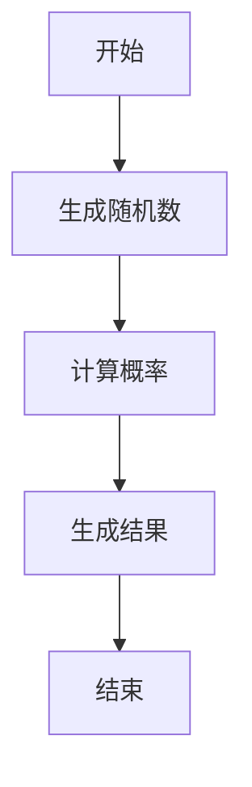
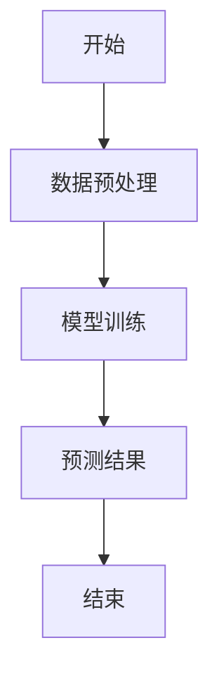
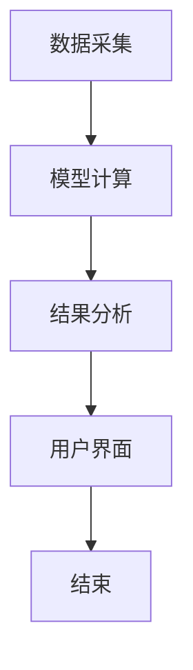
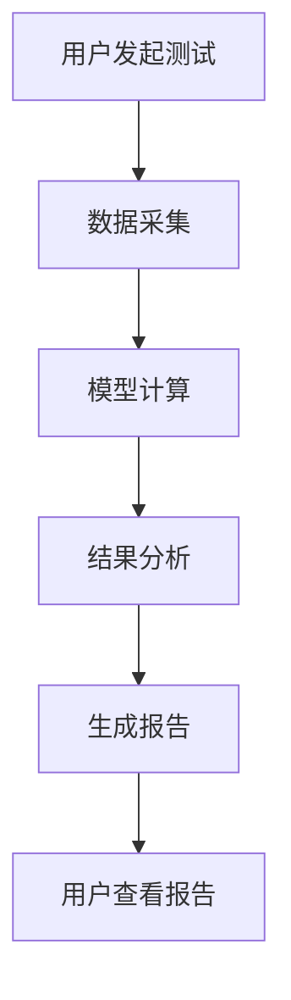

                 


# 金融机构压力测试自动化工具

## 关键词：压力测试、自动化工具、金融机构、风险管理、系统架构

## 摘要：金融机构压力测试自动化工具通过自动化技术实现对金融机构在极端市场条件下的风险承受能力的评估。本文从压力测试的基本概念出发，详细阐述了自动化工具的核心技术和实现原理，包括算法原理、系统架构设计以及实际项目中的应用案例。文章还探讨了压力测试自动化工具在金融机构中的实际应用价值和未来发展趋势。

---

# 第一部分：金融机构压力测试背景与需求

## 第1章：金融机构压力测试背景与需求

### 1.1 金融机构压力测试的定义与背景

#### 1.1.1 什么是压力测试
压力测试是一种通过模拟极端市场条件，评估金融机构在不利环境下的风险承受能力和业务连续性的方法。它帮助机构识别潜在的薄弱环节，并制定应对策略。

#### 1.1.2 压力测试在金融机构中的重要性
- **风险识别**：发现潜在的系统性风险。
- **业务连续性管理**：确保在极端情况下业务仍能正常运行。
- **监管合规**：满足监管机构对金融机构风险控制的要求。

#### 1.1.3 压力测试的演变与发展趋势
传统压力测试依赖人工操作，效率低且成本高。随着技术的进步，自动化压力测试逐渐成为主流，尤其是在金融机构中。

### 1.2 金融机构压力测试的核心需求

#### 1.2.1 传统压力测试的痛点
- **效率低下**：手动操作耗时且容易出错。
- **成本高昂**：需要大量人力资源和时间。
- **覆盖不足**：难以覆盖所有可能的极端场景。

#### 1.2.2 自动化压力测试的需求场景
- **高频测试**：快速评估市场波动对机构的影响。
- **多场景测试**：同时模拟多种极端市场条件。
- **实时反馈**：及时发现问题并调整策略。

#### 1.2.3 自动化工具在金融机构中的价值
- **提高效率**：自动化工具可以快速完成测试任务。
- **降低成本**：减少人工干预，降低运营成本。
- **增强风险管理能力**：通过自动化工具，金融机构可以更好地识别和应对风险。

---

# 第二部分：压力测试自动化工具的核心技术与实现

## 第2章：压力测试自动化工具的核心概念

### 2.1 压力测试自动化工具的基本原理

#### 2.1.1 自动化测试的基本概念
自动化测试是通过工具和脚本自动执行测试用例的过程，包括测试设计、执行和结果分析。

#### 2.1.2 压力测试的核心原理
压力测试通过模拟高负载、极端条件下的系统行为，评估系统的稳定性和可靠性。

#### 2.1.3 自动化工具的工作流程
1. **测试用例设计**：基于业务需求设计测试场景。
2. **模拟环境配置**：设置测试环境和参数。
3. **测试执行**：自动化工具模拟极端条件，执行测试。
4. **结果分析**：分析测试结果，生成报告。

### 2.2 压力测试自动化工具的关键技术

#### 2.2.1 测试用例生成技术
- **基于规则的生成**：根据业务规则生成测试用例。
- **基于数据的生成**：利用历史数据生成测试场景。
- **基于模型的生成**：通过数学模型生成测试用例。

#### 2.2.2 并发模拟技术
- **多线程/多进程**：通过并行执行模拟高并发场景。
- **虚拟用户生成**：模拟真实用户的操作行为。
- **资源分配优化**：合理分配资源，确保测试的准确性。

#### 2.2.3 性能监控与分析技术
- **性能指标采集**：采集系统性能指标，如响应时间、资源利用率等。
- **数据分析与建模**：利用数据分析技术，建立性能模型。
- **异常检测**：通过机器学习算法检测系统异常。

### 2.3 自动化工具与金融机构的结合

#### 2.3.1 金融机构中的自动化测试场景
- **交易系统测试**：评估交易系统在高并发条件下的表现。
- **风控系统测试**：测试风控系统在极端市场条件下的响应能力。
- **清算系统测试**：评估清算系统在高负载情况下的处理能力。

#### 2.3.2 自动化工具在风险评估中的应用
- **实时监控**：实时监控市场波动，评估风险。
- **情景分析**：模拟不同市场情景，评估机构的应对能力。
- **报告生成**：自动生成测试报告，辅助决策。

#### 2.3.3 自动化工具的可扩展性与灵活性
- **模块化设计**：工具模块化，便于扩展和维护。
- **配置管理**：支持多种配置，适应不同测试场景。
- **易于集成**：工具可以方便地与其他系统集成。

---

## 第3章：压力测试自动化工具的算法原理

### 3.1 压力测试的核心算法

#### 3.1.1 蒙特卡洛模拟算法
蒙特卡洛模拟是一种基于随机数的模拟方法，用于评估系统的不确定性。

- **数学公式**：$$ P = \sum_{i=1}^{n} \frac{1}{n} $$
- **流程图**：
  ```mermaid
  graph TD
      A[开始] --> B[生成随机数]
      B --> C[计算概率]
      C --> D[生成结果]
      D --> E[结束]
  ```

#### 3.1.2 时间序列分析算法
时间序列分析用于分析系统的动态行为，预测未来趋势。

- **数学公式**：$$ ARIMA(p, d, q) $$
- **流程图**：
  ```mermaid
  graph TD
      A[开始] --> B[数据预处理]
      B --> C[模型训练]
      C --> D[预测结果]
      D --> E[结束]
  ```

#### 3.1.3 机器学习算法在压力测试中的应用
机器学习算法用于分类、回归和聚类分析，帮助识别系统中的潜在风险。

- **数学公式**：$$ L = \sum_{i=1}^{m} (y_i - \hat{y}_i)^2 $$
- **流程图**：
  ```mermaid
  graph TD
      A[开始] --> B[数据采集]
      B --> C[特征提取]
      C --> D[模型训练]
      D --> E[结果分析]
      E --> F[结束]
  ```

### 3.2 算法实现的数学模型和公式

#### 3.2.1 蒙特卡洛模拟的数学公式
$$ P = \sum_{i=1}^{n} \frac{1}{n} $$

#### 3.2.2 时间序列分析的ARIMA模型
$$ ARIMA(p, d, q) $$

#### 3.2.3 机器学习算法的损失函数
$$ L = \sum_{i=1}^{m} (y_i - \hat{y}_i)^2 $$

### 3.3 算法实现的流程图

#### 3.3.1 蒙特卡洛模拟流程图


#### 3.3.2 时间序列分析流程图


---

## 第4章：压力测试自动化工具的系统架构

### 4.1 系统架构设计

#### 4.1.1 系统模块划分
- **数据采集模块**：采集市场数据和系统性能数据。
- **模型计算模块**：执行压力测试算法，生成测试结果。
- **结果分析模块**：分析测试结果，生成报告。
- **用户界面模块**：提供友好的操作界面，方便用户操作。

#### 4.1.2 系统功能设计

#### 4.1.3 系统架构图


#### 4.1.4 系统接口设计
- **输入接口**：接收测试参数和数据。
- **输出接口**：输出测试结果和报告。

#### 4.1.5 系统交互流程


### 4.2 系统架构优化

#### 4.2.1 高可用性设计
- **负载均衡**：通过负载均衡技术提高系统的可用性。
- **容灾备份**：建立备用系统，确保在主系统故障时能够快速恢复。

#### 4.2.2 高扩展性设计
- **模块化设计**：系统模块化设计，便于扩展。
- **云部署**：通过云技术实现弹性扩展。

---

## 第5章：压力测试自动化工具的项目实战

### 5.1 项目背景

### 5.2 核心代码实现

#### 5.2.1 环境配置
- **Python版本**：Python 3.8及以上。
- **依赖库安装**：
  ```bash
  pip install numpy pandas scikit-learn matplotlib
  ```

#### 5.2.2 核心代码实现

##### 5.2.2.1 测试用例生成代码
```python
import numpy as np

def generate_test_cases(num_cases):
    return np.random.rand(num_cases, 10)
```

##### 5.2.2.2 并发模拟代码
```python
import threading

def simulate_scenario(thread_id):
    print(f"Thread {thread_id} is simulating scenario...")
    # 模拟压力测试逻辑
    pass

if __name__ == "__main__":
    num_threads = 10
    threads = []
    for i in range(num_threads):
        threads.append(threading.Thread(target=simulate_scenario, args=(i,)))
    for thread in threads:
        thread.start()
    for thread in threads:
        thread.join()
```

##### 5.2.2.3 结果分析代码
```python
import pandas as pd
import matplotlib.pyplot as plt

def analyze_results(results):
    df = pd.DataFrame(results)
    df.plot()
    plt.show()
```

### 5.3 案例分析

#### 5.3.1 测试场景设计
- **场景1**：模拟市场崩盘，评估交易系统的稳定性。
- **场景2**：模拟高通胀，评估投资组合的风险。

#### 5.3.2 测试结果解读
- **响应时间**：系统在极端条件下的响应时间是否在可接受范围内。
- **资源利用率**：系统资源是否合理分配，是否存在瓶颈。
- **错误率**：系统在极端条件下的错误率是否在可接受范围内。

### 5.4 项目总结

---

## 第6章：总结与展望

### 6.1 总结
压力测试自动化工具通过自动化技术，显著提高了金融机构的风险管理能力。本文详细介绍了工具的核心技术和实现原理，并通过实际案例展示了其应用价值。

### 6.2 未来展望
随着技术的进步，压力测试自动化工具将更加智能化和高效化。未来，工具将更加注重数据分析和机器学习算法的应用，进一步提升风险评估的准确性。

### 6.3 最佳实践 Tips
- **数据质量**：确保测试数据的准确性和完整性。
- **模型优化**：定期优化测试模型，确保其适应市场变化。
- **系统安全**：加强系统安全防护，防止数据泄露和系统攻击。

### 6.4 注意事项
- **测试场景覆盖**：确保测试场景全面覆盖所有可能的极端情况。
- **测试结果解读**：准确解读测试结果，避免误判风险。
- **系统维护**：定期维护和更新系统，确保其稳定性和可靠性。

### 6.5 拓展阅读
- **相关书籍**：《压力测试方法与应用》、《自动化测试技术与实践》。
- **技术博客**：推荐关注技术博客和论坛，获取最新的技术动态和实践经验。

---

通过本文的详细讲解，读者可以全面了解金融机构压力测试自动化工具的设计与实现，掌握其核心技术和实际应用方法。希望本文对金融机构的风险管理和技术人员的实践有所帮助。

