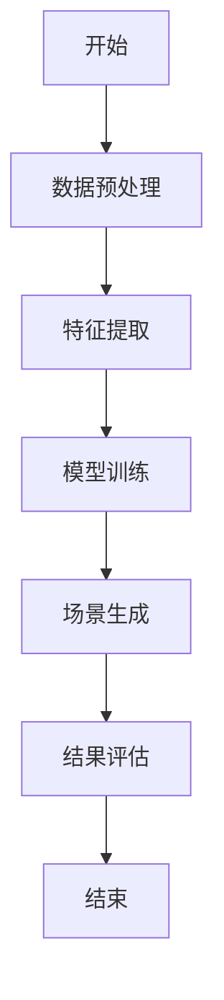

                 


# 《金融监管压力测试场景生成》

> 关键词：金融监管，压力测试，场景生成，风险管理，算法，系统架构

> 摘要：本文深入探讨了金融监管中的压力测试场景生成方法，结合金融学、人工智能和系统架构设计，详细分析了压力测试的背景、核心概念、算法原理、系统设计、项目实战及最佳实践，帮助读者全面理解并有效实施压力测试场景生成。

---

# 《金融监管压力测试场景生成》目录大纲

## 第一章: 金融监管压力测试背景与概念

### 1.1 金融监管的基本概念
- 1.1.1 金融监管的定义与作用
- 1.1.2 金融监管的演变历程
- 1.1.3 金融监管的三大支柱

### 1.2 压力测试的定义与作用
- 1.2.1 压力测试的定义
- 1.2.2 压力测试的目的与意义
- 1.2.3 压力测试在金融监管中的应用

### 1.3 压力测试场景生成的必要性
- 1.3.1 场景生成的背景需求
- 1.3.2 场景生成在压力测试中的作用
- 1.3.3 场景生成的技术挑战

---

## 第二章: 金融监管压力测试的核心概念与联系

### 2.1 金融监管的核心要素
- 2.1.1 金融机构与金融产品
- 2.1.2 市场风险与信用风险
- 2.1.3 监管机构与监管框架

### 2.2 压力测试场景生成的关键要素
- 2.2.1 场景的构成要素
- 2.2.2 场景的分类与特征
- 2.2.3 场景生成的逻辑关系

### 2.3 核心概念的ER实体关系图
```mermaid
er
actor: 监管机构
actor -|> 监管对象: 金融机构
actor -|> 场景生成系统: 场景生成模块
场景生成系统 -|> 数据源: 历史数据、市场数据
场景生成系统 -|> 模型库: 风险模型、压力测试模型
```

---

## 第三章: 压力测试场景生成的算法原理

### 3.1 压力测试场景生成的算法概述
- 3.1.1 算法的基本原理
- 3.1.2 算法的主要步骤
- 3.1.3 算法的分类与选择

### 3.2 基于机器学习的压力测试场景生成
- 3.2.1 机器学习的基本概念
- 3.2.2 常见的机器学习算法
- 3.2.3 机器学习在场景生成中的应用

### 3.3 压力测试场景生成的数学模型
- 3.3.1 场景生成的数学表达式
- 3.3.2 模型的参数设定与优化
- 3.3.3 模型的验证与评估

### 3.4 算法的Mermaid流程图


---

## 第四章: 系统分析与架构设计方案

### 4.1 系统分析与需求分析
- 4.1.1 系统目标与范围
- 4.1.2 系统功能需求
- 4.1.3 系统性能需求

### 4.2 系统架构设计
- 4.2.1 系统架构的模块划分
- 4.2.2 模块之间的交互关系
- 4.2.3 系统架构的Mermaid图


### 4.3 系统接口设计
- 4.3.1 数据接口的设计
- 4.3.2 模型接口的设计
- 4.3.3 用户界面的设计

### 4.4 系统交互的Mermaid序列图
```mermaid
sequenceDiagram
actor 监管机构 ->> 系统: 提交压力测试请求
系统 ->> 数据源: 获取历史数据
数据源 ->> 系统: 返回数据
系统 ->> 场景生成模块: 启动生成场景
场景生成模块 ->> 模型库: 调用风险模型
模型库 ->> 场景生成模块: 返回场景结果
场景生成模块 ->> 系统: 更新系统状态
系统 ->> 监管机构: 返回测试结果
```

---

## 第五章: 项目实战与案例分析

### 5.1 项目环境安装与配置
- 5.1.1 系统环境要求
- 5.1.2 数据库安装与配置
- 5.1.3 开发工具安装与配置

### 5.2 系统核心实现源代码
- 5.2.1 数据预处理代码
- 5.2.2 模型训练代码
- 5.2.3 场景生成代码

### 5.3 代码应用解读与分析
- 5.3.1 数据预处理的实现
- 5.3.2 模型训练的实现
- 5.3.3 场景生成的实现

### 5.4 实际案例分析与详细讲解
- 5.4.1 案例背景介绍
- 5.4.2 数据收集与处理
- 5.4.3 模型训练与优化
- 5.4.4 场景生成与结果分析

---

## 第六章: 最佳实践与小结

### 6.1 最佳实践
- 6.1.1 数据质量管理
- 6.1.2 模型选择与优化
- 6.1.3 系统维护与更新

### 6.2 小结
- 6.2.1 本文总结
- 6.2.2 未来研究方向
- 6.2.3 对读者的建议

### 6.3 注意事项
- 6.3.1 数据隐私与安全
- 6.3.2 系统稳定性与可靠性
- 6.3.3 模型的可解释性

### 6.4 拓展阅读
- 6.4.1 推荐书籍与论文
- 6.4.2 相关技术与领域动态
- 6.4.3 进一步学习资源

---

## 附录: 常用工具与技术参考资料

---

以上目录大纲涵盖了从理论到实践的各个方面，结合了金融监管压力测试场景生成的背景、核心概念、算法原理、系统设计、项目实战及最佳实践，确保内容全面且逻辑清晰，便于读者理解和应用。

