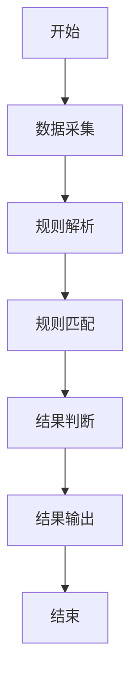
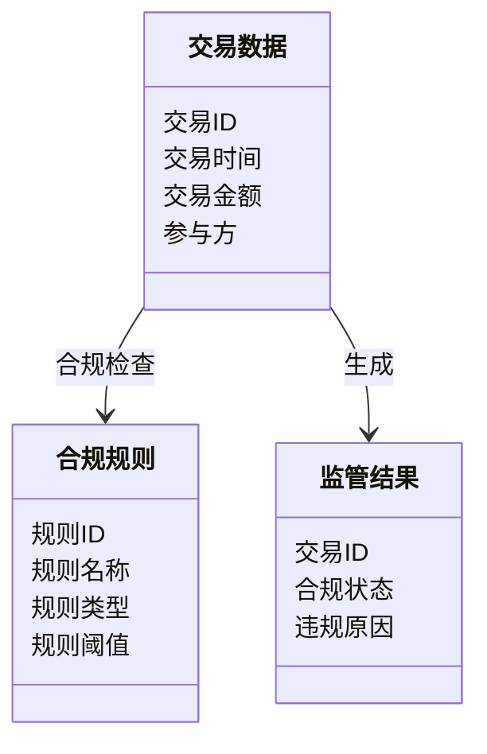
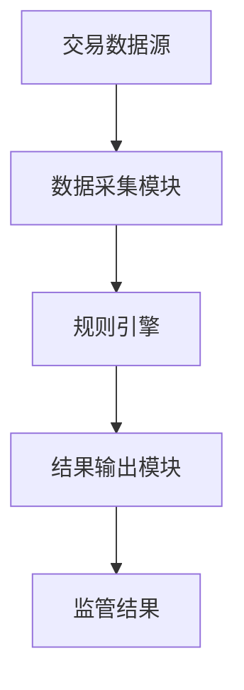
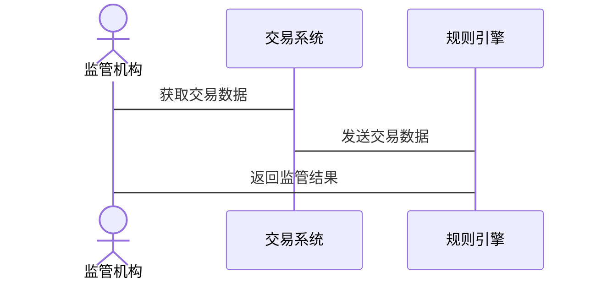

                 


# 《金融监管合规自动化工具》

## 关键词：
- 金融监管
- 合规自动化
- 规则引擎
- 系统架构
- Python实现

## 摘要：
本文详细探讨了金融监管合规自动化工具的设计与实现，从背景介绍、核心概念、算法原理到系统架构，再到项目实战和最佳实践，全面解析了如何利用技术手段提升金融监管的效率和准确性。通过实际案例分析，展示了如何利用规则引擎和自动化工具解决传统监管中的痛点，并通过Python代码实现具体的合规检查流程。

---

## 第一部分: 金融监管合规自动化工具的背景与概述

### 第1章: 金融监管合规自动化工具的概述

#### 1.1 问题背景与描述
金融行业的监管合规要求日益严格，传统的手动监管方式效率低下且容易出错。金融机构需要处理海量的交易数据和复杂的合规规则，如何高效地进行合规检查成为一大挑战。

##### 1.1.1 传统金融监管的痛点与挑战
- 数据量大：金融机构每天处理的交易数据可能以百万计，手动检查耗时耗力。
- 规则复杂：不同金融产品和地区的合规规则千差万别，手动检查难以覆盖所有情况。
- 易出错：人为操作容易出现疏漏，导致合规风险。

##### 1.1.2 合规监管的复杂性与重要性
- 重要性：合规监管是保障金融系统稳定运行的核心环节。
- 复杂性：涉及多个监管机构和不同金融产品的复杂规则。

##### 1.1.3 金融监管自动化工具的必要性
- 提高效率：自动化工具可以快速处理海量数据。
- 减少错误：通过规则引擎减少人为失误。
- 实时监控：自动化工具可以实时检查交易数据，及时发现违规行为。

#### 1.2 核心概念与问题解决
##### 1.2.1 金融监管合规的定义与目标
- 定义：通过自动化工具对金融交易数据进行合规性检查，确保符合相关法律法规。
- 目标：提高监管效率，降低合规风险，保障金融市场的稳定。

##### 1.2.2 自动化工具在金融监管中的作用
- 自动化工具可以快速解析交易数据，匹配合规规则，生成监管报告。
- 通过规则引擎实现灵活的合规检查，适应不同监管要求。

##### 1.2.3 问题解决的思路与方法
- 利用规则引擎实现动态的合规规则配置。
- 通过数据解析和匹配算法快速定位违规行为。

#### 1.3 问题的边界与外延
##### 1.3.1 金融监管的范围与边界
- 监管范围：涵盖银行、证券、保险等多个金融领域。
- 边界：不涉及具体的金融交易执行，仅限于合规检查。

##### 1.3.2 合规自动化工具的应用场景
- 实时监控：对实时交易数据进行合规检查。
- 批量处理：对历史交易数据进行合规回溯。
- 报告生成：自动生成监管报告，便于监管机构审查。

##### 1.3.3 与相关领域的区别与联系
- 区别：与金融交易执行系统不同，合规工具专注于合规检查。
- 联系：合规工具需要与交易系统对接，获取交易数据进行检查。

#### 1.4 核心概念结构与组成
##### 1.4.1 金融监管合规的核心要素
- 交易数据：包括交易时间、金额、参与者等信息。
- 合规规则：包括各地区的法律法规和行业标准。
- 监管结果：包括合规通过和违规行为的具体信息。

##### 1.4.2 自动化工具的功能模块
- 数据采集：从交易系统获取交易数据。
- 规则引擎：根据合规规则对交易数据进行检查。
- 结果输出：生成监管报告或触发报警机制。

##### 1.4.3 系统架构的组成与关系
- 数据源：交易系统提供交易数据。
- 规则引擎：负责解析和匹配合规规则。
- 输出模块：生成监管报告或触发报警。

---

## 第二部分: 核心概念与联系

### 第2章: 核心概念的原理与分析

#### 2.1 核心概念的原理
##### 2.1.1 金融监管的规则引擎
- 规则引擎是合规自动化工具的核心，负责解析和匹配合规规则。
- 支持动态规则配置，可以根据不同监管要求灵活调整。

##### 2.1.2 合规检查的逻辑与流程
- 数据解析：将交易数据转换为可分析的格式。
- 规则匹配：将交易数据与合规规则进行匹配。
- 结果判断：根据匹配结果生成合规判断。

##### 2.1.3 自动化工具的算法基础
- 使用正则表达式和条件判断实现规则匹配。
- 通过队列和线程池实现高效的数据处理。

#### 2.2 核心概念的属性特征对比
##### 2.2.1 传统监管 vs 自动化监管的对比
| 特性        | 传统监管          | 自动化监管          |
|-------------|-------------------|--------------------|
| 效率        | 低                | 高                |
| 准确性      | 易出错            | 准确率高          |
| 适用场景    | 适用于少量数据    | 适用于海量数据    |

##### 2.2.2 不同金融产品的合规要求对比
| 金融产品    | 合规要求          | 示例规则          |
|-------------|-------------------|--------------------|
| 银行存款    | 反洗钱规则        | 交易金额超过一定限额需报告 |
| 证券交易    | 信息披露规则      | 交易行为需符合信息披露要求 |

##### 2.2.3 不同监管机构的规则对比
| 监管机构    | 合规规则          | 示例规则          |
|-------------|-------------------|--------------------|
| 证监会      | 证券法相关规定    | 交易行为需符合证券法要求 |
| 银保监会    | 银行保险监管规定  | 交易行为需符合银保监会要求 |

#### 2.3 ER实体关系图
```mermaid
er
    actor: 监管机构
    actor --> entity: 金融机构
    entity --> entity: 交易数据
    entity --> entity: 合规规则
    entity --> entity: 自动化工具
    actor --> entity: 监管结果
```

---

## 第三部分: 算法原理讲解

### 第3章: 算法原理与实现

#### 3.1 算法原理
##### 3.1.1 算法概述
- 使用规则引擎对交易数据进行合规检查。
- 通过正则表达式和条件判断实现规则匹配。

##### 3.1.2 算法流程


##### 3.1.3 数学模型和公式
- 数据匹配公式：$匹配结果 = \sum_{i=1}^{n} (规则_i 是否满足)$
- 结果判断公式：$合规结果 = \text{所有规则均满足}$

#### 3.2 算法实现
##### 3.2.1 Python代码实现
```python
import re

# 定义合规规则
rules = {
    'rule1': {'name': '大额交易报告', 'amount': 10000},
    'rule2': {'name': '反洗钱检查', 'threshold': 0.5}
}

# 数据解析函数
def parse_transaction(transaction):
    return {
        'amount': transaction['amount'],
        'participant': transaction['participant']
    }

# 规则匹配函数
def match_rule(rule, transaction):
    parsed_transaction = parse_transaction(transaction)
    if rule['type'] == 'amount':
        return parsed_transaction['amount'] > rule['threshold']
    elif rule['type'] == 'participant':
        return re.match(rule['pattern'], parsed_transaction['participant']) is not None
    return False

# 合规检查主函数
def compliance_check(transactions):
    results = []
    for trans in transactions:
        result = {
            'transaction_id': trans['id'],
            'is_compliant': True
        }
        for rule in rules.values():
            if not match_rule(rule, trans):
                result['is_compliant'] = False
                break
        results.append(result)
    return results
```

##### 3.2.2 代码解读与分析
- 数据解析函数：将交易数据转换为可分析的格式。
- 规则匹配函数：根据规则对交易数据进行匹配。
- 合规检查主函数：对所有交易数据进行合规检查，生成结果。

---

## 第四部分: 系统分析与架构设计方案

### 第4章: 系统架构与设计

#### 4.1 问题场景介绍
- 系统需要处理大量交易数据，实时进行合规检查。
- 需要支持不同监管机构的合规规则。

#### 4.2 项目介绍
- 项目目标：开发一个高效的金融监管合规自动化工具。
- 项目范围：涵盖银行、证券、保险等多个金融领域。

#### 4.3 系统功能设计
##### 4.3.1 领域模型


##### 4.3.2 系统架构设计


##### 4.3.3 系统接口设计
- 数据采集接口：从交易系统获取交易数据。
- 规则引擎接口：根据交易数据进行合规检查。
- 结果输出接口：生成监管报告或触发报警。

##### 4.3.4 系统交互图


---

## 第五部分: 项目实战

### 第5章: 项目实战与分析

#### 5.1 环境安装
- 安装Python和相关库：`pip install mermaid.py`

#### 5.2 核心代码实现
##### 5.2.1 数据采集模块
```python
import requests

def get_transactions(api_url):
    response = requests.get(api_url)
    if response.status_code == 200:
        return response.json()['transactions']
    return []
```

##### 5.2.2 规则引擎实现
```python
def rule_engine(transactions, rules):
    results = []
    for trans in transactions:
        compliant = True
        for rule in rules:
            if not match_rule(rule, trans):
                compliant = False
                break
        results.append({'transaction_id': trans['id'], 'is_compliant': compliant})
    return results
```

##### 5.2.3 结果输出模块
```python
def output_results(results, output_file):
    with open(output_file, 'w') as f:
        for res in results:
            f.write(f"Transaction {res['transaction_id']} is compliant: {res['is_compliant']}\n")
```

#### 5.3 案例分析与解读
- 案例背景：某银行的大额交易需要报告。
- 数据输入：交易金额为15000元，参与者为公司账户。
- 规则匹配：金额超过10000元，触发报告。
- 结果输出：交易ID 12345，合规状态：否。

#### 5.4 项目总结
- 项目实现了金融监管合规自动化工具的核心功能。
- 通过规则引擎实现了灵活的合规检查。
- 系统架构设计支持扩展和维护。

---

## 第六部分: 最佳实践与小结

### 第6章: 最佳实践与小结

#### 6.1 最佳实践
- 定期更新合规规则，适应新的监管要求。
- 优化规则引擎，提高处理效率。
- 建立完善的日志系统，便于调试和优化。

#### 6.2 小结
本文详细介绍了金融监管合规自动化工具的设计与实现，从背景介绍到系统架构，再到项目实战，全面解析了如何利用技术手段提升金融监管的效率和准确性。

#### 6.3 注意事项
- 确保数据安全，防止数据泄露。
- 定期测试系统，确保稳定运行。
- 建立完善的报警机制，及时发现违规行为。

#### 6.4 拓展阅读
- 《金融监管科技》
- 《自动化系统的设计与实现》
- 《Python在金融领域的应用》

---

## 《金融监管合规自动化工具》

通过本文的详细讲解，读者可以了解到如何利用技术手段实现金融监管的合规自动化，提升监管效率，降低合规风险。希望本文对从事金融监管相关工作的读者有所帮助。

