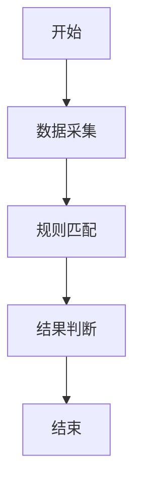
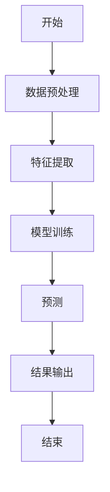
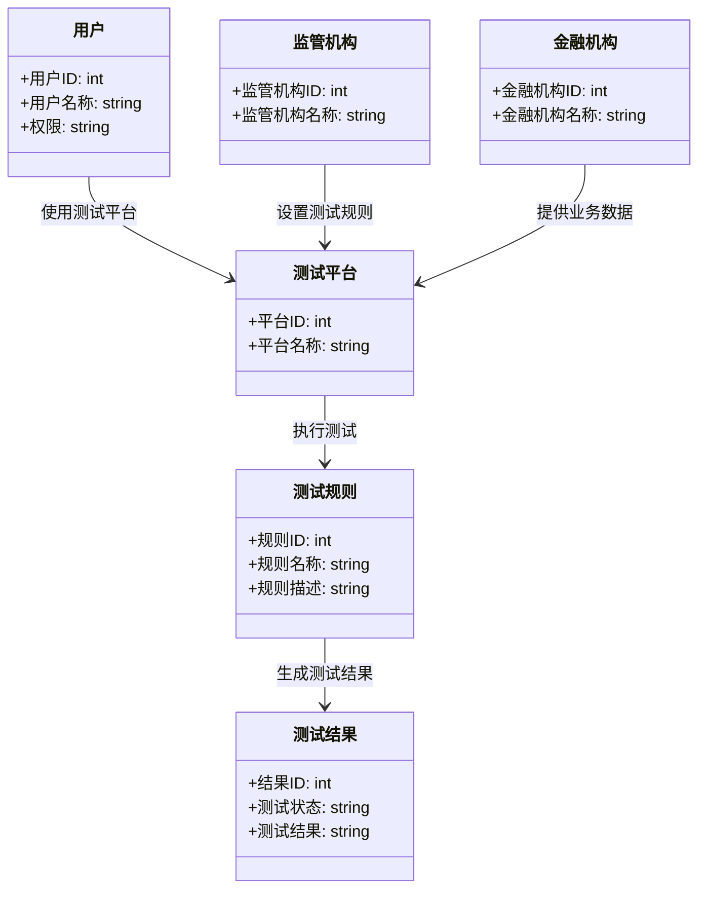

                 


# 《金融监管合规自动化测试平台》

---

## 关键词

- 金融监管  
- 合规测试  
- 自动化测试  
- 规则引擎  
- 系统架构  

---

## 摘要

随着金融行业的快速发展，监管合规的重要性日益凸显。传统的人工合规测试方式效率低下、成本高昂，且容易出现疏漏。为了解决这一问题，本文提出了一种基于自动化技术的金融监管合规测试平台。该平台通过规则引擎、人工智能算法和系统架构设计，实现了对金融机构的业务数据和行为的自动化合规测试，大幅提高了监管效率和准确性。本文详细介绍了平台的核心概念、算法原理、系统架构、项目实现以及最佳实践，为金融行业的自动化合规测试提供了理论和实践指导。

---

# 第一部分：金融监管合规自动化测试平台的背景与概念

---

## 第1章：金融监管合规自动化测试平台概述

### 1.1 问题背景与问题描述

#### 1.1.1 金融监管的重要性与挑战

金融监管是维护金融市场稳定、保护投资者利益的重要手段。随着金融业务的复杂化和多样化，监管机构需要面对海量的业务数据和复杂的合规要求。传统的监管方式依赖于人工审查，存在效率低、成本高、主观性强且容易出错的问题。

#### 1.1.2 传统合规测试的痛点与局限性

- **效率低下**：人工测试需要大量时间，难以应对高频交易和海量数据的监管需求。
- **成本高昂**：需要大量专业人员进行合规审查，企业负担沉重。
- **主观性**：人工测试依赖于测试人员的经验和判断，容易出现疏漏或偏差。
- **滞后性**：传统测试方式难以实现实时监控，导致问题发现不及时。

#### 1.1.3 自动化测试的需求与目标

- **需求**：通过自动化技术实现对金融机构业务数据的实时监控和合规测试，提高监管效率和准确性。
- **目标**：构建一个智能化、自动化的合规测试平台，能够快速识别违规行为，降低监管成本，提升监管效果。

### 1.2 问题解决与边界定义

#### 1.2.1 自动化测试的解决方案

通过引入规则引擎、机器学习算法和自动化测试技术，构建一个智能化的合规测试平台，实现对金融机构业务数据的实时分析和合规判断。

#### 1.2.2 平台的功能边界与外延

- **功能边界**：平台主要负责合规测试、数据采集、规则引擎和结果报告。
- **外延**：平台不直接参与金融机构的业务操作，但可以通过接口与其他系统（如交易系统、数据管理系统）进行交互。

#### 1.2.3 核心要素与组成结构

- **核心要素**：
  - 数据采集模块：负责收集金融机构的业务数据。
  - 规则引擎模块：根据监管要求制定测试规则。
  - 自动化测试模块：执行合规测试并生成报告。
  - 结果报告模块：输出测试结果并提供改进建议。

---

## 第2章：核心概念与联系

### 2.1 核心概念原理

#### 2.1.1 金融监管的概念

金融监管是指监管机构对金融机构的业务行为、财务状况和市场行为进行监督和管理，以确保金融市场稳定运行。

#### 2.1.2 合规测试的概念

合规测试是指通过一定的方法和工具，验证金融机构的业务行为是否符合相关法律法规和监管要求。

#### 2.1.3 自动化测试的概念

自动化测试是通过计算机程序和工具，自动执行测试用例并生成测试结果的过程。

### 2.2 核心概念属性特征对比表格

| 概念       | 属性特征               |
|------------|------------------------|
| 金融监管   | 监管对象、监管规则、监管机构 |
| 合规测试   | 测试标准、测试方法、测试结果 |
| 自动化测试 | 测试自动化、规则引擎、日志记录 |

### 2.3 ER实体关系图（Mermaid）

```mermaid
erDiagram
    actor 用户 {
        +id 用户ID
        +name 用户名称
    }
    actor 监管机构 {
        +id 监管机构ID
        +name 监管机构名称
    }
    actor 金融机构 {
        +id 金融机构ID
        +name 金融机构名称
    }
    boundary 测试平台 {
        +id 平台ID
        +name 平台名称
    }
    entity 测试规则 {
        +id 规则ID
        +name 规则名称
        +description 规则描述
    }
    entity 测试结果 {
        +id 测试结果ID
        +status 测试状态
        +result 测试结果
    }
    user --> 测试平台 : 使用测试平台
    监管机构 --> 测试平台 : 设置测试规则
    金融机构 --> 测试平台 : 提供业务数据
    测试平台 --> 测试规则 : 执行测试
    测试规则 --> 测试结果 : 生成测试结果
```

---

## 第3章：算法原理讲解

### 3.1 算法原理概述

自动化测试平台的核心算法是基于规则引擎和分类算法的组合。规则引擎用于根据预设的监管规则进行初步判断，分类算法用于对异常行为进行深度分析。

### 3.2 规则引擎算法

#### 3.2.1 算法流程

1. **数据采集**：收集金融机构的业务数据。
2. **规则匹配**：根据预设的监管规则，对数据进行匹配。
3. **结果判断**：根据匹配结果生成合规判断。

#### 3.2.2 规则引擎流程图（Mermaid）



#### 3.2.3 规则引擎实现代码

```python
def rule_engine(data, rules):
    results = []
    for rule in rules:
        if data matches rule:
            results.append("合规")
        else:
            results.append("不合规")
    return results
```

---

### 3.3 分类算法

#### 3.3.1 分类算法原理

分类算法用于对异常行为进行深度分析。常用的分类算法包括决策树、随机森林和逻辑回归等。

#### 3.3.2 分类算法流程图（Mermaid）



#### 3.3.3 分类算法数学模型

分类算法的数学模型如下：

$$ P(y|x) = \frac{P(x|y)P(y)}{P(x)} $$

其中，$P(y|x)$ 是在已知 $x$ 的情况下，$y$ 的概率。

---

## 第4章：系统分析与架构设计

### 4.1 问题场景介绍

金融机构需要实时监控其业务行为，确保其符合监管要求。传统的人工监管方式效率低下，难以应对高频交易和海量数据的监管需求。

### 4.2 项目介绍

本项目旨在构建一个金融监管合规自动化测试平台，通过规则引擎和分类算法实现对金融机构业务数据的自动化合规测试。

### 4.3 系统功能设计

#### 4.3.1 领域模型类图（Mermaid）



### 4.4 系统架构设计

#### 4.4.1 系统架构图（Mermaid）

```mermaid
container 测试平台 {
    component 数据采集模块 {
        数据采集接口
    }
    component 规则引擎模块 {
        规则匹配接口
    }
    component 分类算法模块 {
        分类预测接口
    }
    component 结果报告模块 {
        结果输出接口
    }
}
```

---

## 第5章：项目实战

### 5.1 环境安装

#### 5.1.1 Python环境安装

安装Python和必要的库：

```bash
pip install python-dotenv scikit-learn pandas numpy
```

### 5.2 系统核心实现

#### 5.2.1 数据采集模块

```python
import pandas as pd

def collect_data():
    data = pd.read_csv("data.csv")
    return data
```

#### 5.2.2 规则引擎模块

```python
def rule_engine(data, rules):
    results = []
    for rule in rules:
        if data.matches(rule):
            results.append("合规")
        else:
            results.append("不合规")
    return results
```

---

## 第6章：最佳实践

### 6.1 小结

通过构建金融监管合规自动化测试平台，可以显著提高监管效率和准确性。本文详细介绍了平台的核心概念、算法原理、系统架构和项目实现，为金融行业的自动化合规测试提供了参考。

### 6.2 注意事项

- 确保数据安全和隐私保护。
- 定期更新规则和算法，以适应监管要求的变化。
- 提供良好的用户界面和操作指南，方便用户使用。

### 6.3 拓展阅读

- 推荐阅读《自动化测试实战》和《金融监管技术》等书籍。
- 关注行业动态，了解最新的监管技术和合规要求。

---

## 附录

### 附录A：常用工具和技术

- Python编程语言
- Scikit-learn机器学习库
- Pandas数据处理库
- Mermaid图表工具

### 附录B：参考文献

- [1] 《自动化测试技术》
- [2] 《金融监管合规指南》
- [3] 《机器学习实战》

---

## 结束语

金融监管合规自动化测试平台的建设是一个复杂而重要的任务。通过本文的介绍，读者可以深入了解平台的核心技术和实现方法。未来，随着技术的不断发展，自动化测试平台将在金融监管领域发挥越来越重要的作用。

---

