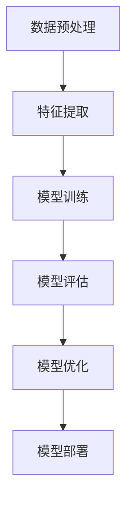
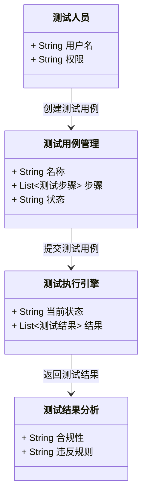

                 


# 《金融监管合规自动化测试平台》

---

## 关键词

- 金融监管
- 合规测试
- 自动化测试
- 系统架构
- 机器学习
- 平台设计

---

## 摘要

随着金融行业的快速发展，监管合规的重要性日益凸显。金融监管合规自动化测试平台通过技术手段，利用自动化测试、机器学习和系统架构设计等技术，实现对金融机构业务的智能化监管和合规测试。本文详细探讨了该平台的核心概念、算法原理、系统架构设计以及项目实战，并结合实际案例进行深入分析，旨在为金融机构提供一套高效、可靠的监管合规解决方案。

---

## 目录大纲

---

### 第一部分：背景介绍

#### 第1章：问题背景与平台概述

##### 1.1 问题背景
- 1.1.1 金融行业监管的重要性
- 1.1.2 传统合规测试的痛点
- 1.1.3 自动化测试的需求与优势

##### 1.2 问题描述
- 1.2.1 合规测试的核心要求
- 1.2.2 传统测试模式的局限性
- 1.2.3 平台的目标与范围

##### 1.3 问题解决思路
- 1.3.1 自动化测试的实现路径
- 1.3.2 平台的设计原则
- 1.3.3 关键技术与工具的选择

##### 1.4 概念结构与核心要素
- 1.4.1 平台的核心功能模块
- 1.4.2 关键技术与工具
- 1.4.3 平台的边界与外延

---

### 第二部分：核心概念与联系

#### 第2章：核心概念解析

##### 2.1 核心概念原理
- 2.1.1 自动化测试的基本原理
- 2.1.2 金融监管规则的数字化表示
- 2.1.3 平台的智能化处理机制

##### 2.2 概念属性特征对比
- 使用表格对比传统测试与自动化测试的特征

##### 2.3 ER实体关系图
- 使用 Mermaid 绘制平台的实体关系图

```mermaid
er
  actor: 测试人员
  entity: 测试用例
  entity: 测试结果
  entity: 监管规则
  entity: 金融机构
  entity: 系统日志

  actor --> 测试用例: 创建测试用例
  测试用例 --> 测试结果: 执行测试
  测试结果 --> 监管规则: 验证合规性
  测试结果 --> 金融机构: 提供合规报告
  系统日志 --> 测试人员: 记录测试过程
```

---

### 第三部分：算法原理

#### 第3章：算法原理与实现

##### 3.1 算法原理
- 3.1.1 机器学习在测试用例生成中的应用
- 3.1.2 自然语言处理（NLP）在监管规则解析中的应用
- 3.1.3 基于规则的测试用例生成算法

##### 3.2 算法流程图
- 使用 Mermaid 绘制机器学习模型训练流程图



##### 3.3 算法实现代码示例
- 使用 Python 实现测试用例生成算法

```python
import numpy as np
from sklearn import svm

# 数据预处理
X = np.array([[1, 2], [3, 4], [5, 6]])
y = np.array([0, 1, 0])

# 模型训练
model = svm.SVC()
model.fit(X, y)

# 模型预测
print(model.predict([[7, 8]]))
```

##### 3.4 数学模型与公式
- 测试用例生成的数学模型

$$
\text{模型预测} = \text{sign}(w \cdot x + b)
$$

---

### 第四部分：系统分析与架构设计

#### 第4章：系统分析与架构设计

##### 4.1 问题场景介绍
- 金融机构合规测试的具体场景
- 平台需要解决的痛点
- 系统的输入输出描述

##### 4.2 项目介绍
- 平台的功能目标
- 项目范围与约束
- 项目的关键成功因素

##### 4.3 系统功能设计
- 使用 Mermaid 绘制领域模型类图



##### 4.4 系统架构设计
- 使用 Mermaid 绘制系统架构图


##### 4.5 系统接口设计
- 使用 Mermaid 绘制系统接口设计图

```mermaid
sequence
    测试人员 -> API Gateway: 提交测试请求
    API Gateway -> 服务网关: 转发请求
    服务网关 -> 测试用例管理服务: 获取测试用例
    测试用例管理服务 -> 测试执行引擎: 执行测试
    测试执行引擎 -> 测试结果分析: 分析结果
    测试结果分析 -> 数据存储: 存储结果
    数据存储 -> API Gateway: 返回结果
    API Gateway -> 测试人员: 显示结果
```

---

### 第五部分：项目实战

#### 第5章：项目实战

##### 5.1 环境安装与配置
- 安装 Python、JDK、IDE 等开发环境
- 安装必要的依赖库（如 requests, pytest, numpy）

##### 5.2 核心功能实现
- 实现测试用例管理模块
- 实现测试执行引擎模块
- 实现测试结果分析模块

##### 5.3 代码实现与解读
- 测试用例管理模块代码示例

```python
class TestCaseManager:
    def __init__(self):
        self.test_cases = []

    def create TestCase(self, name, steps):
        self.test_cases.append(TestCase(name, steps))

    def get TestCase(self, index):
        return self.test_cases[index]

    class TestCase:
        def __init__(self, name, steps):
            self.name = name
            self.steps = steps
```

- 测试执行引擎模块代码示例

```python
class TestExecutionEngine:
    def execute TestCase(self, test_case):
        # 执行测试步骤并返回结果
        pass
```

##### 5.4 案例分析与结果解读
- 实际案例分析
- 测试结果解读与合规报告生成

##### 5.5 项目小结
- 项目实现的关键点总结
- 项目成果与意义

---

### 第六部分：最佳实践与总结

#### 第6章：最佳实践

##### 6.1 小结
- 项目总结与经验分享

##### 6.2 注意事项
- 数据安全与隐私保护
- 系统性能优化
- 测试用例的维护与更新

##### 6.3 拓展阅读
- 推荐相关技术书籍与资源
- 未来研究方向与技术趋势

---

## 结语

通过本篇文章的详细分析与探讨，我们系统地介绍了《金融监管合规自动化测试平台》的核心概念、算法原理、系统架构设计以及项目实战。希望读者能够通过本文，掌握该平台的设计与实现方法，并能够在实际工作中应用这些技术，提升金融监管的合规性与效率。

