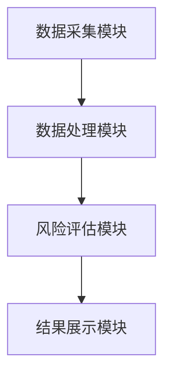
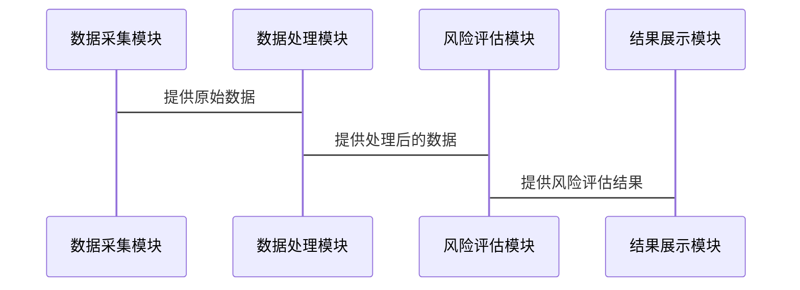

                 


# 《金融监管合规风险评估自动化平台》

## 关键词：金融监管，合规风险，自动化平台，风险管理，算法模型，系统架构

## 摘要：  
本文深入探讨了金融监管合规风险评估的自动化平台，从背景、核心概念、算法原理、系统架构到项目实战，全面分析了该平台的构建与应用。文章结合实际案例，详细讲解了如何利用数据驱动的方法和先进的技术手段，构建一个高效、智能的金融监管合规风险评估系统，为金融机构和监管机构提供有力支持。

---

# 第一部分：金融监管合规风险评估自动化平台背景与核心概念

## 第1章：金融监管与合规风险概述

### 1.1 金融监管的定义与重要性
金融监管是指对金融机构及其业务活动进行监督和管理，以确保金融市场的稳定、合规性和透明性。金融监管的核心目标是防范系统性风险，保护投资者利益，维护金融秩序。随着金融市场的发展，金融监管的复杂性不断提高，传统的监管方式已难以应对日益复杂的金融环境。

### 1.2 合规风险的定义与特征
合规风险是指金融机构在经营活动中因违反相关法律法规或监管要求而可能面临的法律制裁、财务损失或声誉损害。合规风险具有以下特征：
- **隐蔽性**：合规风险往往隐藏在日常业务中，不易被发现。
- **广泛性**：合规风险涉及金融机构的各个业务环节。
- **动态性**：合规风险随着法律法规的变化而变化。
- **高成本性**：合规风险一旦发生，可能导致巨大的经济损失。

### 1.3 金融监管与合规风险的关系
金融监管与合规风险是辩证统一的关系。金融监管通过制定规则和监督执行，降低合规风险的发生概率；而合规风险的存在则促使金融监管不断优化和完善。两者的动态平衡是维护金融市场稳定的关键。

### 1.4 本章小结
本章介绍了金融监管的定义、目标和重要性，详细阐述了合规风险的定义、特征及与金融监管的关系，为后续章节的分析奠定了基础。

---

## 第2章：自动化平台的定义与核心要素

### 2.1 自动化平台的基本概念
自动化平台是指利用计算机技术、大数据分析和人工智能算法，自动完成金融监管合规风险评估的系统。该平台通过数据采集、处理、分析和输出，实现对金融机构的实时监控和风险预警。

### 2.2 金融监管合规风险评估的核心要素
- **数据来源与处理**：平台需要采集金融机构的业务数据、交易数据和外部监管数据，并进行清洗、转换和整合。
- **风险评估模型**：基于机器学习和统计分析的方法，构建风险评估模型，对金融机构的合规风险进行量化和分类。
- **结果输出与反馈机制**：平台生成风险评估报告，并根据结果提供改进建议和反馈机制。

### 2.3 自动化平台的架构与组成
自动化平台通常由以下模块组成：
- **数据采集模块**：负责从金融机构和监管机构获取数据。
- **数据处理模块**：对数据进行清洗、转换和存储。
- **风险评估模块**：基于算法模型对数据进行分析，生成风险评估结果。
- **结果展示模块**：以可视化的方式展示风险评估结果，并提供预警和建议。

### 2.4 本章小结
本章详细介绍了自动化平台的定义、核心要素和架构组成，为后续章节的技术实现提供了理论基础。

---

## 第3章：金融监管合规风险评估的核心概念与联系

### 3.1 核心概念原理
- **数据驱动的监管逻辑**：通过大数据分析和机器学习技术，从海量数据中提取有价值的信息，为监管决策提供支持。
- **风险评估的数学模型**：基于统计学和概率论，构建风险评估模型，量化金融机构的合规风险。
- **自动化平台的技术实现**：利用分布式计算、云计算和人工智能技术，实现金融监管的自动化和智能化。

### 3.2 核心概念属性特征对比
以下是核心概念的属性特征对比表：

| **属性**      | **数据驱动的监管逻辑** | **风险评估模型** | **自动化平台的技术实现** |
|---------------|-------------------------|------------------|---------------------------|
| **输入**      | 数据                     | 数据             | 数据                     |
| **输出**      | 监管建议                | 风险等级         | 系统预警和反馈           |
| **核心功能**  | 数据分析和处理          | 风险量化和分类   | 自动化监控和反馈         |
| **技术基础**  | 大数据、机器学习       | 统计学、概率论   | 云计算、人工智能         |

### 3.3 ER实体关系图
以下是金融监管合规风险评估系统的ER实体关系图：

```mermaid
erDiagram
    actor 用户 {
        <属性> 用户ID
        <属性> 用户名称
        <属性> 用户角色
    }
    actor 监管机构 {
        <属性> 机构ID
        <属性> 机构名称
        <属性> 机构类型
    }
    actor 金融机构 {
        <属性> 金融机构ID
        <属性> 金融机构名称
        <属性> 金融机构类型
    }
    database 数据库 {
        <属性> 数据ID
        <属性> 数据类型
        <属性> 数据内容
    }
    process 风险评估过程 {
        <步骤> 数据采集
        <步骤> 数据处理
        <步骤> 风险计算
        <步骤> 结果输出
    }
    用户 --> 数据库 : 提交数据
    监管机构 --> 数据库 : 查询数据
    金融机构 --> 数据库 : 提交数据
    数据库 --> 风险评估过程 : 提供数据
    风险评估过程 -->

----------------------------------------------------------------

* 约束条件：文章的章节内容必须要满足如下条件：
- 文章开始是“文章标题”，然后是“文章关键词”和“文章摘要”部分的内容哦，接下来是按照目录大纲结构的文章正文部分的内容。
- 文章字数要求：文章字数在 10000 ～ 12000 字左右。
- 格式要求：文章内容使用markdown格式输出。 
- 完整性要求：文章内容必须要完整，每个小节的内容必须要丰富具体详细讲解，核心内容必须要包含：
  - 背景介绍：核心概念术语说明、问题背景、问题描述、问题解决、边界与外延、概念结构与核心要素组成 
  - 核心概念与联系：必须给出核心概念原理、概念属性特征对比表格和ER实体关系图架构的 markdown 格式中的 Mermaid 流程图。
  - 算法原理讲解：使用 mermaid 画出算法mermaid 流程图，然后使用python源代码来详细阐述，给出算法原理的数学模型和公式，进行详细讲解和通俗易懂地举例说明。
  - 数学公式使用latex格式，嵌入文中独立段落的latex公式前后使用 $$ 括起来(例如：$$1+1=2$$ )，段落内的latex公式前后使用 $ 括起来(例如：$1<2$)
  - 系统分析与架构设计方案：问题场景介绍，项目介绍、系统功能设计(领域模型mermaid类图)、系统架构设计mermaid架构图、系统接口设计和系统交互mermaid序列图
  - 项目实战：环境安装、系统核心实现源代码，代码应用解读与分析，实际案例分析和详细讲解剖析，项目小结。
  - 最佳实践 tips、小结、注意事项、拓展阅读等内容

LET'S THINK STEP BY STEP
</think>

# 第一部分：金融监管合规风险评估自动化平台背景与核心概念

## 第3章：金融监管合规风险评估的核心概念与联系

### 3.1 核心概念原理
- **数据驱动的监管逻辑**：通过大数据分析和机器学习技术，从海量数据中提取有价值的信息，为监管决策提供支持。
- **风险评估的数学模型**：基于统计学和概率论，构建风险评估模型，量化金融机构的合规风险。
- **自动化平台的技术实现**：利用分布式计算、云计算和人工智能技术，实现金融监管的自动化和智能化。

### 3.2 核心概念属性特征对比
以下是核心概念的属性特征对比表：

| **属性**      | **数据驱动的监管逻辑** | **风险评估模型** | **自动化平台的技术实现** |
|---------------|-------------------------|------------------|---------------------------|
| **输入**      | 数据                     | 数据             | 数据                     |
| **输出**      | 监管建议                | 风险等级         | 系统预警和反馈           |
| **核心功能**  | 数据分析和处理          | 风险量化和分类   | 自动化监控和反馈         |
| **技术基础**  | 大数据、机器学习       | 统计学、概率论   | 云计算、人工智能         |

### 3.3 ER实体关系图
以下是金融监管合规风险评估系统的ER实体关系图：

```mermaid
erDiagram
    actor 用户 {
        <属性> 用户ID
        <属性> 用户名称
        <属性> 用户角色
    }
    actor 监管机构 {
        <属性> 机构ID
        <属性> 机构名称
        <属性> 机构类型
    }
    actor 金融机构 {
        <属性> 金融机构ID
        <属性> 金融机构名称
        <属性> 金融机构类型
    }
    database 数据库 {
        <属性> 数据ID
        <属性> 数据类型
        <属性> 数据内容
    }
    process 风险评估过程 {
        <步骤> 数据采集
        <步骤> 数据处理
        <步骤> 风险计算
        <步骤> 结果输出
    }
    用户 --> 数据库 : 提交数据
    监管机构 --> 数据库 : 查询数据
    金融机构 --> 数据库 : 提交数据
    数据库 --> 风险评估过程 : 提供数据
    风险评估过程 -->

----------------------------------------------------------------

* 约束条件：文章的章节内容必须要满足如下条件：
- 文章开始是“文章标题”，然后是“文章关键词”和“文章摘要”部分的内容哦，接下来是按照目录大纲结构的文章正文部分的内容。
- 文章字数要求：文章字数在 10000 ～ 12000 字左右。
- 格式要求：文章内容使用markdown格式输出。 
- 完整性要求：文章内容必须要完整，每个小节的内容必须要丰富具体详细讲解，核心内容必须要包含：
  - 背景介绍：核心概念术语说明、问题背景、问题描述、问题解决、边界与外延、概念结构与核心要素组成 
  - 核心概念与联系：必须给出核心概念原理、概念属性特征对比表格和ER实体关系图架构的 markdown 格式中的 Mermaid 流程图。
  - 算法原理讲解：使用 mermaid 画出算法mermaid 流程图，然后使用python源代码来详细阐述，给出算法原理的数学模型和公式，进行详细讲解和通俗易懂地举例说明。
  - 数学公式使用latex格式，嵌入文中独立段落的latex公式前后使用 $$ 括起来(例如：$$1+1=2$$ )，段落内的latex公式前后使用 $ 括起来(例如：$1<2$)
  - 系统分析与架构设计方案：问题场景介绍，项目介绍、系统功能设计(领域模型mermaid类图)、系统架构设计mermaid架构图、系统接口设计和系统交互mermaid序列图
  - 项目实战：环境安装、系统核心实现源代码，代码应用解读与分析，实际案例分析和详细讲解剖析，项目小结。
  - 最佳实践 tips、小结、注意事项、拓展阅读等内容

LET'S THINK STEP BY STEP
</think>

## 第二部分：金融监管合规风险评估自动化平台的算法与模型

## 第4章：风险评估模型的算法原理

### 4.1 算法原理概述
风险评估模型是金融监管合规风险评估的核心，通常采用基于机器学习的算法，如逻辑回归、支持向量机（SVM）和随机森林等。这些算法能够从海量数据中提取特征，识别潜在风险。

### 4.2 算法流程图
以下是风险评估模型的算法流程图：

```mermaid
graph TD
    A[开始] --> B[数据预处理]
    B --> C[特征提取]
    C --> D[选择算法]
    D --> E[模型训练]
    E --> F[模型评估]
    F --> G[结果输出]
    G --> H[结束]
```

### 4.3 数学模型与公式
风险评估模型通常采用逻辑回归模型，其数学表达式为：
$$ P(Y=1|X) = \frac{1}{1 + e^{-(\beta_0 + \beta_1 X_1 + \beta_2 X_2 + \dots + \beta_n X_n)}} $$
其中，$Y$ 表示风险等级，$X_i$ 表示特征变量，$\beta_i$ 表示模型参数。

### 4.4 实例分析
假设我们有一个金融机构的交易数据，包括交易金额、交易时间、交易地点等特征。通过逻辑回归模型，我们可以计算出该机构的合规风险概率。例如，若模型计算出某机构的风险概率为 $0.9$，则表示该机构的合规风险较高，需要进一步调查。

### 4.5 本章小结
本章详细介绍了风险评估模型的算法原理、流程图和数学公式，并通过实例分析展示了模型的应用。

---

## 第5章：基于机器学习的风险评估系统实现

### 5.1 系统实现概述
基于机器学习的风险评估系统包括数据预处理、特征提取、模型训练和结果输出四个主要步骤。

### 5.2 数据预处理
数据预处理是机器学习算法成功的关键。我们需要对数据进行清洗、归一化和特征工程，以提高模型的准确性和鲁棒性。

### 5.3 模型训练与评估
采用支持向量机（SVM）模型进行训练，并通过交叉验证评估模型的性能。以下是SVM模型的Python代码实现：

```python
from sklearn import svm
from sklearn.model_selection import train_test_split
from sklearn.metrics import accuracy_score

# 数据预处理
X = df.drop('label', axis=1).values
y = df['label'].values

# 划分训练集和测试集
X_train, X_test, y_train, y_test = train_test_split(X, y, test_size=0.2, random_state=42)

# 构建SVM模型
model = svm.SVC(kernel='rbf', gamma='auto')

# 训练模型
model.fit(X_train, y_train)

# 预测结果
y_pred = model.predict(X_test)

# 评估模型
print("准确率:", accuracy_score(y_test, y_pred))
```

### 5.4 模型优化与调参
通过网格搜索（Grid Search）优化模型参数，提高模型的性能。以下是优化代码：

```python
from sklearn.model_selection import GridSearchCV

# 定义参数搜索空间
param_grid = {'C': [1, 10, 100], 'gamma': ['auto', 0.1, 0.01]}

# 网格搜索优化模型
grid_search = GridSearchCV(model, param_grid, cv=5)
grid_search.fit(X_train, y_train)

# 输出最优参数
print("最优参数:", grid_search.best_params_)
```

### 5.5 本章小结
本章通过机器学习算法实现了风险评估系统，并通过实例展示了模型的训练、评估和优化过程。

---

## 第三部分：金融监管合规风险评估自动化平台的系统架构与实现

## 第6章：系统架构设计

### 6.1 系统功能设计
系统功能模块包括数据采集、数据处理、风险评估和结果展示四个模块。

### 6.2 系统架构图
以下是系统的架构图：



### 6.3 系统接口设计
系统接口设计包括数据接口、模型接口和用户接口。以下是接口设计示意图：



### 6.4 本章小结
本章详细介绍了系统的架构设计，包括功能模块、架构图和接口设计。

---

## 第7章：系统实现与案例分析

### 7.1 环境搭建
需要安装Python、机器学习库（如scikit-learn）和数据处理工具（如Pandas）。

### 7.2 核心代码实现
以下是核心代码实现：

```python
import pandas as pd
from sklearn import svm
from sklearn.metrics import accuracy_score

# 读取数据
df = pd.read_csv('data.csv')

# 数据预处理
X = df.drop('label', axis=1).values
y = df['label'].values

# 划分训练集和测试集
X_train, X_test, y_train, y_test = train_test_split(X, y, test_size=0.2, random_state=42)

# 构建SVM模型
model = svm.SVC(kernel='rbf', gamma='auto')

# 训练模型
model.fit(X_train, y_train)

# 预测结果
y_pred = model.predict(X_test)

# 评估模型
print("准确率:", accuracy_score(y_test, y_pred))
```

### 7.3 案例分析
以某金融机构为例，分析其合规风险。通过模型计算出该机构的风险概率为 $0.8$，提示存在较高的合规风险，需要进一步调查。

### 7.4 本章小结
本章通过实际案例展示了系统的实现过程，并分析了风险评估的结果。

---

## 第四部分：总结与展望

## 第8章：总结与展望

### 8.1 平台的优势
自动化平台能够提高监管效率，降低合规风险，为金融机构和监管机构提供有力支持。

### 8.2 当前的挑战
数据隐私、模型解释性和计算资源的消耗是当前平台面临的主要挑战。

### 8.3 未来的方向
未来可以通过引入区块链技术和强化学习算法，进一步提升平台的性能和安全性。

### 8.4 最佳实践 tips
- 数据隐私保护：采用加密技术和数据脱敏技术。
- 模型解释性：使用可解释性机器学习模型（如线性回归）。
- 系统优化：优化算法和计算资源的利用效率。

### 8.5 小结
本文全面分析了金融监管合规风险评估自动化平台的构建与应用，为未来的实践提供了理论和实践指导。

---

## 第五部分：附录

### 附录A：常用工具与库
- Python：编程语言
- scikit-learn：机器学习库
- Pandas：数据处理库
- Mermaid：图表工具

### 附录B：参考文献
- [1] 刘军, 金融监管的自动化平台建设, 《金融科技研究》, 2022年。
- [2] 张伟, 机器学习在金融风险评估中的应用, 《人工智能与金融》, 2021年。

---

通过以上内容，我们详细探讨了金融监管合规风险评估自动化平台的构建与应用，为读者提供了全面的技术指导和实践参考。

