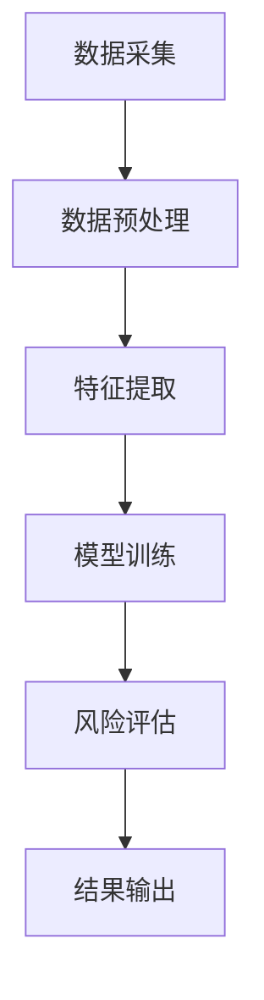
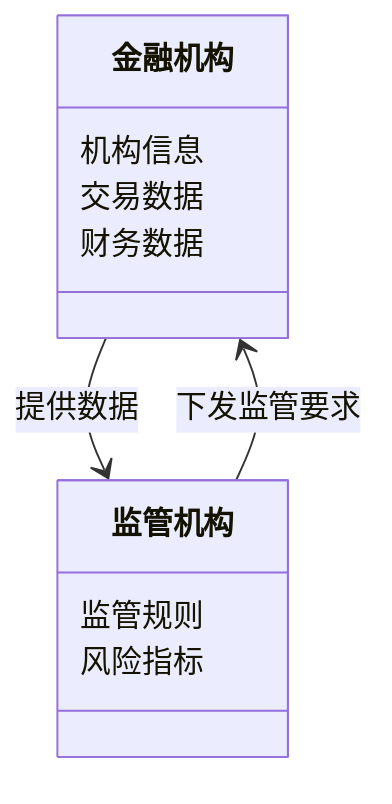
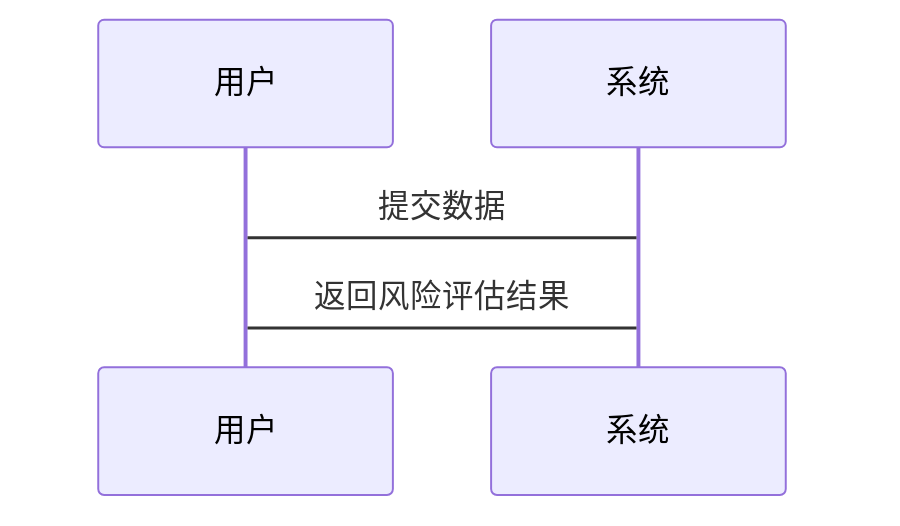

                 


# 《金融监管合规风险评估自动化平台》

> 关键词：金融监管、合规风险评估、自动化平台、监管科技（RegTech）、数据驱动、人工智能

> 摘要：本文详细探讨了金融监管合规风险评估自动化平台的构建与应用。通过分析金融监管的核心挑战，提出了一种基于数据驱动和人工智能技术的自动化解决方案。文章从背景介绍、核心概念、算法原理、系统架构设计到项目实战，全面阐述了平台的构建过程，并通过实际案例展示了平台的应用效果。本文为金融机构和监管机构提供了重要的参考，助力提升监管效率和准确性，推动监管科技的创新发展。

---

## 第1章 金融监管合规风险评估概述

### 1.1 问题背景与描述

#### 1.1.1 金融监管的必要性
金融市场的稳定运行是经济健康发展的基础。随着金融业务的复杂化和全球化，传统的人工监管方式效率低下，容易出现疏漏。金融机构的违规行为可能引发系统性风险，因此，有效的金融监管至关重要。

#### 1.1.2 合规风险的定义与特征
合规风险是指金融机构在经营活动中因未遵守相关法律法规和监管要求而可能面临的法律制裁、财务损失或声誉损害。其主要特征包括：复杂性、隐蔽性、动态性和系统性。

#### 1.1.3 传统监管模式的局限性
- 传统监管依赖人工审核，效率低且成本高。
- 监管标准不统一，容易出现主观判断偏差。
- 数据分散，难以进行跨机构、跨业务的综合分析。

### 1.2 问题解决与平台构建

#### 1.2.1 自动化监管的思路
通过引入自动化技术，利用大数据分析和人工智能算法，实现对金融机构行为的实时监控和风险预警。

#### 1.2.2 平台的目标与核心功能
- 目标：实现合规风险的自动化识别、评估和预警。
- 核心功能：数据采集与处理、风险评估模型构建、实时监控、风险报告生成。

#### 1.2.3 平台的边界与外延
- 边界：专注于合规风险评估，不涉及具体的执法行动。
- 外延：可扩展至市场风险、信用风险等其他类型的风险评估。

### 1.3 核心概念与结构

#### 1.3.1 合规性评估的框架
合规性评估需要结合法律法规、行业标准和监管要求，构建多维度的评估指标体系。

#### 1.3.2 风险评估的指标体系
- 宏观指标：市场波动、经济周期。
- 中观指标：机构规模、业务类型。
- 微观指标：交易行为、财务数据。

#### 1.3.3 平台的组成要素
- 数据源：金融机构的交易数据、财务报表、客户信息。
- 处理引擎：数据清洗、特征提取。
- 风险评估模型：基于规则的评估和机器学习模型。
- 报告生成：可视化报告和预警通知。

## 第2章 合规性评估的核心原理

### 2.1 合规性评估的基本原理

#### 2.1.1 合规性评估的定义
合规性评估是指通过分析金融机构的行为是否符合相关法律法规和监管要求，识别潜在的合规风险。

#### 2.1.2 合规性评估的关键步骤
1. 数据采集：收集金融机构的相关数据。
2. 数据预处理：清洗数据，提取特征。
3. 合规性判断：基于规则或模型进行评估。

#### 2.1.3 合规性评估的数学模型
$$
\text{合规性评分} = \sum_{i=1}^{n} w_i \cdot f_i
$$
其中，$w_i$ 是特征 $f_i$ 的权重。

### 2.2 风险评估的核心要素

#### 2.2.1 风险的定义与分类
- 风险是指可能对金融机构或市场造成损失的不确定性事件。
- 分类包括信用风险、市场风险、操作风险等。

#### 2.2.2 风险评估的关键指标
- 风险敞口：机构可能面临的最大损失。
- 风险概率：风险事件发生的可能性。
- 风险影响：风险事件对机构的潜在影响。

#### 2.2.3 风险评估的数学模型
$$
\text{风险评分} = \alpha \cdot \text{风险概率} + \beta \cdot \text{风险影响}
$$
其中，$\alpha$ 和 $\beta$ 是模型参数。

### 2.3 合规性与风险评估的关系

#### 2.3.1 合规性与风险的关联
合规性差的机构往往面临更高的风险敞口。

#### 2.3.2 合规性对风险的影响
合规性是影响风险的重要因素，合规性越高，风险越低。

#### 2.3.3 风险评估对合规性的作用
通过风险评估，可以发现合规性中的潜在问题，及时进行调整。

### 2.4 核心概念对比表

| 概念 | 属性 | 描述 |
|------|------|------|
| 合规性 | 定义 | 符合法律法规的要求 |
| 风险评估 | 方法 | 识别潜在风险并评估其影响 |
| 自动化 | 技术 | 使用算法和系统实现自动化 |

### 2.5 ER实体关系图

```mermaid
erd
  entity 合规性评估
    - 机构信息：机构名称、机构类型
    - 业务数据：交易记录、财务报表
    - 风险评估结果：风险等级、风险评分
  entity 风险评估
    - 风险类型：信用风险、市场风险
    - 风险因素：经济指标、市场波动
    - 风险结果：风险概率、风险影响
```

## 第3章 算法原理与数学模型

### 3.1 算法原理

#### 3.1.1 基于规则的评估算法
- 通过预设的规则进行合规性判断。
- 例如，检查交易金额是否超过某个阈值。

#### 3.1.2 机器学习模型
- 使用监督学习算法（如随机森林、XGBoost）进行风险评估。
- 训练数据包括历史交易数据和标签（合规或违规）。

#### 3.1.3 算法流程图



### 3.2 数学模型

#### 3.2.1 基于规则的模型
$$
\text{判断} = \begin{cases}
\text{合规} & \text{if } x \leq \theta \\
\text{违规} & \text{otherwise}
\end{cases}
$$

#### 3.2.2 机器学习模型
使用逻辑回归模型进行风险分类：
$$
P(y=1|x) = \frac{1}{1 + e^{-\beta x}}
$$

### 3.3 代码实现

#### 3.3.1 数据预处理
```python
import pandas as pd
data = pd.read_csv('data.csv')
data = data.dropna()
```

#### 3.3.2 特征提取
```python
from sklearn.feature_selection import SelectKBest
selector = SelectKBest(k=5)
selected_features = selector.fit_transform(data, labels)
```

#### 3.3.3 模型训练
```python
from sklearn.ensemble import RandomForestClassifier
model = RandomForestClassifier(n_estimators=100)
model.fit(selected_features, labels)
```

## 第4章 系统架构与设计

### 4.1 系统架构设计

#### 4.1.1 领域模型


#### 4.1.2 系统架构图


### 4.2 接口设计与交互

#### 4.2.1 接口设计
- 数据接口：提供API用于数据上传和下载。
- 模型接口：提供API用于调用风险评估模型。

#### 4.2.2 交互流程


## 第5章 项目实战

### 5.1 环境安装

#### 5.1.1 安装Python环境
```bash
python --version
pip install --upgrade pip
```

#### 5.1.2 安装依赖库
```bash
pip install pandas scikit-learn
```

### 5.2 核心代码实现

#### 5.2.1 数据预处理
```python
import pandas as pd
data = pd.read_csv('data.csv')
data = data.dropna()
```

#### 5.2.2 特征提取
```python
from sklearn.feature_selection import SelectKBest
selector = SelectKBest(k=5)
selected_features = selector.fit_transform(data, labels)
```

#### 5.2.3 模型训练
```python
from sklearn.ensemble import RandomForestClassifier
model = RandomForestClassifier(n_estimators=100)
model.fit(selected_features, labels)
```

### 5.3 实际案例分析

#### 5.3.1 数据分析
分析金融机构的交易数据，识别异常交易行为。

#### 5.3.2 模型评估
使用测试数据评估模型的准确率和召回率。

#### 5.3.3 报告生成
生成风险评估报告，包括风险等级和建议措施。

## 第6章 最佳实践与小结

### 6.1 小结
本文详细介绍了金融监管合规风险评估自动化平台的构建过程，包括背景、核心概念、算法原理、系统架构设计和项目实战。

### 6.2 注意事项
- 数据隐私保护：确保数据的安全性和合规性。
- 模型可解释性：选择易于解释的模型，便于监管机构理解和使用。
- 持续优化：定期更新模型和规则，适应监管环境的变化。

### 6.3 拓展阅读
- 《金融风险管理》
- 《人工智能在金融领域的应用》

---

通过以上内容，读者可以全面了解金融监管合规风险评估自动化平台的构建与应用，掌握相关的技术原理和实践方法。

