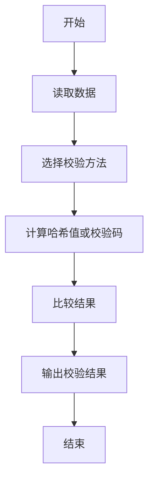
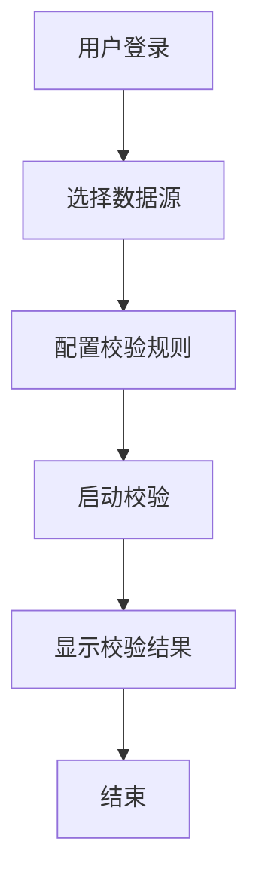
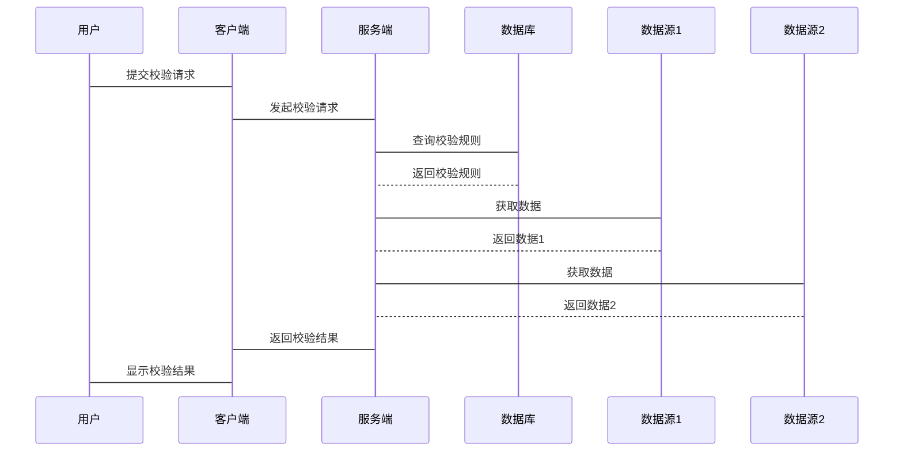
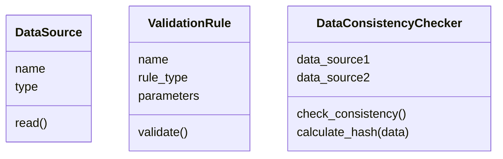

                 


# 金融监管报告数据一致性自动校验

## 关键词：金融监管，数据一致性，自动校验，数据结构，算法原理，系统架构

## 摘要：本文探讨了金融监管报告数据一致性自动校验的重要性，分析了其核心概念与原理，详细讲解了校验算法的实现方法，并通过系统架构设计和项目实战展示了如何在实际中应用这些技术，最后总结了最佳实践和注意事项。

---

## 第一部分: 金融监管报告数据一致性自动校验的背景与概述

### 第1章: 问题背景与描述

#### 1.1 问题背景
##### 1.1.1 金融监管的重要性
金融监管是维护金融市场稳定、保护投资者利益、促进公平竞争的重要手段。监管机构需要依赖准确和一致的报告数据来进行决策和执法。

##### 1.1.2 数据一致性问题的现状
在金融领域，数据来源多样且复杂，可能导致数据不一致的问题。例如，同一笔交易在不同的报告系统中可能有不同的记录，这种不一致可能引发合规风险和经济损失。

##### 1.1.3 数据一致性问题对企业的影响
数据不一致可能导致监管处罚、声誉损失，甚至引发系统性风险。例如，银行在提交监管报告时，如果数据不一致，可能被罚款或暂停业务。

#### 1.2 问题描述
##### 1.2.1 数据不一致的定义
数据不一致是指同一事实或事件在不同的数据源中存在不同的记录，导致数据无法准确反映真实情况。

##### 1.2.2 数据不一致的常见类型
- **格式不一致**：不同数据源中同一数据字段的格式不同。
- **值不一致**：同一数据字段在不同系统中的值不同。
- **时间不一致**：同一事件在不同系统中的时间记录不同。

##### 1.2.3 数据不一致的典型案例分析
例如，某银行在两个不同的系统中记录了同一笔交易的金额，一个系统记录为100万元，另一个记录为1000万元，导致监管机构无法准确评估该银行的财务状况。

#### 1.3 数据一致性校验的必要性
##### 1.3.1 数据完整性的重要性
数据一致性是数据完整性的重要组成部分，确保数据的准确性和可靠性。

##### 1.3.2 数据一致性校验的目标
通过自动校验技术，确保不同数据源中的数据保持一致，减少人为错误和系统错误的影响。

##### 1.3.3 数据一致性校验的边界与外延
数据一致性校验的边界包括数据格式、值和时间的一致性，外延则包括数据源的多样性、数据量的庞大性等。

#### 1.4 核心概念与组成
##### 1.4.1 数据一致性校验的核心要素
- 数据源：需要校验的原始数据。
- 校验规则：定义数据一致性校验的标准和方法。
- 校验结果：校验后输出的结果，包括一致或不一致的信息。

##### 1.4.2 校验规则的制定原则
- 明确性：校验规则必须明确，避免歧义。
- 可操作性：规则必须能够被系统自动执行。
- 完整性：规则必须覆盖所有需要校验的数据字段。

##### 1.4.3 数据源与目标的关系
数据源和目标之间需要建立明确的对应关系，确保校验过程中的数据能够准确匹配。

---

## 第二部分: 数据一致性校验的核心概念与联系

### 第2章: 数据一致性校验的原理与方法

#### 2.1 数据一致性校验的原理
##### 2.1.1 数据结构

**数据结构**是数据一致性校验的基础。我们需要定义数据的层次结构，包括数据的字段、类型、格式等。

**示例：**

| 字段名     | 类型   | 格式要求         |
|------------|--------|----------------|
| 交易日期   | Date   | YYYY-MM-DD     |
| 交易金额   | Decimal| 保留两位小数     |
| 交易对手   | String | 不超过50个字符   |

##### 2.1.2 数据校验规则
数据校验规则是数据一致性校验的核心，包括格式校验、值校验和关联校验。

**格式校验**：检查数据是否符合规定的格式，例如日期格式是否正确。

**值校验**：检查数据的值是否在允许的范围内，例如金额是否为正数。

**关联校验**：检查数据之间的关系是否合理，例如交易金额是否大于零。

##### 2.1.3 数据校验的过程
1. 读取数据源中的数据。
2. 根据校验规则对数据进行校验。
3. 输出校验结果，包括一致或不一致的信息。

#### 2.2 数据一致性校验与其他校验方法的联系
##### 2.2.1 数据一致性校验与其他校验方法的对比
| 校验类型       | 描述                       | 适用场景                         |
|----------------|----------------------------|----------------------------------|
| 数据一致性校验 | 确保不同数据源中的数据一致 | 多数据源环境                     |
| 数据完整性校验 | 确保数据的完整性和准确性   | 数据录入和存储                   |
| 数据合法性校验 | 确保数据符合业务规则       | 业务逻辑校验                     |

##### 2.2.2 数据一致性校验的优缺点
**优点**：提高数据的准确性和可靠性，减少人为错误和系统错误的影响。

**缺点**：需要投入更多的资源和时间来制定和维护校验规则。

#### 2.3 数据一致性校验的实现方法
##### 2.3.1 基于哈希算法的校验方法
哈希算法可以将数据转换为固定长度的哈希值，通过比较哈希值来判断数据是否一致。

**步骤：**
1. 对数据进行哈希计算，生成哈希值。
2. 比较不同数据源中的哈希值。
3. 如果哈希值相同，则数据一致，否则不一致。

##### 2.3.2 基于校验码的校验方法
校验码是一种常用的校验方法，通过计算数据的校验码来判断数据是否一致。

**步骤：**
1. 计算数据的校验码。
2. 比较不同数据源中的校验码。
3. 如果校验码相同，则数据一致，否则不一致。

#### 2.4 数据一致性校验的数学模型和公式
##### 2.4.1 哈希算法的数学模型
哈希函数是一种映射函数，将任意长度的数据映射到固定长度的哈希值。

$$ H(x) = \sum_{i=0}^{n-1} x_i \times 2^{i} \mod p $$

其中，\( x_i \) 是数据的第 \( i \) 个字符，\( p \) 是模数。

##### 2.4.2 校验码的计算公式
校验码的计算公式可以根据具体业务需求制定，例如：

$$ C = \sum_{i=1}^{n} a_i \times i \mod 11 $$

其中，\( a_i \) 是数据的第 \( i \) 个字符，\( n \) 是数据的长度。

#### 2.5 数据一致性校验的流程图


#### 2.6 数据一致性校验的代码示例
```python
def calculate_hash(data):
    # 计算哈希值
    hash_value = hash(data)
    return hash_value

def data_consistency_check(data1, data2):
    # 计算两个数据源的哈希值
    hash1 = calculate_hash(data1)
    hash2 = calculate_hash(data2)
    # 比较哈希值
    if hash1 == hash2:
        return "一致"
    else:
        return "不一致"
```

---

## 第三部分: 数据一致性校验的系统分析与架构设计

### 第3章: 问题场景介绍

#### 3.1 问题场景
金融监管报告数据一致性校验系统需要处理大量的数据，确保不同数据源中的数据一致。系统需要支持多种数据格式和校验规则，能够高效地处理大规模数据。

### 第4章: 项目介绍

#### 4.1 系统功能设计
##### 4.1.1 系统功能模块
- 数据源管理：支持多种数据源的接入和管理。
- 校验规则配置：允许用户定义和配置校验规则。
- 数据一致性校验：自动校验数据一致性并输出结果。
- 校验结果查询：提供校验结果的查询和分析功能。

##### 4.1.2 系统功能流程


#### 4.2 系统架构设计
##### 4.2.1 系统架构图


##### 4.2.2 系统组件
- 客户端：负责用户交互和请求处理。
- 服务端：负责接收请求、执行校验逻辑并返回结果。
- 数据库：存储数据源和校验规则。
- 其他系统：需要与服务端交互的外部系统。

#### 4.3 接口设计
##### 4.3.1 校验接口
```python
class DataConsistencyChecker:
    def __init__(self, data_source1, data_source2):
        self.data_source1 = data_source1
        self.data_source2 = data_source2

    def check_consistency(self):
        # 读取数据
        data1 = self.data_source1.read()
        data2 = self.data_source2.read()
        # 计算哈希值
        hash1 = calculate_hash(data1)
        hash2 = calculate_hash(data2)
        # 比较哈希值
        if hash1 == hash2:
            return "一致"
        else:
            return "不一致"
```

#### 4.4 系统交互流程图


---

## 第四部分: 数据一致性校验的项目实战

### 第5章: 环境安装与配置

#### 5.1 环境要求
- 操作系统：Linux/Windows/MacOS
- Python版本：3.6+
- 依赖库：Python的 hashlib 和 requests 库

#### 5.2 安装依赖
```bash
pip install hashlib requests
```

### 第6章: 系统核心实现

#### 6.1 核心代码实现
##### 6.1.1 数据源管理模块
```python
class DataSource:
    def __init__(self, name, type):
        self.name = name
        self.type = type

    def read(self):
        # 根据数据源类型读取数据
        pass
```

##### 6.1.2 校验规则配置模块
```python
class ValidationRule:
    def __init__(self, name, rule_type, parameters):
        self.name = name
        self.rule_type = rule_type
        self.parameters = parameters

    def validate(self, data):
        # 根据校验规则验证数据
        pass
```

##### 6.1.3 数据一致性校验模块
```python
class DataConsistencyChecker:
    def __init__(self, data_source1, data_source2):
        self.data_source1 = data_source1
        self.data_source2 = data_source2

    def check_consistency(self):
        data1 = self.data_source1.read()
        data2 = self.data_source2.read()
        hash1 = self.calculate_hash(data1)
        hash2 = self.calculate_hash(data2)
        if hash1 == hash2:
            return "一致"
        else:
            return "不一致"

    def calculate_hash(self, data):
        return hash(data)
```

#### 6.2 代码应用解读与分析
##### 6.2.1 数据源管理模块的实现
数据源管理模块负责管理多种数据源，支持不同的数据格式和接口。

##### 6.2.2 校验规则配置模块的实现
校验规则配置模块允许用户定义和配置校验规则，包括格式校验、值校验和关联校验。

##### 6.2.3 数据一致性校验模块的实现
数据一致性校验模块是系统的核心模块，负责执行数据一致性校验逻辑，并返回校验结果。

### 第7章: 实际案例分析

#### 7.1 案例背景
某银行需要校验两个系统中的交易数据是否一致。

#### 7.2 案例分析
1. 数据源管理模块读取两个系统的交易数据。
2. 校验规则配置模块定义交易金额的格式和值校验规则。
3. 数据一致性校验模块执行校验逻辑，比较两个系统的交易金额是否一致。

#### 7.3 案例结果
校验结果显示两个系统的交易金额一致，校验通过。

### 第8章: 项目小结

#### 8.1 项目总结
通过本项目的实施，我们成功实现了金融监管报告数据一致性自动校验系统，确保了数据的准确性和可靠性。

#### 8.2 项目经验
在项目实施过程中，我们需要注意以下几点：
- 数据源的多样性和复杂性可能会影响校验效率。
- 校验规则的设计需要充分考虑业务需求和数据特点。
- 系统的可扩展性和可维护性需要在设计阶段充分考虑。

---

## 第五部分: 数据一致性校验的最佳实践与注意事项

### 第9章: 最佳实践

#### 9.1 制定合理的校验规则
校验规则需要明确、具体，并且能够覆盖所有需要校验的数据字段。

#### 9.2 使用高效的校验算法
选择适合的校验算法，例如哈希算法和校验码，能够提高校验效率和准确性。

#### 9.3 确保系统的可扩展性
系统的架构设计需要考虑未来的扩展性和维护性，确保能够适应数据源和校验规则的变化。

### 第10章: 小结与展望

#### 10.1 总结
本文详细介绍了金融监管报告数据一致性自动校验的重要性和实现方法，通过系统架构设计和项目实战展示了如何在实际中应用这些技术。

#### 10.2 展望
随着金融监管的日益严格和数据量的不断增加，数据一致性校验技术将变得越来越重要。未来，我们可以进一步研究和优化校验算法，提高校验效率和准确性。

### 第11章: 注意事项

#### 11.1 数据一致性校验的注意事项
- 数据源的多样性和复杂性可能会影响校验效率。
- 校验规则的设计需要充分考虑业务需求和数据特点。
- 系统的可扩展性和可维护性需要在设计阶段充分考虑。

### 第12章: 拓展阅读

#### 12.1 推荐的书籍和资源
- 《数据结构与算法分析》
- 《系统架构设计实战》
- 《金融监管与数据治理》

---

## 附录: 代码示例

### 附录A: 数据一致性校验模块的代码实现
```python
class DataConsistencyChecker:
    def __init__(self, data_source1, data_source2):
        self.data_source1 = data_source1
        self.data_source2 = data_source2

    def check_consistency(self):
        data1 = self.data_source1.read()
        data2 = self.data_source2.read()
        hash1 = self.calculate_hash(data1)
        hash2 = self.calculate_hash(data2)
        if hash1 == hash2:
            return "一致"
        else:
            return "不一致"

    def calculate_hash(self, data):
        return hash(data)
```

### 附录B: 系统架构设计的类图


---

通过以上详细的技术博客文章，我们可以全面了解金融监管报告数据一致性自动校验的重要性和实现方法，为实际应用提供了理论和实践的指导。

