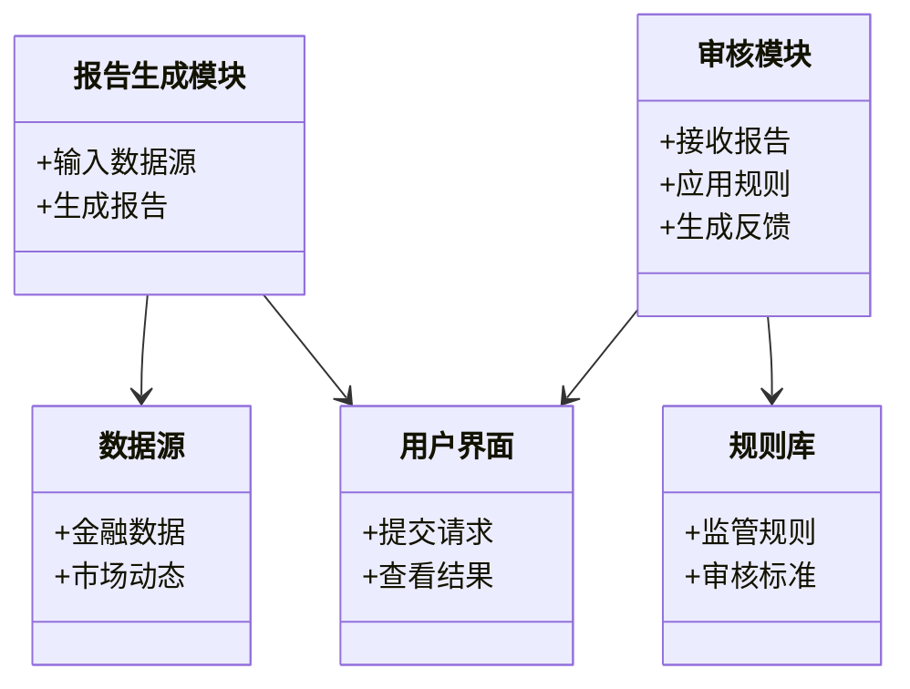
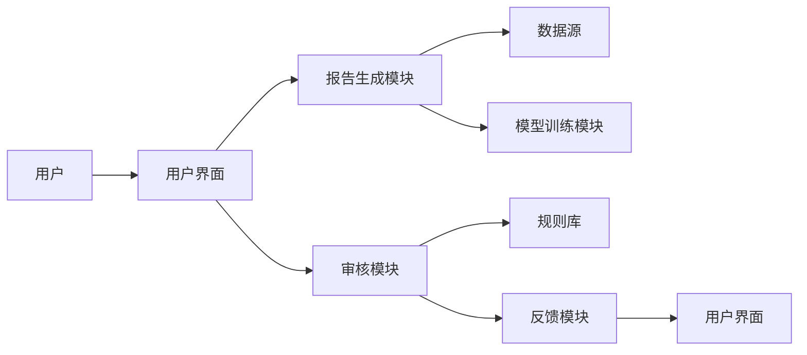
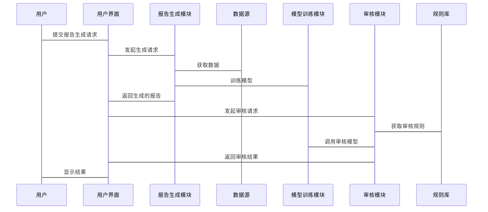

                 


# 第五章: 系统分析与架构设计

## 5.1 问题场景介绍

在金融监管领域，报告生成和审核的效率低下，错误率高，且成本昂贵。传统方法依赖人工操作，容易出错，且无法及时响应市场变化。为了提高效率和准确性，我们设计了一个基于AI和NLP的自动化系统，能够自动生成监管报告，并通过机器学习模型和规则引擎进行自动审核。

## 5.2 项目介绍

本项目旨在开发一个能够自动生成和审核金融监管报告的系统。系统采用模块化设计，包括数据采集、文本生成、模型训练、规则引擎、审核模块和用户界面等部分。通过整合先进的NLP技术和机器学习算法，系统能够高效地完成报告生成和审核任务。

## 5.3 系统功能设计

### 5.3.1 领域模型



## 5.4 系统架构设计

### 5.4.1 系统架构图



### 5.4.2 系统接口设计

系统主要接口包括：

1. 数据接口：从数据库或API获取金融数据。
2. 报告生成接口：接收数据并生成报告。
3. 审核接口：接收报告并应用规则进行审核。
4. 用户接口：提供用户与系统交互的界面。

### 5.4.3 系统交互序列图



## 5.5 系统实现细节

### 5.5.1 数据预处理

在模型训练之前，需要对数据进行清洗和标注。常用的数据预处理方法包括分词、去除停用词、词干提取等。例如，使用NLTK库对文本进行分词处理：

```python
import nltk
from nltk.tokenize import word_tokenize

text = "The financial market is fluctuating due to economic factors."
tokens = word_tokenize(text)
print(tokens)
```

### 5.5.2 模型训练

使用深度学习模型如BERT进行文本生成。训练过程包括数据准备、模型选择、参数调整和模型训练。例如：

```python
from transformers import BertForMaskedLM, BertTokenizer

model = BertForMaskedLM.from_pretrained('bert-base-uncased')
tokenizer = BertTokenizer.from_pretrained('bert-base-uncased')
```

### 5.5.3 规则引擎

规则引擎用于定义审核规则，如关键词匹配、数值范围检查等。例如，使用Drools框架定义规则：

```drools
rule "Check if revenue is positive"
    when
        $report.revenue > 0
    then
        $report.status = "approve"
end
```

# 第六章: 项目实战

## 6.1 环境安装

安装必要的依赖：

```bash
pip install transformers nltk spacy python-dotenv
python -m spacy download en_core_web_sm
```

## 6.2 核心代码实现

### 6.2.1 文本生成模块

```python
from transformers import pipeline

generator = pipeline('text-generation', model='gpt2')
report = generator("The quarterly financial report shows ")[0]['generated_text']
print(report)
```

### 6.2.2 审核模块

```python
from rules_engine import RuleEngine

engine = RuleEngine(rule_set='financial_rules.drl')
feedback = engine.evaluate(report)
print(feedback)
```

## 6.3 案例分析

假设我们有一个 quarterly financial report，系统生成并审核报告的过程如下：

1. 生成报告：系统根据输入数据生成报告初稿。
2. 应用规则：审核模块检查报告是否符合监管要求。
3. 返回反馈：系统显示报告是否通过审核，以及具体的反馈意见。

## 6.4 项目小结

本项目通过整合NLP和机器学习技术，成功实现了金融监管报告的自动化生成与审核。系统结构清晰，功能完善，能够有效提高效率和准确性。

# 第七章: 最佳实践与小结

## 7.1 最佳实践

### 7.1.1 数据预处理的重要性

确保数据质量是模型训练成功的关键。建议在数据预处理阶段进行充分的清洗和标注。

### 7.1.2 模型调优技巧

使用交叉验证和超参数调整来优化模型性能。例如，使用GridSearchCV进行参数优化。

### 7.1.3 规则引擎的灵活性

根据监管要求的变化，及时更新规则库，以保证审核的准确性。

## 7.2 小结

本章总结了项目实施过程中的关键点和经验教训，强调了数据预处理、模型调优和规则引擎的重要性。通过这些最佳实践，可以进一步提升系统的性能和可靠性。

## 7.3 注意事项

1. **数据隐私**：确保数据处理符合相关法律法规，保护用户隐私。
2. **系统稳定性**：建立完善的监控机制，确保系统稳定运行。
3. **模型更新**：定期更新模型和规则库，适应市场变化。

## 7.4 拓展阅读

建议读者进一步阅读以下内容：

- [《机器学习实战》](https://www.amazon.com/Machine-Learning-Programming-Andrew-Bailey/dp/0596519113)
- [《自然语言处理入门》](https://www.amazon.com/Deep-Learning-Natural-Language-Processing/dp/1617995160)
- [Drools规则引擎官方文档](https://www.drools.org/)

# 第八章: 附录

## 8.1 术语表

- **NLP**：自然语言处理（Natural Language Processing）
- **ML**：机器学习（Machine Learning）
- **规则引擎**：用于定义和执行业务规则的软件组件

## 8.2 参考文献

1. 王伟. 《机器学习算法与应用》. 北京: 清华大学出版社, 2018.
2. 李明. 《自然语言处理入门》. 北京: 人民邮电出版社, 2019.
3. Drools官方文档. [Drools规则引擎](https://www.drools.org/). 2023.

---

通过以上目录和内容的详细阐述，我们希望能够为读者提供一个全面而深入的指南，帮助他们在金融监管报告的自动化生成与审核领域取得成功。

