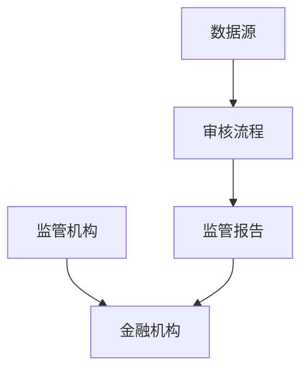
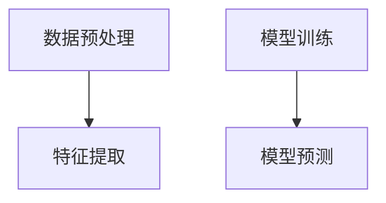
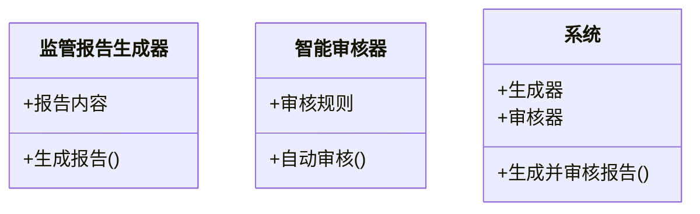
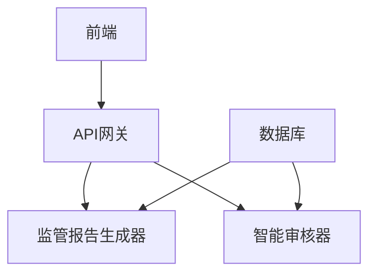

                 


# 《金融监管报告自动化生成与审核系统》

> **关键词**：金融监管，自然语言处理，机器学习，知识图谱，自动化审核，合规报告  
>
> **摘要**：本文探讨了如何利用自然语言处理（NLP）、机器学习和金融知识图谱等技术，实现金融监管报告的自动化生成与审核。文章从背景、核心概念、算法原理、系统架构到项目实战，全面解析了这一系统的构建过程，并通过实际案例展示了其应用价值。

---

## 第一章: 金融监管报告自动化生成与审核系统背景介绍

### 1.1 问题背景与描述

#### 1.1.1 传统金融监管报告的痛点
- **手动编写与审核效率低**：传统金融监管报告通常由人工编写和审核，耗时长且效率低下，尤其是在处理大量报告时。
- **易出错且耗时**：由于人为因素，报告中容易出现错误，且审核过程繁琐，容易遗漏关键信息。
- **标准化程度低**：不同机构的报告格式和内容可能存在差异，导致难以统一标准。

#### 1.1.2 金融监管的重要性
- **监管合规性**：金融监管是确保市场秩序、保护投资者利益的重要手段。
- **风险控制**：通过监管报告及时发现和处理风险点，防止金融市场的波动。
- **保护投资者利益**：确保金融机构的透明度和合规性，维护投资者的权益。

#### 1.1.3 问题解决
- **自动化生成与审核的目标**：通过技术手段实现监管报告的自动化生成和智能审核，提高效率、降低成本、减少错误。
- **边界与外延**：系统主要处理监管报告的生成和审核，不涉及具体的金融交易处理或其他业务。

### 1.2 核心概念与联系

#### 1.2.1 核心概念原理
- **自然语言处理（NLP）**：用于处理和理解文本数据，提取关键信息。
- **机器学习**：通过模型训练，实现分类、预测等任务。
- **金融知识图谱**：构建金融领域的知识库，帮助理解实体关系。

#### 1.2.2 核心概念对比表格
| 概念       | 特性                       |
|------------|----------------------------|
| 自然语言处理 | 文本处理、实体识别         |
| 机器学习    | 数据训练、模式识别         |
| 金融知识图谱 | 实体关联、规则引擎         |

#### 1.2.3 ER实体关系图


---

## 第二章: 核心概念与联系

### 2.1 核心概念原理

#### 2.1.1 自然语言处理
- **文本预处理**：包括分词、去除停用词等。
- **语义分析**：理解文本中的实体和关系。

#### 2.1.2 机器学习
- **数据特征提取**：从文本中提取有用的特征。
- **模型训练**：使用训练数据训练分类模型。

#### 2.1.3 金融知识图谱
- **实体识别**：识别文本中的金融实体。
- **关系抽取**：提取实体之间的关系。

### 2.2 算法原理讲解

#### 2.2.1 算法流程图


#### 2.2.2 代码实现
```python
import numpy as np
from sklearn.feature_extraction.text import TfidfVectorizer
from sklearn.svm import SVC

# 示例数据
texts = ["机构A的业务符合监管要求", "机构B存在合规问题"]
labels = [0, 1]

# 特征提取
vectorizer = TfidfVectorizer()
X = vectorizer.fit_transform(texts)

# 模型训练
model = SVC()
model.fit(X, labels)

# 预测
new_text = "机构C的业务合规"
X_new = vectorizer.transform([new_text])
print(model.predict(X_new))
```

#### 2.2.3 数学公式
- **条件概率公式**：$P(y|x) = \frac{P(x|y)P(y)}{P(x)}$
- **损失函数**：$L = -\sum_{i} y_i \log(p_i) + (1-y_i)\log(1-p_i)$

---

## 第三章: 系统分析与架构设计

### 3.1 系统分析

#### 3.1.1 问题场景介绍
- 系统需要处理大量的监管报告，实现自动化生成和审核。

### 3.2 项目介绍

#### 3.2.1 系统功能设计
- **监管报告生成**：自动生成符合要求的监管报告。
- **智能审核**：使用模型自动审核报告内容。

#### 3.2.2 领域模型类图


#### 3.2.3 系统架构设计


---

## 第四章: 项目实战

### 4.1 环境安装
- **Python 3.8+**
- **Jupyter Notebook**
- **Scikit-learn、NLTK**

### 4.2 核心实现

#### 4.2.1 代码实现
```python
from sklearn.pipeline import Pipeline
from sklearn.feature_extraction.text import CountVectorizer
from sklearn.svm import LinearSVC

pipeline = Pipeline([
    ('vect', CountVectorizer()),
    ('clf', LinearSVC())
])

pipeline.fit(X_train, y_train)
print(pipeline.predict(X_test))
```

#### 4.2.2 代码解读
- **数据预处理**：使用`CountVectorizer`提取文本特征。
- **模型训练**：使用`LinearSVC`进行分类。

### 4.3 实际案例分析
- **案例分析**：通过实际案例展示系统的应用效果。

---

## 第五章: 最佳实践

### 5.1 小结
- 系统实现的要点和注意事项。

### 5.2 注意事项
- 数据质量的重要性
- 模型调优的必要性

### 5.3 拓展阅读
- 推荐相关书籍和论文。

---

## 结语

通过以上章节的详细解析，我们了解了金融监管报告自动化生成与审核系统的构建过程。从背景分析到技术实现，再到系统设计和项目实战，这一系统展示了技术与金融监管的深度融合，为提高监管效率提供了有力支持。

--- 

# 《金融监管报告自动化生成与审核系统》至此全部内容完成。

