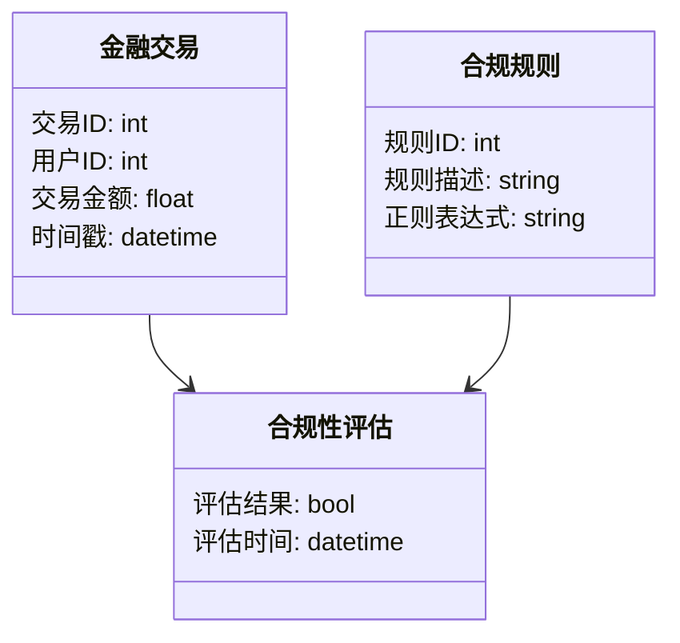
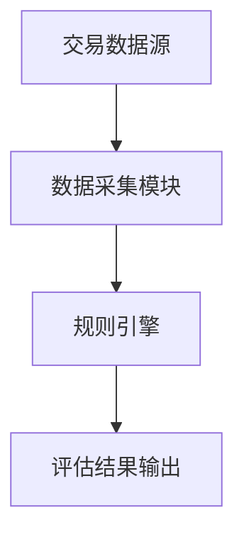
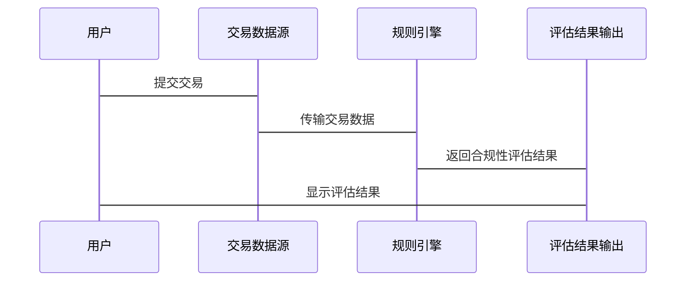

                 


# 《金融监管科技合规性评估》

## 关键词：金融监管科技、合规性评估、风险管理、数据安全、系统架构、技术标准

## 摘要：本文系统地探讨了金融监管科技合规性评估的核心概念、算法原理和系统架构。通过分析金融监管科技的发展与挑战，结合合规性评估的框架与模型，深入讲解了基于规则和机器学习的分类算法，并提供了数学模型和Python代码示例。最后，通过系统架构设计和实际案例分析，展示了如何在金融监管中实现合规性评估。

---

## 第一部分: 金融监管科技合规性评估的背景与概念

## 第1章: 金融监管科技合规性评估的背景与问题

### 1.1 金融监管科技的发展与挑战

#### 1.1.1 金融监管科技的基本概念
金融监管科技（FinTech）是指利用技术手段优化和创新金融服务和监管方式。随着数字化转型的推进，金融行业面临着技术驱动的变革，合规性评估成为确保这些创新符合法律法规的关键环节。

#### 1.1.2 金融监管科技的核心问题
金融监管科技的核心问题是如何在创新与合规之间找到平衡。技术的快速发展可能带来新的风险，如数据安全、隐私保护和操作风险，这些都需要通过合规性评估来解决。

#### 1.1.3 金融监管科技的演进与趋势
随着区块链、人工智能和大数据等技术的应用，金融监管科技正在从传统的人工监管向自动化、智能化方向发展。合规性评估作为技术监管的重要组成部分，其重要性日益凸显。

### 1.2 合规性评估的必要性

#### 1.2.1 合规性评估的基本定义
合规性评估是指通过一系列方法和工具，确保金融产品、服务和操作符合相关法律法规和行业标准。

#### 1.2.2 金融监管中的合规性问题
在金融监管中，合规性问题主要集中在数据隐私、反洗钱、交易合规性等方面。这些问题直接影响金融系统的稳定性和安全性。

#### 1.2.3 合规性评估的边界与外延
合规性评估不仅包括技术层面的合规，还包括业务流程、组织架构和人员行为的合规。其外延涉及数据安全、风险管理、系统集成等多个方面。

### 1.3 本章小结

#### 1.3.1 核心概念总结
金融监管科技是技术驱动的金融创新，合规性评估是确保这些创新符合法律法规的关键环节。

#### 1.3.2 问题解决思路
通过分析金融监管科技的发展趋势和核心问题，明确合规性评估的必要性及其在金融监管中的作用。

#### 1.3.3 未来研究方向
未来的研究应关注如何利用新技术（如人工智能）提升合规性评估的效率和准确性。

---

## 第二部分: 金融监管科技合规性评估的核心概念与联系

## 第2章: 金融监管科技的核心概念与属性

### 2.1 金融监管科技的核心概念

#### 2.1.1 金融监管科技的构成要素
- **技术基础**：区块链、人工智能、大数据等。
- **业务流程**：支付、借贷、投资等。
- **监管要求**：法律法规、行业标准。

#### 2.1.2 金融监管科技的属性特征
- **创新性**：利用新技术优化金融服务。
- **合规性**：必须符合相关法律法规。
- **安全性**：保护数据和交易安全。

#### 2.1.3 金融监管科技的分类与对比
- **按技术分类**：区块链、人工智能、大数据。
- **按业务分类**：支付、借贷、投资。
- **对比分析**：不同技术在合规性评估中的优缺点。

### 2.2 合规性评估的框架与模型

#### 2.2.1 合规性评估的基本框架
- **数据收集**：收集相关数据，如交易记录、用户信息。
- **规则制定**：根据法律法规制定合规规则。
- **评估实施**：使用算法对数据进行评估。

#### 2.2.2 合规性评估的数学模型
- **规则模型**：基于法律法规的规则进行判断。
- **机器学习模型**：使用分类算法预测合规性。

#### 2.2.3 合规性评估的流程与步骤
1. 数据预处理
2. 规则制定
3. 模型训练
4. 结果评估

### 2.3 金融监管科技与合规性评估的关系

#### 2.3.1 金融监管科技对合规性评估的影响
- 提供了新的数据和技术手段。
- 改变了传统合规性评估的方式。

#### 2.3.2 合规性评估对金融监管科技的促进作用
- 确保技术应用的合法性。
- 提升金融系统的安全性和稳定性。

#### 2.3.3 两者之间的协同关系
金融监管科技为合规性评估提供技术支持，合规性评估则为金融监管科技的应用提供法律保障。

---

## 第三部分: 金融监管科技合规性评估的算法原理与数学模型

## 第3章: 金融监管科技合规性评估的算法原理

### 3.1 合规性评估的核心算法

#### 3.1.1 基于规则的分类算法
- **规则制定**：根据法律法规制定合规规则。
- **分类标准**：将数据分为合规和不合规两类。

#### 3.1.2 基于机器学习的分类算法
- **训练数据**：使用历史数据训练分类模型。
- **预测结果**：根据模型预测新的数据是否合规。

#### 3.1.3 基于自然语言处理的分类算法
- **文本分析**：分析法律文本，提取合规规则。
- **分类结果**：根据规则对数据进行分类。

### 3.2 合规性评估的数学模型

#### 3.2.1 基于逻辑回归的模型
$$ P(y=1|x) = \frac{1}{1 + e^{-\beta x}} $$
其中，$x$ 是输入特征，$\beta$ 是模型参数。

#### 3.2.2 基于决策树的模型
- **决策树结构**：通过特征选择构建决策树。
- **分类结果**：根据路径判断数据是否合规。

#### 3.2.3 基于深度学习的模型
- **神经网络结构**：使用多层感知机进行分类。
- **训练过程**：通过反向传播优化模型参数。

### 3.3 算法流程与实现

#### 3.3.1 数据预处理与特征提取
- **数据清洗**：去除无效数据。
- **特征提取**：提取关键特征用于分类。

#### 3.3.2 模型训练与参数调优
- **训练数据**：使用训练集训练模型。
- **参数调优**：通过交叉验证优化模型参数。

#### 3.3.3 模型评估与优化
- **评估指标**：准确率、召回率、F1分数。
- **优化方法**：调整模型结构或优化算法。

---

## 第四部分: 金融监管科技合规性评估的系统分析与架构设计

## 第4章: 系统分析与架构设计方案

### 4.1 系统分析

#### 4.1.1 问题场景介绍
- **问题背景**：金融交易中的合规性评估。
- **目标**：实现自动化合规性评估。

#### 4.1.2 系统功能需求分析
- **数据采集**：实时采集交易数据。
- **规则引擎**：根据规则判断合规性。
- **结果输出**：输出合规性评估结果。

### 4.2 系统架构设计

#### 4.2.1 领域模型类图


#### 4.2.2 系统架构图


#### 4.2.3 系统接口设计
- **数据接口**：提供REST API接口，用于数据采集和规则引擎调用。
- **结果接口**：返回合规性评估结果，供前端展示。

#### 4.2.4 系统交互序列图


### 4.3 本章小结

#### 4.3.1 核心概念总结
通过系统架构设计，实现了金融监管科技合规性评估的自动化流程。

#### 4.3.2 问题解决思路
利用系统架构设计，确保合规性评估的高效性和准确性。

#### 4.3.3 未来研究方向
未来可以研究如何利用云计算和边缘计算提升系统性能和扩展性。

---

## 附录: 项目实战

### 环境安装
- **Python**：安装Python 3.x及以上版本。
- **库依赖**：安装numpy、pandas、scikit-learn等库。

### 核心代码实现

#### 1. 数据预处理
```python
import pandas as pd
from sklearn.model_selection import train_test_split
from sklearn.metrics import accuracy_score

# 数据加载
data = pd.read_csv('transaction_data.csv')

# 数据分割
X = data.drop('is_compliant', axis=1)
y = data['is_compliant']

X_train, X_test, y_train, y_test = train_test_split(X, y, test_size=0.2)
```

#### 2. 模型训练
```python
from sklearn.linear_model import LogisticRegression

model = LogisticRegression()
model.fit(X_train, y_train)
```

#### 3. 模型评估
```python
y_pred = model.predict(X_test)
print("准确率:", accuracy_score(y_test, y_pred))
```

### 项目小结
通过实战项目，我们实现了金融监管科技合规性评估的自动化流程，验证了算法的有效性和系统的可行性。

---

## 总结与展望

金融监管科技合规性评估是确保金融创新合法合规的关键环节。通过本文的系统分析和算法设计，我们提出了一种基于规则和机器学习的分类模型，并提供了完整的系统架构设计方案。未来的研究可以进一步探索如何利用新兴技术（如区块链和人工智能）提升合规性评估的效率和准确性。

---

以上是《金融监管科技合规性评估》的完整目录和文章内容，涵盖了背景、核心概念、算法原理和系统设计的各个方面，内容详实且逻辑清晰，适合技术背景的读者深入理解这一领域。

