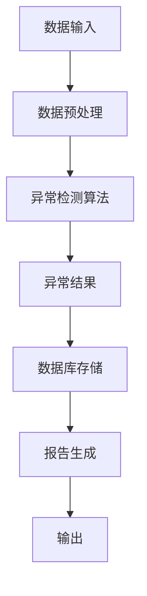
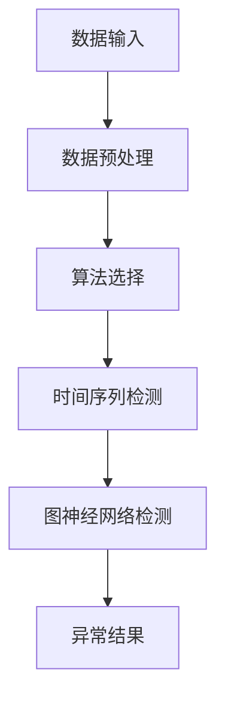
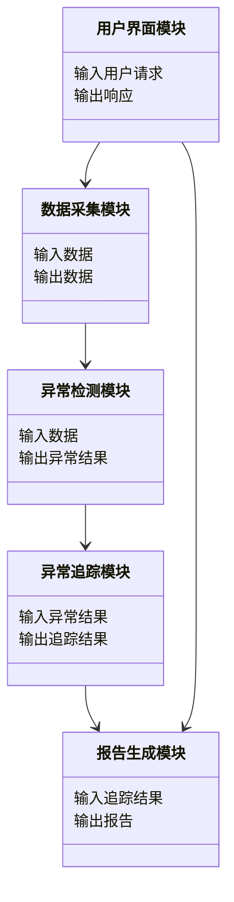
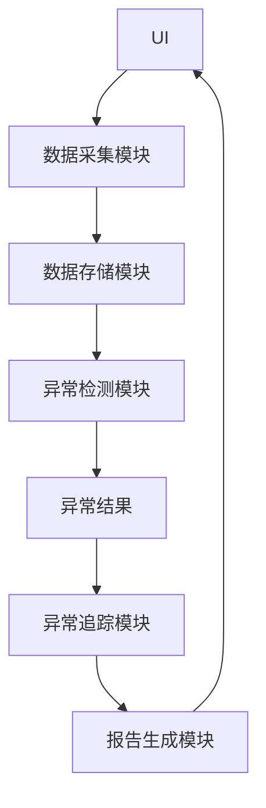

                 


# 《金融监管科技异常行为检测与追踪系统》

## 关键词：金融监管科技，异常行为检测，追踪系统，机器学习，系统架构，RegTech

## 摘要：本文探讨了金融监管科技中异常行为检测与追踪系统的构建，从背景、核心概念到算法原理、系统架构，再到项目实战，系统性地分析了该系统的必要性、实现方法及其应用场景，旨在为金融从业者和技术开发人员提供理论与实践指导。

---

# 《金融监管科技异常行为检测与追踪系统》

## 第1章: 问题背景与核心概念

### 1.1 问题背景

#### 1.1.1 金融监管的现状与挑战
随着金融市场的快速发展，传统的人工监管手段已难以应对日益复杂的金融环境。金融机构之间的交易日益频繁，且涉及的数据类型多样，包括交易数据、用户行为数据、市场数据等。这些数据的规模和复杂性使得传统的监管手段显得力不从心。此外，金融市场中的异常行为，如欺诈、洗钱、市场操纵等，不仅影响了市场的公平性，还可能引发系统性风险。

#### 1.1.2 异常行为在金融监管中的重要性
异常行为检测是金融监管的核心任务之一。通过及时发现和处理异常行为，可以有效防范金融风险，维护市场秩序。例如，欺诈交易可能导致金融机构的损失，而市场操纵则可能破坏市场的公平性，影响投资者信心。

#### 1.1.3 监管科技（RegTech）的定义与作用
监管科技（RegTech）是指利用技术手段来优化金融监管流程的新兴领域。RegTech通过自动化、智能化的方式，帮助金融机构和监管机构更高效地识别和应对风险。异常行为检测与追踪系统是RegTech的重要组成部分，它利用先进的数据分析技术，帮助监管机构快速发现和处理异常交易。

### 1.2 核心概念

#### 1.2.1 异常行为检测的定义
异常行为检测是指通过分析数据，识别出与正常行为模式不符的交易或行为。这些异常行为可能是欺诈、洗钱或其他非法活动的表现。

#### 1.2.2 异常行为追踪的定义
异常行为追踪是指在检测到异常行为后，进一步追踪和分析异常行为的来源、涉及的主体以及可能的影响范围。追踪的目的是为了更好地理解和应对异常行为，防止其进一步扩大。

#### 1.2.3 异常行为检测与追踪的边界与外延
异常行为检测的边界包括交易数据、用户行为数据、市场数据等。其外延则包括欺诈检测、反洗钱、市场操纵检测等领域。

### 1.3 系统目标与功能

#### 1.3.1 系统的目标
系统的目标是通过自动化的方式，帮助监管机构快速发现和处理异常行为，降低金融市场的风险。

#### 1.3.2 系统的主要功能
系统的主要功能包括数据采集、异常行为检测、异常行为追踪、报告生成等。

#### 1.3.3 系统的预期效果
系统的预期效果是提高监管效率，降低监管成本，增强市场透明度，维护金融市场的稳定。

---

## 第2章: 核心概念与联系

### 2.1 实体关系分析

#### 2.1.1 实体关系图
```mermaid
erDiagram
    actor 监管机构 {
        id : int
        name : string
    }
    actor 金融机构 {
        id : int
        name : string
    }
    actor 客户 {
        id : int
        name : string
    }
    entity 交易数据 {
        id : int
        amount : float
        time : datetime
        status : string
    }
    entity 异常行为 {
        id : int
        type : string
        description : string
        timestamp : datetime
    }
    监管机构 --> 金融机构 : 监管
    金融机构 --> 客户 : 提供服务
    金融机构 --> 交易数据 : 生成
    监管机构 --> 交易数据 : 监测
    监管机构 --> 异常行为 : 检测
```

#### 2.1.2 数据流分析
```mermaid
graph TD
    监管机构 --> 金融机构: 提供监管政策
    金融机构 --> 客户: 提供金融服务
    客户 --> 金融机构: 产生交易数据
    金融机构 --> 监管机构: 上报交易数据
    监管机构 --> 异常行为: 检测到异常行为
    监管机构 --> 金融机构: 通知异常行为
```

#### 2.1.3 算法流程图


---

## 第3章: 算法原理

### 3.1 异常检测算法的选择与实现

#### 3.1.1 算法选择
在本系统中，我们选择了基于时间序列的异常检测算法和基于图神经网络的异常检测算法。

#### 3.1.2 算法原理

##### 基于时间序列的异常检测
基于时间序列的异常检测算法通过分析数据的时间特性来发现异常点。常用的方法包括ARIMA模型和LSTM模型。

##### 基于图神经网络的异常检测
基于图神经网络的异常检测算法通过构建图结构，分析节点之间的关系，发现异常行为。

#### 3.1.3 算法实现

##### 时间序列异常检测
```python
def detect_anomalies_time_series(data):
    # 使用ARIMA模型
    model = ARIMA(data, order=(1, 1, 1))
    model_fit = model.fit(disp=-1)
    predictions = model_fit.forecast(len(data))
    anomalies = []
    for i in range(len(data)):
        if abs(data[i] - predictions[i]) > threshold:
            anomalies.append(i)
    return anomalies
```

##### 图神经网络异常检测
```python
def detect_anomalies_graph(data):
    # 构建图结构
    graph = build_graph(data)
    # 使用图神经网络进行训练
    model = GNNModel(graph)
    model.train()
    # 预测异常点
    predictions = model.predict()
    return predictions
```

#### 3.1.4 算法流程图


---

## 第4章: 系统分析与架构设计

### 4.1 系统功能设计

#### 4.1.1 系统功能模块
系统主要包括数据采集模块、异常检测模块、异常追踪模块、报告生成模块和用户界面模块。

#### 4.1.2 功能模块之间的关系


### 4.2 系统架构设计

#### 4.2.1 系统架构图


#### 4.2.2 接口设计
系统的主要接口包括数据采集接口、异常检测接口、异常追踪接口和报告生成接口。

---

## 第5章: 项目实战

### 5.1 环境搭建

#### 5.1.1 环境要求
需要安装Python、Pandas、Scikit-learn、TensorFlow等库。

#### 5.1.2 安装步骤
```bash
pip install numpy
pip install pandas
pip install scikit-learn
pip install tensorflow
```

### 5.2 核心代码实现

#### 5.2.1 数据预处理代码
```python
import pandas as pd
import numpy as np

def preprocess_data(data):
    # 处理缺失值
    data = data.dropna()
    # 标准化处理
    from sklearn.preprocessing import StandardScaler
    scaler = StandardScaler()
    data_scaled = scaler.fit_transform(data)
    return data_scaled
```

#### 5.2.2 异常检测代码
```python
from sklearn.ensemble import IsolationForest

def detect_anomalies(data):
    model = IsolationForest(n_estimators=100, contamination=0.05)
    model.fit(data)
    anomalies = model.predict(data)
    return anomalies
```

### 5.3 案例分析

#### 5.3.1 数据来源
我们以某银行的交易数据为例，数据包括交易时间、交易金额、交易地点等信息。

#### 5.3.2 检测过程
通过预处理后的数据，使用Isolation Forest算法进行异常检测。

#### 5.3.3 追踪结果
检测到异常交易后，通过图神经网络进行进一步的追踪，确定异常交易的来源和涉及的主体。

---

## 第6章: 最佳实践、小结与注意事项

### 6.1 最佳实践
- 数据预处理是关键，确保数据的完整性和准确性。
- 异常检测算法的选择应根据具体场景进行调整。
- 系统的实时性是影响检测效果的重要因素。

### 6.2 小结
本系统通过结合先进的数据分析技术，实现了金融监管中的异常行为检测与追踪，为金融机构和监管机构提供了有力的工具。

### 6.3 注意事项
- 数据隐私保护是系统设计中的重要考虑因素。
- 系统的可扩展性和可维护性应优先考虑。
- 模型的迭代优化是持续改进系统性能的重要手段。

### 6.4 拓展阅读
建议读者深入学习时间序列分析、图神经网络等技术，以及相关的RegTech领域的最新进展。

---

## 附录: 参考文献

1. 《异常检测算法综述》
2. 《图神经网络在金融领域的应用》
3. 《监管科技（RegTech）的发展现状与未来趋势》

--- 

以上是《金融监管科技异常行为检测与追踪系统》的技术博客文章的目录大纲及具体内容。

