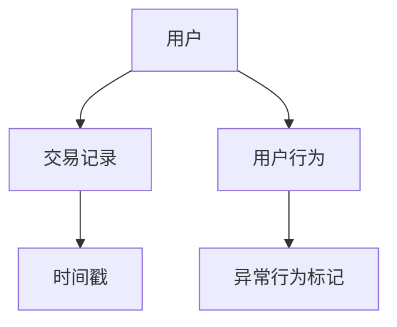
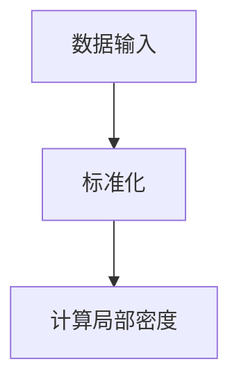
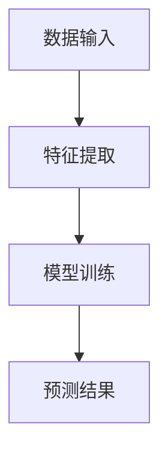
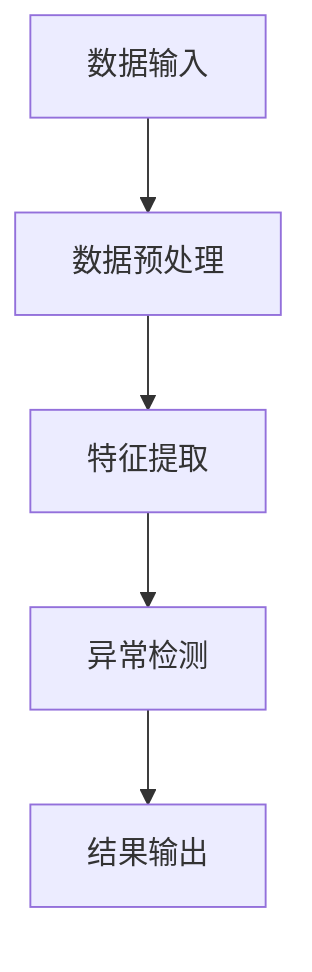
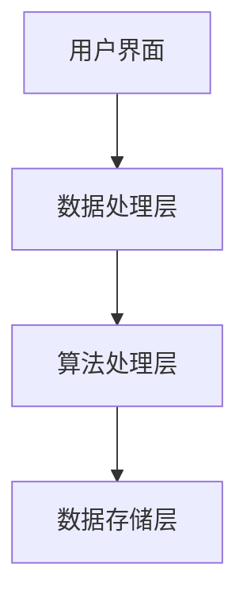

                 


# 目录大纲：《金融监管科技异常行为检测系统》

---

## 第一部分：背景介绍

### 第1章：金融监管科技异常行为检测概述

#### 1.1 问题背景与目标
- 1.1.1 金融监管中的异常行为问题
- 1.1.2 异常行为检测的目标与意义
- 1.1.3 系统设计的核心问题

#### 1.2 问题描述与解决方法
- 1.2.1 异常行为的定义与分类
- 1.2.2 金融监管中的常见异常行为类型
- 1.2.3 异常行为检测的解决思路

#### 1.3 系统目标与边界
- 1.3.1 系统的主要目标
- 1.3.2 系统的边界与外延
- 1.3.3 核心要素与组成结构

---

## 第二部分：核心概念与联系

### 第2章：异常行为检测的核心概念

#### 2.1 异常行为检测的基本原理
- 2.1.1 统计分析与机器学习方法
- 2.1.2 异常检测的关键特征提取

#### 2.2 核心概念对比分析
- 2.2.1 基于规则的方法与机器学习模型的对比
- 2.2.2 实时检测与事后分析的优缺点
- 2.2.3 数据特征与模型性能的关系

#### 2.3 实体关系图（ER图）


---

## 第三部分：算法原理讲解

### 第3章：异常行为检测算法原理

#### 3.1 基于统计的异常检测方法
- 3.1.1 Z-score方法
- 3.1.2 LOF（局部 outlier factor）算法
- 3.1.3 算法流程图


#### 3.2 基于机器学习的异常检测方法
- 3.2.1 随机森林模型
- 3.2.2 神经网络模型
- 3.2.3 算法流程图


#### 3.3 算法实现代码
- 3.3.1 LOF算法的Python实现
```python
import numpy as np
from sklearn.neighbors import NearestNeighbors

def compute_lof(X, n_neighbors=5):
    clf = NearestNeighbors(n_neighbors)
    clf.fit(X)
    lof = []
    for i in range(len(X)):
        kn = clf.kneighbors(X[i].reshape(1, -1), return_distance=False)
        kn_size = len(kn[0])
        lof.append(kn_size)
    return np.array(lof)
```

---

## 第四部分：系统分析与架构设计

### 第4章：系统分析与架构设计

#### 4.1 项目背景与目标
- 4.1.1 项目背景
- 4.1.2 项目目标
- 4.1.3 项目范围

#### 4.2 系统功能设计
- 4.2.1 系统功能模块划分
- 4.2.2 系统功能流程图


#### 4.3 系统架构设计
- 4.3.1 分层架构
- 4.3.2 组件交互
- 4.3.3 系统架构图


---

## 第五部分：项目实战

### 第5章：项目实战与实现

#### 5.1 环境搭建
- 5.1.1 安装Python
- 5.1.2 安装相关库
- 5.1.3 配置开发环境

#### 5.2 系统核心代码实现
- 5.2.1 数据预处理代码
```python
import pandas as pd

def preprocess_data(data):
    # 数据清洗与转换
    data = data.dropna()
    data = data.astype(float)
    return data
```

#### 5.3 实际案例分析
- 5.3.1 案例背景
- 5.3.2 数据分析
- 5.3.3 结果解读

#### 5.4 项目总结
- 5.4.1 成果总结
- 5.4.2 项目不足
- 5.4.3 优化方向

---

## 第六部分：总结与展望

### 第6章：总结与展望

#### 6.1 最佳实践 tips
- 数据预处理的重要性
- 模型调优的技巧
- 结果解读的关键点

#### 6.2 系统小结
- 系统整体回顾
- 核心算法总结
- 系统架构总结

#### 6.3 注意事项
- 数据隐私保护
- 模型鲁棒性
- 系统可扩展性

#### 6.4 拓展阅读
- 推荐书籍
- 相关论文
- 在线资源

---

## 附录

### 附录A：常用异常检测算法对比表
| 方法类型 | 基于规则 | 基于统计 | 基于机器学习 |
|----------|----------|----------|--------------|
| 优点     | 易解释    | 快速高效  | 高准确性      |
| 缺点     | 易被规避  | 灵活性差  | 需大量数据    |

### 附录B：代码示例汇总

---

通过以上目录大纲，您可以系统地撰写《金融监管科技异常行为检测系统》的技术博客文章，确保内容全面、结构清晰，并且符合技术博客的写作要求。

