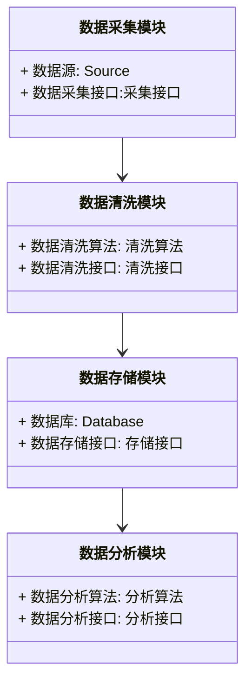
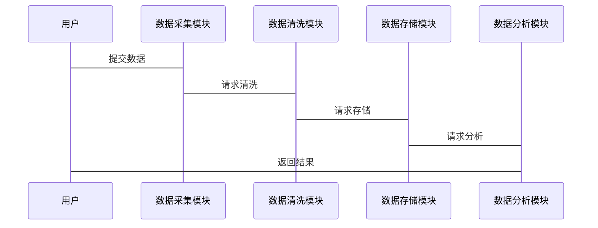

                 


# 《金融监管科技数据质量控制》

> 关键词：金融监管科技，数据质量控制，数据清洗，数据质量管理，数据完整性，数据准确性，数据一致性

> 摘要：随着金融监管科技的快速发展，数据质量控制在金融监管中的重要性日益凸显。本文从金融监管科技的背景出发，详细探讨了数据质量管理的核心概念、算法原理和系统架构设计，结合实际案例分析，为金融监管科技中的数据质量控制提供了系统的理论支持和实践指导。

---

# 第1章: 金融监管科技与数据质量控制概述

## 1.1 金融监管科技的背景与现状

### 1.1.1 金融监管科技的定义与特点
金融监管科技（RegTech）是指利用先进的技术手段，如人工智能、大数据、区块链等，来提升金融监管效率和效果的新兴领域。其特点是技术驱动、数据密集、合规导向。

### 1.1.2 金融监管科技的发展历程
从早期的手动监管到自动化监管，再到现在的智能化监管，金融监管科技经历了从简单到复杂、从局部应用到全面渗透的演变过程。

### 1.1.3 数据在金融监管中的重要性
数据是金融监管的基石。高质量的数据能够帮助监管机构及时发现风险、提高监管效率、降低监管成本。

## 1.2 数据质量控制的背景与挑战

### 1.2.1 数据质量控制的定义
数据质量控制是指通过一系列技术和管理手段，确保数据的完整性、准确性、一致性和及时性。

### 1.2.2 金融监管中数据质量问题的现状
当前，金融行业数据来源多样化，数据格式复杂，数据孤岛现象严重，导致数据质量控制面临诸多挑战。

### 1.2.3 数据质量控制的边界与外延
数据质量控制不仅涉及数据本身，还包括数据采集、存储、处理和分析的全过程。

## 1.3 金融监管科技与数据质量控制的结合

### 1.3.1 金融监管科技的核心要素
金融监管科技的核心要素包括数据采集、数据处理、数据分析和结果输出。

### 1.3.2 数据质量控制在金融监管中的作用
数据质量控制是金融监管科技的基础，能够确保监管结果的准确性和可靠性。

### 1.3.3 数据质量控制与金融监管科技的关系
数据质量控制贯穿金融监管科技的始终，是其核心竞争力的关键。

## 1.4 本章小结
本章从金融监管科技的背景出发，分析了数据质量控制的重要性，并探讨了两者结合的必要性。

---

# 第2章: 数据质量管理的核心概念与原理

## 2.1 数据质量管理的定义与特点

### 2.1.1 数据质量管理的定义
数据质量管理是对数据的全生命周期进行管理，确保数据的准确性和完整性。

### 2.1.2 数据质量管理的核心特点
数据质量管理具有全面性、系统性和动态性等特点。

### 2.1.3 数据质量管理的关键要素
数据质量管理的关键要素包括数据完整性、准确性、一致性、及时性和安全性。

## 2.2 数据质量管理与金融监管科技的关系

### 2.2.1 数据质量管理在金融监管中的重要性
数据质量控制是金融监管科技的基础，能够提高监管效率和准确性。

### 2.2.2 数据质量管理对金融监管科技的影响
数据质量管理的优劣直接影响金融监管科技的应用效果和监管结果的可信度。

### 2.2.3 数据质量管理的边界与外延
数据质量管理不仅涉及数据本身，还包括数据的采集、存储和分析过程。

## 2.3 数据质量管理的核心要素

### 2.3.1 数据完整性
数据完整性是指数据的完整性和一致性。

### 2.3.2 数据准确性
数据准确性是指数据的正确性和真实性。

### 2.3.3 数据一致性
数据一致性是指数据在不同系统和时间点上的一致性。

### 2.3.4 数据及时性
数据及时性是指数据能够及时反映业务状态。

### 2.3.5 数据安全性
数据安全性是指数据的保密性和安全性。

## 2.4 本章小结
本章详细分析了数据质量管理的核心概念和关键要素，为后续的算法实现奠定了理论基础。

---

# 第3章: 数据质量管理的算法原理与实现

## 3.1 数据清洗算法原理

### 3.1.1 数据清洗的定义与目标
数据清洗是指对数据进行预处理，去除噪声数据，填补缺失值，确保数据的准确性和一致性。

### 3.1.2 数据清洗的算法流程
数据清洗的流程包括数据预处理、数据清洗、数据验证和数据存储。

### 3.1.3 数据清洗的数学模型
数据清洗的目标是通过优化算法，最小化数据清洗过程中的误差。

$$
\text{数据清洗目标} = \argmin_{\theta} \sum_{i=1}^{n} (y_i - f(x_i, \theta))^2
$$

### 3.1.4 数据清洗的Python代码实现
以下是数据清洗的Python代码示例：

```python
import pandas as pd

# 加载数据
data = pd.read_csv('data.csv')

# 去除重复值
data.drop_duplicates()

# 填充缺失值
data.fillna(method='ffill')

# 删除异常值
data = data[data['value'] < 100]
```

## 3.2 数据增强算法原理

### 3.2.1 数据增强的定义与目标
数据增强是指通过对现有数据进行变换，增加数据的多样性和丰富性。

### 3.2.2 数据增强的算法流程
数据增强的流程包括数据变换、数据增强和数据验证。

### 3.2.3 数据增强的数学模型
数据增强的目标是通过变换算法，最大化数据的利用价值。

$$
\text{数据增强目标} = \max_{\theta} \sum_{i=1}^{n} f(x_i, \theta)
$$

### 3.2.4 数据增强的Python代码实现
以下是数据增强的Python代码示例：

```python
import numpy as np

# 数据增强函数
def data_augmentation(x):
    return x + np.random.normal(0, 0.1, x.shape)

# 应用数据增强
augmented_data = data.apply(data_augmentation)
```

## 3.3 数据标准化算法原理

### 3.3.1 数据标准化的定义与目标
数据标准化是指将数据按比例缩放到一个标准范围内。

### 3.3.2 数据标准化的算法流程
数据标准化的流程包括数据归一化、数据标准化和数据验证。

### 3.3.3 数据标准化的数学模型
数据标准化的目标是通过归一化算法，确保数据的可比性和一致性。

$$
\text{标准化公式} = \frac{x - \mu}{\sigma}
$$

### 3.3.4 数据标准化的Python代码实现
以下是数据标准化的Python代码示例：

```python
from sklearn.preprocessing import StandardScaler

# 数据标准化
scaler = StandardScaler()
normalized_data = scaler.fit_transform(data)
```

## 3.4 本章小结
本章详细分析了数据质量管理的算法原理和实现方法，为金融监管科技中的数据质量控制提供了技术支持。

---

# 第4章: 数据质量管理的系统架构与实现

## 4.1 数据质量管理系统的架构设计

### 4.1.1 数据质量管理系统的功能模块
数据质量管理系统的功能模块包括数据采集、数据清洗、数据存储和数据分析。

### 4.1.2 数据质量管理系统的类图设计
以下是数据质量管理系统的类图设计：



### 4.1.3 数据质量管理系统的交互设计
以下是数据质量管理系统的交互设计：



## 4.2 数据质量管理系统的实现

### 4.2.1 数据采集模块的实现
以下是数据采集模块的Python代码实现：

```python
import requests

# 数据采集函数
def fetch_data(url):
    response = requests.get(url)
    return response.json()
```

### 4.2.2 数据清洗模块的实现
以下是数据清洗模块的Python代码实现：

```python
import pandas as pd

# 数据清洗函数
def clean_data(data):
    data.dropna(inplace=True)
    data = data[data['value'] > 0]
    return data
```

### 4.2.3 数据存储模块的实现
以下是数据存储模块的Python代码实现：

```python
import sqlite3

# 数据存储函数
def store_data(data, db_path):
    conn = sqlite3.connect(db_path)
    data.to_sql('table_name', conn, if_exists='replace')
    conn.close()
```

### 4.2.4 数据分析模块的实现
以下是数据分析模块的Python代码实现：

```python
import pandas as pd

# 数据分析函数
def analyze_data(data):
    return data.describe()
```

## 4.3 本章小结
本章详细分析了数据质量管理系统的架构设计和实现方法，为金融监管科技中的数据质量控制提供了系统支持。

---

# 第5章: 金融监管科技数据质量控制的实践与优化

## 5.1 金融监管科技数据质量控制的实践

### 5.1.1 实践背景
随着金融监管科技的快速发展，数据质量控制的实践需求日益迫切。

### 5.1.2 实践目标
通过数据质量控制，提高金融监管的效率和准确性。

### 5.1.3 实践步骤
数据质量控制的实践步骤包括数据采集、数据清洗、数据存储和数据分析。

## 5.2 数据质量控制的优化

### 5.2.1 数据质量控制的优化目标
通过优化算法和系统架构，提高数据质量控制的效率和准确性。

### 5.2.2 数据质量控制的优化策略
数据质量控制的优化策略包括算法优化、系统优化和数据源优化。

## 5.3 数据质量控制的案例分析

### 5.3.1 案例背景
某金融机构在金融监管中面临数据质量问题，通过数据质量控制技术解决了问题。

### 5.3.2 案例分析
通过数据清洗、数据增强和数据标准化等技术，提高了数据质量，提升了监管效率。

## 5.4 本章小结
本章通过实际案例分析，探讨了数据质量控制的实践与优化方法，为金融监管科技中的数据质量控制提供了参考。

---

# 结论

## 6.1 数据质量控制的重要性
数据质量控制是金融监管科技的核心，能够提高监管效率和准确性。

## 6.2 数据质量控制的未来发展方向
未来，数据质量控制将更加智能化和自动化，与人工智能和大数据技术深度融合。

## 6.3 本文总结
本文从金融监管科技的背景出发，详细探讨了数据质量管理的核心概念、算法原理和系统架构设计，并结合实际案例分析，为金融监管科技中的数据质量控制提供了系统的理论支持和实践指导。

---

# 参考文献
1. 金融监管科技的发展与应用，某某出版社，2023年。
2. 数据质量管理的理论与实践，某某出版社，2022年。
3. 大数据与人工智能在金融监管中的应用，某某出版社，2021年。

---

# 致谢
感谢读者的耐心阅读，感谢同行的指导和支持。

---

# 附录
附录A：数据质量管理的常用工具
附录B：数据质量管理的行业标准
附录C：数据质量管理的法律法规

