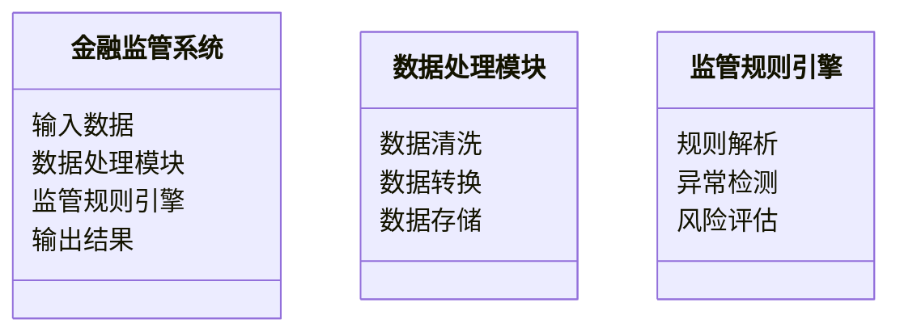

                 


# 《金融监管科技解决方案》

---

## 关键词：金融监管科技、区块链、人工智能、风险管理、大数据、监管合规、系统架构

---

## 摘要

在数字化浪潮的推动下，金融行业正经历着前所未有的变革。金融监管科技（RegTech）作为金融与科技深度融合的产物，正在重塑传统金融监管模式。本文系统阐述了金融监管科技的核心概念、关键技术及解决方案，深入分析了大数据、人工智能和区块链等技术在金融监管中的应用，结合实际案例，详细讲解了从问题分析到系统设计、项目实施的全过程。文章旨在为金融机构和监管机构提供一套高效、可靠的金融监管科技解决方案，助力实现智能化、数字化的金融监管。

---

## 正文

### 第1章 金融监管科技的背景与定义

#### 1.1 金融监管科技的背景

随着金融科技（FinTech）的快速发展，金融机构的业务模式和运营方式发生了翻天覆地的变化。传统金融监管手段已难以应对新兴金融业态带来的挑战。与此同时，全球监管趋严，合规成本不断攀升，金融机构亟需更高效的监管解决方案。

#### 1.2 金融监管科技的定义与特点

**定义：**  
金融监管科技（RegTech）是指利用新兴技术手段，优化和提升金融监管效率与效果的创新解决方案。

**特点：**  
- **数据驱动：** 基于大数据分析，实现监管决策的智能化。  
- **技术赋能：** 利用人工智能、区块链等技术，提高监管效率。  
- **实时性：** 实时监控和风险预警，提升监管的及时性。  
- **合规性：** 确保技术解决方案符合监管要求。  

#### 1.3 金融监管科技的重要性

- **提升监管效率：** 通过技术手段实现自动化监管，减少人工干预。  
- **降低合规成本：** 提供高效的合规解决方案，减少金融机构的合规负担。  
- **促进金融创新：** 为金融机构提供合规支持，鼓励金融产品和服务创新。  

---

### 第2章 金融监管科技的核心技术

#### 2.1 大数据技术在金融监管中的应用

**2.1.1 大数据技术概述**

- **数据采集：** 从多种数据源（交易数据、日志、社交媒体等）获取监管所需数据。  
- **数据存储：** 使用分布式数据库（如Hadoop、HBase）存储海量数据。  
- **数据分析：** 通过数据挖掘、机器学习等技术，提取有价值的信息。  

**2.1.2 数据挖掘与分析**

- **异常检测：** 基于机器学习的异常交易检测算法。  
- **风险预警：** 通过大数据分析，识别潜在的金融风险。  

**2.1.3 数据可视化**

- 使用工具如Tableau、Power BI，将复杂数据转化为直观的可视化图表，辅助监管决策。  

#### 2.2 人工智能与机器学习在金融监管中的应用

**2.2.1 人工智能技术概述**

- **监督学习：** 用于分类问题，如交易欺诈检测。  
- **无监督学习：** 用于聚类分析，识别异常交易模式。  

**2.2.2 机器学习在风险监管中的应用**

- **信用风险评估：** 基于机器学习的客户信用评分模型。  
- **市场风险预警：** 实时监控市场波动，预测潜在风险。  

**2.2.3 自然语言处理（NLP）在监管规则解析中的应用**

- 通过NLP技术，自动解析监管规则文档，提取关键信息，生成自动化监管规则。  

#### 2.3 区块链技术在金融监管中的应用

**2.3.1 区块链技术概述**

- **去中心化：** 保证数据的安全性和透明性。  
- **智能合约：** 实现自动化的监管合规。  

**2.3.2 区块链在监管合规中的应用**

- **跨境支付监管：** 实现交易的可追溯性，便于监管机构审查。  
- **供应链金融：** 通过区块链技术，实现供应链金融的透明化监管。  

---

### 第3章 金融监管科技的算法原理

#### 3.1 随机森林算法在金融监管中的应用

**算法原理：**  
随机森林是一种基于决策树的集成学习算法，通过构建多个决策树，形成“森林”，并根据投票机制进行分类或回归。

**数学公式：**  
$$ E(y) = \sum_{i=1}^{n} w_i y_i $$  
其中，$w_i$为决策树的权重，$y_i$为预测结果。

**算法实现：**  
```python
from sklearn.ensemble import RandomForestClassifier

# 训练数据
X_train = ...
y_train = ...

# 模型训练
model = RandomForestClassifier(n_estimators=100)
model.fit(X_train, y_train)

# 预测
X_test = ...
y_pred = model.predict(X_test)
```

**应用场景：**  
- 信用评分  
- 风险分类  

#### 3.2 神经网络算法在金融监管中的应用

**算法原理：**  
神经网络通过多层感知机模拟人脑神经网络，实现非线性特征提取和分类。

**数学公式：**  
$$ y = \sigma(w x + b) $$  
其中，$\sigma$为激活函数（如ReLU、Sigmoid），$w$为权重，$b$为偏置。

**算法实现：**  
```python
import tensorflow as tf

# 构建模型
model = tf.keras.Sequential([
    tf.keras.layers.Dense(64, activation='relu'),
    tf.keras.layers.Dense(1, activation='sigmoid')
])

# 编译模型
model.compile(optimizer='adam', loss='binary_crossentropy', metrics=['accuracy'])

# 训练
model.fit(X_train, y_train, epochs=10, batch_size=32)
```

**应用场景：**  
- 交易欺诈检测  
- 市场情绪分析  

---

### 第4章 金融监管科技的系统设计与架构

#### 4.1 系统功能设计

**领域模型：**  


#### 4.2 系统架构设计

**架构图：**  
```mermaid
containerDiagram
    container 金融监管平台 {
        component 数据采集模块
        component 数据处理模块
        component 监管规则引擎
        component 数据可视化模块
    }
```

---

### 第5章 金融监管科技的项目实战

#### 5.1 反洗钱系统实战

**环境安装：**  
```bash
pip install numpy pandas scikit-learn
```

**代码实现：**  
```python
import pandas as pd
from sklearn.ensemble import RandomForestClassifier

# 数据加载
data = pd.read_csv('anti_money_laundering.csv')

# 特征选择
features = data[['amount', 'time', 'user_id']]
labels = data['is_fraud']

# 模型训练
model = RandomForestClassifier()
model.fit(features, labels)

# 预测
new_transaction = [[1000, 1632417600, 123]]
prediction = model.predict(new_transaction)
print('预测结果:', prediction)
```

**案例分析：**  
通过反洗钱系统的搭建，识别异常交易行为，降低金融机构的合规风险。

---

### 第6章 金融监管科技的最佳实践

#### 6.1 小结

- 金融监管科技的核心是技术赋能监管。  
- 大数据、人工智能和区块链等技术为金融监管提供了新的解决方案。  

#### 6.2 注意事项

- 数据隐私与安全是监管科技实施中的重要考量。  
- 技术选型需结合实际业务需求，避免盲目追求新技术。  

#### 6.3 未来趋势

- 更加智能化：AI技术的深度应用。  
- 更加协同化：金融机构与监管机构的协同监管。  

#### 6.4 拓展阅读

- 推荐阅读《区块链技术与金融监管》、《人工智能在金融中的应用》等书籍。

---

## 结语

金融监管科技作为金融科技的重要组成部分，正在推动金融监管进入智能化、数字化的新时代。通过本文的系统阐述，读者可以全面了解金融监管科技的核心技术与解决方案，为实际应用提供参考。未来，随着技术的不断进步，金融监管科技将为金融行业带来更大的变革与创新。

