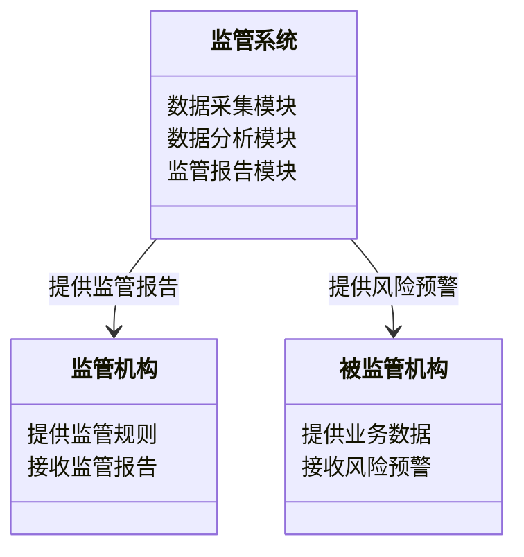
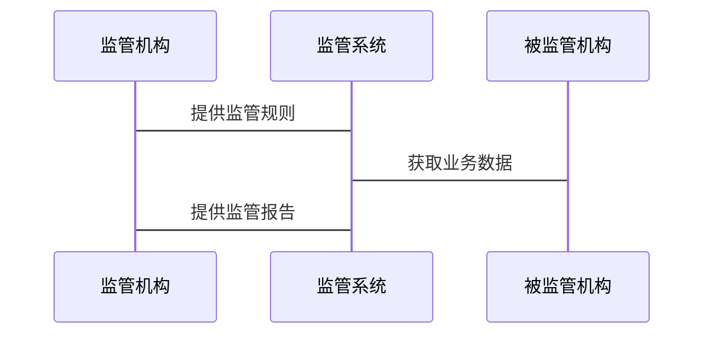

                 


接下来是详细的内容部分：

# 《金融监管科技解决方案设计》

## 关键词：
- 金融监管
- 监管科技
- 金融科技
- 人工智能
- 区块链

## 摘要：
金融监管科技是金融科技领域的重要分支，旨在通过技术手段提升金融监管的效率和准确性。本文从背景、核心概念、算法原理、系统架构到项目实战，全面解析金融监管科技解决方案的设计与实现，帮助读者掌握从理论到实践的全过程。

---

# 第1章: 金融监管科技的背景与问题

## 1.1 金融监管科技的背景

### 1.1.1 金融科技的发展与监管需求
金融科技（FinTech）的快速发展推动了金融行业的创新，但也带来了新的监管挑战。传统的监管方式难以应对日益复杂的金融业务。

### 1.1.2 监管科技的定义与特点
监管科技（RegTech）是利用技术手段优化金融监管的新兴领域。其特点包括数据驱动、自动化、智能化和实时性。

### 1.1.3 金融监管科技的核心问题
金融监管科技的核心问题是如何在保证监管效率的同时，降低监管成本，并应对日益复杂的金融风险。

## 1.2 监管科技的必要性

### 1.2.1 传统金融监管的局限性
传统监管方式依赖人工操作，效率低、成本高，难以应对复杂的金融业务。

### 1.2.2 金融科技带来的新挑战
金融科技的发展使得金融业务更加复杂化，传统的监管手段难以覆盖这些新型业务。

### 1.2.3 监管科技的解决方案
监管科技通过技术手段，如人工智能、大数据和区块链，提升监管效率和准确性。

## 1.3 监管科技的边界与外延

### 1.3.1 监管科技的应用场景
监管科技应用于反洗钱、合规性监管、市场监控等领域。

### 1.3.2 监管科技与其他技术的关系
监管科技依赖于大数据、人工智能和区块链等技术，但其核心目标是优化监管流程。

### 1.3.3 监管科技的未来发展趋势
监管科技将更加智能化、自动化，并与金融业务深度融合。

## 1.4 监管科技的核心要素

### 1.4.1 数据驱动的监管
通过收集和分析大量数据，实现精准监管。

### 1.4.2 智能化监管工具
利用人工智能技术，实现自动化监管和风险预警。

### 1.4.3 监管科技的生态系统
构建一个涵盖监管机构、金融机构和科技企业的生态系统。

## 1.5 本章小结
本章介绍了金融监管科技的背景、必要性、核心问题及发展趋势，为后续章节奠定了基础。

---

# 第2章: 监管科技的核心概念与技术原理

## 2.1 监管科技的核心概念

### 2.1.1 监管科技的定义
监管科技是利用技术手段优化金融监管的新兴领域。

### 2.1.2 监管科技的分类
监管科技可以分为数据监管、行为监管和合规监管三类。

### 2.1.3 监管科技的关键技术
包括大数据分析、人工智能、区块链和云计算等技术。

## 2.2 监管科技的核心原理

### 2.2.1 数据采集与处理
通过API和爬虫等技术，采集金融机构的交易数据和行为数据。

### 2.2.2 智能分析与决策
利用机器学习算法，分析数据并生成监管报告。

### 2.2.3 监管工具的自动化
通过自动化工具，实现监管流程的自动化和智能化。

## 2.3 监管科技的核心技术对比

### 2.3.1 传统监管技术与监管科技的对比
传统监管技术依赖人工操作，效率低；监管科技利用技术手段，效率高。

### 2.3.2 监管科技技术的优劣势分析
优势：高效、精准；劣势：技术复杂，实施成本高。

### 2.3.3 监管科技技术的未来发展方向
更加智能化、自动化，并与其他金融科技深度融合。

## 2.4 监管科技的ER实体关系图

```mermaid
erDiagram
    actor 监管机构 {
        <属性> 被监管机构
        <属性> 监管数据
        <属性> 监管规则
    }
    actor 被监管机构 {
        <属性> 业务数据
        <属性> 交易记录
        <属性> 风险评估
    }
    actor 监管系统 {
        <属性> 数据采集模块
        <属性> 数据分析模块
        <属性> 监管报告模块
    }
    监管机构 --> 监管系统 : 提供监管规则
    监管系统 --> 监管机构 : 提供监管报告
    被监管机构 --> 监管系统 : 提供业务数据
```

---

# 第3章: 监管科技的关键算法与数学模型

## 3.1 监管科技中的关键算法

### 3.1.1 机器学习算法
机器学习算法广泛应用于风险评估和异常检测。

### 3.1.2 区块链技术
区块链技术用于数据的安全存储和不可篡改性。

## 3.2 监管科技中的数学模型

### 3.2.1 风险评估模型
$$ R = \alpha \cdot X + \beta \cdot Y $$
其中，$X$ 和 $Y$ 是业务数据，$\alpha$ 和 $\beta$ 是系数。

### 3.2.2 异常检测模型
$$ D = \sum_{i=1}^{n} (x_i - \mu)^2 $$
其中，$x_i$ 是数据点，$\mu$ 是均值。

## 3.3 监管科技算法的实现

### 3.3.1 机器学习模型的训练
```python
from sklearn.linear_model import LinearRegression
model = LinearRegression()
model.fit(X, y)
```

### 3.3.2 区块链数据的存储
```python
import hashlib
hash_value = hashlib.sha256(data.encode()).hexdigest()
```

## 3.4 监管科技算法的优化

### 3.4.1 参数优化
使用梯度下降法优化模型参数。

### 3.4.2 模型评估
通过交叉验证评估模型的性能。

---

# 第4章: 监管科技的系统分析与架构设计

## 4.1 系统分析

### 4.1.1 问题场景
金融机构的交易数据需要实时监控，以发现异常交易。

### 4.1.2 系统功能需求
包括数据采集、数据分析、风险预警和监管报告生成。

## 4.2 系统架构设计

### 4.2.1 系统功能模块设计


### 4.2.2 系统架构图


## 4.3 系统接口设计

### 4.3.1 数据接口
定义数据采集的接口规范。

### 4.3.2 API接口
提供RESTful API，供监管机构调用监管报告。

## 4.4 系统交互设计

### 4.4.1 交互流程


---

# 第5章: 监管科技的项目实战

## 5.1 环境安装

### 5.1.1 开发环境
安装Python、Jupyter Notebook和相关库（如pandas、scikit-learn）。

### 5.1.2 数据库安装
安装MySQL或MongoDB，用于存储监管数据。

## 5.2 核心代码实现

### 5.2.1 数据采集代码
```python
import requests
url = "https://api.example.com/data"
response = requests.get(url)
data = response.json()
```

### 5.2.2 异常检测代码
```python
from sklearn.ensemble import IsolationForest
model = IsolationForest(n_estimators=100)
model.fit(X)
outliers = model.predict(X)
```

## 5.3 实际案例分析

### 5.3.1 案例背景
分析某金融机构的交易数据，发现异常交易行为。

### 5.3.2 案例分析
利用机器学习模型检测异常交易，生成风险预警报告。

## 5.4 项目小结
本章通过实际案例，展示了监管科技解决方案的实现过程和应用效果。

---

# 第6章: 监管科技的总结与展望

## 6.1 本章总结
监管科技通过技术手段提升金融监管的效率和准确性，解决了传统监管方式的痛点。

## 6.2 未来展望
未来，监管科技将更加智能化和自动化，与其他金融科技深度融合，推动金融监管的创新。

## 6.3 最佳实践

### 6.3.1 技术选型
选择合适的技术栈，确保系统的高效性和稳定性。

### 6.3.2 数据安全
加强数据安全保护，防止数据泄露和篡改。

### 6.3.3 持续优化
定期优化系统，提升监管效率和准确性。

## 6.4 注意事项

### 6.4.1 数据隐私
遵守数据隐私法规，保护用户隐私。

### 6.4.2 系统稳定性
确保系统的高可用性，避免因系统故障导致监管失败。

### 6.4.3 技术更新
及时跟进技术发展，保持系统的先进性。

## 6.5 拓展阅读
推荐相关书籍和论文，供读者深入学习。

---

# 结语

金融监管科技是金融科技的重要组成部分，通过技术手段优化监管流程，提升监管效率。本文从背景、核心概念、算法原理到系统设计和项目实战，全面解析了监管科技解决方案的设计与实现，为读者提供了从理论到实践的完整指导。

---

通过以上目录和内容设计，您可以根据需要进一步扩展每一章的内容，确保文章的完整性和深度。

