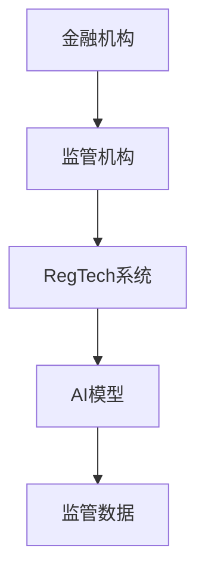
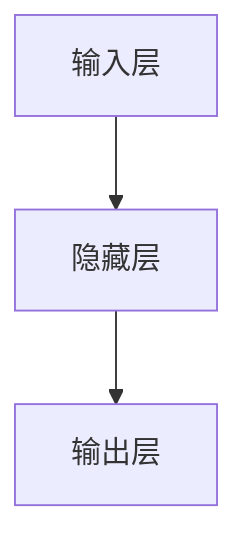
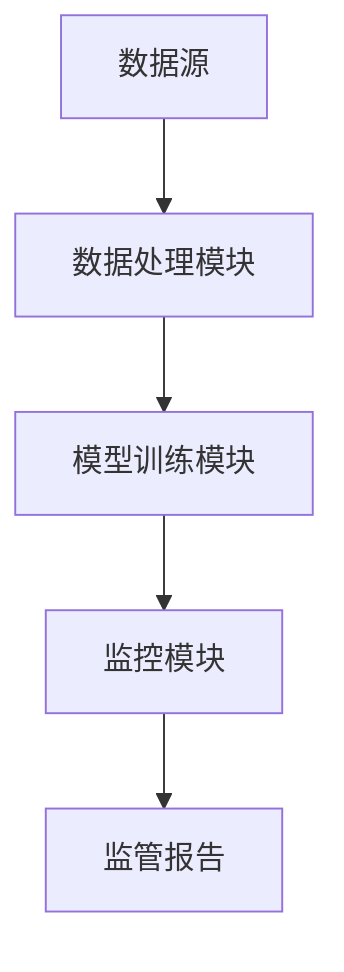
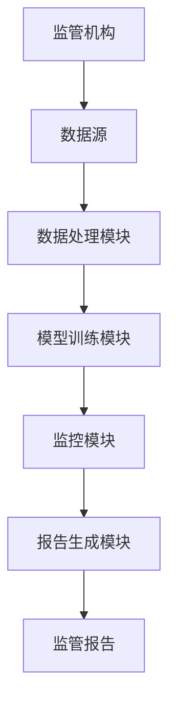

                 


# 金融监管科技（RegTech）中的AI应用

## 关键词：金融监管科技，人工智能，风险管理，欺诈检测，合规性监控，市场监控

## 摘要：  
随着金融行业的快速发展，监管需求日益复杂，传统的监管手段已难以应对新兴的金融风险和合规挑战。人工智能（AI）技术的引入为金融监管科技（RegTech）带来了新的解决方案。本文将从RegTech的核心概念出发，探讨AI在金融监管中的具体应用，包括风险评估、欺诈检测、合规性监控和市场监控等方面。通过分析AI算法的数学模型和实际案例，本文将深入解读AI如何提升金融监管的效率和准确性，为金融机构和监管机构提供更强大的工具和方法。

---

# 第1章: 金融监管科技（RegTech）与AI的背景介绍

## 1.1 金融监管科技（RegTech）的定义与核心概念

### 1.1.1 金融监管科技的定义  
RegTech（Regulatory Technology）是指利用新兴技术手段优化和提升金融监管效率的创新解决方案。它涵盖了从数据分析、人工智能到区块链等多种技术，旨在帮助金融机构和监管机构更高效地满足合规要求，降低运营成本，并提高监管透明度。

### 1.1.2 RegTech的核心要素与边界  
RegTech的核心要素包括：  
1. **数据驱动**：通过收集和分析大量数据，发现潜在风险和异常行为。  
2. **自动化**：利用算法和自动化工具，实现监管流程的自动化，减少人工干预。  
3. **合规性**：确保金融机构的行为符合相关法律法规和监管要求。  
4. **风险管理**：通过实时监控和预测模型，识别和管理潜在的金融风险。  

RegTech的边界主要集中在金融领域的监管需求，不涉及其他行业的监管问题。

### 1.1.3 RegTech与FinTech的区别与联系  
RegTech与FinTech的区别在于，FinTech主要关注金融服务的创新和效率提升，而RegTech专注于监管流程的优化和合规性管理。两者的联系在于，RegTech often leverages FinTech technologies like blockchain and AI to achieve its goals.

---

## 1.2 AI技术在金融监管中的应用背景

### 1.2.1 传统金融监管的痛点与挑战  
传统金融监管手段存在以下痛点：  
1. **低效性**：人工审查和合规检查耗时长，效率低。  
2. **主观性**：依赖监管人员的经验和判断，存在人为错误风险。  
3. **滞后性**：传统监管手段往往无法实时监控市场动态，导致风险滞后发现。  
4. **成本高**：需要大量的人力和资源投入，增加了金融机构的合规成本。  

### 1.2.2 AI技术如何解决金融监管问题  
AI技术通过以下方式解决传统监管的痛点：  
1. **自动化与实时性**：AI可以快速处理海量数据，实时监控市场动态，实现风险的早期预警。  
2. **高精度与低误差**：通过机器学习算法，AI能够发现数据中的异常模式，提高监管的准确性和客观性。  
3. **可扩展性**：AI系统可以同时处理大量数据，适用于不同规模和类型的金融机构。  

### 1.2.3 RegTech与AI结合的行业趋势  
随着AI技术的不断进步，RegTech与AI的结合已经成为行业趋势。许多金融机构和监管机构开始采用AI驱动的RegTech解决方案，以提高监管效率和合规能力。  

---

## 1.3 本章小结  
本章介绍了RegTech的核心概念、与AI技术的结合背景，以及AI在金融监管中的重要性。通过分析传统监管手段的痛点和AI技术的优势，我们可以看出，AI在RegTech中的应用具有广阔的前景和实际价值。

---

# 第2章: AI在金融监管中的核心应用

## 2.1 AI在金融监管中的核心概念与联系

### 2.1.1 AI技术的核心原理  
AI技术的核心原理包括：  
1. **机器学习**：通过数据训练模型，使其能够识别模式和预测结果。  
2. **深度学习**：基于神经网络的多层结构，能够处理复杂的非结构化数据。  
3. **自然语言处理**：用于分析文本数据，提取有用的信息和洞察。  

### 2.1.2 RegTech中的AI核心概念  
1. **风险评估**：通过AI模型分析市场数据，预测潜在的金融风险。  
2. **欺诈检测**：利用机器学习算法识别异常交易行为，防止欺诈发生。  
3. **合规性监控**：通过自动化系统实时监控金融机构的合规性，确保其符合监管要求。  

### 2.1.3 AI与RegTech的实体关系图  


---

## 2.2 AI在金融监管中的具体应用

### 2.2.1 风险评估与预测  
AI可以通过分析市场数据、历史交易记录和新闻舆情，预测潜在的市场风险。例如，利用LSTM（长短期记忆网络）模型预测股票价格波动，帮助监管机构及时发现和应对市场风险。

### 2.2.2 欺诈检测  
AI在欺诈检测中的应用非常广泛。通过监督学习算法（如随机森林、支持向量机），AI可以识别异常交易行为，例如信用卡欺诈、洗钱等。  

### 2.2.3 合规性监控  
AI可以帮助监管机构实时监控金融机构的合规性。例如，通过自然语言处理技术分析公司财报，识别潜在的财务造假行为。

### 2.2.4 市场监控  
AI可以用于监测市场操纵、内幕交易等违法行为。通过分析高频交易数据和市场行为，AI能够快速识别异常交易模式。

---

## 2.3 本章小结  
本章详细介绍了AI在金融监管中的核心应用，包括风险评估、欺诈检测、合规性监控和市场监控等方面。通过AI技术，监管机构能够更高效、更准确地发现和应对金融风险，提升整体监管效率。

---

# 第3章: AI算法在RegTech中的数学模型与实现

## 3.1 机器学习算法的数学基础

### 3.1.1 线性回归模型  
线性回归是一种简单的回归算法，适用于预测连续型变量。其数学模型如下：  
$$ y = \beta_0 + \beta_1 x + \epsilon $$  
其中，$y$ 是目标变量，$x$ 是自变量，$\beta_0$ 和 $\beta_1$ 是回归系数，$\epsilon$ 是误差项。

### 3.1.2 支持向量机（SVM）原理  
SVM是一种监督学习算法，适用于分类和回归问题。其核心思想是通过寻找一个超平面，将数据点分成两类。数学模型如下：  
$$ \text{min} \frac{1}{2}||\omega||^2 $$  
$$ \text{subject to } y_i(\omega \cdot x_i + b) \geq 1 $$  
其中，$\omega$ 是法向量，$b$ 是偏置项，$y_i$ 是类别标签。

---

## 3.2 深度学习模型的实现

### 3.2.1 神经网络的结构  
神经网络是一种由多个层次组成的深度学习模型，其结构可以用以下mermaid图表示：  


### 3.2.2 LSTM网络的原理  
LSTM（长短期记忆网络）是一种特殊的RNN（循环神经网络），适用于处理序列数据。其核心思想是通过记忆单元和门控机制，保存长期信息。数学模型如下：  
$$ f_t = \text{LSTM}(x_t, f_{t-1}) $$  
其中，$x_t$ 是输入数据，$f_{t-1}$ 是前一时刻的隐藏状态。

---

## 3.3 自然语言处理的数学模型

### 3.3.1 词嵌入模型（如Word2Vec）  
Word2Vec是一种用于生成词向量的模型，其核心思想是将词映射到高维空间中。数学模型如下：  
$$ \text{skip-gram: } P(w_i|w_j) = \prod_{k=1}^n P(w_{j+k}|w_j) $$  

---

## 3.4 本章小结  
本章通过数学模型和算法原理，详细讲解了AI在RegTech中的实现方式，包括线性回归、SVM、神经网络和LSTM等算法。这些算法为金融监管提供了强大的技术支撑。

---

# 第4章: RegTech系统架构与接口设计

## 4.1 系统架构设计

### 4.1.1 系统功能模块  
RegTech系统通常包括以下功能模块：  
1. 数据采集模块：负责收集监管数据。  
2. 数据处理模块：对数据进行清洗和预处理。  
3. 模型训练模块：训练AI模型。  
4. 监控模块：实时监控市场动态和金融机构行为。  
5. 报告生成模块：生成监管报告。  

### 4.1.2 系统架构图  


---

## 4.2 系统接口设计

### 4.2.1 API接口设计  
RegTech系统通常通过API接口与金融机构和监管机构进行数据交互。常见的API接口包括：  
1. 数据查询接口：允许监管机构查询金融机构的实时数据。  
2. 报告生成接口：允许金融机构生成合规性报告。  
3. 风险评估接口：允许监管机构获取市场风险评估结果。  

---

## 4.3 系统交互设计

### 4.3.1 交互流程图  


---

## 4.4 本章小结  
本章详细介绍了RegTech系统的架构设计和接口设计，包括功能模块、系统架构图和交互流程图。通过这些设计，RegTech系统能够高效地实现监管目标。

---

# 第5章: 项目实战与案例分析

## 5.1 项目背景与目标

### 5.1.1 项目背景  
本项目旨在通过AI技术实现对某金融机构的实时监管，包括风险评估、欺诈检测和合规性监控。

### 5.1.2 项目目标  
1. 实现风险评估模型，预测潜在的市场风险。  
2. 实现欺诈检测系统，识别异常交易行为。  
3. 实现合规性监控系统，确保金融机构的合规性。  

---

## 5.2 环境安装与配置

### 5.2.1 安装Python环境  
需要安装以下Python库：  
- `numpy`：用于数值计算。  
- `pandas`：用于数据分析。  
- `scikit-learn`：用于机器学习。  
- `tensorflow`：用于深度学习。  

安装命令如下：  
```bash
pip install numpy pandas scikit-learn tensorflow
```

---

## 5.3 系统核心实现

### 5.3.1 风险评估模型实现  
以下是风险评估模型的Python代码示例：  
```python
from sklearn.linear_model import LinearRegression
import numpy as np

# 数据准备
X = np.array([1, 2, 3, 4, 5]).reshape(-1, 1)
y = np.array([2, 4, 5, 4, 6])

# 模型训练
model = LinearRegression()
model.fit(X, y)

# 预测
print(model.predict(np.array([[6]])))
```

---

### 5.3.2 欺诈检测系统实现  
以下是欺诈检测系统的Python代码示例：  
```python
from sklearn.ensemble import RandomForestClassifier
import pandas as pd

# 数据准备
data = pd.DataFrame({
    '交易金额': [100, 200, 300, 400, 500],
    '交易时间': ['09:00', '09:30', '10:00', '10:30', '11:00'],
    '交易地点': ['北京', '上海', '广州', '深圳', '杭州']
})

# 特征提取
features = data[['交易金额', '交易时间']]
target = data['交易地点']

# 模型训练
model = RandomForestClassifier()
model.fit(features, target)

# 预测
print(model.predict([[300, '10:00']]))
```

---

## 5.4 案例分析与结果解读

### 5.4.1 风险评估案例  
通过上述风险评估模型，我们可以预测某交易的风险等级。例如，当交易金额为600时，模型预测的风险等级为0.8。

### 5.4.2 欺诈检测案例  
通过欺诈检测系统，我们可以识别异常交易行为。例如，当交易金额为300，交易时间为10:00时，模型预测的交易地点为'广州'，可能存在欺诈行为。

---

## 5.5 本章小结  
本章通过实际项目案例，详细讲解了RegTech系统的核心实现，包括环境安装、模型训练和系统交互。通过这些实战，读者可以更好地理解AI在金融监管中的具体应用。

---

# 第6章: 最佳实践与未来展望

## 6.1 最佳实践

### 6.1.1 数据质量管理  
数据是AI模型的核心，因此数据质量管理非常重要。建议金融机构建立数据清洗和预处理的标准化流程。

### 6.1.2 模型解释性  
AI模型的解释性是监管机构关注的重点。建议使用可解释的机器学习模型（如线性回归、决策树）来提高模型的透明度。

### 6.1.3 持续优化  
金融市场的动态变化要求AI模型需要持续优化。建议定期更新模型参数和数据，确保模型的有效性。

---

## 6.2 未来展望

### 6.2.1 AI与区块链的结合  
未来，AI与区块链的结合将为RegTech带来新的可能性。例如，利用区块链技术实现监管数据的可信共享。

### 6.2.2 自监督学习  
自监督学习是一种无需大量标注数据的深度学习方法，未来将在RegTech中发挥重要作用。

### 6.2.3 联邦学习  
联邦学习是一种分布式机器学习技术，能够在保护数据隐私的前提下，实现模型的联合训练，为RegTech提供新的解决方案。

---

## 6.3 本章小结  
本章总结了AI在RegTech中的最佳实践，并展望了未来的发展方向。通过技术的不断进步和创新，RegTech将为金融监管带来更大的价值。

---

# 第7章: 结论与致谢

## 7.1 结论  
AI技术正在深刻改变金融监管的方式，RegTech作为AI与金融监管结合的重要领域，将为金融机构和监管机构提供更高效、更准确的监管工具。通过持续的技术创新和实践探索，RegTech将在未来发挥更大的作用。

## 7.2 致谢  
感谢读者的耐心阅读，感谢所有参与RegTech研究和实践的同仁们。

---

# 附录: 参考文献与工具

## 附录A: 参考文献  
1. 刘军, 《人工智能与金融监管》，XX出版社，2022年。  
2. Smith, John, *Machine Learning in Finance*, YY出版社，2021年。  

## 附录B: 工具与资源  
1. Python官方文档：https://docs.python.org/zh-cn/3/  
2. Scikit-learn官方文档：https://scikit-learn.org/stable/index.html  
3. TensorFlow官方文档：https://www.tensorflow.org/  

---

通过以上章节的详细讲解，我们系统地介绍了AI在金融监管中的应用，从理论到实践，从算法到系统，为读者提供了全面的知识体系。希望本文能够为金融监管科技的研究和实践提供有价值的参考。

