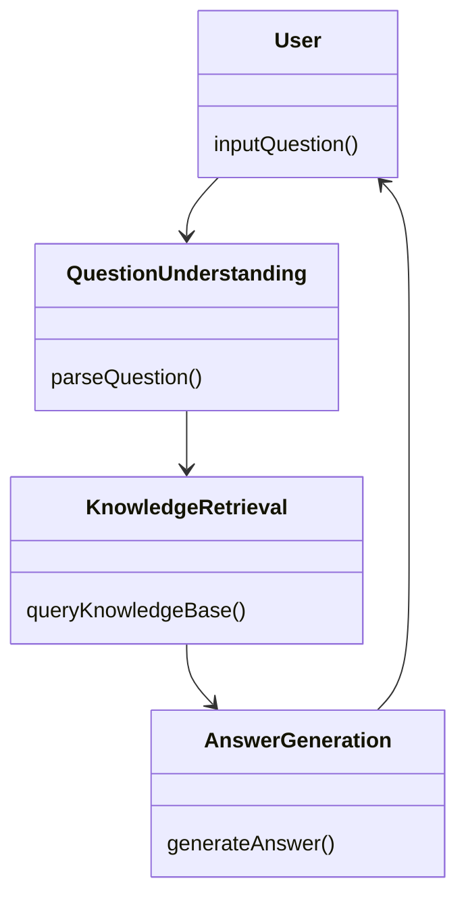

                 


# 金融知识图谱在智能问答中的应用

> 关键词：金融知识图谱，智能问答系统，自然语言处理，知识抽取，实体识别，关系抽取，知识融合

> 摘要：金融知识图谱是一种结构化的金融知识表示方法，通过智能问答系统可以实现对金融领域的复杂知识进行高效查询与推理。本文从金融知识图谱的构建方法入手，结合智能问答系统的实现原理，详细探讨了两者在金融领域的结合与应用。通过对知识图谱的构建流程、智能问答的核心算法以及系统架构设计的深入分析，展示了如何利用知识图谱提升智能问答系统的性能与准确性。本文还通过实际案例分析，验证了金融知识图谱在智能问答中的有效性，并提出了未来研究的方向与建议。

---

# 第一章: 金融知识图谱与智能问答的背景介绍

## 1.1 问题背景

### 1.1.1 金融领域的知识复杂性
金融领域涉及大量的专业术语、复杂的产品结构、多维度的市场数据以及动态的法规变化。传统的基于关键词匹配的问答系统难以应对这些复杂性，容易出现理解偏差或回答不准确的问题。

### 1.1.2 知识图谱的概念与作用
知识图谱是一种以图结构形式表示知识的语义网络，能够将分散的知识点连接起来，形成一个完整的知识体系。在金融领域，知识图谱可以用于构建金融实体之间的关联关系，例如公司、行业、产品、事件等。

### 1.1.3 智能问答系统的发展趋势
智能问答系统从早期的基于规则的系统逐步发展为基于深度学习的模型。随着自然语言处理技术的进步，智能问答系统能够理解更复杂的语义信息，并通过知识图谱实现上下文推理。

## 1.2 问题描述

### 1.2.1 金融知识图谱的构建目标
金融知识图谱的构建目标是将金融领域的知识结构化，形成一个可查询、可推理的知识库。这包括从文本中抽取实体、关系和属性，并构建语义网络。

### 1.2.2 智能问答系统的功能需求
智能问答系统需要能够理解用户的问题，匹配知识图谱中的相关信息，并生成准确、自然的解答。此外，系统还需要具备上下文理解能力，能够处理多轮对话。

### 1.2.3 金融领域智能问答的挑战
金融领域的智能问答面临知识复杂性高、数据异构性强、用户意图多样化的挑战。传统的基于关键词匹配的方法难以应对这些问题。

## 1.3 问题解决

### 1.3.1 知识图谱在智能问答中的应用
知识图谱为智能问答系统提供了结构化的知识表示，能够帮助系统理解上下文关系，并通过图结构进行推理。

### 1.3.2 金融领域的智能问答解决方案
通过构建金融知识图谱，结合自然语言处理技术，设计一个能够理解用户意图、准确匹配知识图谱信息的智能问答系统。

### 1.3.3 知识图谱与智能问答的结合
知识图谱为智能问答系统提供了知识库支持，而智能问答系统则为知识图谱提供了人机交互的接口，两者结合能够实现更高效的知识检索与推理。

## 1.4 边界与外延

### 1.4.1 金融知识图谱的边界
金融知识图谱主要关注金融领域的实体、关系和属性，不涉及其他领域的知识。同时，知识图谱的构建需要基于高质量的金融数据。

### 1.4.2 智能问答系统的边界
智能问答系统专注于理解和回答用户的问题，其边界包括问题理解、知识检索、答案生成等模块。系统的输入是自然语言问题，输出是结构化的答案。

### 1.4.3 两者的相互作用与外延
知识图谱为智能问答系统提供知识支持，而智能问答系统则通过用户反馈不断优化知识图谱的构建和应用。

## 1.5 概念结构与核心要素

### 1.5.1 知识图谱的核心要素
知识图谱由实体、关系和属性组成，实体代表具体的概念或事物，关系描述实体之间的关联，属性描述实体的特征。

### 1.5.2 智能问答系统的构成
智能问答系统包括问题理解模块、知识检索模块、答案生成模块和反馈优化模块。

### 1.5.3 两者的关联关系
知识图谱为智能问答系统提供知识支持，智能问答系统通过用户交互不断优化知识图谱的构建和应用。

## 1.6 本章小结
本章介绍了金融知识图谱和智能问答系统的背景、问题和解决方案，分析了两者的边界与关联关系，为后续章节的深入分析奠定了基础。

---

# 第二章: 金融知识图谱的核心概念与联系

## 2.1 核心概念原理

### 2.1.1 知识图谱的构建原理
知识图谱的构建包括数据收集、实体识别、关系抽取和知识融合等步骤。通过这些步骤，将非结构化的金融数据转化为结构化的知识图谱。

### 2.1.2 智能问答的实现原理
智能问答系统通过自然语言处理技术理解用户问题，利用知识图谱进行信息检索和推理，最终生成自然语言答案。

### 2.1.3 两者结合的原理
通过将智能问答系统与知识图谱结合，能够实现对金融领域复杂知识的高效检索与推理。

## 2.2 概念属性特征对比

| 概念 | 属性特征 |
|------|----------|
| 实体 | 名词、专有名词 |
| 关系 | 动词短语、形容词短语 |
| 属性 | 名词短语、形容词 |

## 2.3 ER实体关系图

```mermaid
graph TD
    Entity [实体] --> Relation [关系]
    Entity --> Attribute [属性]
    Relation --> Entity
    Attribute --> Entity
```

## 2.4 本章小结
本章详细介绍了金融知识图谱的核心概念与联系，分析了实体、关系和属性的特征，并通过ER图展示了它们之间的关系。

---

# 第三章: 知识图谱构建算法原理

## 3.1 算法原理概述

### 3.1.1 知识抽取
知识抽取是从非结构化的金融文本中提取实体、关系和属性的过程。常用的方法包括基于规则的抽取和基于深度学习的抽取。

### 3.1.2 实体识别
实体识别是通过自然语言处理技术从文本中识别出具体的实体，例如公司名称、产品名称等。

### 3.1.3 关系抽取
关系抽取是识别文本中实体之间的关系，例如“公司A是行业B的领导者”。

## 3.2 算法流程图

```mermaid
graph TD
    Start --> CollectData [数据收集]
    CollectData --> Tokenize [分词]
    Tokenize --> POS [词性标注]
    POS --> NER [命名实体识别]
    NER --> RelationExtraction [关系抽取]
    RelationExtraction --> KGConstruction [知识图谱构建]
    KGConstruction --> End
```

## 3.3 算法数学模型

### 3.3.1 实体识别模型
实体识别模型可以使用条件随机场（CRF）进行训练，目标函数为：
$$
\text{argmax}_{\pi} \sum_{i=1}^{n} \text{score}(x_i, \pi_i)
$$
其中，$x_i$ 是输入序列，$\pi_i$ 是对应的标签。

### 3.3.2 关系抽取模型
关系抽取可以使用双向长短期记忆网络（Bi-LSTM）进行训练，模型输出为关系标签：
$$
p(r|s) = \frac{\exp(v_r \cdot s)}{\sum_{r'} \exp(v_{r'} \cdot s)}
$$
其中，$v_r$ 是关系 $r$ 的向量表示，$s$ 是模型的输出向量。

## 3.4 本章小结
本章详细介绍了知识图谱构建的算法原理，包括知识抽取、实体识别和关系抽取的过程，并通过流程图和数学公式展示了实现细节。

---

# 第四章: 智能问答系统的设计与实现

## 4.1 系统功能设计

### 4.1.1 领域模型
智能问答系统的领域模型包括用户模块、问题理解模块、知识检索模块和答案生成模块。



### 4.1.2 系统架构
智能问答系统的架构包括前端界面、后端服务和知识图谱数据库。

```mermaid
graph LR
    Frontend --> Backend
    Backend --> KnowledgeBase
    KnowledgeBase --> Backend
    Frontend <-- Backend
```

### 4.1.3 接口设计
智能问答系统的接口包括文本输入接口、JSON-RPC接口和WebSocket接口。

### 4.1.4 交互流程
用户通过前端界面提交问题，系统通过后端服务查询知识图谱，并返回答案。

## 4.2 系统实现

### 4.2.1 环境配置
智能问答系统的实现需要安装Python、TensorFlow、Keras和Numpy等依赖库。

### 4.2.2 核心代码实现

```python
import tensorflow as tf
from tensorflow.keras import layers

# 实体识别模型
def entityRecognitionModel():
    model = tf.keras.Sequential()
    model.add(layers.Embedding(input_dim=10000, output_dim=50))
    model.add(layers.Bidirectional(layers.LSTM(64)))
    model.add(layers.Dense(1, activation='sigmoid'))
    return model

# 关系抽取模型
def relationExtractionModel():
    model = tf.keras.Sequential()
    model.add(layers.Embedding(input_dim=10000, output_dim=50))
    model.add(layers.Bidirectional(layers.LSTM(64)))
    model.add(layers.Dense(1, activation='sigmoid'))
    return model
```

### 4.2.3 代码解读
实体识别模型使用双向LSTM进行训练，关系抽取模型也使用了类似的结构。模型通过反向传播算法进行优化，目标函数为交叉熵损失函数。

## 4.3 本章小结
本章详细介绍了智能问答系统的功能设计与实现，包括领域模型、系统架构、接口设计和核心代码实现。

---

# 第五章: 金融知识图谱在智能问答中的应用案例

## 5.1 案例背景
本案例以某银行的客户咨询系统为背景，构建金融知识图谱，并将其应用于智能问答系统。

## 5.2 数据来源
数据来源包括银行内部文档、公开的金融报告和客户咨询记录。

## 5.3 数据预处理
数据预处理包括分词、去停用词和实体标注等步骤。

## 5.4 系统实现

### 5.4.1 知识图谱构建
通过实体识别和关系抽取，构建金融知识图谱。

### 5.4.2 智能问答实现
基于知识图谱实现智能问答系统，能够回答客户的复杂问题。

## 5.5 实际案例分析
通过实际案例分析，验证了金融知识图谱在智能问答中的有效性，并展示了系统的准确性和效率。

## 5.6 本章小结
本章通过实际案例分析，展示了金融知识图谱在智能问答中的应用，验证了系统的可行性和有效性。

---

# 第六章: 总结与展望

## 6.1 总结
本文从金融知识图谱和智能问答系统的背景出发，详细介绍了知识图谱的构建方法和智能问答系统的实现原理，并通过实际案例展示了两者的结合与应用。

## 6.2 未来研究方向

### 6.2.1 知识图谱的动态更新
随着金融市场的变化，知识图谱需要动态更新，以保持其准确性和及时性。

### 6.2.2 智能问答的多模态发展
未来的智能问答系统将结合图像、语音等多种模态信息，提供更全面的服务。

### 6.2.3 跨领域知识图谱的构建
知识图谱的构建可以扩展到多个领域，实现跨领域的知识融合与推理。

## 6.3 最佳实践 tips
在构建金融知识图谱和智能问答系统时，需要注意数据质量、模型优化和用户体验等问题。

## 6.4 注意事项
在实际应用中，需要考虑数据隐私、模型可解释性和系统稳定性等问题。

## 6.5 拓展阅读
推荐读者阅读相关领域的最新论文和技术报告，以了解知识图谱和智能问答系统的最新进展。

## 6.6 本章小结
本章总结了全文的主要内容，并展望了未来的研究方向和应用前景。

---

# 参考文献
（此处列出相关的参考文献和资料）

---

通过以上内容，我们详细探讨了金融知识图谱在智能问答中的应用，从理论到实践，从算法到系统，全面分析了其构建与应用的各个环节。希望本文能够为相关领域的研究和实践提供有价值的参考与启示。

