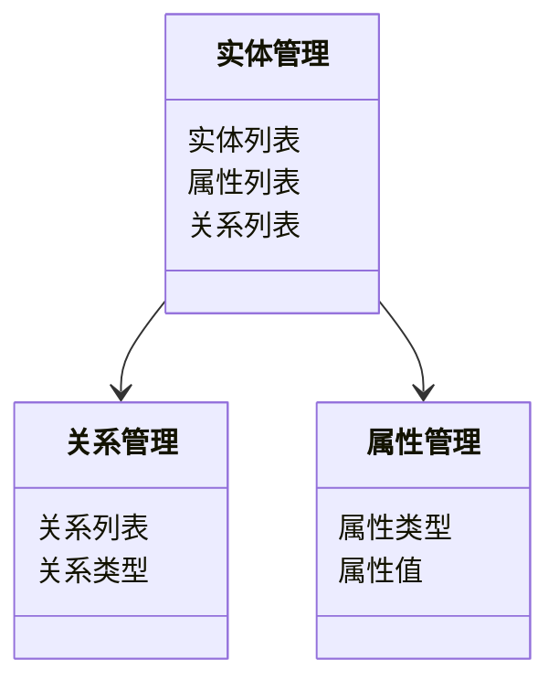
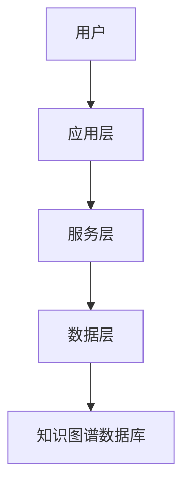
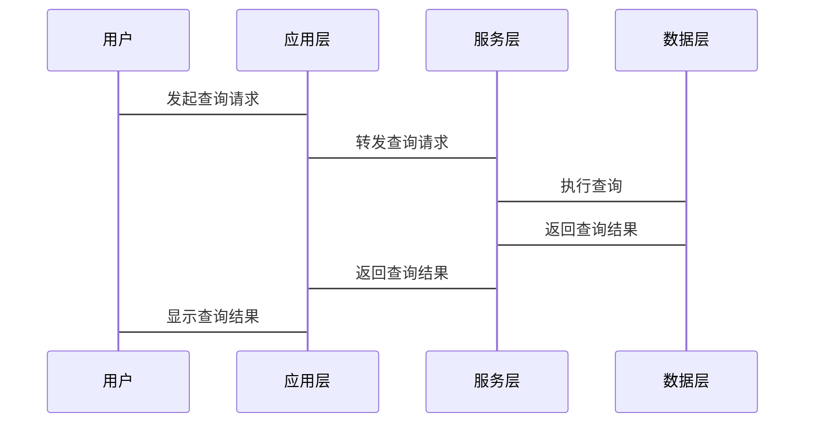

                 


# 《金融知识图谱的构建与应用》

## 关键词：金融知识图谱、知识图谱、数据挖掘、机器学习、系统架构、项目实战

## 摘要：  
金融知识图谱是一种基于图结构的数据组织方式，能够有效整合金融领域的多源异构数据，构建金融实体之间的语义关联网络。本文详细探讨了金融知识图谱的构建方法、应用场景及其系统架构设计，通过实际项目案例展示其在风险控制、智能投顾等领域的应用价值。同时，本文分析了构建过程中的关键技术挑战，并提出了相应的解决方案和优化建议。

---

# 1. 金融知识图谱的概述

## 1.1 知识图谱的基本概念

### 1.1.1 知识图谱的定义  
知识图谱是一种以图结构形式表示知识的技术，由节点（实体）和边（关系）组成，节点代表具体的概念或实体，边表示实体之间的关联关系。

### 1.1.2 金融领域的特殊性  
金融领域的数据具有多源异构、复杂关联的特点，知识图谱能够有效整合结构化、半结构化和非结构化数据，构建金融实体之间的语义网络。

### 1.1.3 金融知识图谱的定义与特点  
金融知识图谱是专门针对金融领域构建的知识图谱，其特点包括：多模态数据融合、语义关联强、实时性要求高等。

## 1.2 金融知识图谱的核心概念

### 1.2.1 实体与关系的定义  
- **实体**：金融领域的基本概念，如“公司”、“股票”、“交易”等。  
- **关系**：实体之间的关联，如“公司持有股票”、“股票属于行业”等。

### 1.2.2 属性与上下文的关联  
- **属性**：实体的描述性特征，如“公司的成立时间”、“股票的市盈率”等。  
- **上下文**：实体关系的背景信息，如时间、地点、交易类型等。

### 1.2.3 知识图谱的构建目标  
构建金融知识图谱的目标是整合金融数据，发现隐含关系，支持智能决策。

---

# 2. 金融知识图谱的构建方法论

## 2.1 数据预处理

### 2.1.1 数据来源  
- 结构化数据：金融数据库、交易数据、财务报表等。  
- 半结构化数据：新闻、报告、评论等。  
- 非结构化数据：文本、图像、音频等。

### 2.1.2 数据清洗  
- 去重、去噪：去除重复数据和无效数据。  
- 标准化：统一数据格式和命名规范。

## 2.2 知识抽取与构建

### 2.2.1 实体识别  
- 使用自然语言处理（NLP）技术从文本中提取实体。  
- 示例：从新闻中提取公司名称、行业名称等。

### 2.2.2 关系抽取  
- 识别实体之间的关系，如“公司A持有股票B”。  
- 使用句法分析和语义分析技术。

### 2.2.3 属性提取  
- 提取实体的属性信息，如“公司A的成立时间是1990年”。  
- 使用信息抽取技术。

## 2.3 知识图谱的构建与优化

### 2.3.1 知识图谱的构建流程  
1. 数据清洗与预处理。  
2. 实体识别与关系抽取。  
3. 数据融合与关联构建。  
4. 图谱存储与管理。

### 2.3.2 知识图谱的优化方法  
- 去除冗余关系。  
- 处理歧义关系。  
- 增强语义关联。

---

# 3. 金融知识图谱的应用场景

## 3.1 金融领域的典型应用

### 3.1.1 风险控制  
- 通过知识图谱识别关联风险，评估企业信用风险。  
- 示例：发现同一实际控制人控制的多家公司之间的关联交易。

### 3.1.2 智能投顾  
- 基于知识图谱分析投资标的关联性，提供个性化投资建议。  
- 示例：分析某行业的上下游企业，推荐投资标的。

## 3.2 跨领域应用

### 3.2.1 企业征信  
- 基于知识图谱分析企业之间的关联关系，评估企业信用风险。  
- 示例：识别企业之间的隐性关联，发现潜在风险。

### 3.2.2 监管科技（RegTech）  
- 帮助监管部门发现市场操纵、关联交易等违规行为。  
- 示例：识别异常交易模式，辅助监管决策。

---

# 4. 金融知识图谱的系统架构设计

## 4.1 系统功能设计

### 4.1.1 功能模块划分  
- 数据采集模块：从多源数据中采集数据。  
- 数据处理模块：清洗、转换数据。  
- 知识抽取模块：识别实体、关系和属性。  
- 图谱存储模块：存储和管理知识图谱。  
- 应用接口模块：提供查询和分析接口。

### 4.1.2 领域模型设计  


## 4.2 系统架构设计

### 4.2.1 系统架构图  


### 4.2.2 系统接口设计  
- 数据接口：提供数据导入和导出功能。  
- 查询接口：支持复杂关系查询。  
- 分析接口：提供基于图的分析功能。

## 4.3 系统交互设计

### 4.3.1 交互流程  


---

# 5. 项目实战：构建一个简单的金融知识图谱

## 5.1 项目背景

### 5.1.1 项目目标  
构建一个小型金融知识图谱，用于演示知识图谱的构建过程。

## 5.2 项目实现

### 5.2.1 环境搭建  
- 安装Python环境。  
- 安装必要的库：`networkx`, `py2neo`, `nltk`。

### 5.2.2 核心代码实现

```python
import networkx as nx
from py2neo import Graph, Node, Relationship

# 连接Neo4j数据库
graph = Graph("http://localhost:7474", auth=("neo4j", "password"))

# 创建节点
company = Node('Company', name='Company A')
stock = Node('Stock', name='Stock B')

# 创建关系
relationship = Relationship(company, 'HOLDS', stock)
graph.create(relationship)
```

### 5.2.3 代码解读  
- 使用`networkx`构建图结构。  
- 使用`py2neo`连接Neo4j数据库，创建节点和关系。

## 5.3 项目分析与优化

### 5.3.1 项目分析  
- 知识图谱的构建需要大量的数据清洗和特征提取工作。  
- 实体识别和关系抽取是关键的技术难点。

### 5.3.2 优化建议  
- 使用更高效的图数据库（如Neo4j）。  
- 引入机器学习模型提升实体识别的准确率。

---

# 6. 总结与展望

## 6.1 总结  
金融知识图谱是一种强大的数据组织方式，能够有效整合金融数据，支持智能决策。

## 6.2 未来展望  
- 提升知识图谱的实时性和动态性。  
- 探索知识图谱与区块链等新兴技术的结合。  
- 拓展更多金融应用场景，如智能合约、风险管理等。

---

# 参考文献  
（此处列出相关文献和资料）

---

通过以上目录结构，您可以逐步撰写出一篇详细的技术博客文章，涵盖金融知识图谱的构建与应用的各个方面，从理论到实践，从概念到代码，层层深入，帮助读者全面理解这一技术的核心价值和应用前景。

