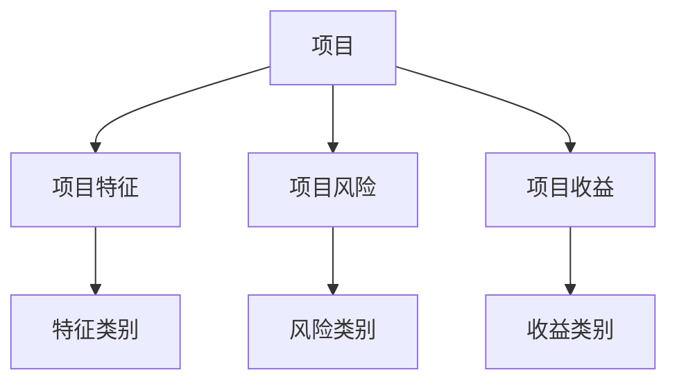
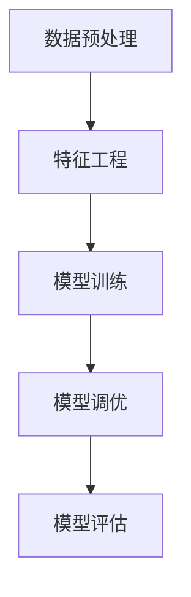
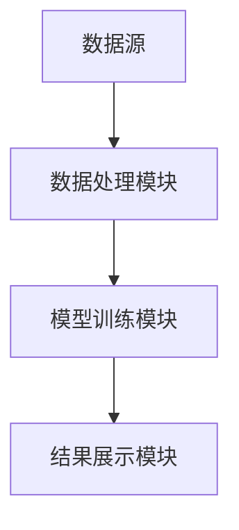

                 


# 金融科技创新项目ROI预测模型

> 关键词：金融科技创新，ROI预测模型，机器学习，系统架构，金融项目评估

> 摘要：本文详细探讨了金融科技创新项目中的ROI预测模型，从背景、核心概念、算法原理到系统架构设计，再到项目实战和最佳实践，全面解析了如何利用数据分析和机器学习技术来预测和优化金融创新项目的投资回报率。

---

## 第一部分：金融科技创新与ROI预测模型的背景

### 第1章：金融科技创新的现状与趋势

#### 1.1 金融科技创新的定义与范畴

金融科技创新是指利用新技术（如人工智能、大数据、区块链等）对传统金融业务进行创新和优化，以提升效率、降低成本、增强客户体验并创造新的价值。金融科技创新涵盖支付、借贷、投资、保险等多个领域，例如移动支付、智能投顾、区块链金融等。

#### 1.2 金融科技创新的驱动因素

- **技术进步**：人工智能、大数据、区块链等技术的快速发展为金融行业带来了新的可能性。
- **客户需求变化**：客户对个性化服务、实时响应和便捷体验的需求推动了金融科技创新。
- **行业竞争压力**：传统金融机构为了在数字化时代保持竞争力，纷纷引入新技术。
- **政策支持**：各国政府和监管机构通过政策引导和扶持，推动金融科技创新的发展。

#### 1.3 ROI预测模型在金融科技创新中的重要性

ROI（Return on Investment，投资回报率）是衡量投资项目收益的重要指标。在金融科技创新项目中， ROI预测模型能够帮助投资者和金融机构评估项目的潜在收益和风险，从而做出更科学的投资决策。

### 第2章：ROI预测模型的核心概念

#### 2.1 ROI预测模型的定义

ROI预测模型是一种用于预测金融科技创新项目投资回报率的数学模型。它通过分析项目的特征、风险和市场环境，预测项目在一定期限内的净收益与投资成本的比率。

#### 2.2 ROI预测模型的组成部分

- **项目特征**：包括项目类型、投资金额、开发周期、技术复杂度等。
- **项目风险**：包括市场风险、技术风险、操作风险等。
- **项目收益**：包括直接收益（如收入增长）和间接收益（如品牌价值提升）。

#### 2.3 ROI预测模型的边界与外延

- **边界**：模型仅考虑直接影响项目ROI的因素，如项目本身的特征和风险。
- **外延**：模型的预测结果可以为后续的项目管理、资源配置和风险控制提供依据。

---

## 第二部分：ROI预测模型的核心概念与联系

### 第3章：ROI预测模型的核心要素与关系

#### 3.1 项目特征与项目收益的关系

项目特征（如技术复杂度、开发周期）直接影响项目的成本和时间，从而间接影响收益。例如，技术复杂度高的项目可能需要更多的资源投入，但其潜在收益也可能更高。

#### 3.2 项目风险与项目收益的关系

项目风险是影响项目收益的重要因素。高风险项目可能带来高收益，但也可能因失败而导致亏损。因此，在预测ROI时，需要综合考虑风险和收益的平衡。

#### 3.3 ROI预测模型与其他预测模型的对比

- **现金流预测模型**：主要用于预测项目的未来现金流情况， ROI预测模型则基于现金流预测结果进行收益评估。
- **风险评估模型**：主要用于评估项目的风险， ROI预测模型则在考虑风险的基础上预测收益。

### 第4章：ROI预测模型的ER实体关系图



---

## 第三部分：ROI预测模型的算法原理

### 第4章：ROI预测模型的算法实现

#### 4.1 ROI预测模型的算法选择

- **机器学习算法**：如随机森林、支持向量机（SVM）、神经网络等。
- **深度学习算法**：如长短时记忆网络（LSTM）用于时间序列预测。

#### 4.2 ROI预测模型的算法流程



#### 4.3 ROI预测模型的数学公式

- **线性回归模型**：$$y = \beta_0 + \beta_1x + \epsilon$$
  - $y$：预测的ROI
  - $x$：自变量（如项目特征）
  - $\beta_0$：截距
  - $\beta_1$：回归系数
  - $\epsilon$：误差项

- **随机森林模型**：随机森林是一种基于决策树的集成学习方法，适用于高维数据和非线性关系。

---

## 第四部分：系统架构与设计

### 第5章：ROI预测模型的系统架构设计

#### 5.1 问题场景介绍

- **目标**：预测金融科技创新项目的ROI。
- **输入**：项目特征、历史数据。
- **输出**：预测的ROI值。

#### 5.2 系统功能设计

- **数据处理模块**：负责数据的清洗、转换和特征提取。
- **模型训练模块**：基于机器学习算法训练ROI预测模型。
- **结果展示模块**：将预测结果以可视化方式呈现。

#### 5.3 系统架构设计



---

## 第五部分：项目实战

### 第6章：ROI预测模型的项目实战

#### 6.1 环境安装

- **Python**：安装Anaconda或Miniconda。
- **机器学习库**：安装scikit-learn、xgboost、tensorflow等。

#### 6.2 核心代码实现

```python
import pandas as pd
from sklearn.ensemble import RandomForestRegressor
from sklearn.model_selection import train_test_split
from sklearn.metrics import mean_squared_error

# 数据加载
data = pd.read_csv('projects.csv')

# 特征选择
features = ['investment', 'development_time', 'tech_complexity']
target = 'roi'

X = data[features]
y = data[target]

# 数据分割
X_train, X_test, y_train, y_test = train_test_split(X, y, test_size=0.2, random_state=42)

# 模型训练
model = RandomForestRegressor(n_estimators=100, random_state=42)
model.fit(X_train, y_train)

# 模型预测
y_pred = model.predict(X_test)

# 模型评估
mse = mean_squared_error(y_test, y_pred)
print(f'Mean Squared Error: {mse}')
```

#### 6.3 项目小结

通过实际案例分析，我们可以看到ROI预测模型在金融科技创新项目中的应用价值。模型可以帮助投资者和金融机构做出更科学的投资决策，降低投资风险，提高投资效率。

---

## 第六部分：最佳实践与未来展望

### 第7章：ROI预测模型的最佳实践

#### 7.1 小结

本文详细探讨了金融科技创新项目ROI预测模型的构建与应用，从背景、核心概念到算法实现和系统架构设计，再到项目实战和最佳实践，为读者提供了一个全面的视角。

#### 7.2 注意事项

- 数据质量：确保数据的准确性和完整性。
- 模型选择：根据实际需求选择合适的算法。
- 模型调优：通过交叉验证和超参数优化提高模型性能。

#### 7.3 未来展望

- **实时预测**：结合实时数据流，提供动态的ROI预测。
- **多模型融合**：通过集成学习提高预测精度。
- **可解释性增强**：提升模型的可解释性，帮助用户更好地理解预测结果。

---

## 附录

### A. 数据集描述

- 数据来源：公开金融数据集或企业内部数据。
- 数据格式：CSV格式，包含项目特征和目标变量。

### B. 工具安装指南

- Python安装：使用Anaconda或Miniconda。
- 库安装：使用pip或conda安装scikit-learn、xgboost等。

### C. 参考文献

- 本文参考了《机器学习实战》、《Python机器学习》等书籍，以及相关学术论文和行业报告。

---

通过本文的详细讲解，读者可以深入了解金融科技创新项目ROI预测模型的构建与应用，掌握其实现方法和最佳实践，为实际应用提供参考和指导。

