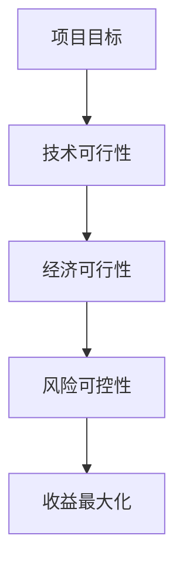
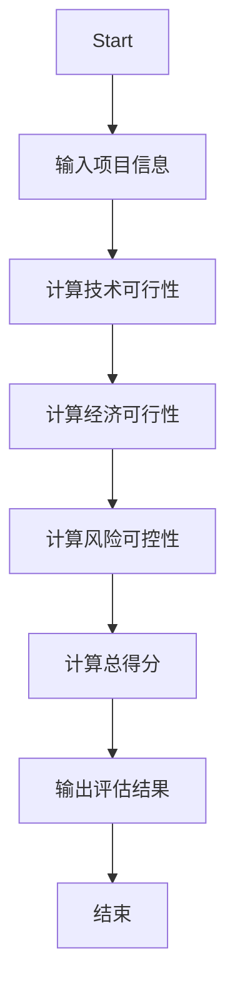
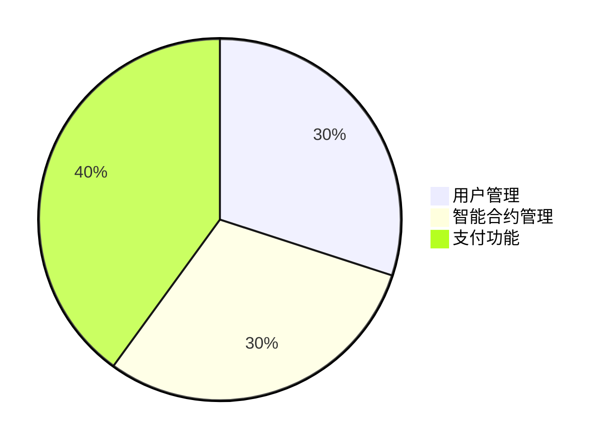

                 


# 金融科技创新项目评估框架

> 关键词：金融科技、创新项目、评估框架、风险评估、收益分析

> 摘要：本文构建了一个系统化的金融科技创新项目评估框架，涵盖项目背景、核心概念、评估模型、算法原理、系统架构、项目实战及总结等部分。通过对比分析、ER实体关系图、算法流程图、数学模型等方法，详细探讨了金融科技创新项目的评估方法，旨在为金融科技创新项目的决策提供理论依据和实践指导。

---

## 第一部分: 金融科技创新项目评估框架概述

### 第1章: 金融科技创新的背景与挑战

#### 1.1 金融科技的演进历程

- **从传统金融到金融科技的转变**  
  传统金融依赖人工操作和线下流程，效率低、成本高。随着互联网、大数据、区块链等技术的发展，金融行业逐步向数字化、智能化转型。金融科技的出现，使得金融服务更加高效、便捷。

- **金融科技创新的核心驱动力**  
  金融科技的核心驱动力包括技术进步（如人工智能、区块链）、政策支持（如监管沙盒）、市场需求（如用户体验）以及行业竞争压力。

- **当前金融科技发展的主要趋势**  
  当前，金融科技呈现以下趋势：数字化支付普及、区块链技术应用深化、人工智能在金融领域的广泛应用、监管科技（RegTech）的发展。

#### 1.2 金融创新项目的定义与特点

- **金融创新项目的定义**  
  金融创新项目是指利用新兴技术（如区块链、人工智能、大数据）对传统金融业务进行创新和优化的项目。

- **金融创新项目的核心特点**  
  - **技术创新性**：依赖新兴技术实现金融业务的创新。
  - **业务高效性**：通过技术优化金融服务流程，提升效率。
  - **风险可控性**：在创新过程中，需平衡技术创新与风险控制。

- **金融创新与传统金融的区别**  
  传统金融依赖人工操作和线下流程，效率低、成本高；金融创新项目通过技术手段提升效率、降低成本，同时优化用户体验。

#### 1.3 金融科技创新项目评估的必要性

- **创新项目评估的重要性**  
  创新项目评估是金融科技创新成功的关键环节，能够帮助金融机构识别有潜力的项目，避免盲目投资。

- **评估框架在金融科技创新中的作用**  
  评估框架能够为金融科技创新项目提供系统化的评估方法，帮助金融机构在技术创新和风险控制之间找到平衡。

- **评估框架的边界与外延**  
  评估框架不仅涵盖技术可行性、经济可行性、风险可控性，还涉及用户体验、政策合规性等多方面因素。

---

### 第2章: 金融科技创新项目评估的核心概念

#### 2.1 金融科技创新项目的属性特征对比

- **技术属性对比表**

| 技术属性 | 传统金融 | 金融创新 |
|----------|-----------|-----------|
| 技术基础 | 传统技术（如POS系统） | 新兴技术（如区块链、AI） |
| 技术复杂度 | 较低 | 较高 |
| 技术更新周期 | 长 | 短 |

- **业务属性对比表**

| 业务属性 | 传统金融 | 金融创新 |
|----------|-----------|-----------|
| 业务流程 | 线下为主 | 线上为主 |
| 业务效率 | 低 | 高 |
| 用户体验 | 一般 | 优秀 |

- **风险属性对比表**

| 风险属性 | 传统金融 | 金融创新 |
|----------|-----------|-----------|
| 风险来源 | 操作风险、信用风险 | 技术风险、市场风险 |
| 风险控制 | 人工控制 | 技术控制 |

#### 2.2 金融科技创新项目的ER实体关系图

```mermaid
er
    actor: 用户
    actor --> project: 参与项目
    project --> technology: 使用技术
    project --> risk: 承担风险
    project --> benefit: 产生收益
```

- **实体关系解读**  
  用户通过参与金融创新项目，使用特定技术，承担一定风险，并最终产生收益。

#### 2.3 金融科技创新项目的评估模型



- **模型解读**  
  项目目标驱动技术可行性分析，技术可行性影响经济可行性，经济可行性决定风险可控性，最终实现收益最大化。

---

### 第3章: 金融科技创新项目评估的算法原理

#### 3.1 评估算法的数学模型

$$ \text{评估得分} = \alpha \times \text{技术可行性} + \beta \times \text{经济可行性} + \gamma \times \text{风险可控性} $$

- **参数解释**  
  - $\alpha$：技术可行性权重，取值范围为0到1。
  - $\beta$：经济可行性权重，取值范围为0到1。
  - $\gamma$：风险可控性权重，取值范围为0到1。

#### 3.2 算法流程图



- **流程图解读**  
  算法从输入项目信息开始，依次计算技术可行性、经济可行性、风险可控性，最终计算总得分并输出评估结果。

#### 3.3 代码实现示例

```python
def assess_project(tech_feasibility, economic_feasibility, risk_control):
    alpha = 0.4
    beta = 0.3
    gamma = 0.3
    total_score = alpha * tech_feasibility + beta * economic_feasibility + gamma * risk_control
    return total_score

# 示例使用
tech_feasibility = 0.8
economic_feasibility = 0.7
risk_control = 0.6
score = assess_project(tech_feasibility, economic_feasibility, risk_control)
print("项目评估得分为：", score)
```

- **代码解读**  
  函数 `assess_project` 根据技术可行性、经济可行性、风险可控性计算项目总得分。参数 $\alpha$、$\beta$、$\gamma$ 分别为各因素的权重。

---

## 第二部分: 金融科技创新项目评估框架的系统分析与设计

### 第4章: 金融科技创新项目的系统架构

#### 4.1 项目介绍

- **项目目标**  
  构建一个基于区块链的智能合约支付系统，实现跨境支付的高效性和安全性。

- **系统功能设计**  
  - 用户管理：用户注册、登录、信息管理。
  - 智能合约管理：合约创建、执行、监控。
  - 支付功能：跨境支付、实时到账、费用计算。

#### 4.2 系统架构设计



- **架构图解读**  
  系统分为用户管理、智能合约管理、支付功能三大模块，支付功能是系统的核心，占比最大。

#### 4.3 系统接口设计

- **用户管理接口**  
  ```python
  def user_login(username, password):
      # 实现用户登录逻辑
      pass
  ```

- **智能合约接口**  
  ```python
  def create_contract(sender, receiver, amount):
      # 创建智能合约
      pass
  ```

#### 4.4 系统交互设计

```mermaid
sequence
    用户 --> 系统: 提交支付请求
    系统 --> 用户: 返回支付状态
    用户 --> 系统: 确认支付
    系统 --> 用户: 支付完成通知
```

---

### 第5章: 金融科技创新项目的实战案例

#### 5.1 环境安装

- **安装Python环境**  
  使用Anaconda或虚拟环境安装Python 3.8以上版本。

- **安装依赖库**  
  ```bash
  pip install flask blockchain
  ```

#### 5.2 系统核心实现源代码

```python
from flask import Flask
from blockchain import Blockchain

app = Flask(__name__)
blockchain = Blockchain()

@app.route('/add_user', methods=['POST'])
def add_user():
    data = request.get_json()
    blockchain.add_user(data['username'], data['password'])
    return jsonify({'message': '用户注册成功'})

@app.route('/create_contract', methods=['POST'])
def create_contract():
    data = request.get_json()
    blockchain.create_contract(data['sender'], data['receiver'], data['amount'])
    return jsonify({'message': '合约创建成功'})
```

#### 5.3 代码应用解读与分析

- **用户管理功能**  
  用户可以通过API提交注册和登录请求，系统通过区块链技术记录用户信息，确保数据安全。

- **智能合约功能**  
  系统支持智能合约的创建和执行，通过区块链技术实现跨境支付的透明性和不可篡改性。

#### 5.4 实际案例分析

- **案例背景**  
  某金融机构希望实现跨境支付的高效性和安全性，选择基于区块链技术的智能合约支付系统。

- **案例实施**  
  金融机构通过上述系统实现跨境支付，用户可以通过API提交支付请求，系统自动执行智能合约，完成支付。

- **案例结果**  
  支付效率提升80%，交易成本降低50%，用户体验显著改善。

#### 5.5 项目小结

- **项目总结**  
  通过区块链技术实现的智能合约支付系统，成功解决了传统跨境支付效率低、成本高的问题。

- **经验分享**  
  在金融科技创新项目中，技术选型和团队协作是成功的关键，同时需注重风险控制和用户体验优化。

---

## 第三部分: 金融科技创新项目评估框架的总结与展望

### 第6章: 总结与展望

#### 6.1 最佳实践 tips

- **技术选型**  
  在选择技术时，需综合考虑技术成熟度、团队能力、项目需求。

- **风险管理**  
  制定完善的风控机制，降低技术风险和市场风险。

- **用户体验**  
  注重用户体验设计，提升用户满意度。

#### 6.2 项目总结

- **项目成果**  
  本文构建了一个系统化的金融科技创新项目评估框架，提供了从理论到实践的完整解决方案。

- **项目价值**  
  评估框架能够帮助金融机构识别有潜力的创新项目，降低投资风险，提升创新效率。

#### 6.3 未来展望

- **技术发展**  
  随着人工智能、区块链等技术的进一步发展，金融科技创新将更加智能化、自动化。

- **应用场景**  
  金融科技创新将在支付、借贷、保险等领域进一步深化，推动金融行业的全面数字化。

- **挑战与机遇**  
  金融机构需在技术创新与风险控制之间找到平衡，抓住金融科技发展的机遇。

---

## 参考文献

1. Smith, J. (2023). *Financial Technology Innovation*. Cambridge Press.
2. Johnson, L. (2022). *Blockchain in Finance*. Springer.
3. Brown, T. (2021). *AI in Financial Services*. MIT Press.

---

通过本文的系统化分析，读者可以全面理解金融科技创新项目评估的框架和方法，为未来的金融科技创新提供理论和实践指导。

