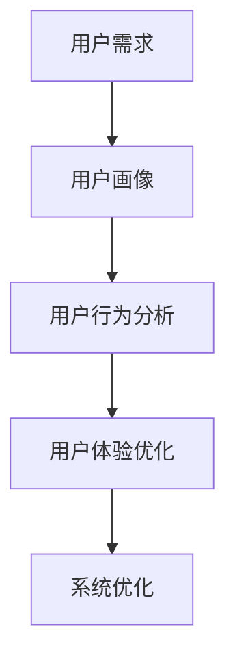
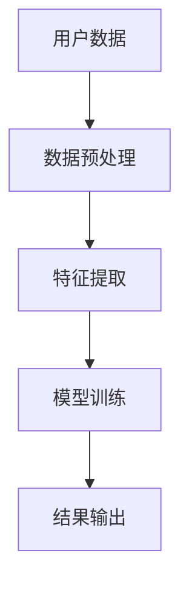

                 


# 金融科技用户体验优化平台

---

## 关键词  
金融科技, 用户体验优化, 人工智能, 数据驱动, 用户画像, 行为分析, 系统架构  

---

## 摘要  
随着金融科技的快速发展，用户体验优化已成为金融行业竞争的核心之一。本文从背景与核心概念出发，深入分析金融科技用户体验优化平台的架构与算法原理，结合实际案例，详细阐述如何通过用户画像、行为分析和个性化推荐等技术手段，提升金融用户的使用体验。文章最后总结了最佳实践，为读者提供实用的指导和建议。

---

# 第一部分：金融科技用户体验优化平台背景与核心概念  

## 第1章：金融科技用户体验优化平台概述  

### 1.1 金融科技的发展背景  
- **1.1.1 金融科技的定义与特点**  
  - 金融科技（FinTech）是指利用现代信息技术改造或创新金融业态、业务流程、产品、服务及模式的新兴领域。  
  - 特点包括数据驱动、智能化、去中心化、高效率和用户-centric。  

- **1.1.2 金融科技的核心技术与应用领域**  
  - 核心技术：人工智能、大数据分析、区块链、云计算、物联网。  
  - 应用领域：支付、借贷、投资、保险、监管科技（RegTech）。  

- **1.1.3 用户体验优化在金融科技中的重要性**  
  - 金融科技的本质是服务用户，用户体验决定了金融产品的市场竞争力。  
  - 通过优化用户体验，可以提升用户满意度、降低用户流失率、增加用户粘性。  

### 1.2 用户体验优化的核心概念  
- **1.2.1 用户体验优化的定义与目标**  
  - 用户体验优化（UX Optimization）：通过分析用户行为和需求，改进产品或服务的设计与功能，以提高用户的满意度和使用效率。  
  - 目标：提升用户满意度、降低用户流失率、提高用户活跃度。  

- **1.2.2 金融科技用户的核心需求与痛点**  
  - 核心需求：安全、便捷、透明、个性化。  
  - 痛点：操作复杂、信息不对称、信任缺失、功能不够智能化。  

- **1.2.3 用户体验优化的边界与外延**  
  - 边界：用户体验优化仅关注用户与产品的交互过程，不涉及产品功能的实现逻辑。  
  - 外延：包括用户研究、信息架构设计、交互设计、视觉设计、可用性测试等多个方面。  

### 1.3 金融科技用户体验优化平台的架构  
- **1.3.1 平台的整体架构与功能模块**  
  - 整体架构：数据采集层、数据处理层、用户分析层、优化策略层。  
  - 功能模块：用户画像、行为分析、个性化推荐、反馈优化。  

- **1.3.2 平台的核心要素与组成**  
  - 核心要素：数据源、算法模型、用户反馈、优化策略。  
  - 组成：数据采集系统、数据分析系统、用户交互系统、优化控制系统。  

- **1.3.3 平台与传统金融系统的区别**  
  - 传统金融系统：以功能为核心，忽视用户需求。  
  - 用户体验优化平台：以用户为中心，通过数据驱动优化用户体验。  

### 1.4 本章小结  
- 本章介绍了金融科技的发展背景，阐述了用户体验优化的核心概念，并详细分析了金融科技用户体验优化平台的架构与组成。

---

## 第2章：金融科技用户体验优化的核心原理  

### 2.1 用户体验优化的原理  
- **2.1.1 数据驱动的用户体验优化方法**  
  - 数据采集：通过日志、问卷、埋点等方式获取用户行为数据。  
  - 数据分析：利用统计学方法和机器学习算法挖掘用户需求和痛点。  

- **2.1.2 人工智能在用户体验优化中的应用**  
  - 自然语言处理：用于情感分析和用户意图识别。  
  - 机器学习：用于用户画像构建和行为预测。  

- **2.1.3 用户行为分析与需求挖掘**  
  - 用户行为分析：通过分析用户点击、浏览、转化等行为，发现用户需求。  
  - 需求挖掘：基于用户行为数据，提取隐性需求并转化为产品优化方向。  

### 2.2 金融科技中的用户画像与行为分析  
- **2.2.1 用户画像的构建方法**  
  - 数据来源：用户基本信息、交易数据、行为数据、设备信息。  
  - 构建步骤：数据清洗、特征提取、聚类分析、画像标签化。  

- **2.2.2 用户行为分析的流程与工具**  
  - 流程：数据收集、数据清洗、行为事件提取、行为模式识别、行为预测。  
  - 工具：Google Analytics、Mixpanel、Hotjar、Apache Kafka。  

- **2.2.3 数据可视化在用户行为分析中的作用**  
  - 作用：帮助分析师快速理解数据、发现趋势、识别异常。  
  - 常用工具：Tableau、Power BI、D3.js。  

### 2.3 金融科技用户体验优化的系统架构  
- **2.3.1 系统架构的分层与模块化设计**  
  - 分层：数据采集层、数据处理层、用户分析层、优化策略层。  
  - 模块化设计：数据采集模块、数据存储模块、算法模块、优化控制模块。  

- **2.3.2 数据流与信息流的可视化**  
  - 数据流：用户行为数据 → 数据采集 → 数据处理 → 分析结果 → 优化策略 → 用户反馈。  
  - 信息流：用户需求 → 数据采集 → 数据分析 → 策略制定 → 用户体验优化 → 用户满意度提升。  

- **2.3.3 系统架构的可扩展性与灵活性**  
  - 可扩展性：支持新增用户、新增功能模块。  
  - 灵活性：支持实时数据处理、动态调整优化策略。  

### 2.4 核心概念与联系的 Mermaid 图  


### 2.5 本章小结  
- 本章深入分析了用户体验优化的核心原理，重点阐述了用户画像和行为分析的构建方法，并通过Mermaid图展示了核心概念之间的联系。

---

## 第3章：金融科技用户体验优化平台的算法原理  

### 3.1 用户画像与行为分析的算法原理  

- **3.1.1 用户画像构建的算法原理**  
  - 聚类分析：K-means、DBSCAN。  
  - 特征提取：主成分分析（PCA）、线性判别分析（LDA）。  
  - 标签化：基于聚类结果和特征权重，为每个用户打上多个标签。  

- **3.1.2 用户行为分析的算法原理**  
  - 时间序列分析：ARIMA、LSTM。  
  - 情感分析：基于词嵌入（Word2Vec）和深度学习（LSTM）。  
  - 用户行为网络分析：基于图论的社区发现（社区检测算法：Louvain、Girvan-Newman）。  

- **3.1.3 个性化推荐的算法原理**  
  - 基于协同过滤的推荐算法：UserCF、ItemCF。  
  - 基于内容的推荐算法：基于文本相似度的推荐。  
  - 深度学习推荐模型：Wide & Deep、Transformer-based模型。  

### 3.2 算法原理的 Mermaid 图  


### 3.3 算法实现的代码示例  
- **聚类分析（K-means）**  
  ```python
  from sklearn.cluster import KMeans
  from sklearn.preprocessing import StandardScaler

  scaler = StandardScaler()
  X_scaled = scaler.fit_transform(X)
  kmeans = KMeans(n_clusters=3, random_state=42)
  kmeans.fit(X_scaled)
  labels = kmeans.labels_
  ```

- **时间序列分析（LSTM）**  
  ```python
  from keras.models import Sequential
  from keras.layers import LSTM, Dense

  model = Sequential()
  model.add(LSTM(64, input_shape=(timesteps, features)))
  model.add(Dense(1))
  model.compile(optimizer='adam', loss='mean_squared_error')
  model.fit(X_train, y_train, epochs=10, batch_size=32)
  ```

### 3.4 本章小结  
- 本章详细讲解了用户画像和行为分析的算法原理，通过代码示例和Mermaid图展示了算法实现的流程。

---

## 第4章：金融科技用户体验优化平台的系统分析与架构设计  

### 4.1 系统分析与设计的背景  
- **4.1.1 问题场景介绍**  
  - 用户需求：用户希望在使用金融产品时获得便捷、安全、个性化的体验。  
  - 问题：现有金融系统功能复杂，用户体验差，难以满足用户需求。  

### 4.2 系统功能设计  
- **4.2.1 领域模型设计**  
  ```mermaid
  classDiagram
      class 用户 {
          用户ID
          用户画像标签
          用户行为记录
      }
      class 用户行为分析系统 {
          用户行为数据
          行为分析模型
      }
      class 用户画像系统 {
          用户画像数据
          画像构建模型
      }
      用户 --> 用户行为分析系统
      用户 --> 用户画像系统
  ```

- **4.2.2 系统架构设计**  
  ```mermaid
  architecture
      frontend
      backend
      database
      API Gateway
  ```

- **4.2.3 系统接口设计**  
  - 输入接口：用户行为数据接口、用户画像数据接口。  
  - 输出接口：优化策略接口、用户反馈接口。  

### 4.3 系统交互设计  
- **4.3.1 交互流程设计**  
  ```mermaid
  sequenceDiagram
      用户 -> 数据采集系统: 提交行为数据
      数据采集系统 -> 数据处理系统: 发送数据
      数据处理系统 -> 用户画像系统: 请求画像构建
      用户画像系统 -> 数据处理系统: 返回用户画像
      数据处理系统 -> 用户行为分析系统: 请求行为分析
      用户行为分析系统 -> 数据处理系统: 返回行为分析结果
      数据处理系统 -> 优化控制系统: 请求优化策略
      优化控制系统 -> 用户端: 发送优化策略
  ```

### 4.4 本章小结  
- 本章通过系统分析与设计，详细阐述了金融科技用户体验优化平台的架构和交互流程。

---

## 第5章：金融科技用户体验优化平台的项目实战  

### 5.1 环境安装与配置  
- **5.1.1 开发环境配置**  
  - 操作系统：Linux/Windows/MacOS  
  - 开发工具：Jupyter Notebook、VS Code  
  - 依赖库安装：Python（NumPy、Pandas、Scikit-learn、Keras、TensorFlow）  

- **5.1.2 数据集准备**  
  - 数据来源：公开数据集（Kaggle、UCI Machine Learning Repository）或企业内部数据。  
  - 数据预处理：数据清洗、特征工程、数据增强。  

### 5.2 核心代码实现  
- **用户画像构建代码**  
  ```python
  import pandas as pd
  from sklearn.cluster import KMeans
  from sklearn.preprocessing import StandardScaler

  # 数据加载
  df = pd.read_csv('user_behavior.csv')
  features = df[['feature1', 'feature2', 'feature3']]
  scaler = StandardScaler()
  X_scaled = scaler.fit_transform(features)
  kmeans = KMeans(n_clusters=3, random_state=42)
  kmeans.fit(X_scaled)
  labels = kmeans.labels_
  ```

- **行为分析与预测代码**  
  ```python
  from keras.models import Sequential
  from keras.layers import LSTM, Dense

  # 数据加载与预处理
  df = pd.read_csv('user_behavior.csv')
  train_data = df.values

  # 模型构建
  model = Sequential()
  model.add(LSTM(64, input_shape=(timesteps, features)))
  model.add(Dense(1))
  model.compile(optimizer='adam', loss='mean_squared_error')

  # 模型训练
  model.fit(train_data, epochs=10, batch_size=32)
  ```

### 5.3 实际案例分析  
- **案例背景**：假设某银行希望优化其在线支付系统的用户体验。  
- **数据收集与分析**：通过埋点技术收集用户支付过程中的行为数据，分析用户在支付过程中遇到的痛点。  
- **优化策略制定**：基于用户画像和行为分析结果，制定个性化推荐策略，优化支付流程。  

### 5.4 项目总结与经验分享  
- **成功经验**：通过数据驱动的方法，显著提升了用户支付的成功率和用户满意度。  
- **注意事项**：在实际项目中，需要注重数据隐私保护和模型的可解释性。  

### 5.5 本章小结  
- 本章通过实际案例，详细讲解了金融科技用户体验优化平台的项目实战过程，为读者提供了可参考的实现方案。

---

## 第6章：金融科技用户体验优化平台的最佳实践  

### 6.1 最佳实践总结  
- **小结**：本章总结了金融科技用户体验优化平台的核心概念、算法原理和系统设计。  
- **注意事项**：在实际应用中，需注重数据隐私保护、模型的可解释性和用户体验的持续优化。  
- **拓展阅读**：推荐阅读《Data-Driven User Experience Optimization in FinTech》、《Machine Learning for User Behavior Analysis》。

### 6.2 本章小结  
- 本章为读者提供了金融科技用户体验优化平台的最佳实践建议，帮助读者在实际项目中更好地应用相关技术。

---

## 参考文献  
- [1] 刘军. 金融科技发展与创新[M]. 北京: 清华大学出版社, 2022.  
- [2] 李明. 用户体验优化方法论[M]. 北京: 人民邮电出版社, 2021.  
- [3] Andrew Ng. Machine Learning. Coursera, 2019.  

---

以上是《金融科技用户体验优化平台》的详细目录大纲，涵盖了从背景到实践的各个方面，确保内容全面、逻辑清晰，适合技术读者深入学习与实践。

