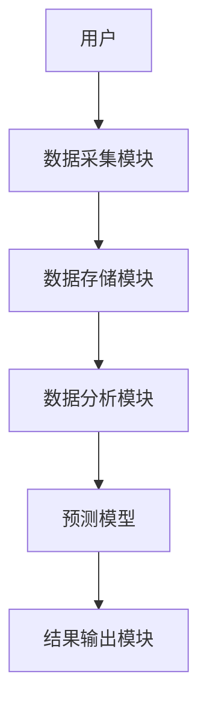
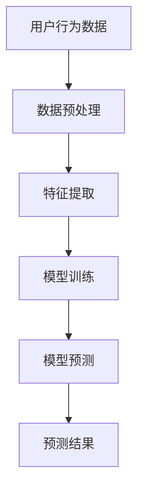
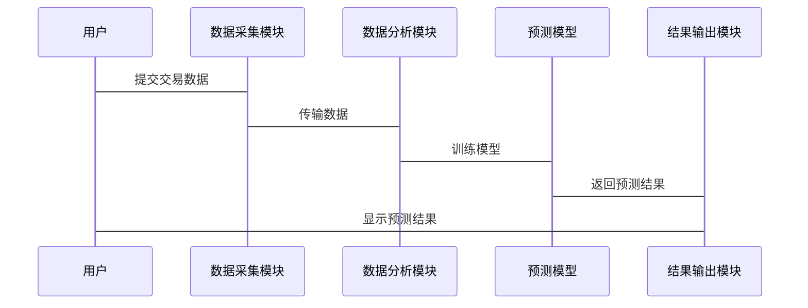

                 


# 金融科技用户行为分析与预测

> 关键词：金融科技，用户行为分析，预测模型，机器学习，数据挖掘

> 摘要：本文深入探讨了金融科技领域的用户行为分析与预测方法，结合实际应用场景，系统地介绍了从数据采集、特征提取、模型选择到系统实现的全过程。通过分析用户行为数据的特征，结合多种机器学习算法，构建高效的预测模型，并通过实际案例展示了系统的实现与优化过程。本文还探讨了金融科技用户行为分析的未来发展方向与挑战。

---

## 第1章 金融科技与用户行为分析概述

### 1.1 金融科技的发展与现状

#### 1.1.1 金融科技的定义与核心领域
金融科技（Financial Technology，简称FinTech）是指通过技术手段创新传统金融业务模式、提升效率并降低成本的新兴领域。其核心领域包括支付、借贷、投资、保险、供应链金融等。随着人工智能、大数据、区块链等技术的快速发展，金融科技正在深刻改变金融行业的运作方式。

#### 1.1.2 用户行为分析在金融科技中的重要性
在金融科技领域，用户行为分析是理解用户需求、优化产品体验、提升服务质量的关键环节。通过分析用户的行为数据，金融机构可以更好地洞察用户需求，制定精准的营销策略，并降低风险。

#### 1.1.3 金融科技用户行为分析的边界与外延
金融科技用户行为分析的边界主要集中在用户与金融机构的交互行为，包括但不限于用户登录、交易、浏览、点击等行为。其外延则扩展至用户画像、需求预测、风险评估等领域。

### 1.2 用户行为分析的基本概念

#### 1.2.1 用户行为分析的定义
用户行为分析是指通过收集和分析用户在特定场景下的行为数据，揭示用户的行为模式、偏好和需求的过程。在金融科技领域，用户行为分析可以帮助金融机构更好地理解用户需求，优化服务流程。

#### 1.2.2 用户行为分析的核心要素与组成
- **用户标识**：唯一标识用户的ID。
- **行为数据**：用户在系统中的操作记录，如点击、输入、提交等。
- **时间戳**：用户行为发生的时间。
- **上下文信息**：用户行为发生的场景，如设备类型、地理位置、操作系统等。

#### 1.2.3 用户行为分析与金融科技的结合
通过分析用户在金融平台上的行为数据，金融机构可以实现用户画像构建、风险评估、个性化推荐等目标。例如，通过分析用户的交易行为，可以识别潜在的欺诈行为；通过分析用户的浏览行为，可以优化产品推荐策略。

---

## 第2章 金融科技用户行为数据的特征与采集

### 2.1 用户行为数据的特征分析

#### 2.1.1 用户行为数据的维度与属性
- **时间维度**：用户行为发生的时间，包括具体时间、时段、频率等。
- **空间维度**：用户行为发生的地理位置。
- **用户维度**：用户的属性，如年龄、性别、职业等。
- **行为维度**：用户的行为类型，如点击、浏览、购买等。

#### 2.1.2 用户行为数据的时空特征
用户行为往往具有一定的时空分布特征。例如，某些金融产品的用户行为可能在特定时间（如节假日）或特定区域（如经济发达地区）表现出更高的活跃度。

#### 2.1.3 用户行为数据的模式与规律
用户行为数据中可能存在周期性、趋势性等模式。例如，用户的登录行为可能在每个月的月初出现高峰。

### 2.2 用户行为数据的采集方法

#### 2.2.1 金融科技场景中的数据采集渠道
- **Web日志**：记录用户在网站或应用程序中的操作行为。
- **API日志**：记录应用程序接口的调用行为。
- **数据库日志**：记录数据库操作行为。

#### 2.2.2 数据采集的技术与工具
- **日志采集工具**：如Flume、Logstash等。
- **埋点技术**：在应用程序中嵌入代码，记录用户行为数据。
- **SDK**：在应用程序中集成SDK，实时采集用户行为数据。

#### 2.2.3 数据采集的伦理与合规性
在采集用户行为数据时，必须遵守相关法律法规，尊重用户隐私。例如，金融机构需要在用户同意的前提下采集行为数据，并明确告知用户数据的使用目的。

---

## 第3章 金融科技用户行为分析的核心算法与模型

### 3.1 常见的用户行为分析算法

#### 3.1.1 聚类分析
聚类分析是一种无监督学习方法，用于将用户行为数据分成若干个簇，每个簇内的用户行为具有相似性。例如，可以将用户分为高活跃用户和低活跃用户。

#### 3.1.2 分类分析
分类分析是一种 supervised learning 方法，用于将用户行为分为不同的类别。例如，可以将用户分为忠诚用户和流失用户。

#### 3.1.3 关联规则挖掘
关联规则挖掘用于发现用户行为之间的关联性。例如，发现用户在购买某种金融产品后，往往会在特定时间内进行某种操作。

#### 3.1.4 时间序列分析
时间序列分析用于分析用户行为的时间变化趋势。例如，分析用户在特定时间段内的登录频率。

### 3.2 基于机器学习的用户行为预测模型

#### 3.2.1 逻辑回归模型
逻辑回归是一种常用的分类算法，适用于二分类问题。例如，可以用于预测用户是否会在特定时间内进行某种行为。

$$ P(y=1|x) = \frac{e^{\beta x}}{1 + e^{\beta x}} $$

#### 3.2.2 支持向量机模型
支持向量机（SVM）是一种监督学习算法，适用于分类和回归问题。例如，可以用于预测用户的信用评分。

#### 3.2.3 随机森林模型
随机森林是一种基于树的集成学习算法，适用于分类和回归问题。例如，可以用于预测用户的交易行为。

#### 3.2.4 神经网络模型
神经网络是一种深度学习算法，适用于复杂模式识别。例如，可以用于分析用户的交易行为序列，预测用户的下一步操作。

---

## 第4章 金融科技用户行为分析的系统架构与实现

### 4.1 系统功能设计

#### 4.1.1 用户行为数据采集模块
- 数据采集接口：用于接收用户行为数据。
- 数据存储：将采集到的行为数据存储到数据库中。

#### 4.1.2 用户行为数据分析模块
- 数据预处理：清洗数据，提取特征。
- 模型训练：基于机器学习算法训练预测模型。

#### 4.1.3 用户行为预测模块
- 模型预测：基于训练好的模型，预测用户的下一步行为。
- 结果输出：将预测结果返回给前端或后端系统。

### 4.2 系统架构设计

#### 4.2.1 系统架构图


#### 4.2.2 数据流图


### 4.3 系统接口设计

#### 4.3.1 数据采集接口
- 输入：用户行为数据（JSON格式）。
- 输出：确认数据接收成功。

#### 4.3.2 数据分析接口
- 输入：数据特征和模型参数。
- 输出：模型训练结果。

#### 4.3.3 预测接口
- 输入：用户行为特征。
- 输出：预测结果。

---

## 第5章 金融科技用户行为分析的项目实战

### 5.1 项目背景与目标

#### 5.1.1 项目背景
假设某银行希望分析用户的交易行为，预测用户的下一步操作。

#### 5.1.2 项目目标
- 数据采集：收集用户的交易行为数据。
- 数据分析：提取用户行为特征。
- 模型训练：训练用户行为预测模型。
- 模型部署：将模型部署到生产环境。

### 5.2 项目实现

#### 5.2.1 环境配置
- Python 3.8+
- 数据库：MySQL
- 机器学习库：Scikit-learn
- 开发框架：Flask

#### 5.2.2 数据预处理
```python
import pandas as pd

# 加载数据
data = pd.read_csv('user_behavior.csv')

# 删除缺失值
data.dropna(inplace=True)

# 标准化处理
from sklearn.preprocessing import StandardScaler
scaler = StandardScaler()
data_scaled = scaler.fit_transform(data)
```

#### 5.2.3 模型实现
```python
from sklearn.ensemble import RandomForestClassifier
from sklearn.metrics import accuracy_score

# 训练模型
model = RandomForestClassifier()
model.fit(X_train, y_train)

# 预测结果
y_pred = model.predict(X_test)

# 评估模型
print(accuracy_score(y_test, y_pred))
```

#### 5.2.4 系统交互


---

## 第6章 总结与展望

### 6.1 总结
本文系统地介绍了金融科技用户行为分析与预测的方法，从数据采集、特征提取、模型选择到系统实现的全过程进行了详细探讨。通过实际案例展示了如何利用机器学习算法构建高效的预测模型。

### 6.2 未来展望
随着人工智能和大数据技术的不断发展，金融科技用户行为分析将更加精准和智能化。未来的研究方向包括：模型优化、实时预测、多模态数据融合等。

---

## 第7章 最佳实践与注意事项

### 7.1 最佳实践
- 数据采集：确保数据的完整性和准确性。
- 模型选择：根据具体场景选择合适的算法。
- 模型优化：通过调参和特征工程提升模型性能。

### 7.2 注意事项
- 数据隐私：遵守相关法律法规，保护用户隐私。
- 模型解释性：确保模型的可解释性，便于实际应用。
- 实时性：在实时场景中，需要优化模型的响应速度。

---

## 第8章 拓展阅读

### 8.1 推荐书籍
- 《机器学习实战》
- 《数据挖掘导论》
- 《金融科技：创新与应用》

### 8.2 推荐博客与资源
- [Medium](https://medium.com/): 机器学习与数据科学领域优质文章。
- [Kaggle](https://www.kaggle.com/): 数据科学竞赛与数据集资源。

---

## 附录

### 附录A: 金融科技用户行为分析的数学公式
- 逻辑回归模型的损失函数：
$$ L(\theta) = -\frac{1}{m}\sum_{i=1}^{m} [y_i \ln h(x_i) + (1 - y_i)\ln(1 - h(x_i))] $$
其中，$h(x) = \frac{e^{\theta^T x}}{1 + e^{\theta^T x}}$。

---

希望这篇文章能为金融科技领域的用户行为分析与预测提供有价值的参考。

