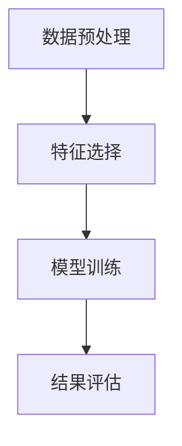
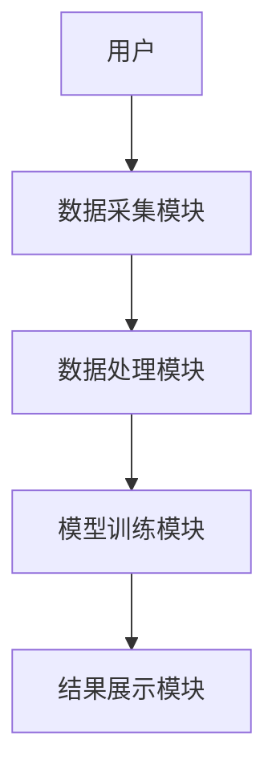
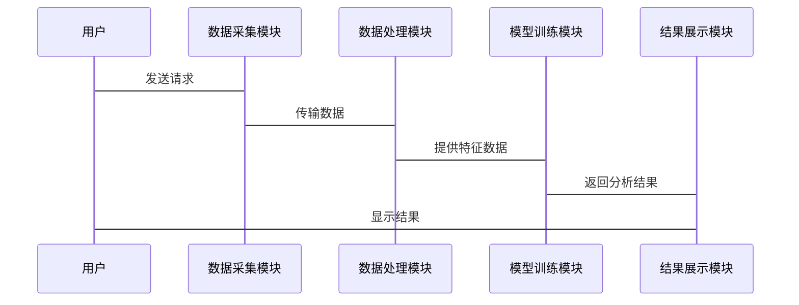

                 


# 金融科技用户行为分析平台

## 关键词

金融科技，用户行为分析，机器学习，系统架构，数据分析

## 摘要

随着金融科技的快速发展，用户行为分析在金融领域的应用越来越重要。本文详细介绍了金融科技用户行为分析平台的构建，涵盖背景、核心概念、算法原理、系统设计和项目实战。通过分析用户行为，利用机器学习和数据挖掘技术，帮助金融机构优化服务和风险控制，提升用户体验和业务效率。

---

## 第一部分：背景介绍

### 第1章：金融科技用户行为分析概述

#### 1.1 金融科技的发展现状

金融科技（Fintech）通过技术手段优化传统金融服务，涵盖支付、借贷、投资等多个领域。近年来，随着大数据、人工智能和区块链技术的快速发展，金融科技应用日益广泛，推动金融服务智能化和个性化。用户行为分析在这一背景下显得尤为重要，因为它能够帮助金融机构更好地理解用户需求，提供精准服务。

#### 1.2 用户行为分析的重要性

用户行为分析通过收集和分析用户在金融平台上的行为数据，挖掘用户偏好、消费习惯和风险倾向。这种分析能够帮助金融机构识别潜在风险、优化产品设计、提高客户满意度。例如，通过分析用户的点击流数据，可以发现用户在浏览理财产品时的偏好，从而推荐更符合其需求的产品。

#### 1.3 金融科技用户行为分析平台的目标与意义

平台的目标是通过收集、处理和分析用户行为数据，为金融机构提供用户画像、行为预测和风险评估等服务。意义在于提升金融服务的智能化水平，降低运营成本，增强用户体验，同时帮助金融机构在激烈的市场竞争中占据优势。

---

## 第二部分：核心概念与联系

### 第2章：用户行为分析的核心概念

#### 2.1 用户行为分析的基本原理

用户行为分析包括数据采集、特征提取和行为建模三个主要步骤。数据采集涉及从日志、交易记录等多渠道获取数据；特征提取需要从数据中提取有意义的特征，如用户登录频率、交易金额等；行为建模则是利用机器学习算法对特征进行建模，预测用户行为。

#### 2.2 用户行为分析的关键技术

- 数据挖掘技术：用于发现数据中的模式和关联。
- 机器学习算法：用于分类、聚类和预测用户行为。
- 自然语言处理技术：用于分析用户评论和反馈，提取情感倾向。

#### 2.3 用户行为分析的实体关系图

通过ER图展示用户、交易、行为日志等实体之间的关系，帮助理解数据结构和交互方式。例如，用户实体与行为日志实体通过用户ID关联，记录用户的每次操作。

```mermaid
er
    title 实体关系图
    User {
        id: integer
        name: string
        email: string
    }
    BehaviourLog {
        id: integer
        userId: integer
        action: string
        timestamp: datetime
    }
    Transaction {
        id: integer
        userId: integer
        amount: integer
        time: datetime
    }
    User -|{1, N}| BehaviourLog
    User -|{1, N}| Transaction
```

---

## 第三部分：算法原理讲解

### 第3章：用户行为分析的算法原理

#### 3.1 基于机器学习的用户行为分析

机器学习算法如决策树、随机森林和神经网络常用于用户行为分析。以决策树为例，通过训练模型，分类用户的行为类型，如正常交易、异常登录等。

#### 3.2 用户行为分类算法

- 分类算法：如决策树和随机森林，用于将用户行为分为不同类别。
- 实现步骤：数据预处理、特征选择、模型训练、结果评估。

#### 3.3 用户行为聚类算法

聚类算法如K-means用于将用户分为不同群体，识别用户的行为模式。例如，将用户分为高活跃用户和低活跃用户。



代码实现：

```python
from sklearn.tree import DecisionTreeClassifier
from sklearn.model_selection import train_test_split
from sklearn.metrics import accuracy_score

# 数据预处理
X = ...  # 特征数据
y = ...  # 标签

# 划分训练集和测试集
X_train, X_test, y_train, y_test = train_test_split(X, y, test_size=0.2)

# 训练模型
model = DecisionTreeClassifier()
model.fit(X_train, y_train)

# 预测
y_pred = model.predict(X_test)

# 评估
print(accuracy_score(y_test, y_pred))
```

---

## 第四部分：系统分析与架构设计方案

### 第4章：金融科技用户行为分析平台的系统设计

#### 4.1 系统功能设计

- 数据采集模块：收集用户行为数据，如点击流、交易记录。
- 数据处理模块：清洗和转换数据，提取特征。
- 模型训练模块：训练机器学习模型，预测用户行为。
- 结果展示模块：可视化分析结果，生成用户画像。

#### 4.2 系统架构设计

采用分层架构，包括数据层、业务逻辑层和表现层。微服务架构确保各模块独立，提高系统的可扩展性和维护性。



#### 4.3 系统接口设计

- 数据接口：用于数据导入和导出。
- API接口：提供RESTful API，供其他系统调用。
- 用户接口：供用户查看分析结果。

#### 4.4 系统交互流程图

展示用户登录、数据采集和模型训练的流程。



---

## 第五部分：项目实战

### 第5章：金融科技用户行为分析平台的实现

#### 5.1 环境安装与配置

安装Python、Jupyter Notebook和相关库如pandas、scikit-learn。

#### 5.2 核心代码实现

```python
import pandas as pd
from sklearn.ensemble import RandomForestClassifier
from sklearn.metrics import classification_report

# 加载数据
data = pd.read_csv('user Behaviour.csv')

# 数据预处理
X = data.drop('label', axis=1)
y = data['label']

# 划分训练集和测试集
X_train, X_test, y_train, y_test = train_test_split(X, y, test_size=0.2)

# 训练模型
model = RandomForestClassifier()
model.fit(X_train, y_train)

# 预测
y_pred = model.predict(X_test)

# 评估
print(classification_report(y_test, y_pred))
```

#### 5.3 实际案例分析

以某银行为例，分析用户的交易行为，识别异常交易，防范欺诈风险。

#### 5.4 项目小结

通过项目实战，读者可以掌握从数据采集到模型训练的整个流程，理解金融科技用户行为分析的实际应用。

---

## 第六部分：最佳实践与总结

### 6.1 最佳实践

- 数据质量：确保数据准确性和完整性。
- 模型选择：根据具体需求选择合适的算法。
- 可解释性：选择易于解释的模型，便于业务人员理解。

### 6.2 小结

本文详细介绍了金融科技用户行为分析平台的设计与实现，涵盖了从背景到系统的各个方面，帮助读者掌握构建此类平台的关键技术。

### 6.3 注意事项

- 数据隐私：确保用户数据的安全和隐私。
- 模型更新：定期更新模型，保持其准确性。
- 性能优化：优化系统性能，提高响应速度。

### 6.4 拓展阅读

推荐阅读关于机器学习、数据挖掘和系统架构设计的书籍，深入学习相关知识。

---

通过本文的学习，读者可以系统地了解金融科技用户行为分析平台的构建过程，掌握相关的技术和工具，并能够实际应用到金融项目中。

